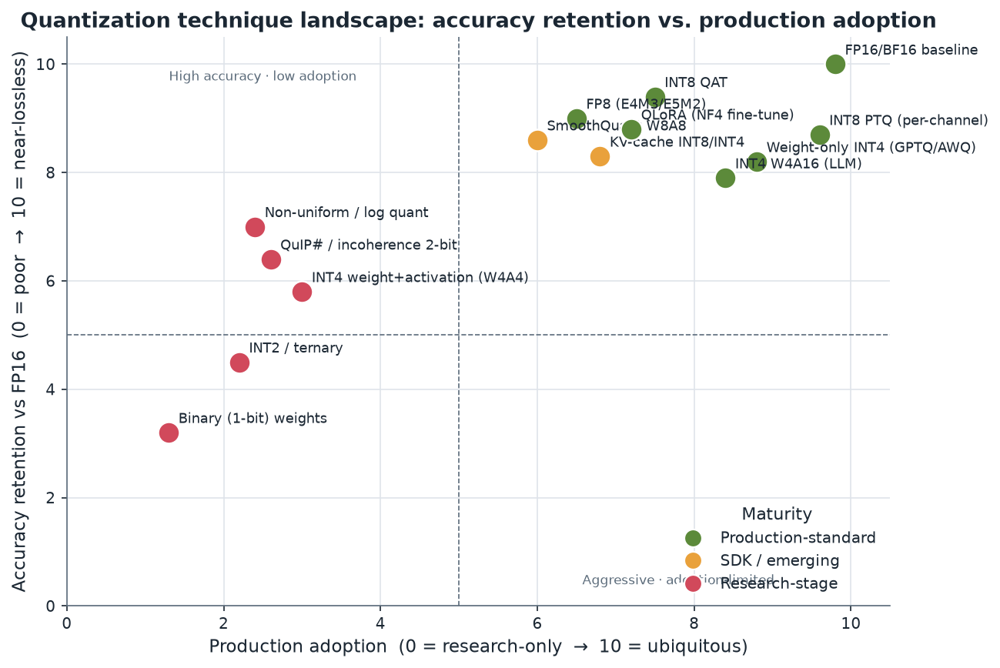
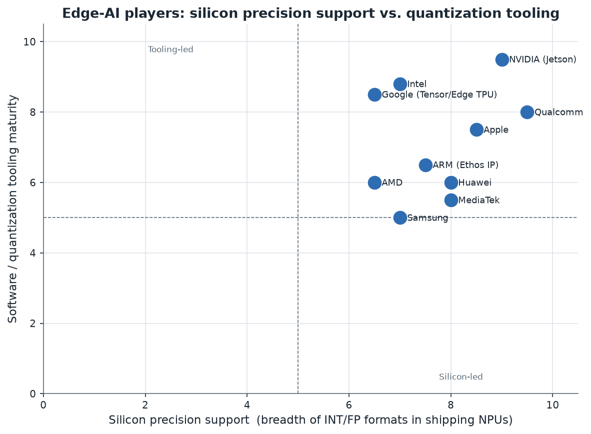
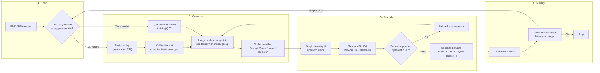

# 01. Executive Summary

> **Section scope.** A cross-cutting orientation to model quantization for edge
> AI as it stands in mid-2026: where quantization sits on the accuracy/efficiency
> frontier, which techniques are production-standard versus research-stage, and
> which players lead in silicon support versus software tooling. Later sections
> expand each thread in depth; this one is the map.

## The one-paragraph version

Quantization — representing a neural network's weights and, optionally, its
activations in low-bit integer or reduced-precision floating-point formats
instead of 16- or 32-bit floats — has moved from an optimization of last resort
to the default deployment path for essentially all edge AI. For convolutional
vision models, 8-bit integer (INT8) inference has been production-standard since
roughly 2018 and is now effectively free in accuracy terms when done with
per-channel scales and a short calibration pass. The frontier has since moved
twice: first to **weight-only 4-bit** quantization, which became the standard way
to fit large language models (LLMs) onto phones, laptops, and single consumer
GPUs between 2022 and 2024; and second toward **sub-4-bit and low-bit
floating-point** (FP8, FP4, and 2-bit integer schemes), which are now shipping in
silicon but whose software maturity lags their hardware support. The through-line
of the field in 2026 is **hardware–software co-design**: the accuracy of a
quantized model is now as much a property of the target NPU's supported formats,
its per-group scale handling, and its compiler as it is of the quantization
algorithm itself.

## Where quantization sits on the accuracy/efficiency frontier

The value proposition of quantization is a set of near-linear resource wins
traded against a sub-linear-until-a-cliff accuracy cost. Moving from FP16 to INT8
halves model memory and roughly doubles arithmetic throughput on hardware with
native INT8 matrix units, for a top-line accuracy loss that is typically under
1% for vision CNNs and under 1–2 perplexity-equivalent points for well-calibrated
LLMs. Moving from FP16 to 4-bit weight-only quantization cuts weight memory by
~4× — the dominant win for LLMs, which are memory-bandwidth-bound during
autoregressive decoding — while keeping activations in FP16 to preserve accuracy.
The cost curve stays gentle down to about 4 bits and then steepens sharply: at
2 bits and below, naive quantization collapses model quality, and only
carefully-engineered schemes (incoherence processing, learned codebooks,
mixed-precision outlier handling) keep models usable.

The single most important structural fact for edge deployment is that **the
binding constraint differs by workload**. Vision and audio CNNs on a phone are
usually *compute-bound* and *energy-bound*: the win from quantization is faster,
cooler inference, and INT8 (increasingly INT4 for weights) is the sweet spot.
LLM decoding is *memory-bandwidth-bound*: each generated token requires streaming
the entire weight set from DRAM, so weight-only 4-bit quantization delivers a
near-4× token-rate improvement almost regardless of the compute engine, which is
why 4-bit LLMs dominate on-device generative AI. This asymmetry — compute-bound
vision versus bandwidth-bound generation — explains most of the divergence in how
techniques and silicon have evolved.

The quadrant above places the field's major techniques by production adoption
(horizontal) and accuracy retention relative to an FP16 baseline (vertical).
Three clusters are visible. In the upper right sit the **production-standard**
techniques — INT8 PTQ and QAT, weight-only INT4 for LLMs, FP8, and NF4-based
QLoRA fine-tuning — high accuracy retention *and* broad adoption. Along the top
edge but further left are techniques with **excellent accuracy but narrower
adoption**, typically because they require specialized kernels or hardware (FP8
outside data-center/flagship silicon, non-uniform quantization). The lower-left
region holds the **research-stage** aggressive schemes: W4A4, INT2/ternary,
and 1-bit binary weights, which achieve dramatic compression but have not cleared
the accuracy or tooling bar for general production use.

## Production-standard vs. research-stage: the honest maturity map

The most common failure in surveying this field is conflating "demonstrated in a
paper" with "deployable." The table below separates the two explicitly, using the
maturity taxonomy applied throughout this database.

| Technique | Typical bit-width | Maturity | Where it actually ships |
|---|---|---|---|
| Per-channel INT8 PTQ | W8A8 | 🟢 production-shipped | Every mobile NPU, TFLite, TensorRT, Core ML, OpenVINO |
| INT8 QAT | W8A8 | 🟢 production-shipped | Accuracy-critical vision/audio models; standard in vendor SDKs |
| Weight-only INT4 (GPTQ, AWQ) | W4A16 | 🟢 production-shipped | On-device + server LLMs; llama.cpp, vLLM, MLC, TensorRT-LLM |
| NF4 / QLoRA | W4 (fine-tune) | 🟢 production-shipped | De-facto standard for fine-tuning large models on limited VRAM |
| GGUF k-quants (llama.cpp) | 2–8 bit mixed | 🟢 production-shipped | The dominant local-LLM distribution format |
| FP8 (E4M3/E5M2) | W8A8 (float) | 🟢 production-shipped (data center) / 🟡 emerging (edge) | Hopper/Blackwell, flagship 2025 mobile NPUs |
| SmoothQuant (W8A8 activations) | W8A8 | 🟡 sdk-limited | Server LLM serving; less common on edge |
| KV-cache quantization (INT8/INT4) | KV 8/4-bit | 🟡 sdk-limited → shipping | Long-context on-device LLMs; increasingly default |
| FP4 / MXFP4 | W4A4 (float) | 🟡 emerging | Blackwell + newest mobile NPUs; software immature |
| W4A4 integer | W4A4 | 🔴 research-only | Papers (Atom, QuaRot, SpinQuant); niche kernels |
| INT2 / ternary | 2-bit / {-1,0,1} | 🔴 research-only | BitNet-style; requires from-scratch training |
| Binary (1-bit) weights | 1-bit | 🔴 research-only | XNOR-Net lineage; accuracy-limited outside tiny models |

The practical takeaway: **8-bit is solved, 4-bit weight-only is solved for LLMs,
and everything below 4 bits is a live research problem** with pockets of
production use only where the model was *trained* for it (quantization-aware or
quantization-native architectures such as the BitNet family).

## Silicon support vs. software tooling: who leads where

A recurring theme is that leadership in *silicon precision support* and leadership
in *software tooling* are held by different players, and the gap between a chip's
theoretical format support and a developer's ability to actually exploit it is
where most of the real-world friction lives.

- **Silicon-led:** Qualcomm's Hexagon NPU is the breadth leader among mobile SoCs
  — the Snapdragon 8 Elite Gen 5 (Sept 2025) supports INT2/INT4/INT8/INT16 and
  FP8/FP16 in hardware — but its tooling (AIMET, AI Engine Direct/QNN) has a
  steeper learning curve than the desktop ecosystems. Apple's Neural Engine and
  MediaTek's APU are similarly silicon-strong.
- **Tooling-led:** NVIDIA is the outlier that leads on *both* axes — TensorRT /
  TensorRT-LLM plus a mature CUDA quantization stack — but its edge footprint
  (Jetson) is a smaller market than mobile. Intel (OpenVINO, Neural Compressor)
  and Google (LiteRT/TFLite, the reference mobile quantization toolchain) lead on
  software approachability relative to their silicon volume.
- **Balanced:** Apple pairs a strong Neural Engine with Core ML tools and the MLX
  framework, and has the unusual advantage of controlling the whole stack from
  silicon to the shipping on-device models (Apple Intelligence).

This matters because a developer targeting "the edge" is really targeting a
specific NPU's *supported format × granularity × compiler* combination. A model
quantized to a scheme the target NPU cannot execute natively will silently fall
back to a slower path or be rejected by the compiler. Section 06 treats this
co-design problem directly, and Sections 08–11 give per-vendor detail.

## The end-to-end quantization pipeline

Every deployment, regardless of technique, follows the same four-stage arc:
**train → quantize → compile → deploy**. The decisions at each stage constrain the
others — the target NPU's supported formats determine which quantization schemes
are worth applying, and the choice of PTQ versus QAT determines whether the
training stage is even revisited.

The feedback edges are the important part: real quantization work is iterative.
A format the compiler cannot map, or an accuracy regression discovered on-device,
sends the engineer back to re-quantize (change granularity, add per-group scales,
protect outlier channels) or, in the worst case, back to training for QAT.
Section 03 details the technique choices inside the "Quantize" box; Section 06
details what happens inside "Compile."

## Cross-cutting maturity summary: techniques × players

The following matrix condenses the state of play — which precision formats are
genuinely production-shipped versus SDK-available-but-limited across the major
edge silicon vendors. It is a summary; per-vendor nuance and confidence flags are
in Sections 08–11.

| Vendor / stack | INT8 | INT4 (weight) | INT2 | FP8 | FP4 | Primary tooling | Tooling maturity |
|---|---|---|---|---|---|---|---|
| Qualcomm Hexagon | 🟢 | 🟢 | 🟡 | 🟢 (2025 flagship) | 🟡 | AIMET, QNN / AI Engine Direct | High |
| Apple Neural Engine | 🟢 | 🟢 (Core ML/MLX) | 🔴 | 🟡 | 🔴 | Core ML Tools, MLX | High |
| MediaTek APU | 🟢 | 🟢 | 🟡 | 🟡 | 🔴 | NeuroPilot | Medium |
| Samsung Exynos NPU | 🟢 | 🟡 | 🔴 | 🟡 | 🔴 | ENN SDK | Medium |
| Google Tensor / Edge TPU | 🟢 | 🟡 | 🔴 | 🔴 | 🔴 | LiteRT (TFLite) | High |
| NVIDIA Jetson | 🟢 | 🟢 | 🔴 | 🟢 | 🟢 (Blackwell) | TensorRT / TensorRT-LLM | Very high |
| Intel (NPU/GPU) | 🟢 | 🟢 | 🔴 | 🟡 | 🔴 | OpenVINO, Neural Compressor | Very high |
| AMD Ryzen AI | 🟢 | 🟢 | 🔴 | 🟡 | 🔴 | Ryzen AI SW, Quark | Medium |
| ARM Ethos NPU IP | 🟢 | 🟡 | 🔴 | 🔴 | 🔴 | Vela compiler, ExecuTorch | Medium |

Legend: 🟢 production-shipped · 🟡 sdk-limited / emerging · 🔴 not supported / research-only.
Cells marked for FP4/FP8 on unreleased or first-generation silicon carry a
⚠️ confidence flag — vendor format claims frequently precede robust software
support by one or more product cycles.

## What "leads" actually means in 2026

Three consolidations define the current moment:

1. **4-bit weight-only quantization is the new INT8.** Just as INT8 became the
   assumed baseline for vision by 2018, W4A16 (4-bit weights, 16-bit activations)
   has become the assumed baseline for on-device LLMs. GPTQ and AWQ are the two
   reference algorithms; GGUF/llama.cpp is the dominant distribution format for
   local models; and every serious mobile NPU now advertises INT4 support.
2. **The format war has moved to sub-8-bit floating point.** FP8 is production in
   the data center and arriving on flagship mobile NPUs; FP4/MXFP4 (microscaling
   formats) are the frontier, with NVIDIA Blackwell and the newest mobile NPUs
   claiming support. The open question is software: hardware format support is
   necessary but not sufficient, and mature, accuracy-preserving FP4 toolchains
   are still maturing.
3. **Co-design, not algorithms, is the bottleneck.** The marginal accuracy gains
   from new quantization *algorithms* have shrunk; the marginal gains from better
   *compilers, per-group scale hardware, and quantization-native architectures*
   have grown. The most consequential recent work — microscaling formats,
   rotation/incoherence methods, KV-cache quantization, and BitNet-style
   quantization-native training — all blur the line between "algorithm" and
   "hardware format."

## How the rest of this database is organized

Sections 02–07 build the technical foundation: history (02), core techniques and
theory (03), precision formats and numerics (04), LLM-specific methods (05),
hardware–software co-design (06), and the tradeoff analysis (07). Sections 08–11
are the vendor roadmaps: Apple, Qualcomm, MediaTek, and the other major players
(Samsung, Google, NVIDIA, Intel, AMD, ARM, Huawei). Sections 12–13 cover the
research and startup ecosystems. Sections 14–15 look forward (future roadmap;
standards and benchmarks). Section 16 consolidates every entity discussed into a
single competitive database of 75–100+ entries with an exportable CSV, and
Section 17 provides the glossary and the confidence-level methodology that governs
every claim in this document.

A note on epistemics, expanded in Section 17: this database distinguishes
**official-spec** claims (datasheets, papers) from **sdk-docs** and **inferred**
claims, and flags every **speculative** roadmap statement. Vendor performance
numbers ("N TOPS", "X% faster") are reported as vendor claims and flagged where no
independent benchmark corroborates them — TOPS figures in particular are near-
useless for cross-vendor comparison because they conflate precision, utilization,
and measurement methodology. Where a comparison table cannot be responsibly
filled — because a category is genuinely sparse or the public data does not exist
— that is stated explicitly rather than papered over.

---

*Next: [02 — Development History (2015–present)](./02-history.md) traces how the
field arrived here, from BinaryConnect and XNOR-Net through the INT8 standardization
era to the LLM-quantization explosion.*
