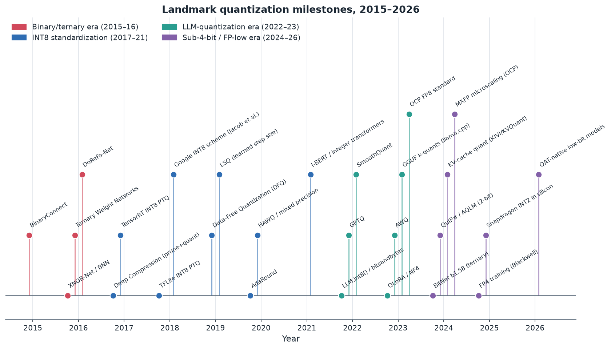
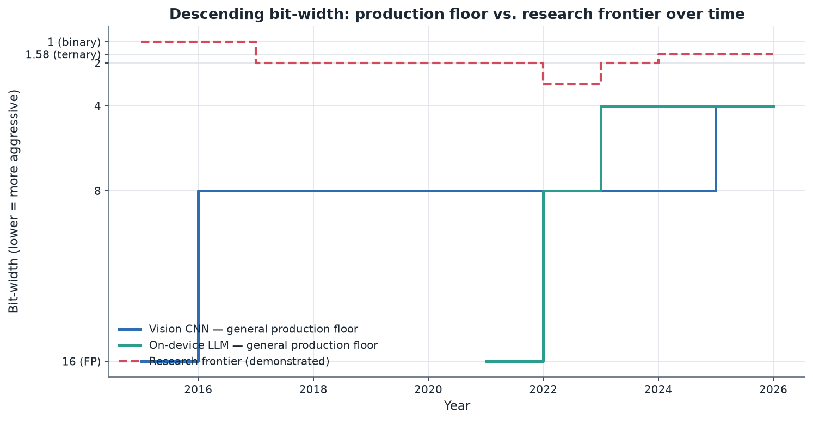
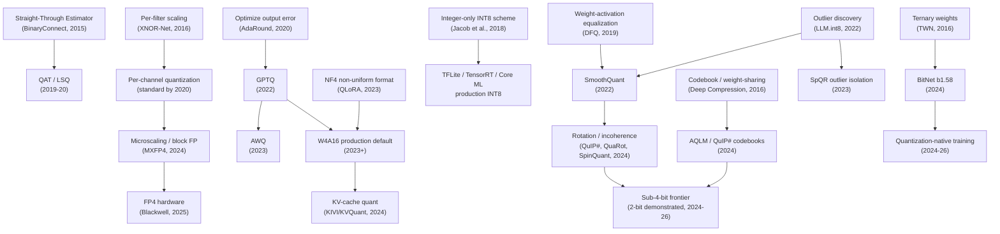

# 02. Development History (2015–present)

> **Section scope.** A chronological account of how neural-network quantization
> developed from the early binary and ternary networks of 2015–2016, through the
> standardization of INT8 post-training quantization, into the large-language-model
> quantization explosion of 2022–2023, and on to the sub-4-bit and low-bit
> floating-point era of 2024–2026. The aim is not just a list of papers but an
> account of *why* each advance mattered and *whether it was adopted* — the gap
> between a clever idea and a shipped default is the recurring theme.

## Reading the timeline

The field's history divides cleanly into four eras, each defined by a different
binding problem. The **binary/ternary era** (2015–2016) asked whether networks
could work at all at extreme low precision. The **INT8 standardization era**
(2017–2021) turned 8-bit integer inference from a research result into an
industrial default, and built the calibration and quantization-aware-training
machinery that still underpins production tooling. The **LLM-quantization era**
(2022–2023) confronted a new problem — models too large to fit in memory at
FP16 — and produced the weight-only 4-bit methods (GPTQ, AWQ) and distribution
formats (GGUF) that now define on-device generative AI. The **sub-4-bit / low-FP
era** (2024–2026) is pushing below 4 bits with rotation methods, learned
codebooks, and quantization-native architectures, while low-bit floating-point
formats (FP8, FP4, microscaling) move the frontier in a parallel direction.

The second chart captures the single most important dynamic: the *gap* between
what research demonstrates and what production actually ships. Binary weights were
demonstrated in 2016 but never became a general production floor; INT8 became the
vision floor around 2018 and stayed there for years; 4-bit became the on-device
LLM floor in 2023. The research frontier consistently runs several bits ahead of
the production floor, and the lag is measured in years — a pattern that recurs
today with FP4 and 2-bit schemes.

## Prehistory: fixed-point DSP and the pre-2015 baseline

Quantizing numeric computation for efficiency long predates deep learning. Digital
signal processors have used fixed-point arithmetic since the 1980s precisely
because integer multiply-accumulate units are smaller and more energy-efficient
than floating-point ones. Early neural-network accelerators and embedded vision
systems routinely used 16-bit or 8-bit fixed-point representations. What changed
with deep learning was scale and sensitivity: modern networks have millions to
billions of parameters, and the question became not "can we use fixed point" but
"how aggressively can we reduce precision before the network's learned function
degrades." The 2011–2014 period established, largely empirically, that networks
tolerate 16-bit and often 8-bit fixed point with little loss — but the theory and
tooling to do this reliably, and the appetite to go lower, arrived with the
binary-network wave.

## Era 1 — Binary and ternary networks (2015–2016)

The opening question of modern quantization research was audacious: could a neural
network function with weights constrained to a single bit? The answer, surprisingly,
was a qualified yes, and the papers that established it set the intellectual agenda
for a decade.

### BinaryConnect (2015)

Courbariaux, Bengio, and David's **BinaryConnect** (NeurIPS 2015) demonstrated
training deep networks with binary weights (+1 / −1) during the forward and
backward passes, while keeping a full-precision copy of the weights for the
gradient accumulation step. The key insight — the **straight-through estimator**
(STE), which passes gradients through the non-differentiable sign function as if it
were the identity — remains the foundation of essentially all quantization-aware
training today. BinaryConnect showed near-state-of-the-art results on small image
datasets (MNIST, CIFAR-10, SVHN), proving the concept even if it did not scale to
large models.

### Binarized Neural Networks and XNOR-Net (2016)

Two 2016 papers pushed further. **Binarized Neural Networks (BNN)** (Courbariaux &
Bengio) binarized both weights *and* activations, so that the dominant matrix
multiplications could be replaced by bitwise XNOR and popcount operations — a
potential ~32× reduction in arithmetic energy. **XNOR-Net** (Rastegari et al.,
ECCV 2016) refined this with per-filter scaling factors that recovered much of the
lost accuracy, and was the first to report binary-network results on ImageNet-scale
classification. XNOR-Net's accuracy gap versus full precision on ImageNet was
large (double-digit top-1 percentage points on AlexNet-class models), which
foreshadowed the enduring problem with extreme quantization: it works on easy
tasks and small models, but the accuracy cliff on hard tasks is steep.

### Ternary Weight Networks and DoReFa-Net (2016)

**Ternary Weight Networks (TWN)** (Li, Zhang & Liu) added a zero state — weights
in {−1, 0, +1} — which materially improved accuracy over binary by allowing the
network to prune (zero) unimportant weights while keeping the compute cheap. The
ternary idea would resurface, almost unchanged in spirit, in the 2024 BitNet
b1.58 work. **DoReFa-Net** (Zhou et al.) generalized the approach to arbitrary
low bit-widths for weights, activations, *and* gradients, introducing the notion
that different tensors in a network could be quantized to different bit-widths —
an early gesture toward mixed precision.

### Deep Compression (2015–2016) — the pipeline view

Han, Mao, and Dally's **Deep Compression** (ICLR 2016, best paper) was influential
in a different way: it combined pruning, weight-sharing quantization (via k-means
clustering of weights into a codebook), and Huffman coding into a single pipeline,
achieving 35–49× model-size reduction on vision models. It reframed quantization
as one stage in a *compression pipeline* rather than an isolated trick, and its
codebook/non-uniform quantization idea anticipated the learned-codebook methods
(AQLM, QuIP#) of the 2024 era.

**Adoption outcome for Era 1:** Binary and ternary networks were a research
success and a production near-miss. They proved networks tolerate extreme
precision reduction and gave us the straight-through estimator, but the accuracy
gap on real tasks, the need to train from scratch, and the lack of hardware with
native 1-bit matrix units meant they never became a general deployment path. Their
influence is intellectual: STE, per-channel scaling, ternary states, and the
codebook idea all became load-bearing components of later, more moderate methods.

## Era 2 — INT8 standardization (2017–2021)

If Era 1 asked "how low can we go," Era 2 answered "how do we make a *practical*,
lossless-enough bit-width work reliably in industry." The answer was 8-bit integer
inference, and the story of this era is the story of turning INT8 from a result
into an infrastructure.

### Integer-arithmetic-only inference (2017–2018)

The pivotal paper was Jacob et al.'s **"Quantization and Training of Neural
Networks for Efficient Integer-Arithmetic-Only Inference"** (arXiv late 2017,
CVPR 2018), from Google. It specified a complete, hardware-friendly scheme:
affine (asymmetric) 8-bit integer quantization with a per-tensor scale and
zero-point, arranged so that inference — including the requantization between
layers — could run entirely in integer arithmetic, with the only floating-point
operation being a fixed-point multiplication approximated by an integer multiply
and bit-shift. This mattered because it matched what cheap mobile hardware could
actually execute. The companion release in **TensorFlow Lite** made INT8 PTQ and
QAT available to ordinary developers, and the scheme became the template that ARM,
Qualcomm, and others built silicon and compilers around. Raghuraman
Krishnamoorthi's 2018 whitepaper, *"Quantizing deep convolutional networks for
efficient inference,"* consolidated the practical guidance — per-channel weight
quantization, the importance of folding batch-norm before quantizing, and when QAT
is necessary — and remains a canonical reference.

### TensorRT and the inference-engine model (2017)

NVIDIA's **TensorRT** brought INT8 PTQ to GPU inference in 2017, introducing a
calibration procedure based on minimizing the Kullback–Leibler divergence between
the FP32 and INT8 activation distributions to choose clipping thresholds. This
"entropy calibration" was one of the first widely-deployed answers to the central
PTQ question — *where do you clip the activation range* — and established the
inference-engine pattern (take a trained model, calibrate, compile to an optimized
integer engine) that TensorRT-LLM, OpenVINO, Core ML, and QNN all follow today.

### Calibration, rounding, and data-free methods (2019–2020)

With the basic scheme fixed, research turned to squeezing PTQ accuracy without
retraining:

- **Data-Free Quantization (DFQ)** (Nagel et al., ICCV 2019) showed that
  cross-layer weight equalization and bias correction could make many CNNs
  quantize to INT8 with *no* calibration data at all, by exploiting the scale
  invariance of consecutive linear layers separated by ReLU — an idea that
  reappears, generalized, in SmoothQuant's activation-to-weight migration.
- **Learned Step Size Quantization (LSQ)** (Esser et al., ICLR 2020) made the
  quantization step size a learnable parameter trained by gradient descent,
  setting a new bar for low-bit QAT accuracy.
- **AdaRound** (Nagel et al., ICML 2020) challenged the universal assumption that
  you should round weights to the *nearest* quantization level, showing that a
  learned per-weight up-or-down rounding decision — optimized to minimize the
  impact on the layer's output rather than on the weights themselves — recovered
  substantial accuracy in PTQ. AdaRound reframed PTQ as a small local
  optimization problem, an idea GPTQ would later scale to billions of parameters.
- **HAWQ** (Dong et al., 2019–2020) used the Hessian (second-order curvature) to
  decide *which layers* were most sensitive and therefore deserved higher
  precision, formalizing **mixed-precision quantization** as a principled search
  rather than hand-tuning.

### BRECQ, per-channel granularity, and QAT maturation (2020–2021)

**BRECQ** (Li et al., ICLR 2021) pushed block-wise reconstruction to enable INT4
PTQ on vision models with reconstruction at the block granularity, narrowing the
gap between PTQ and QAT. Across this period, **per-channel weight quantization**
(a separate scale per output channel) became standard practice, because the
dynamic range of weights varies enormously across channels and a single per-tensor
scale wastes precision. QAT tooling matured in TensorFlow and PyTorch, making the
train-with-fake-quantization workflow accessible.

### Quantizing transformers (2021)

As transformers displaced CNNs in NLP, quantization research followed.
**I-BERT** (Kim et al., ICML 2021) implemented integer-only inference for BERT,
including integer approximations of the nonlinearities (GELU, softmax, layer-norm)
that CNNs did not have. **Q-BERT** and related work applied Hessian-based mixed
precision to transformers. These papers surfaced the problem that would dominate
the next era: transformer *activations* contain large-magnitude **outliers** in
specific channels that make naive activation quantization catastrophic — a problem
CNNs largely did not have.

**Adoption outcome for Era 2:** total success. INT8 PTQ became the assumed baseline
for vision and audio on-device inference, wired into TFLite, TensorRT, Core ML,
OpenVINO, and every mobile NPU's toolchain. QAT became the standard escalation
path when PTQ lost too much accuracy. Per-channel weight quantization, batch-norm
folding, KL/percentile calibration, and mixed precision all became production
defaults. The machinery built in this era is still the substrate on which the LLM
era's methods run.

## Era 3 — The LLM-quantization explosion (2022–2023)

The arrival of large language models changed the problem. A 7-billion-parameter
model in FP16 needs ~14 GB just for weights; a 70B model needs ~140 GB. Suddenly
the point of quantization was not primarily speed or energy but *fitting the model
into available memory at all* — and, because LLM decoding streams every weight from
memory for each token, weight-only quantization directly bought decoding speed.
This era compressed an enormous amount of progress into roughly eighteen months.

### LLM.int8() and the outlier discovery (2022)

Tim Dettmers et al.'s **LLM.int8()** (NeurIPS 2022), shipped in the **bitsandbytes**
library, was the first method to quantize large transformer weights to INT8 with
*no* accuracy loss at scale. Its central finding was diagnostic: beyond a
parameter threshold (~6.7B), transformers develop a small number of
**emergent outlier feature dimensions** whose activation magnitudes are orders of
magnitude larger than the rest, and which are essential to model quality. LLM.int8()
handled them with a mixed-precision decomposition — the ~0.1% of outlier dimensions
computed in FP16, the rest in INT8. This crystallized outlier handling as *the*
central technical problem of LLM quantization, and every subsequent method is in
some sense an answer to it.

### GPTQ — accurate one-shot 4-bit weights (2022)

Frantar, Ashkboos, Hoefler, and Alistarh's **GPTQ** (arXiv October 2022) was the
breakthrough that made 4-bit LLMs practical. It scaled the AdaRound-style idea —
quantize to minimize output error, not weight error — to billion-parameter models
using an efficient approximation of the layer-wise Hessian (via the Optimal Brain
Surgeon framework) and a clever column-by-column update order. GPTQ could quantize
a 175B-parameter model to 3–4 bits in a few GPU-hours with minimal perplexity
degradation, and crucially did so *post-training* with only a small calibration
set. GPTQ (and its open implementations, later consolidated into AutoGPTQ and the
GPTQModel lineage) became one of the two reference 4-bit weight-only methods.

### ZeroQuant and SmoothQuant — the activation problem (2022)

Two methods tackled the outlier problem for *activation* quantization (needed for
W8A8 integer speedups, not just memory savings). **ZeroQuant** (Yao et al.,
Microsoft, 2022) combined per-token dynamic activation quantization with
group-wise weight quantization and a layer-wise knowledge-distillation recovery
step. **SmoothQuant** (Xiao et al., MIT/NVIDIA, arXiv November 2022) introduced an
elegant, training-free idea: because the outliers live in activations and weights
are easy to quantize, you can *migrate* quantization difficulty from activations
to weights by scaling activation channels down and the corresponding weight
channels up by an offline-computed per-channel factor, preserving the mathematical
product. This "smoothing" made W8A8 quantization of large models feasible and
became a standard preprocessing step in server LLM serving.

### llama.cpp, GGUF, and the local-LLM movement (2023)

Georgi Gerganov's **llama.cpp** (early 2023) did for deployment what GPTQ did for
accuracy: it made quantized LLMs run on ordinary CPUs and laptops. Its quantization
schemes — the **k-quant** family (Q4_K, Q5_K, Q6_K, etc.), which use block-wise
quantization with mixed bit allocation and a super-block scale hierarchy — were
engineered for CPU SIMD execution and a good accuracy/size tradeoff. The
**GGUF** file format (successor to GGML) became the dominant distribution format
for local models: a single self-describing file containing quantized weights and
metadata. The importance of llama.cpp/GGUF is sociological as much as technical —
it created a mass ecosystem of hobbyists and developers running quantized LLMs
locally, which drove demand and expectations for on-device generative AI.

### QLoRA / NF4 — quantization meets fine-tuning (2023)

Dettmers et al.'s **QLoRA** (May 2023) combined 4-bit weight quantization with
low-rank adapters (LoRA) to enable fine-tuning of large models on a single
consumer GPU. It introduced the **NormalFloat4 (NF4)** data type — a non-uniform
4-bit format whose quantization levels are placed to be information-theoretically
optimal for the roughly-Gaussian distribution of neural-network weights — plus
double quantization (quantizing the quantization constants) and paged optimizers.
QLoRA made 4-bit not just a deployment format but a *training* substrate, and NF4
became a widely-used weight format in its own right.

### AWQ — activation-aware weight quantization (2023)

Lin et al.'s **AWQ** (Activation-aware Weight Quantization, MIT, June 2023)
observed that not all weights matter equally: the weights connected to
high-magnitude activation channels are salient, and protecting them (by scaling)
preserves accuracy better than treating all weights uniformly. AWQ requires no
backpropagation or reconstruction, is fast, and generalizes well across domains
(including instruction-tuned and multimodal models). It became the second
reference 4-bit method alongside GPTQ, and is often preferred for its robustness
and hardware-friendly, reordering-free kernels.

### SpQR and the FP8 standard (2023)

**SpQR** (Sparse-Quantized Representation, Dettmers et al., 2023) pushed toward
near-lossless sub-4-bit by isolating the small fraction of outlier weights and
storing them in a sparse high-precision side-channel while quantizing the rest very
aggressively. In parallel, the industry standardized low-bit floating point: the
**OCP FP8 specification** (Open Compute Project, 2023), backed by NVIDIA, Arm, and
Intel, defined the E4M3 and E5M2 8-bit float formats, and NVIDIA's Hopper (H100)
brought native FP8 tensor cores to the data center. FP8 offered a different tradeoff
than INT8 — wider dynamic range, better for activations with outliers — and set the
stage for the FP4/microscaling formats of the next era.

**Adoption outcome for Era 3:** transformative and fast. Weight-only 4-bit (GPTQ,
AWQ, NF4) became the universal on-device and cost-optimized-server LLM format;
GGUF/llama.cpp became the local-LLM standard; SmoothQuant became standard for W8A8
server serving; QLoRA became the default fine-tuning method for the GPU-poor. Within
eighteen months, "quantize the LLM to 4 bits" went from research result to
industry default.

## Era 4 — Sub-4-bit and low-bit floating point (2024–2026)

The current era is defined by two parallel pushes: *below* 4 bits on the integer
side, and *below* 8 bits on the floating-point side, with a growing recognition
that the most reliable path to extreme low precision is to *train for it* rather
than quantize after the fact.

### BitNet and quantization-native architectures (2024)

Microsoft Research's **BitNet** and especially **BitNet b1.58** (February 2024)
revived the ternary idea with a crucial twist: instead of quantizing a pre-trained
FP model, BitNet *trains from scratch* with weights constrained to {−1, 0, +1}
(≈1.58 bits) and 8-bit activations. Trained this way, ternary models matched
full-precision transformers of the same size on language modeling, because the
network learns weights that are *natively* representable in ternary rather than
being forced into it after training. BitNet reframed extreme quantization as an
**architecture and training** problem — "quantization-native" models — and its
matmul-free, addition-dominant compute is attractive for custom silicon. Whether
quantization-native training scales to frontier model sizes and holds up on hard
reasoning tasks is the open question, but it is the most-watched direction in the
field.

### Rotation and incoherence methods: QuIP#, QuaRot, SpinQuant (2024)

A cluster of 2024 methods attacked the outlier problem geometrically. The insight,
originating in **QuIP** and refined in **QuIP#**, is that multiplying weights and
activations by random orthogonal (rotation) matrices makes their distributions more
*incoherent* — Gaussian-like and outlier-free — which makes them far easier to
quantize to 2–3 bits; the rotations are chosen so they cancel mathematically and
can be fused into adjacent layers at no inference cost. **QuIP#** added a
lattice-based (E8) vector codebook for near-optimal 2-bit quantization.
**QuaRot** and **SpinQuant** applied the rotation idea to enable full 4-bit
*weight-and-activation* (W4A4) quantization by rotating away activation outliers,
with SpinQuant *learning* the rotation matrices. These methods represent the
current state of the art for aggressive integer quantization and are the reason
2-bit is now "difficult but demonstrated" rather than "impossible."

### Learned codebooks: AQLM and the return of vector quantization (2024)

**AQLM** (Additive Quantization of Language Models, 2024) brought classical
multi-codebook vector quantization to LLM weights, representing groups of weights
as sums of vectors drawn from learned codebooks, achieving strong 2-bit accuracy.
Together with QuIP#, AQLM demonstrated that the Deep-Compression-era codebook idea,
scaled up with modern optimization, is the path to the 2-bit regime — at the cost
of more complex (and often slower) decoding kernels.

### HQQ and the fast-quantization trend (2024)

**HQQ** (Half-Quadratic Quantization, 2024) prioritized *speed of quantization*:
it quantizes large models to 4-bit or lower in minutes, without any calibration
data, by formulating quantization as a robust optimization over the quantization
parameters solved with a half-quadratic splitting method. HQQ reflects a practical
trend — as models proliferate, the cost and friction of the quantization *process*
(calibration data, GPU-hours) matters, and calibration-free methods that "just
work" are increasingly valued.

### KV-cache quantization (2024)

As context windows grew to tens and hundreds of thousands of tokens, the
**KV cache** — the stored keys and values for every past token — became a dominant
memory consumer, often exceeding the model weights for long contexts. Methods like
**KIVI** (asymmetric 2-bit KV quantization, per-channel keys and per-token values)
and **KVQuant** made long-context inference feasible on constrained devices by
quantizing the cache to 2–4 bits. KV-cache quantization moved quickly from research
to a near-default option in on-device and server LLM runtimes because its memory
payoff is so direct.

### Microscaling formats and FP4: MXFP (2024–2025)

The **Open Compute Project's Microscaling (MX) formats** (MXFP8, MXFP6, MXFP4,
MXINT8), finalized in 2023–2024 and backed by AMD, Arm, Intel, Meta, Microsoft,
NVIDIA, and Qualcomm, define block floating-point types where a small block of
low-precision elements (e.g., 32 FP4 values) shares a common scale. This is
essentially per-group quantization standardized into a hardware numeric format.
**NVIDIA Blackwell** (2024–2025) brought native FP4 (NVFP4/MXFP4) tensor cores to
the data center, and demonstrated FP4 *training*, not just inference. On the edge,
the newest mobile NPUs began advertising FP8 and, in some cases, FP4 support. The
microscaling approach is significant because it *bakes the per-group scale into the
hardware format*, closing the gap between the algorithm's needs and the silicon's
capabilities — the co-design theme of the whole field.

### Silicon catches up: INT2 in shipping phones (2025)

By 2025, the hardware caught up to the low-bit research: Qualcomm's Snapdragon 8
Elite Gen 5 (September 2025) shipped a Hexagon NPU with native **INT2, INT4, INT8,
INT16, FP8, and FP16** support ⚠️ (vendor spec; independent low-bit accuracy
benchmarks limited). The presence of INT2 in a mass-market phone SoC — whether or
not developers widely use it yet — signals that vendors now expect sub-4-bit
schemes to matter, and are provisioning silicon ahead of the software.

**Adoption outcome for Era 4 (in progress):** mixed and evolving. KV-cache
quantization and FP8 are moving decisively into production. Weight-only 4-bit
remains the workhorse. Sub-4-bit integer (2-bit via QuIP#/AQLM) is
demonstrated and available in tooling but not yet a general default — the accuracy
is close but the decoding kernels are complex and the last accuracy points matter
for hard tasks. Quantization-native training (BitNet) is promising but unproven at
frontier scale. FP4 hardware exists ahead of mature FP4 software. The era's verdict
is still being written.

## The technique lineage

The methods above are not independent; they form a lineage where each era's ideas
resurface, generalized, in the next. The graph below traces the main intellectual
dependencies.

## Landmark techniques table

The table below is the compact reference for this section: each landmark, its year,
its core contribution, and — critically — its adoption outcome, using the maturity
taxonomy. "Adoption" here means production reality, not citation count.

| Year | Technique | Core contribution | Adoption outcome |
|---|---|---|---|
| 2015 | BinaryConnect | Binary weights + straight-through estimator | 🔴 research; STE is now universal in QAT |
| 2016 | XNOR-Net / BNN | Binary weights+activations, per-filter scale | 🔴 research; scaling idea → per-channel |
| 2016 | Ternary Weight Networks | {−1,0,+1} weights | 🔴 research then; revived by BitNet (2024) |
| 2016 | DoReFa-Net | Arbitrary low-bit W/A/gradients | 🔴 research; seeded mixed precision |
| 2016 | Deep Compression | Prune + codebook quant + Huffman pipeline | 🟡 influential; codebook idea → AQLM/QuIP# |
| 2018 | Integer-only INT8 (Jacob et al.) | HW-friendly affine INT8 scheme | 🟢 the production INT8 standard |
| 2017 | TensorRT INT8 + KL calibration | GPU INT8 engine + entropy calibration | 🟢 production; template for inference engines |
| 2018 | TFLite INT8 PTQ/QAT | INT8 for mass mobile developers | 🟢 production baseline for mobile |
| 2019 | Data-Free Quantization | Calibration-free INT8 via equalization | 🟡 used; idea → SmoothQuant |
| 2020 | AdaRound | Learned rounding to minimize output error | 🟡 in PTQ toolkits; idea → GPTQ |
| 2020 | LSQ | Learnable quantization step size | 🟢 standard in low-bit QAT |
| 2020 | HAWQ | Hessian-based mixed precision | 🟡 mixed-precision search tooling |
| 2021 | BRECQ | Block reconstruction for INT4 PTQ | 🟡 research/tooling |
| 2021 | I-BERT | Integer-only transformer inference | 🟡 research; surfaced outlier problem |
| 2022 | LLM.int8() / bitsandbytes | No-loss INT8 LLM via outlier decomposition | 🟢 production; defined outlier problem |
| 2022 | GPTQ | Accurate one-shot 4-bit weights | 🟢 reference 4-bit method |
| 2022 | SmoothQuant | Migrate activation outliers to weights (W8A8) | 🟢 production in server serving |
| 2022 | ZeroQuant | Per-token dynamic + group weight + distill | 🟡 used in DeepSpeed |
| 2023 | QLoRA / NF4 | 4-bit fine-tuning + non-uniform NF4 format | 🟢 default fine-tuning method |
| 2023 | AWQ | Activation-aware weight protection | 🟢 reference 4-bit method |
| 2023 | GGUF / llama.cpp k-quants | CPU-friendly mixed-bit block quant + format | 🟢 dominant local-LLM format |
| 2023 | SpQR | Sparse outlier + aggressive base quant | 🟡 research/tooling |
| 2023 | OCP FP8 (E4M3/E5M2) | Standard 8-bit float formats | 🟢 production (data center), 🟡 edge |
| 2024 | BitNet b1.58 | Ternary quantization-native training | 🔴 research; most-watched direction |
| 2024 | QuIP# | Rotation + E8 lattice codebook, 2-bit | 🟡 SOTA 2-bit, tooling |
| 2024 | QuaRot / SpinQuant | Rotation-enabled W4A4 | 🟡 research/tooling |
| 2024 | AQLM | Additive multi-codebook 2-bit | 🟡 tooling; slow kernels |
| 2024 | HQQ | Fast calibration-free quantization | 🟡 popular in HF ecosystem |
| 2024 | KIVI / KVQuant | 2–4-bit KV-cache quantization | 🟢 moving to production default |
| 2024 | MXFP microscaling | Block FP formats (FP8/6/4) as HW numerics | 🟡→🟢 hardware arriving |
| 2025 | FP4 training (Blackwell) | Native FP4 tensor cores + FP4 training | 🟡 data center; edge emerging |

## Case studies: how landmark models actually got quantized

Abstract technique histories can obscure the concrete engineering reality. Four
model-quantization stories illustrate how the eras played out in practice.

**MobileNet on phones (2018).** MobileNet was designed for mobile inference, and
its INT8 quantization exposed an important subtlety: depthwise-separable
convolutions have very different weight distributions across channels, so
per-tensor INT8 quantization degraded accuracy noticeably (several top-1 points),
while **per-channel** weight quantization recovered nearly all of it. MobileNet was
one of the models that made per-channel quantization a non-negotiable default, and
it also motivated **quantization-aware training** in TFLite because the residual
PTQ gap on the most efficient architectures was real. The lesson — that the most
compute-efficient architectures are often the *hardest* to quantize, because they
have less redundancy to spare — recurs constantly.

**BERT and the transformer activation problem (2019–2021).** Quantizing BERT to
INT8 was straightforward for weights but revealed the activation-outlier issue
before LLMs made it famous: certain layers, particularly around the attention
softmax and the residual stream, had activation ranges that resisted uniform
quantization. Integer-only BERT (I-BERT) had to design integer approximations for
GELU, softmax, and layer normalization — operations CNNs did not stress. BERT
quantization was the dress rehearsal for the LLM era's outlier battles.

**Llama and the 4-bit local-model explosion (2023).** When Meta's Llama weights
became available in early 2023, the community quantized them to 4 bits within days
using GPTQ and llama.cpp, and the result — a capable 7B–13B model running on a
laptop or even a phone — is arguably what made "local LLMs" a mass phenomenon. The
Llama models became the de-facto benchmark on which every new quantization method
was validated, and the practical experience of quantizing them (which layers
tolerate 4 bits, how much a group size of 128 helps, when to keep the embedding and
final projection in higher precision) codified the folk wisdom of the field. The
`TheBloke` repositories on Hugging Face, which published GPTQ/GGUF quantizations of
essentially every open model in 2023, were a distribution phenomenon that
accelerated adoption enormously.

**Whisper and on-device speech (2023–2024).** OpenAI's Whisper speech-recognition
models were quantized (INT8 and 4-bit) for on-device transcription, a case where
the encoder–decoder architecture and the streaming latency requirement created
different constraints than either vision or text generation. Whisper quantization,
shipped in llama.cpp's sibling `whisper.cpp` and in mobile apps, is a reminder that
"edge quantization" spans speech and multimodal workloads with their own failure
modes (Section 07), not just the vision and LLM cases that dominate the literature.

These stories share a moral: the technique history is necessary but not sufficient;
each real deployment surfaced architecture-specific quirks (depthwise convolutions,
softmax outliers, embedding sensitivity, streaming latency) that the general
methods had to accommodate. The generalized methods won, but only after being
hardened against the specific models people actually shipped.

## The parallel hardware timeline

Quantization algorithms did not develop in a vacuum; they co-evolved with the
silicon that could execute them, and often the availability of a hardware
instruction preceded and *pulled* the software. Reading the algorithm history
against the hardware history explains much of the adoption lag.

The earliest relevant hardware primitive was NVIDIA's **DP4A** instruction
(introduced with the Pascal architecture, 2016), a 4-way INT8 dot-product-accumulate
that made INT8 GPU inference worthwhile and gave TensorRT's INT8 path something to
target. Google's first **Tensor Processing Unit** (deployed internally from 2015,
publicly detailed in 2017) was an INT8 systolic-array matrix multiplier — a
statement that INT8 was the right inference numeric at data-center scale. On the
mobile side, dedicated neural accelerators arrived in 2017–2018: Apple's first
**Neural Engine** (A11 Bionic, 2017), Huawei's **NPU** (Kirin 970, 2017),
Qualcomm's Hexagon gaining a dedicated tensor accelerator, and Google's **Edge TPU**
(2018). All were built around INT8 as the primary numeric — which is *why* INT8
PTQ tooling had an audience ready to consume it.

The next hardware inflection was **INT4** in the tensor units. NVIDIA's Turing
(2018) added INT4 tensor-core support; Qualcomm's Hexagon introduced INT4 with the
Snapdragon 8 Gen 2 generation (2022–2023). The data-center **FP8** wave arrived
with NVIDIA Hopper (H100, 2022) and was matched by the OCP FP8 standard (2023).
Most recently, NVIDIA Blackwell (2024–2025) brought **FP4** tensor cores and
microscaling support, and flagship mobile NPUs (Snapdragon 8 Elite Gen 5, 2025)
brought INT2 and FP8 to phones. The consistent pattern: a numeric format appears in
silicon roughly one to three years before software fully exploits it, and the
vendors provision hardware ahead of demonstrated demand because silicon design
cycles are long and being late is costlier than being early.

| Year | Hardware milestone | Numeric introduced | Significance |
|---|---|---|---|
| 2016 | NVIDIA Pascal (DP4A) | INT8 dot-product | Made GPU INT8 inference practical |
| 2015–17 | Google TPU v1 | INT8 systolic array | INT8 as data-center inference numeric |
| 2017 | Apple A11 Neural Engine; Kirin 970 NPU | INT8 | Dedicated mobile NPUs, INT8-first |
| 2018 | NVIDIA Turing tensor cores; Edge TPU | INT8/INT4 | INT4 arrives in tensor units |
| 2020 | NVIDIA Ampere | INT8/INT4 + sparsity | 2:4 structured sparsity + quant |
| 2022 | NVIDIA Hopper (H100) | FP8 (E4M3/E5M2) | Data-center FP8 |
| 2022–23 | Snapdragon 8 Gen 2 Hexagon | INT4 | INT4 in mass-market mobile |
| 2024–25 | NVIDIA Blackwell | FP4 / MXFP4 | FP4 inference + training |
| 2025 | Snapdragon 8 Elite Gen 5 | INT2 + FP8 | Sub-4-bit + low-FP on phones |

## The tooling and ecosystem evolution

A technique becomes a default only when it is wrapped in tooling that an ordinary
engineer can use without reading the paper. The history of quantization *software*
is therefore as consequential as the history of the algorithms, and it followed a
recognizable arc from framework-native APIs to a rich third-party ecosystem.

In the INT8 era, quantization lived inside the training frameworks and inference
engines: **TensorFlow Lite**'s converter (PTQ and QAT), **PyTorch**'s `torch.quantization`
(later FX-graph and then the `torch.ao` and PyTorch 2 export quantization flows),
NVIDIA **TensorRT**, Intel **OpenVINO** and the **Neural Network Compression
Framework (NNCF)**, and vendor SDKs (Qualcomm's SNPE/AIMET, Apple's Core ML Tools).
The unit of work was a vision model, and the workflow was calibrate-and-compile.

The LLM era spawned a parallel, faster-moving open-source ecosystem centered on
Hugging Face. **bitsandbytes** (Dettmers) delivered LLM.int8() and later 4-bit
NF4/FP4 as a near-transparent drop-in for `transformers`. **AutoGPTQ** (and later
the **GPTQModel** fork) packaged GPTQ; **AutoAWQ** packaged AWQ; Hugging Face
**Optimum** and later a unified **quantization backend** exposed them behind common
APIs. On the serving side, **vLLM** and **TensorRT-LLM** added optimized quantized
kernels (GPTQ, AWQ, FP8, later 4-bit KV cache) for high-throughput inference, and
**llama.cpp** plus **Ollama** and **LM Studio** made local quantized inference a
consumer-grade experience. Meta's **ExecuTorch** and Apple's **MLX** extended the
on-device story. The frontier methods (QuIP#, AQLM, HQQ) shipped as research
repositories that were then absorbed into the Hugging Face stack.

Two structural observations about this ecosystem matter. First, **the distribution
format became a battleground**: GGUF (llama.cpp) for local/CPU, safetensors +
per-method metadata for the GPU/HF world, and ONNX with its evolving quantization
representation for cross-vendor exchange. A model is now shipped in *many* quantized
forms simultaneously. Second, **the ecosystem consolidated the reference methods**:
of the dozens of published LLM-quantization papers, the ones that got clean,
maintained, well-integrated tooling (GPTQ, AWQ, GGUF k-quants, bitsandbytes NF4)
became the defaults, largely independent of which paper had the best benchmark
numbers. Tooling quality, not benchmark leadership, decided adoption — a lesson the
field keeps re-learning.

| Era | Tooling layer | Representative tools |
|---|---|---|
| INT8 (2017–21) | Framework/engine-native | TFLite, PyTorch quant, TensorRT, OpenVINO/NNCF, Core ML Tools, SNPE |
| LLM (2022–23) | Open-source method libs | bitsandbytes, AutoGPTQ, AutoAWQ, llama.cpp, HF Optimum |
| LLM serving (2023+) | Optimized runtimes | vLLM, TensorRT-LLM, MLC-LLM, SGLang |
| On-device (2023+) | Edge runtimes | llama.cpp, Ollama, ExecuTorch, MLX, LiteRT |
| Sub-4-bit (2024–26) | Research → integration | QuIP#, AQLM, HQQ repos absorbed into HF stack |

## Deep dive: the outlier problem as the field's organizing principle

If one technical thread unifies the LLM and sub-4-bit eras, it is the **activation
outlier problem**, and it is worth stating precisely because so many methods are
best understood as responses to it. In large transformers, a small number of
feature dimensions (channels of the hidden state) develop activation magnitudes
that are 10–100× larger than the typical dimension. These outliers are not noise —
they carry information the model depends on — but they wreck naive quantization:
because integer quantization allocates its levels uniformly across the observed
range, a few huge values force a coarse scale that crushes the precision available
to the many normal values.

The history of LLM quantization is essentially a sequence of increasingly elegant
answers to this one problem:

- **Isolate them in higher precision.** LLM.int8() computes the ~0.1% outlier
  dimensions in FP16 and the rest in INT8. SpQR isolates outlier *weights* into a
  sparse FP16 side-channel. Simple and effective, but requires mixed-precision
  execution paths.
- **Move them somewhere easier.** SmoothQuant migrates activation outliers into the
  weights (which are easier to quantize) via a per-channel rescaling that preserves
  the product. AWQ protects the weights connected to outlier activations by scaling.
- **Rotate them away.** QuIP/QuaRot/SpinQuant multiply by orthogonal matrices that
  redistribute the outlier energy across all dimensions, turning a spiky
  distribution into a smooth Gaussian-like one that quantizes cleanly, with the
  rotations fused into adjacent layers so they cost nothing at inference.
- **Avoid creating them at all.** Quantization-native training (BitNet) and
  architectural changes (e.g., activation-function and attention modifications that
  suppress outlier formation) attack the root cause during training rather than
  compensating after the fact.

This progression — isolate → migrate → rotate → prevent — is a good lens for the
whole field, and it explains why the frontier methods increasingly touch training
and hardware rather than living purely in post-training software.

## How evaluation evolved

A quieter but important thread is how the field learned to *measure* quantization
quality. Early vision work reported top-1/top-5 accuracy on ImageNet, a clean
single number. The LLM era complicated this: perplexity on WikiText/C4 became the
default proxy, but perplexity is insensitive to exactly the capabilities
(reasoning, instruction-following, code) that users care about, and a quantized
model can hold perplexity while degrading on downstream tasks. The community
gradually moved to task suites (MMLU, GSM8K, HumanEval, and instruction-following
benchmarks) and, more recently, to explicit tests of the failure modes quantization
induces — long-context degradation, calibration/overconfidence shifts, and
task-specific collapse. This maturation matters because a technique's "accuracy
retention" claim is only as meaningful as the benchmark behind it; Section 15
treats the benchmark landscape in detail, and Section 07 catalogues the failure
modes that aggregate metrics hide.

## Why open source drove the LLM-quantization era

A structural difference between the INT8 and LLM eras is worth calling out because
it shaped the pace of progress. INT8 quantization advanced largely inside company
walls — Google (TFLite, the Jacob et al. scheme), NVIDIA (TensorRT), Intel
(OpenVINO), and the mobile SoC vendors — with academic contributions feeding in.
The LLM-quantization era, by contrast, was overwhelmingly **open**: GPTQ, AWQ,
bitsandbytes, llama.cpp, QLoRA, and the frontier 2-bit methods were released as
open code, often alongside the paper, and iterated in public. The reason is partly
that open model weights (Llama, Mistral, Qwen, and others) created a shared
substrate everyone could quantize and compare on, and partly that the community of
GPU-poor researchers and hobbyists who *needed* quantization to run models at all
was large, motivated, and collaborative.

This openness had concrete consequences for the history. It compressed the
research-to-adoption lag from years (INT8) to weeks (4-bit LLMs), because there was
no productization step between "paper on arXiv" and "installable via pip." It made
tooling quality, rather than benchmark leadership, the deciding factor in adoption,
because users could and did try everything. And it meant the *reference*
implementations were community-maintained rather than vendor-owned, which is why a
handful of methods (GPTQ, AWQ, GGUF) became universal standards without any
standards body declaring them so. The contrast with the FP4/microscaling frontier —
which is being driven top-down by hardware vendors and the OCP standards process —
is instructive: hardware-defined formats necessarily move at silicon speed and
standards-committee speed, which is why the FP4 software ecosystem lags its hardware
in a way the 4-bit integer ecosystem never did.

The open-source dynamic also explains a persistent measurement problem the field
still wrestles with: because anyone can publish a quantization of any model, the
ecosystem is full of quantized checkpoints of *unknown provenance and quality*.
A model labeled "4-bit GPTQ" might use group size 32 or 128, might or might not
keep sensitive layers in higher precision, and might have been calibrated on an
appropriate or inappropriate dataset — all of which materially affect accuracy but
are rarely documented. The maturation of the field partly consists of the ecosystem
slowly developing conventions (documented group sizes, standard calibration sets,
published evaluation numbers) to tame this variance, a process Section 15's
discussion of benchmarks and standardization picks up.

## Synthesis: what the history teaches

Three durable lessons emerge from a decade of quantization research. First,
**ideas outlive their first failure**: ternary weights failed in 2016 and
triumphed (differently) in 2024; codebooks were a 2016 curiosity and a 2024 SOTA
technique. The field mines its own history. Second, **the production floor lags the
research frontier by years, and the lag is set by hardware and tooling, not by the
algorithm** — INT8 waited for silicon and compilers; 4-bit LLMs waited for GPTQ's
efficiency and llama.cpp's kernels; sub-4-bit waits now on kernel and accuracy
maturity. Third, and most importantly, **the problem has migrated from algorithm to
co-design**: the highest-leverage recent advances (microscaling formats, rotation
methods fused into layers, quantization-native training, KV-cache quantization) are
those that align the algorithm with what hardware can natively execute. The next
sections take up that co-design problem in depth — first the core techniques and
theory (Section 03), then the precision formats themselves (Section 04). Keep the
four-era arc in mind as a scaffold: nearly every method, format, and vendor
capability discussed later in this database can be located as a descendant of one
of these four historical waves.

---

*Next: [03 — Core Quantization Techniques and Theory](./03-core-techniques.md).*
