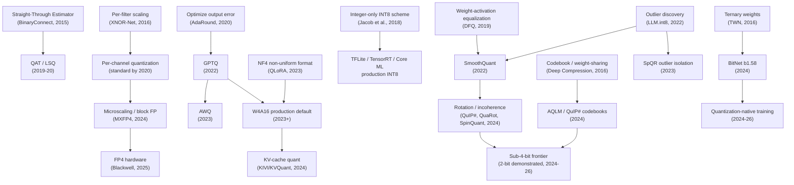

# 02. Development History (2015–present)

> **Section scope.** A chronological account of how neural-network quantization
> developed from the early binary and ternary networks of 2015–2016, through the
> standardization of INT8 post-training quantization, into the large-language-model
> quantization explosion of 2022–2023, and on to the sub-4-bit and low-bit
> floating-point era of 2024–2026. The aim is not just a list of papers but an
> account of *why* each advance mattered and *whether it was adopted* — the gap
> between a clever idea and a shipped default is the recurring theme.

## Reading the timeline

The field's history divides cleanly into four eras, each defined by a different
binding problem. The **binary/ternary era** (2015–2016) asked whether networks
could work at all at extreme low precision. The **INT8 standardization era**
(2017–2021) turned 8-bit integer inference from a research result into an
industrial default, and built the calibration and quantization-aware-training
machinery that still underpins production tooling. The **LLM-quantization era**
(2022–2023) confronted a new problem — models too large to fit in memory at
FP16 — and produced the weight-only 4-bit methods (GPTQ, AWQ) and distribution
formats (GGUF) that now define on-device generative AI. The **sub-4-bit / low-FP
era** (2024–2026) is pushing below 4 bits with rotation methods, learned
codebooks, and quantization-native architectures, while low-bit floating-point
formats (FP8, FP4, microscaling) move the frontier in a parallel direction.

The second chart captures the single most important dynamic: the *gap* between
what research demonstrates and what production actually ships. Binary weights were
demonstrated in 2016 but never became a general production floor; INT8 became the
vision floor around 2018 and stayed there for years; 4-bit became the on-device
LLM floor in 2023. The research frontier consistently runs several bits ahead of
the production floor, and the lag is measured in years — a pattern that recurs
today with FP4 and 2-bit schemes.

## Prehistory: fixed-point DSP and the pre-2015 baseline

Quantizing numeric computation for efficiency long predates deep learning. Digital
signal processors have used fixed-point arithmetic since the 1980s precisely
because integer multiply-accumulate units are smaller and more energy-efficient
than floating-point ones. Early neural-network accelerators and embedded vision
systems routinely used 16-bit or 8-bit fixed-point representations. What changed
with deep learning was scale and sensitivity: modern networks have millions to
billions of parameters, and the question became not "can we use fixed point" but
"how aggressively can we reduce precision before the network's learned function
degrades." The 2011–2014 period established, largely empirically, that networks
tolerate 16-bit and often 8-bit fixed point with little loss — but the theory and
tooling to do this reliably, and the appetite to go lower, arrived with the
binary-network wave.

## Era 1 — Binary and ternary networks (2015–2016)

The opening question of modern quantization research was audacious: could a neural
network function with weights constrained to a single bit? The answer, surprisingly,
was a qualified yes, and the papers that established it set the intellectual agenda
for a decade.

### BinaryConnect (2015)

Courbariaux, Bengio, and David's **BinaryConnect** (NeurIPS 2015) demonstrated
training deep networks with binary weights (+1 / −1) during the forward and
backward passes, while keeping a full-precision copy of the weights for the
gradient accumulation step. The key insight — the **straight-through estimator**
(STE), which passes gradients through the non-differentiable sign function as if it
were the identity — remains the foundation of essentially all quantization-aware
training today. BinaryConnect showed near-state-of-the-art results on small image
datasets (MNIST, CIFAR-10, SVHN), proving the concept even if it did not scale to
large models.

### Binarized Neural Networks and XNOR-Net (2016)

Two 2016 papers pushed further. **Binarized Neural Networks (BNN)** (Courbariaux &
Bengio) binarized both weights *and* activations, so that the dominant matrix
multiplications could be replaced by bitwise XNOR and popcount operations — a
potential ~32× reduction in arithmetic energy. **XNOR-Net** (Rastegari et al.,
ECCV 2016) refined this with per-filter scaling factors that recovered much of the
lost accuracy, and was the first to report binary-network results on ImageNet-scale
classification. XNOR-Net's accuracy gap versus full precision on ImageNet was
large (double-digit top-1 percentage points on AlexNet-class models), which
foreshadowed the enduring problem with extreme quantization: it works on easy
tasks and small models, but the accuracy cliff on hard tasks is steep.

### Ternary Weight Networks and DoReFa-Net (2016)

**Ternary Weight Networks (TWN)** (Li, Zhang & Liu) added a zero state — weights
in {−1, 0, +1} — which materially improved accuracy over binary by allowing the
network to prune (zero) unimportant weights while keeping the compute cheap. The
ternary idea would resurface, almost unchanged in spirit, in the 2024 BitNet
b1.58 work. **DoReFa-Net** (Zhou et al.) generalized the approach to arbitrary
low bit-widths for weights, activations, *and* gradients, introducing the notion
that different tensors in a network could be quantized to different bit-widths —
an early gesture toward mixed precision.

### Deep Compression (2015–2016) — the pipeline view

Han, Mao, and Dally's **Deep Compression** (ICLR 2016, best paper) was influential
in a different way: it combined pruning, weight-sharing quantization (via k-means
clustering of weights into a codebook), and Huffman coding into a single pipeline,
achieving 35–49× model-size reduction on vision models. It reframed quantization
as one stage in a *compression pipeline* rather than an isolated trick, and its
codebook/non-uniform quantization idea anticipated the learned-codebook methods
(AQLM, QuIP#) of the 2024 era.

**Adoption outcome for Era 1:** Binary and ternary networks were a research
success and a production near-miss. They proved networks tolerate extreme
precision reduction and gave us the straight-through estimator, but the accuracy
gap on real tasks, the need to train from scratch, and the lack of hardware with
native 1-bit matrix units meant they never became a general deployment path. Their
influence is intellectual: STE, per-channel scaling, ternary states, and the
codebook idea all became load-bearing components of later, more moderate methods.

## Era 2 — INT8 standardization (2017–2021)

If Era 1 asked "how low can we go," Era 2 answered "how do we make a *practical*,
lossless-enough bit-width work reliably in industry." The answer was 8-bit integer
inference, and the story of this era is the story of turning INT8 from a result
into an infrastructure.

### Integer-arithmetic-only inference (2017–2018)

The pivotal paper was Jacob et al.'s **"Quantization and Training of Neural
Networks for Efficient Integer-Arithmetic-Only Inference"** (arXiv late 2017,
CVPR 2018), from Google. It specified a complete, hardware-friendly scheme:
affine (asymmetric) 8-bit integer quantization with a per-tensor scale and
zero-point, arranged so that inference — including the requantization between
layers — could run entirely in integer arithmetic, with the only floating-point
operation being a fixed-point multiplication approximated by an integer multiply
and bit-shift. This mattered because it matched what cheap mobile hardware could
actually execute. The companion release in **TensorFlow Lite** made INT8 PTQ and
QAT available to ordinary developers, and the scheme became the template that ARM,
Qualcomm, and others built silicon and compilers around. Raghuraman
Krishnamoorthi's 2018 whitepaper, *"Quantizing deep convolutional networks for
efficient inference,"* consolidated the practical guidance — per-channel weight
quantization, the importance of folding batch-norm before quantizing, and when QAT
is necessary — and remains a canonical reference.

### TensorRT and the inference-engine model (2017)

NVIDIA's **TensorRT** brought INT8 PTQ to GPU inference in 2017, introducing a
calibration procedure based on minimizing the Kullback–Leibler divergence between
the FP32 and INT8 activation distributions to choose clipping thresholds. This
"entropy calibration" was one of the first widely-deployed answers to the central
PTQ question — *where do you clip the activation range* — and established the
inference-engine pattern (take a trained model, calibrate, compile to an optimized
integer engine) that TensorRT-LLM, OpenVINO, Core ML, and QNN all follow today.

### Calibration, rounding, and data-free methods (2019–2020)

With the basic scheme fixed, research turned to squeezing PTQ accuracy without
retraining:

- **Data-Free Quantization (DFQ)** (Nagel et al., ICCV 2019) showed that
  cross-layer weight equalization and bias correction could make many CNNs
  quantize to INT8 with *no* calibration data at all, by exploiting the scale
  invariance of consecutive linear layers separated by ReLU — an idea that
  reappears, generalized, in SmoothQuant's activation-to-weight migration.
- **Learned Step Size Quantization (LSQ)** (Esser et al., ICLR 2020) made the
  quantization step size a learnable parameter trained by gradient descent,
  setting a new bar for low-bit QAT accuracy.
- **AdaRound** (Nagel et al., ICML 2020) challenged the universal assumption that
  you should round weights to the *nearest* quantization level, showing that a
  learned per-weight up-or-down rounding decision — optimized to minimize the
  impact on the layer's output rather than on the weights themselves — recovered
  substantial accuracy in PTQ. AdaRound reframed PTQ as a small local
  optimization problem, an idea GPTQ would later scale to billions of parameters.
- **HAWQ** (Dong et al., 2019–2020) used the Hessian (second-order curvature) to
  decide *which layers* were most sensitive and therefore deserved higher
  precision, formalizing **mixed-precision quantization** as a principled search
  rather than hand-tuning.

### BRECQ, per-channel granularity, and QAT maturation (2020–2021)

**BRECQ** (Li et al., ICLR 2021) pushed block-wise reconstruction to enable INT4
PTQ on vision models with reconstruction at the block granularity, narrowing the
gap between PTQ and QAT. Across this period, **per-channel weight quantization**
(a separate scale per output channel) became standard practice, because the
dynamic range of weights varies enormously across channels and a single per-tensor
scale wastes precision. QAT tooling matured in TensorFlow and PyTorch, making the
train-with-fake-quantization workflow accessible.

### Quantizing transformers (2021)

As transformers displaced CNNs in NLP, quantization research followed.
**I-BERT** (Kim et al., ICML 2021) implemented integer-only inference for BERT,
including integer approximations of the nonlinearities (GELU, softmax, layer-norm)
that CNNs did not have. **Q-BERT** and related work applied Hessian-based mixed
precision to transformers. These papers surfaced the problem that would dominate
the next era: transformer *activations* contain large-magnitude **outliers** in
specific channels that make naive activation quantization catastrophic — a problem
CNNs largely did not have.

**Adoption outcome for Era 2:** total success. INT8 PTQ became the assumed baseline
for vision and audio on-device inference, wired into TFLite, TensorRT, Core ML,
OpenVINO, and every mobile NPU's toolchain. QAT became the standard escalation
path when PTQ lost too much accuracy. Per-channel weight quantization, batch-norm
folding, KL/percentile calibration, and mixed precision all became production
defaults. The machinery built in this era is still the substrate on which the LLM
era's methods run.

## Era 3 — The LLM-quantization explosion (2022–2023)

The arrival of large language models changed the problem. A 7-billion-parameter
model in FP16 needs ~14 GB just for weights; a 70B model needs ~140 GB. Suddenly
the point of quantization was not primarily speed or energy but *fitting the model
into available memory at all* — and, because LLM decoding streams every weight from
memory for each token, weight-only quantization directly bought decoding speed.
This era compressed an enormous amount of progress into roughly eighteen months.

### LLM.int8() and the outlier discovery (2022)

Tim Dettmers et al.'s **LLM.int8()** (NeurIPS 2022), shipped in the **bitsandbytes**
library, was the first method to quantize large transformer weights to INT8 with
*no* accuracy loss at scale. Its central finding was diagnostic: beyond a
parameter threshold (~6.7B), transformers develop a small number of
**emergent outlier feature dimensions** whose activation magnitudes are orders of
magnitude larger than the rest, and which are essential to model quality. LLM.int8()
handled them with a mixed-precision decomposition — the ~0.1% of outlier dimensions
computed in FP16, the rest in INT8. This crystallized outlier handling as *the*
central technical problem of LLM quantization, and every subsequent method is in
some sense an answer to it.

### GPTQ — accurate one-shot 4-bit weights (2022)

Frantar, Ashkboos, Hoefler, and Alistarh's **GPTQ** (arXiv October 2022) was the
breakthrough that made 4-bit LLMs practical. It scaled the AdaRound-style idea —
quantize to minimize output error, not weight error — to billion-parameter models
using an efficient approximation of the layer-wise Hessian (via the Optimal Brain
Surgeon framework) and a clever column-by-column update order. GPTQ could quantize
a 175B-parameter model to 3–4 bits in a few GPU-hours with minimal perplexity
degradation, and crucially did so *post-training* with only a small calibration
set. GPTQ (and its open implementations, later consolidated into AutoGPTQ and the
GPTQModel lineage) became one of the two reference 4-bit weight-only methods.

### ZeroQuant and SmoothQuant — the activation problem (2022)

Two methods tackled the outlier problem for *activation* quantization (needed for
W8A8 integer speedups, not just memory savings). **ZeroQuant** (Yao et al.,
Microsoft, 2022) combined per-token dynamic activation quantization with
group-wise weight quantization and a layer-wise knowledge-distillation recovery
step. **SmoothQuant** (Xiao et al., MIT/NVIDIA, arXiv November 2022) introduced an
elegant, training-free idea: because the outliers live in activations and weights
are easy to quantize, you can *migrate* quantization difficulty from activations
to weights by scaling activation channels down and the corresponding weight
channels up by an offline-computed per-channel factor, preserving the mathematical
product. This "smoothing" made W8A8 quantization of large models feasible and
became a standard preprocessing step in server LLM serving.

### llama.cpp, GGUF, and the local-LLM movement (2023)

Georgi Gerganov's **llama.cpp** (early 2023) did for deployment what GPTQ did for
accuracy: it made quantized LLMs run on ordinary CPUs and laptops. Its quantization
schemes — the **k-quant** family (Q4_K, Q5_K, Q6_K, etc.), which use block-wise
quantization with mixed bit allocation and a super-block scale hierarchy — were
engineered for CPU SIMD execution and a good accuracy/size tradeoff. The
**GGUF** file format (successor to GGML) became the dominant distribution format
for local models: a single self-describing file containing quantized weights and
metadata. The importance of llama.cpp/GGUF is sociological as much as technical —
it created a mass ecosystem of hobbyists and developers running quantized LLMs
locally, which drove demand and expectations for on-device generative AI.

### QLoRA / NF4 — quantization meets fine-tuning (2023)

Dettmers et al.'s **QLoRA** (May 2023) combined 4-bit weight quantization with
low-rank adapters (LoRA) to enable fine-tuning of large models on a single
consumer GPU. It introduced the **NormalFloat4 (NF4)** data type — a non-uniform
4-bit format whose quantization levels are placed to be information-theoretically
optimal for the roughly-Gaussian distribution of neural-network weights — plus
double quantization (quantizing the quantization constants) and paged optimizers.
QLoRA made 4-bit not just a deployment format but a *training* substrate, and NF4
became a widely-used weight format in its own right.

### AWQ — activation-aware weight quantization (2023)

Lin et al.'s **AWQ** (Activation-aware Weight Quantization, MIT, June 2023)
observed that not all weights matter equally: the weights connected to
high-magnitude activation channels are salient, and protecting them (by scaling)
preserves accuracy better than treating all weights uniformly. AWQ requires no
backpropagation or reconstruction, is fast, and generalizes well across domains
(including instruction-tuned and multimodal models). It became the second
reference 4-bit method alongside GPTQ, and is often preferred for its robustness
and hardware-friendly, reordering-free kernels.

### SpQR and the FP8 standard (2023)

**SpQR** (Sparse-Quantized Representation, Dettmers et al., 2023) pushed toward
near-lossless sub-4-bit by isolating the small fraction of outlier weights and
storing them in a sparse high-precision side-channel while quantizing the rest very
aggressively. In parallel, the industry standardized low-bit floating point: the
**OCP FP8 specification** (Open Compute Project, 2023), backed by NVIDIA, Arm, and
Intel, defined the E4M3 and E5M2 8-bit float formats, and NVIDIA's Hopper (H100)
brought native FP8 tensor cores to the data center. FP8 offered a different tradeoff
than INT8 — wider dynamic range, better for activations with outliers — and set the
stage for the FP4/microscaling formats of the next era.

**Adoption outcome for Era 3:** transformative and fast. Weight-only 4-bit (GPTQ,
AWQ, NF4) became the universal on-device and cost-optimized-server LLM format;
GGUF/llama.cpp became the local-LLM standard; SmoothQuant became standard for W8A8
server serving; QLoRA became the default fine-tuning method for the GPU-poor. Within
eighteen months, "quantize the LLM to 4 bits" went from research result to
industry default.

## Era 4 — Sub-4-bit and low-bit floating point (2024–2026)

The current era is defined by two parallel pushes: *below* 4 bits on the integer
side, and *below* 8 bits on the floating-point side, with a growing recognition
that the most reliable path to extreme low precision is to *train for it* rather
than quantize after the fact.

### BitNet and quantization-native architectures (2024)

Microsoft Research's **BitNet** and especially **BitNet b1.58** (February 2024)
revived the ternary idea with a crucial twist: instead of quantizing a pre-trained
FP model, BitNet *trains from scratch* with weights constrained to {−1, 0, +1}
(≈1.58 bits) and 8-bit activations. Trained this way, ternary models matched
full-precision transformers of the same size on language modeling, because the
network learns weights that are *natively* representable in ternary rather than
being forced into it after training. BitNet reframed extreme quantization as an
**architecture and training** problem — "quantization-native" models — and its
matmul-free, addition-dominant compute is attractive for custom silicon. Whether
quantization-native training scales to frontier model sizes and holds up on hard
reasoning tasks is the open question, but it is the most-watched direction in the
field.

### Rotation and incoherence methods: QuIP#, QuaRot, SpinQuant (2024)

A cluster of 2024 methods attacked the outlier problem geometrically. The insight,
originating in **QuIP** and refined in **QuIP#**, is that multiplying weights and
activations by random orthogonal (rotation) matrices makes their distributions more
*incoherent* — Gaussian-like and outlier-free — which makes them far easier to
quantize to 2–3 bits; the rotations are chosen so they cancel mathematically and
can be fused into adjacent layers at no inference cost. **QuIP#** added a
lattice-based (E8) vector codebook for near-optimal 2-bit quantization.
**QuaRot** and **SpinQuant** applied the rotation idea to enable full 4-bit
*weight-and-activation* (W4A4) quantization by rotating away activation outliers,
with SpinQuant *learning* the rotation matrices. These methods represent the
current state of the art for aggressive integer quantization and are the reason
2-bit is now "difficult but demonstrated" rather than "impossible."

### Learned codebooks: AQLM and the return of vector quantization (2024)

**AQLM** (Additive Quantization of Language Models, 2024) brought classical
multi-codebook vector quantization to LLM weights, representing groups of weights
as sums of vectors drawn from learned codebooks, achieving strong 2-bit accuracy.
Together with QuIP#, AQLM demonstrated that the Deep-Compression-era codebook idea,
scaled up with modern optimization, is the path to the 2-bit regime — at the cost
of more complex (and often slower) decoding kernels.

### HQQ and the fast-quantization trend (2024)

**HQQ** (Half-Quadratic Quantization, 2024) prioritized *speed of quantization*:
it quantizes large models to 4-bit or lower in minutes, without any calibration
data, by formulating quantization as a robust optimization over the quantization
parameters solved with a half-quadratic splitting method. HQQ reflects a practical
trend — as models proliferate, the cost and friction of the quantization *process*
(calibration data, GPU-hours) matters, and calibration-free methods that "just
work" are increasingly valued.

### KV-cache quantization (2024)

As context windows grew to tens and hundreds of thousands of tokens, the
**KV cache** — the stored keys and values for every past token — became a dominant
memory consumer, often exceeding the model weights for long contexts. Methods like
**KIVI** (asymmetric 2-bit KV quantization, per-channel keys and per-token values)
and **KVQuant** made long-context inference feasible on constrained devices by
quantizing the cache to 2–4 bits. KV-cache quantization moved quickly from research
to a near-default option in on-device and server LLM runtimes because its memory
payoff is so direct.

### Microscaling formats and FP4: MXFP (2024–2025)

The **Open Compute Project's Microscaling (MX) formats** (MXFP8, MXFP6, MXFP4,
MXINT8), finalized in 2023–2024 and backed by AMD, Arm, Intel, Meta, Microsoft,
NVIDIA, and Qualcomm, define block floating-point types where a small block of
low-precision elements (e.g., 32 FP4 values) shares a common scale. This is
essentially per-group quantization standardized into a hardware numeric format.
**NVIDIA Blackwell** (2024–2025) brought native FP4 (NVFP4/MXFP4) tensor cores to
the data center, and demonstrated FP4 *training*, not just inference. On the edge,
the newest mobile NPUs began advertising FP8 and, in some cases, FP4 support. The
microscaling approach is significant because it *bakes the per-group scale into the
hardware format*, closing the gap between the algorithm's needs and the silicon's
capabilities — the co-design theme of the whole field.

### Silicon catches up: INT2 in shipping phones (2025)

By 2025, the hardware caught up to the low-bit research: Qualcomm's Snapdragon 8
Elite Gen 5 (September 2025) shipped a Hexagon NPU with native **INT2, INT4, INT8,
INT16, FP8, and FP16** support ⚠️ (vendor spec; independent low-bit accuracy
benchmarks limited). The presence of INT2 in a mass-market phone SoC — whether or
not developers widely use it yet — signals that vendors now expect sub-4-bit
schemes to matter, and are provisioning silicon ahead of the software.

**Adoption outcome for Era 4 (in progress):** mixed and evolving. KV-cache
quantization and FP8 are moving decisively into production. Weight-only 4-bit
remains the workhorse. Sub-4-bit integer (2-bit via QuIP#/AQLM) is
demonstrated and available in tooling but not yet a general default — the accuracy
is close but the decoding kernels are complex and the last accuracy points matter
for hard tasks. Quantization-native training (BitNet) is promising but unproven at
frontier scale. FP4 hardware exists ahead of mature FP4 software. The era's verdict
is still being written.

## The technique lineage

The methods above are not independent; they form a lineage where each era's ideas
resurface, generalized, in the next. The graph below traces the main intellectual
dependencies.

## Landmark techniques table

The table below is the compact reference for this section: each landmark, its year,
its core contribution, and — critically — its adoption outcome, using the maturity
taxonomy. "Adoption" here means production reality, not citation count.

| Year | Technique | Core contribution | Adoption outcome |
|---|---|---|---|
| 2015 | BinaryConnect | Binary weights + straight-through estimator | 🔴 research; STE is now universal in QAT |
| 2016 | XNOR-Net / BNN | Binary weights+activations, per-filter scale | 🔴 research; scaling idea → per-channel |
| 2016 | Ternary Weight Networks | {−1,0,+1} weights | 🔴 research then; revived by BitNet (2024) |
| 2016 | DoReFa-Net | Arbitrary low-bit W/A/gradients | 🔴 research; seeded mixed precision |
| 2016 | Deep Compression | Prune + codebook quant + Huffman pipeline | 🟡 influential; codebook idea → AQLM/QuIP# |
| 2018 | Integer-only INT8 (Jacob et al.) | HW-friendly affine INT8 scheme | 🟢 the production INT8 standard |
| 2017 | TensorRT INT8 + KL calibration | GPU INT8 engine + entropy calibration | 🟢 production; template for inference engines |
| 2018 | TFLite INT8 PTQ/QAT | INT8 for mass mobile developers | 🟢 production baseline for mobile |
| 2019 | Data-Free Quantization | Calibration-free INT8 via equalization | 🟡 used; idea → SmoothQuant |
| 2020 | AdaRound | Learned rounding to minimize output error | 🟡 in PTQ toolkits; idea → GPTQ |
| 2020 | LSQ | Learnable quantization step size | 🟢 standard in low-bit QAT |
| 2020 | HAWQ | Hessian-based mixed precision | 🟡 mixed-precision search tooling |
| 2021 | BRECQ | Block reconstruction for INT4 PTQ | 🟡 research/tooling |
| 2021 | I-BERT | Integer-only transformer inference | 🟡 research; surfaced outlier problem |
| 2022 | LLM.int8() / bitsandbytes | No-loss INT8 LLM via outlier decomposition | 🟢 production; defined outlier problem |
| 2022 | GPTQ | Accurate one-shot 4-bit weights | 🟢 reference 4-bit method |
| 2022 | SmoothQuant | Migrate activation outliers to weights (W8A8) | 🟢 production in server serving |
| 2022 | ZeroQuant | Per-token dynamic + group weight + distill | 🟡 used in DeepSpeed |
| 2023 | QLoRA / NF4 | 4-bit fine-tuning + non-uniform NF4 format | 🟢 default fine-tuning method |
| 2023 | AWQ | Activation-aware weight protection | 🟢 reference 4-bit method |
| 2023 | GGUF / llama.cpp k-quants | CPU-friendly mixed-bit block quant + format | 🟢 dominant local-LLM format |
| 2023 | SpQR | Sparse outlier + aggressive base quant | 🟡 research/tooling |
| 2023 | OCP FP8 (E4M3/E5M2) | Standard 8-bit float formats | 🟢 production (data center), 🟡 edge |
| 2024 | BitNet b1.58 | Ternary quantization-native training | 🔴 research; most-watched direction |
| 2024 | QuIP# | Rotation + E8 lattice codebook, 2-bit | 🟡 SOTA 2-bit, tooling |
| 2024 | QuaRot / SpinQuant | Rotation-enabled W4A4 | 🟡 research/tooling |
| 2024 | AQLM | Additive multi-codebook 2-bit | 🟡 tooling; slow kernels |
| 2024 | HQQ | Fast calibration-free quantization | 🟡 popular in HF ecosystem |
| 2024 | KIVI / KVQuant | 2–4-bit KV-cache quantization | 🟢 moving to production default |
| 2024 | MXFP microscaling | Block FP formats (FP8/6/4) as HW numerics | 🟡→🟢 hardware arriving |
| 2025 | FP4 training (Blackwell) | Native FP4 tensor cores + FP4 training | 🟡 data center; edge emerging |

## Synthesis: what the history teaches

Three durable lessons emerge from a decade of quantization research. First,
**ideas outlive their first failure**: ternary weights failed in 2016 and
triumphed (differently) in 2024; codebooks were a 2016 curiosity and a 2024 SOTA
technique. The field mines its own history. Second, **the production floor lags the
research frontier by years, and the lag is set by hardware and tooling, not by the
algorithm** — INT8 waited for silicon and compilers; 4-bit LLMs waited for GPTQ's
efficiency and llama.cpp's kernels; sub-4-bit waits now on kernel and accuracy
maturity. Third, and most importantly, **the problem has migrated from algorithm to
co-design**: the highest-leverage recent advances (microscaling formats, rotation
methods fused into layers, quantization-native training, KV-cache quantization) are
those that align the algorithm with what hardware can natively execute. The next
sections take up that co-design problem in depth — first the core techniques and
theory (Section 03), then the precision formats themselves (Section 04).

---

*Next: [03 — Core Quantization Techniques and Theory](./03-core-techniques.md).*
