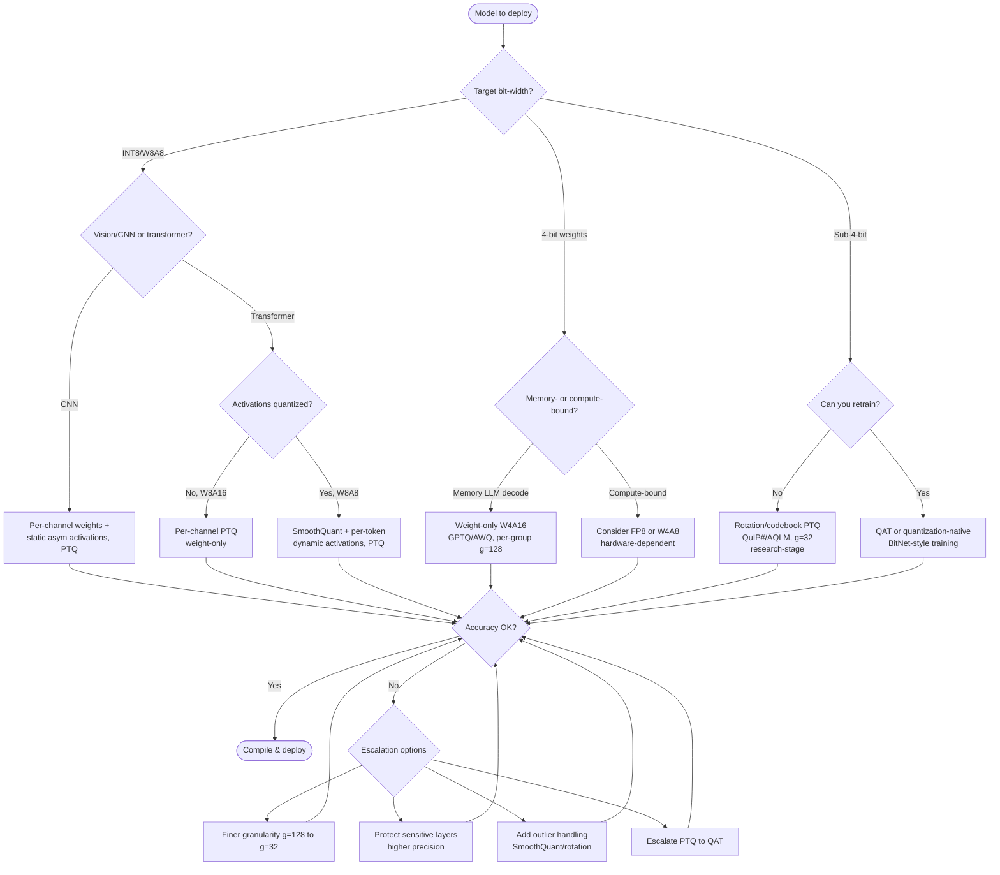

# 03. Core Quantization Techniques and Theory

> **Section scope.** The conceptual and mathematical foundation shared by every
> quantization method: how the quantization mapping works, the axes along which
> schemes differ (symmetric/asymmetric, granularity, weight-only vs. weight+
> activation, static/dynamic, PTQ/QAT), how calibration and rounding are chosen,
> and how outliers are handled. This section is deliberately technique-agnostic;
> the LLM-specific *named* methods (GPTQ, AWQ, etc.) build on these primitives and
> are treated in Section 05, and the numeric formats (INT4, FP8, etc.) in Section 04.

## The quantization mapping

At its core, quantization replaces a high-precision tensor **x** (FP32 or FP16/BF16)
with a low-precision representation that can be reconstructed approximately. The
overwhelmingly dominant scheme is **uniform affine quantization**, defined by a
**scale** `s` (a positive real number) and a **zero-point** `z` (an integer):

```
quantize:    x_q = clip( round(x / s) + z,  q_min,  q_max )
dequantize:  x_hat = s * (x_q - z)
```

The scale `s` sets the spacing between representable values (the *step size*), and
the zero-point `z` is the integer that maps to the real value 0.0 — important
because exact representation of zero matters for padding, ReLU, and sparsity. The
clip to `[q_min, q_max]` (e.g. `[-128, 127]` for signed INT8, `[0, 255]` for
unsigned) is where information is irreversibly lost for any value outside the
representable range. The reconstruction error `x - x_hat` is the **quantization
error**, and essentially all of quantization theory is about minimizing its effect
on the network's output.

Two sources of error coexist. **Rounding error** affects values inside the range
and is bounded by `s/2` per element; it behaves like additive noise roughly uniform
on `[-s/2, s/2]`. **Clipping error** affects values outside `[q_min, q_max]` and is
unbounded in principle; a single large outlier that gets clipped can distort a
result badly. The central tension of calibration — choosing `s` — is that a *large*
`s` (wide range) reduces clipping error but coarsens the step and increases
rounding error, while a *small* `s` (narrow range) does the opposite. Every
calibration method is a different answer to this bias–variance-like tradeoff.

A useful summary metric is the **signal-to-quantization-noise ratio (SQNR)**, the
ratio of signal power to quantization-noise power, usually in dB. For a
well-matched uniform quantizer, SQNR improves by roughly 6 dB per additional bit —
the classic "6 dB/bit" rule from signal processing. This is why each bit removed
roughly quadruples the noise power, and why the accuracy cliff below 4 bits is so
steep: there simply is not enough SQNR left to represent the signal once outliers
consume most of the range.

## Symmetric vs. asymmetric quantization

The first design axis is whether the quantization range is **symmetric** about zero
or **asymmetric** (affine with a non-zero zero-point).

- **Symmetric quantization** forces `z = 0`, so the mapping is `x_q = round(x/s)`
  with the range `[-s·q_max, s·q_max]` centered on zero. It is simpler and faster
  in hardware — the integer matrix multiply needs no zero-point-correction terms —
  and it exactly represents zero for free. It is the natural choice for **weights**,
  which are typically distributed roughly symmetrically around zero, and for
  hardware that wants the cheapest possible integer datapath.
- **Asymmetric quantization** allows `z ≠ 0`, shifting the range to fit the actual
  data. It is the better choice for **activations** that are one-sided — the classic
  example is post-ReLU activations, which are all non-negative; a symmetric quantizer
  would waste half its codes (the negative half) on values that never occur, halving
  the effective precision. Asymmetric quantization uses the full `[0, 255]` range,
  doubling resolution, at the cost of zero-point-correction arithmetic in the matmul.

In practice the common production configuration is **symmetric weights, asymmetric
activations** (or symmetric both, if the hardware or format prefers it). The choice
interacts with hardware: some NPUs support only symmetric, some support both, and
the compiler may silently convert. The zero-point correction for asymmetric matmul
adds terms that must be folded efficiently, and getting this right is a
compiler concern (Section 06).

| Property | Symmetric | Asymmetric (affine) |
|---|---|---|
| Zero-point | Fixed at 0 | Learned/calibrated integer |
| Exact zero | Always | Always (by construction) |
| Range utilization for one-sided data | Poor (wastes half) | Full |
| Matmul overhead | None | Zero-point correction terms |
| Typical use | Weights | Activations (esp. post-ReLU) |
| Hardware support | Universal | Common but not universal |

## Granularity: per-tensor, per-channel, per-group

The second — and arguably most consequential — axis is **granularity**: how many
distinct `(s, z)` pairs are used per tensor. Finer granularity fits the data better
(less error) but stores more scale metadata and complicates the hardware.

- **Per-tensor** (a single `s, z` for the whole weight or activation tensor) is the
  cheapest and the coarsest. It fails when different channels have very different
  magnitude ranges — common in depthwise convolutions and transformer weights —
  because one scale must accommodate the widest channel, crushing precision for the
  rest.
- **Per-channel** (a separate scale per output channel of a weight tensor) is the
  production standard for weights. It costs one scale per channel (negligible
  storage) and dramatically improves accuracy because each channel gets a range
  matched to its own distribution. Activations are usually *not* quantized
  per-channel because the channel dimension is the contraction (reduction) dimension
  of the matmul, and per-channel activation scales do not factor cleanly out of the
  dot product; per-*token* activation scaling is used instead where dynamic ranges
  vary by token.
- **Per-group / per-block** (a separate scale for each contiguous group of, say, 32,
  64, or 128 weights within a channel) is the granularity that made 4-bit and
  sub-4-bit LLM quantization work. A group size of 128 is the common default; 32 or
  64 gives more accuracy at more overhead. Per-group quantization is essentially
  **block floating point** applied to integers, and it is the conceptual bridge to
  the microscaling (MXFP) hardware formats of Section 04 — those formats standardize
  per-group scaling *into the numeric type itself*.


The chart above (illustrative, reflecting typical weight-only LLM PTQ behavior)
shows the payoff. At 8 bits, granularity barely matters — everything is
near-lossless. As bits fall, the curves fan out dramatically: at 3–4 bits, moving
from per-tensor to per-group (g=128) can be the difference between a broken model
and a usable one, and per-group (g=32) extends usability to lower bits still. The
cost is **scale overhead**: a group size of 128 with a 16-bit scale adds `16/128 =
0.125` bits per weight; a group size of 32 adds `0.5` bits per weight — non-trivial
at a nominal 4-bit budget, which is why group size is a real accuracy/size knob, not
a free lunch. Sub-4-bit methods therefore also quantize the *scales* (double
quantization, as in QLoRA) to claw back the overhead.

| Granularity | Scales per tensor | Accuracy | Overhead | Typical use |
|---|---|---|---|---|
| Per-tensor | 1 | Lowest | Minimal | Legacy / simple INT8 activations |
| Per-channel | # output channels | Good | Negligible | Standard for weights (all bit-widths) |
| Per-group (g=128) | # channels × (in/128) | Very good | ~0.125 bits/weight | 4-bit LLM weights (default) |
| Per-group (g=32) | # channels × (in/32) | Best | ~0.5 bits/weight | Sub-4-bit / accuracy-critical |
| Per-token (activations) | # tokens | Good for activations | Dynamic, cheap | Dynamic activation quantization |

## Weight-only vs. weight-and-activation quantization

Whether to quantize only the weights, or the activations too, is the axis that most
determines *what kind of speedup you get*, and it is where the vision and LLM worlds
diverge most sharply.

- **Weight-only quantization** (e.g. W4A16: 4-bit weights, 16-bit activations)
  compresses the weights but keeps activations and the matmul accumulation in
  higher precision. The matmul is performed by dequantizing weights on the fly (or
  using specialized mixed-precision kernels). The benefit is almost entirely
  **memory**: less weight storage and less weight traffic from DRAM. For LLM
  decoding — which is memory-bandwidth-bound, streaming all weights per token —
  this directly buys ~4× faster decoding, which is why W4A16 dominates on-device
  generative AI. It does *not* speed up compute-bound workloads, because the actual
  arithmetic still happens at high precision.
- **Weight-and-activation quantization** (e.g. W8A8: both 8-bit) quantizes both
  operands so the matmul runs on integer (or low-FP) tensor units at full low-
  precision throughput. This is the path to **compute** speedups and is standard for
  vision/audio CNNs on NPUs, where the workload is compute-bound. The catch is the
  activation outlier problem (Section 02): quantizing activations to low precision
  is much harder than quantizing weights, which is why W8A8 needs SmoothQuant-style
  preprocessing and why W4A4 remains research-stage.

The rule of thumb: **weight-only for memory-bound (LLM decoding), weight+activation
for compute-bound (vision, prefill).** Many real systems are hybrids — an LLM might
use W4A16 for decoding but benefit from W8A8 or FP8 during the compute-bound prefill
of a long prompt.

## Static vs. dynamic quantization

For activations specifically, the quantization parameters can be fixed ahead of time
or computed at runtime.

- **Static quantization** pre-computes activation scales/zero-points offline from a
  calibration dataset and bakes them into the model. Runtime is cheapest (no range
  computation), and the whole graph can run in integer end-to-end, which is what
  NPUs want. The risk is *calibration mismatch*: if runtime activations differ from
  the calibration data's distribution, the fixed range clips or wastes precision.
- **Dynamic quantization** computes activation ranges on the fly from the actual
  tensor being processed (per inference, often per-token). It adapts perfectly to
  the data — no calibration set needed — at the cost of a runtime reduction to find
  min/max. Dynamic **per-token** activation quantization is common in LLM serving
  because it handles the varying dynamic range of different tokens gracefully and
  needs no calibration.

Weights are always effectively "static" (known at deploy time). The static/dynamic
choice is about activations, and it trades runtime overhead against robustness to
distribution shift. NPUs generally favor static (for the fully-integer pipeline);
flexible CPU/GPU LLM runtimes often use dynamic per-token.

## PTQ vs. QAT: the central methodological fork

The single biggest decision in a quantization project is **post-training
quantization (PTQ)** versus **quantization-aware training (QAT)**.

**PTQ** takes an already-trained FP model and quantizes it without further training,
using at most a small calibration set (a few hundred samples) to set activation
ranges and, in advanced variants, to locally optimize weights (AdaRound, GPTQ).
PTQ is fast (minutes to a few GPU-hours), needs little or no data, requires no
training pipeline or labels, and is the default first attempt. It works excellently
at INT8 and, with good methods and per-group granularity, at 4-bit for LLM weights.

**QAT** inserts simulated quantization ("fake-quant" nodes that round in the forward
pass) into the model and *continues training* (or fine-tunes), so the weights adapt
to the quantization. Gradients flow through the non-differentiable rounding via the
**straight-through estimator** (STE), which treats `round()` as the identity for the
backward pass. QAT recovers substantially more accuracy than PTQ, especially at low
bit-widths, because the network learns weights that are robust to being quantized.
The cost is real: a full or partial training run, the training data and labels, the
compute, and the engineering of a QAT pipeline.


The chart makes the tradeoff concrete (illustrative values). At INT8 the gap is
negligible — use PTQ. As bit-width falls, the gap widens: at INT4 QAT recovers
several points PTQ leaves on the table, and at INT2 QAT is often the difference
between a functioning and a broken model. This yields a simple heuristic: **PTQ
until it stops being good enough, then QAT** — and "good enough" arrives sooner the
lower the bit-width and the harder the task.

A modern middle ground is **parameter-efficient QAT** and **quantization-native
training**. QLoRA-style approaches fine-tune low-rank adapters on top of frozen
quantized weights, capturing much of QAT's benefit at a fraction of the cost.
BitNet-style quantization-native training (Section 02, 04) goes further, training
the model in low precision from scratch so no post-hoc quantization is needed at all.

## The PTQ-vs-QAT (and technique-selection) decision tree

The following decision tree encodes the practical selection logic. It is
deliberately opinionated toward the cheapest technique that meets the accuracy bar,
escalating only when necessary.



The escalation loop at the bottom is the real work of a quantization engineer:
finer granularity, mixed precision for sensitive layers (embeddings, the final
projection, the first and last layers are common culprits), outlier handling, and
finally QAT. Each step costs more effort and buys more accuracy.

## Calibration methods

Calibration is the process of choosing the quantization range — the clipping
thresholds — for weights and especially activations, from a small representative
dataset. The method matters more than beginners expect, because the outlier-vs-
resolution tradeoff is decided here.

- **Min–max** uses the observed minimum and maximum as the range. Simple and
  outlier-sensitive: a single extreme activation sets the range and coarsens
  everything else. Fine for weights, often too loose for activations.
- **Percentile / clipping** discards the extreme tails (e.g. clip at the 99.9th
  percentile), trading a little clipping error for much better resolution. A common,
  robust default for activations.
- **MSE (mean-squared-error) minimization** searches for the clipping threshold that
  minimizes the reconstruction error of the tensor, balancing rounding and clipping
  error analytically or by grid search. Strong general-purpose choice.
- **KL-divergence / entropy calibration** (TensorRT's original method) chooses the
  threshold that minimizes the KL divergence between the FP and quantized activation
  distributions — i.e. preserves the *information* in the distribution rather than
  its extremes. Effective for activation-heavy vision models.
- **Cross-layer equalization + bias correction** (from Data-Free Quantization)
  rescales consecutive layers to even out channel ranges and corrects the mean shift
  quantization introduces, sometimes eliminating the need for calibration data
  entirely.
- **Learned / reconstruction-based** (AdaRound, BRECQ) go beyond range selection to
  optimize the rounding of each weight to minimize the layer or block output error,
  using the calibration set as a tiny optimization objective. This blurs into the
  GPTQ family of Section 05.

| Calibration method | Outlier robustness | Data needed | Cost | Typical use |
|---|---|---|---|---|
| Min–max | Low | Tiny | Trivial | Weights; quick baselines |
| Percentile clipping | Medium–High | Small | Low | Activations (robust default) |
| MSE minimization | High | Small | Low–Medium | General-purpose PTQ |
| KL / entropy | High | Small | Medium | Vision activations (TensorRT) |
| Cross-layer equalization | High | None–tiny | Low | Data-free INT8 |
| AdaRound / reconstruction | High | Small | Medium–High | INT4 PTQ; precursor to GPTQ |

The choice of **calibration data** is as important as the method: it must match the
deployment distribution. A model calibrated on clean images and deployed on noisy
ones, or an LLM calibrated on web text and used for code, will have mis-set
activation ranges. This is a frequent, under-appreciated source of quantization
accuracy loss, and it is why dynamic activation quantization (no calibration) is
attractive when the deployment distribution is unpredictable.

## Rounding: nearest is not optimal

The naive assumption is that each weight should be rounded to its nearest
quantization level. **AdaRound** (Section 02) showed this is provably suboptimal:
the goal is to minimize the impact on the *layer's output*, not on the individual
weights, and because weights interact through the matmul, a coordinated choice of
rounding directions (some up, some down) can cancel errors and preserve the output
far better than independent nearest-rounding. This "learned rounding" insight is the
theoretical seed of GPTQ, which scales the idea to billions of parameters by
processing weights in a Hessian-informed order and compensating each quantization
step's error in the yet-to-be-quantized weights. The takeaway for this section:
**rounding is a degree of freedom, not a fixed rule**, and exploiting it is a large
part of what separates advanced PTQ from naive PTQ.

## Outlier handling: the make-or-break problem

As established in Section 02, activation outliers are the central obstacle to
low-bit and to activation quantization. The core techniques, in increasing
sophistication:

1. **Clipping** the outliers (percentile calibration) — cheap, lossy, a first line
   of defense.
2. **Mixed-precision decomposition** — keep the outlier dimensions/weights in higher
   precision (FP16), the rest low (LLM.int8(), SpQR). Effective but needs
   mixed-precision execution.
3. **Difficulty migration** — SmoothQuant moves activation outliers into weights via
   an offline per-channel rescale that preserves the product; AWQ scales to protect
   salient weights. Training-free, hardware-friendly.
4. **Rotation / incoherence** — QuIP#, QuaRot, SpinQuant multiply by orthogonal
   matrices that spread outlier energy across all dimensions, producing smooth,
   easily-quantized distributions, with the rotations fused away at inference.
5. **Prevention** — quantization-native training and architectural changes that
   suppress outlier formation in the first place.

The general trajectory — clip, isolate, migrate, rotate, prevent — mirrors the
historical arc of the field and is the single most useful mental model for
understanding why any given method exists.

## Error propagation and sensitivity

Not all layers are equally sensitive to quantization, and understanding *why* guides
mixed-precision allocation. Layers with high **Hessian curvature** (where small
weight perturbations cause large loss changes) are sensitive and deserve higher
precision; HAWQ and related methods formalize this. Empirically, the usual sensitive
suspects are: **input embeddings and the output/LM-head projection** (large,
directly touch the vocabulary), **the first and last layers** (they interface with
raw inputs/outputs), **normalization and attention-softmax paths** (dynamic-range
sensitive), and **any layer feeding a residual stream carrying outliers**. A common
production pattern is "quantize everything to 4-bit except keep the embedding and LM
head at 8-bit," which costs little size but recovers meaningful accuracy. The
general principle: **spend your precision budget where the Hessian says it matters.**

## Putting the axes together: the technique-tradeoff table

The axes above are orthogonal knobs, and a concrete deployment picks a value on
each. The table condenses the tradeoffs across the primary technique families,
using the maturity taxonomy.

| Technique family | Accuracy retention | Compute overhead (to apply) | Tooling maturity | Best fit |
|---|---|---|---|---|
| Per-tensor INT8 PTQ | Medium | Trivial | 🟢 High | Legacy / simple pipelines |
| Per-channel INT8 PTQ | High | Trivial | 🟢 High | Vision/audio default |
| INT8 QAT | Very high | High (retraining) | 🟢 High | Accuracy-critical low-bit |
| W8A8 + SmoothQuant | High | Low (offline rescale) | 🟡 Medium | Server LLM compute speedup |
| Weight-only W4A16 (GPTQ/AWQ, g=128) | High | Low–Medium (calibration) | 🟢 High | On-device LLM decode |
| W4A16 + protected layers | High | Low–Medium | 🟢 High | LLM accuracy tuning |
| Rotation W4A4 (QuaRot/SpinQuant) | Medium–High | Medium | 🟡 Low–Medium | Research; compute+memory |
| Codebook 2-bit (QuIP#/AQLM) | Medium | High (optimization) | 🟡 Low | Extreme compression, slow kernels |
| Quantization-native (BitNet) | High (if trained so) | Very high (full training) | 🔴 Research | Native low-bit models |

## Choosing granularity, symmetry, and calibration together

A final integrative point: these choices are not independent, and the interactions
matter. Symmetric per-channel weights with per-group scales and MSE-calibrated
per-token dynamic activations is a coherent, strong configuration for 4-bit LLMs;
mixing incompatible choices (e.g. per-tensor symmetric activations with min-max
calibration on outlier-heavy transformer activations) is a recipe for failure. The
compiler and target hardware constrain the feasible combinations — an NPU that only
supports symmetric per-tensor activations forecloses the per-token dynamic option
regardless of what the algorithm prefers. This is why quantization is a co-design
problem and not a pure-software one, and it is the bridge to Section 06.

## A worked numeric example

Concreteness helps. Suppose a weight vector `w = [-0.62, 0.13, 0.47, -0.05, 0.98,
-0.31]` is to be quantized to signed INT4 (levels `-8..7`), symmetric per-tensor.
The absolute maximum is `0.98`, so the scale is `s = 0.98 / 7 ≈ 0.140`. Quantizing
each value as `round(w/s)` gives integer codes `[-4, 1, 3, 0, 7, -2]`, and
dequantizing (`s · q`) reconstructs `[-0.560, 0.140, 0.420, 0.000, 0.980, -0.280]`.
The per-element errors are `[0.060, -0.010, 0.050, -0.050, 0.000, -0.030]` — bounded
by `s/2 ≈ 0.070`, exactly as theory predicts. Note two things. First, the single
large value `0.98` set the scale and thereby the resolution for *all* the others;
had there been an outlier at `4.0`, the scale would have ballooned to `0.571` and the
small values would have collapsed to near-zero codes — the outlier problem in
miniature. Second, per-group quantization would split this vector into blocks with
independent scales, so a block containing only small values would get a fine scale
and low error. This six-element toy is the entire field in microcosm: scale
selection, outlier domination, and the granularity remedy.

## The quantization noise model and SQNR in depth

Treating rounding error as additive noise `e` uniformly distributed on `[-s/2, s/2]`
gives a noise power (variance) of `s²/12`. For a signal with power `σ²` quantized to
`b` bits over a range that is `k` standard deviations wide, the step size scales as
`s ∝ σ/2^b`, so the noise power scales as `2^(-2b)`. The signal-to-quantization-noise
ratio in decibels is therefore approximately `SQNR ≈ 6.02·b + constant`, the origin
of the "**6 dB per bit**" rule: each additional bit roughly quadruples SQNR (halves
the RMS error). This linear-in-bits relationship holds only while the quantizer is
*well-matched* — the range neither clips significant mass nor wastes codes. Outliers
break it: when a few values force the range far wider than the bulk of the
distribution, the *effective* number of bits spent on the bulk drops sharply, and
SQNR falls well below the `6.02·b` line. This is the quantitative reason the accuracy
cliff below 4 bits is so abrupt for outlier-heavy transformer activations, and why
outlier handling (which restores a well-matched range) recovers so much: it puts the
quantizer back on the 6 dB/bit line.

The noise-power view also explains why **error accumulates through depth**. Each
quantized layer injects noise; in a deep network these perturbations propagate and,
depending on the layer's gain and the loss curvature, can amplify. Networks with
residual connections tend to be more robust (the identity path carries the signal
around noisy transformations), which is part of why transformers quantize as well as
they do given their size. Sensitivity analysis — perturbing one layer at a time and
measuring output change, or using the Hessian diagonal — identifies which layers'
noise the network cannot absorb, guiding mixed-precision allocation.

## Fake quantization and the straight-through estimator in QAT

QAT works by inserting **fake-quantization** operators into the training graph.
A fake-quant node computes `x_hat = s·(clip(round(x/s)+z, q_min, q_max) - z)` in the
forward pass — i.e. it actually quantizes and dequantizes, so the network *sees* the
rounding error during training and adapts to it — but the tensor stays in
floating-point (hence "fake"; the values are quantized-then-dequantized floats, not
true integers). The problem is the backward pass: `round()` has zero gradient almost
everywhere and is undefined at the step boundaries, so naive backpropagation would
send no gradient through. The **straight-through estimator (STE)** resolves this by
defining the backward pass of the rounding operation to be the identity (gradient
passes through unchanged) within the representable range, and zero outside it (where
the value is clipped, so it genuinely cannot influence the output). Formally,
`∂x_hat/∂x ≈ 1` for `q_min ≤ x/s ≤ q_max` and `≈ 0` otherwise.

STE is a biased gradient estimator — it ignores the true (zero/undefined) local
derivative of rounding — but it works remarkably well in practice, and every QAT
method since BinaryConnect relies on it. Two refinements matter. **Learnable step
size (LSQ)** makes `s` itself a trained parameter with its own STE-style gradient,
letting the network optimize the range jointly with the weights, which is important
at low bit-widths where a hand-set range is suboptimal. **Gradient scaling** for the
step-size parameter (LSQ's `1/√(N·q_max)` factor) stabilizes training by matching
the step-size gradient magnitude to the weight gradients. The mental model: QAT is
ordinary training with a rounding "distortion" in the forward path and a pragmatic
fiction (STE) that lets gradients flow, so the network learns weights that sit
comfortably on quantization grid points rather than being violently snapped to them
after the fact.

## Batch-norm folding, bias correction, and equalization

Several preprocessing steps are so standard that omitting them is a common cause of
"quantization broke my model" reports.

**Batch-norm folding.** In inference, a convolution or linear layer followed by
batch normalization can be algebraically merged: the BN scale and shift are folded
into the preceding layer's weights and bias, producing a single affine layer. This
must happen *before* quantization, because quantizing the conv and BN separately
quantizes intermediate values that will not exist at inference, mis-setting ranges.
QAT frameworks fold BN during training (with care to handle the running-statistics
vs. batch-statistics discrepancy) so the model is quantized in its deployed form.

**Bias correction.** Quantization introduces a small *systematic* bias in each
layer's output (the mean of the quantization error is not exactly zero once weights
are quantized), which compounds through depth. Bias correction estimates this mean
shift on calibration data and subtracts it (folding a correction into the layer
bias), recovering accuracy at near-zero cost. It is especially valuable for
per-tensor and lower-bit weight quantization.

**Cross-layer equalization (CLE).** Because a positive scaling of one layer's output
channel can be exactly cancelled by inversely scaling the next layer's corresponding
input channel (for piecewise-linear activations like ReLU), CLE redistributes weight
magnitudes across consecutive layers to make each channel's range more uniform —
directly improving per-tensor quantizability without any data. CLE plus bias
correction is the core of Data-Free Quantization and can bring many CNNs to INT8
with no calibration set at all. The same "rescale to preserve the product" algebra,
generalized to activations, is exactly what SmoothQuant does for transformers.

## Rounding schemes beyond nearest

Beyond nearest-rounding and AdaRound's learned rounding, two other schemes appear.
**Stochastic rounding** rounds `x/s` up or down with probability proportional to
proximity, so that the *expected* rounded value equals the true value — it is
unbiased. Stochastic rounding is largely irrelevant for inference (you want
deterministic outputs) but is important for **low-precision training**, where
accumulating many small unbiased-rounded updates preserves gradient information that
deterministic rounding-to-nearest would systematically discard (small updates that
never reach half a step would always round to zero). This is why FP8/FP4 *training*
(Section 04, 14) leans on stochastic rounding in the accumulation path. **Dithered**
and **noise-shaped** rounding borrow further from signal processing but see little
use in mainstream neural quantization. The practical point: for inference, the
rounding choice is nearest vs. learned (AdaRound/GPTQ); for training in low
precision, stochastic rounding is the relevant tool.

## Quantizing the hard operations: softmax, LayerNorm, GELU, attention

Matrix multiplications are the easy part; the *nonlinear* operations between them are
where integer-only inference gets subtle, and where transformers differ from CNNs.

- **Softmax** involves exponentials and a division, both awkward in integer
  arithmetic and both dynamic-range-sensitive (the exponentials span many orders of
  magnitude). Integer-only implementations (I-BERT) use polynomial or lookup-table
  approximations of `exp` and careful fixed-point normalization. On most edge
  hardware, softmax is either computed in higher precision (FP16) as a small,
  cheap island in an otherwise-integer graph, or handled by a dedicated
  hardware unit. Attention-score quantization is delicate because the scores feed
  softmax, and errors there distort the attention distribution.
- **LayerNorm / RMSNorm** compute a mean and variance (a reduction) and divide by a
  standard deviation, again dynamic-range-sensitive. These are commonly kept in
  FP16, or implemented with integer approximations of the reciprocal-square-root.
  Getting normalization wrong shifts every downstream activation's range, so it is a
  frequent quantization failure point.
- **GELU / SiLU activations** are smooth nonlinearities; integer versions use
  polynomial approximation or lookup tables. Errors here are usually tolerable
  because the functions are smooth and bounded in their effect.
- **The KV cache** in attention stores keys and values for all past tokens and,
  for long contexts, dominates memory; quantizing it (to INT8, INT4, or 2-bit) is
  its own sub-problem, sensitive because errors in cached keys/values compound over
  the whole sequence. Section 05 treats KV-cache quantization in detail.

The general pattern on edge hardware is a **mostly-integer graph with high-precision
islands** for the range-sensitive nonlinearities, fused by the compiler to minimize
the cost of the precision transitions. A model that appears "fully INT8" almost
always runs its softmax and normalization in higher precision under the hood, and
whether the NPU can do this efficiently (rather than falling back to a slow path or
the CPU) is a key hardware capability.

## Non-uniform and codebook quantization

Everything so far assumed *uniform* quantization (equally-spaced levels). But neural
weights are not uniformly distributed — they are roughly bell-shaped (Gaussian- or
Laplacian-like), with most mass near zero. **Non-uniform quantization** places levels
to match this distribution, spending more levels where the data is dense. Three
flavors appear:

- **Logarithmic / power-of-two** quantization spaces levels geometrically, which
  matches the heavy-tailed magnitude distribution and turns multiplications into
  cheap bit-shifts — attractive for hardware, at some accuracy cost.
- **Companding / NF4-style** formats (QLoRA's NormalFloat) place levels at the
  quantiles of a reference (normal) distribution, so each level is equally likely —
  information-theoretically efficient for Gaussian weights. NF4 is the most
  successful non-uniform format in production.
- **Codebook / vector quantization** (Deep Compression's k-means, AQLM, QuIP#'s E8
  lattice) stores a small learned codebook and represents each weight (or group of
  weights) by an index into it. This can approach the information-theoretic optimum
  at 2 bits, but the decode step (codebook lookup, possibly multi-codebook sums) is
  more expensive than a uniform dequantize, which is why codebook methods deliver
  excellent accuracy-per-bit but slower kernels.

The tradeoff is uniform's hardware-friendliness (a scale and a shift) versus
non-uniform's better accuracy-per-bit at the cost of lookup/decode complexity.
Uniform dominates production; non-uniform (NF4, codebooks) wins where the last bit
of compression matters more than kernel simplicity. Section 04 treats these formats
as *numeric types* in their own right.

## Debugging quantization: metrics and common pitfalls

Because a quantized model can look fine on aggregate accuracy while failing
specifically, practitioners rely on finer diagnostics. **Per-layer SQNR** or
**cosine similarity** between the FP and quantized activations localizes where error
is injected — a layer with low cosine similarity is the culprit to protect. **Output
distribution comparison** (KL divergence between FP and quantized logits) catches
calibration/overconfidence shifts. **Task-specific evaluation**, not just perplexity,
catches the reasoning/code/long-context degradations that aggregate metrics hide
(Section 07). The most common pitfalls, in rough order of frequency:

1. **Forgetting batch-norm folding** — quantizing conv and BN separately.
2. **Bad calibration data** — a distribution mismatch with deployment.
3. **Per-tensor where per-channel/group is needed** — the classic accuracy leak.
4. **Quantizing sensitive layers** — embeddings, LM head, first/last layers.
5. **Ignoring outliers** — no SmoothQuant/rotation on activation quantization.
6. **Range-sensitive nonlinearities forced to low precision** — softmax/LayerNorm.
7. **Hardware/scheme mismatch** — a scheme the target NPU cannot execute natively,
   silently falling back to a slow or higher-precision path.

Each maps directly to a remedy from the sections above, and a disciplined
"measure per-layer error, protect the worst offenders, re-measure" loop resolves the
large majority of quantization accuracy problems.

## Summary

The theory of quantization reduces to a handful of orthogonal choices — the affine
mapping and its scale/zero-point, symmetric vs. asymmetric, granularity (per-tensor/
channel/group/token), weight-only vs. weight+activation, static vs. dynamic, PTQ vs.
QAT — plus the two cross-cutting concerns of calibration (choosing ranges) and
outlier handling (surviving the values that break naive schemes). Every named method
in Section 05 is a specific, cleverly-engineered point in this design space, and
every hardware capability in Sections 06 and 08–11 either enables or forecloses
particular combinations. The next section drills into the *representations*
themselves — the integer and floating-point numeric formats that these techniques
target.

---

*Next: [04 — Precision Formats and Numerics](./04-precision-formats.md).*
