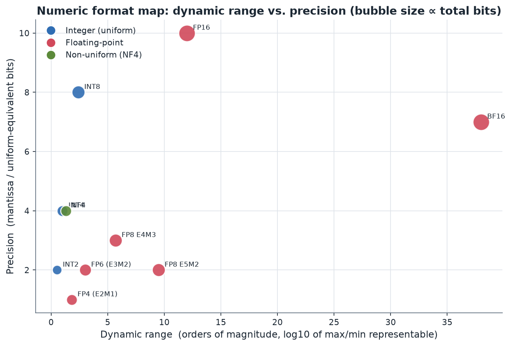
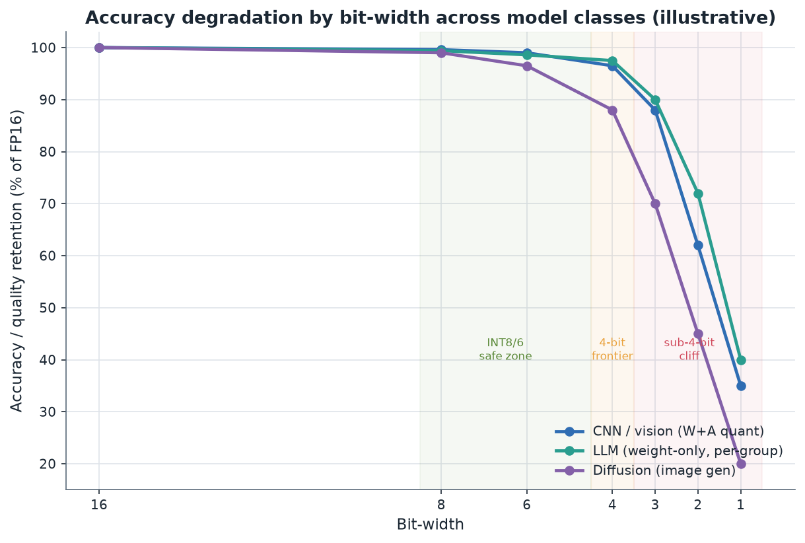

# 04. Precision Formats and Numerics

> **Section scope.** The numeric *representations* that quantization targets: the
> integer formats (INT16/8/4/2, binary, ternary), the reduced-precision
> floating-point formats (FP16, BF16, FP8, FP6, FP4), block floating point and the
> microscaling (MX) family, and the non-uniform formats (NF4, logarithmic,
> codebook). Section 03 covered the *techniques* that map high-precision tensors
> into these formats; this section characterizes the formats themselves — their
> dynamic range, precision, hardware support, and best-fit use cases — because the
> choice of format is increasingly a hardware decision that constrains everything
> upstream.

## Two families: integer and floating point

Every numeric format used in quantization belongs to one of two families, and the
distinction between them is the organizing idea of this section.

**Integer (fixed-point) formats** represent values as evenly-spaced points. An
`n`-bit integer format has `2ⁿ` levels spread *uniformly* across a range set by an
external scale factor (Section 03's affine mapping). The defining property is
**uniform resolution**: the gap between adjacent representable values is constant
across the whole range. This is efficient when the data occupies the range fairly
evenly, and it maps to the cheapest possible hardware — integer multiply-accumulate
units are small and energy-efficient. The weakness is dynamic range: to represent
both very large and very small magnitudes, an integer format must either use a coarse
step (losing small values) or a narrow range (clipping large ones).

**Floating-point formats** represent values as `sign × mantissa × 2^exponent`,
splitting the bits between a mantissa (precision) and an exponent (range). The
defining property is **relative resolution**: the gap between adjacent values scales
with the magnitude, so small numbers get fine steps and large numbers get coarse
steps — a logarithmic-ish spacing that matches how neural-network values are actually
distributed (many small, few large). Floating point handles outliers gracefully (a
large value just uses a large exponent) at the cost of more complex hardware and,
for a fixed bit budget, fewer bits available for the mantissa.

The entire "INT vs FP" debate at low bit-widths — INT4 vs FP4, INT8 vs FP8 — is a
debate about whether uniform or relative resolution better fits a given tensor's
distribution, traded against hardware cost. There is no universal winner, which is
why modern silicon increasingly supports *both* and lets the compiler choose.

## The range-versus-precision tradeoff, visualized

The format map plots each format's dynamic range (how many orders of magnitude of
value it can represent, horizontal) against its precision (effective mantissa bits,
vertical), with bubble size proportional to total bit width. The structure is
revealing. The **integer formats** (blue) sit at low dynamic range but high
uniform-precision-for-their-bits — INT8 gives a full 8 bits of uniform resolution
but only ~2.4 orders of magnitude of range (set by its scale). The **floating-point
formats** (red) trade precision for range: FP8-E5M2 reaches ~9.5 orders of magnitude
but with only 2 mantissa bits, while FP8-E4M3 keeps 3 mantissa bits at ~5.7 orders.
**BF16** is the extreme range choice (8 exponent bits give it the same ~38-order
range as FP32) at the cost of only 7 mantissa bits — which is exactly why it won for
training, where gradient dynamic range matters more than mantissa precision. **NF4**
(green) sits apart: a non-uniform 4-bit format that gets better *effective* precision
than uniform INT4 by placing its levels where the data is dense.

The practical reading: **choose integer when the data is range-limited and you want
maximum uniform precision per bit (weights, post-normalization activations); choose
floating point when the data has outliers or wide dynamic range (raw activations,
gradients); and choose the exponent/mantissa split to match whether range or
precision is your binding constraint.**

## Integer formats in detail

### INT8 — the workhorse

INT8 (8-bit signed or unsigned integer) is the most important quantization format in
history and remains the production baseline. With 256 levels and, in practice,
per-channel or per-group scaling, INT8 is effectively lossless for the vast majority
of models: vision CNNs lose well under 1% top-1, and well-calibrated LLMs lose 1–2
perplexity-equivalent points at most. Every mobile NPU, every inference engine
(TFLite, TensorRT, Core ML, OpenVINO, QNN), and every training framework supports it.
Its ubiquity means INT8 hardware is mature, fast, and cheap, and its accuracy is
well-understood. INT8 is the format you use unless you have a specific reason not to.

### INT16 — the safety margin

INT16 is used where INT8 loses too much accuracy but a full float is unnecessary —
some audio DSP paths, certain sensitive layers in a mixed-precision model, and
accumulation. It is rarely the *primary* deployment format (if you can afford 16 bits
you often just use FP16), but it exists as an intermediate and as an accumulator
width. Many NPUs support INT16 activations paired with INT8 weights (W8A16) as a
higher-accuracy option.

### INT4 — the LLM weight format

INT4 (16 levels) became the defining format of the on-device-LLM era. Naive
per-tensor INT4 is far too coarse for general use, but **per-group INT4** (group size
128 or 64, with an FP16 or INT8 scale per group) is the workhorse of weight-only LLM
quantization — the target of GPTQ, AWQ, and the GGUF k-quants. At 4 bits weight-only,
LLMs retain most of their capability while cutting weight memory ~4×, which is the
single most important compression result in edge AI. INT4 is now natively supported
in most flagship mobile NPUs (Qualcomm since Snapdragon 8 Gen 2, and others),
NVIDIA tensor cores, and Intel/AMD accelerators. For *activation* quantization, INT4
(W4A4) is much harder and remains research-stage (Section 05).

### INT2 and ternary — the frontier

INT2 (4 levels) and ternary ({−1, 0, +1}, ≈1.58 bits) are the aggressive frontier.
Post-training INT2 of a normally-trained model generally collapses accuracy unless
paired with sophisticated methods (QuIP#, AQLM codebooks) that approach the
information-theoretic limit — and even then the decoding kernels are complex.
Ternary's success story is different: **quantization-native training** (BitNet
b1.58) trains the model with ternary weights from scratch, and such models match
full-precision quality because the weights are *learned* to be ternary rather than
forced. INT2 arrived in shipping silicon with the Snapdragon 8 Elite Gen 5 (2025)
⚠️ — hardware provisioning ahead of broad software use.

### Binary — the extreme

1-bit binary weights (and, in BNN/XNOR-Net, binary activations) are the theoretical
floor. They enable replacing multiplies with XNOR+popcount for enormous energy
savings, but the accuracy gap on non-trivial tasks has kept them research-only for a
decade. Binary remains interesting for ultra-low-power always-on tinyML sensing
(keyword spotting, wake-word, simple vision) where the task is easy enough to
tolerate the accuracy loss and the energy budget is measured in microjoules.

| Integer format | Levels | Typical granularity | Maturity | Primary use |
|---|---|---|---|---|
| INT16 | 65,536 | per-tensor/channel | 🟢 | Sensitive layers, accumulation, audio |
| INT8 | 256 | per-channel | 🟢 | Universal baseline (vision, W8A8) |
| INT4 | 16 | per-group (g=128/64) | 🟢 (weight-only) | On-device LLM weights |
| INT2 | 4 | per-group + codebook | 🟡 silicon / 🔴 general SW | Frontier; needs advanced methods |
| Ternary (1.58b) | 3 | per-tensor (native-trained) | 🔴 research | Quantization-native (BitNet) |
| Binary (1b) | 2 | per-filter scale | 🔴 research | tinyML always-on sensing |

## Floating-point formats in detail

### FP32, FP16, BF16 — the high-precision baselines

FP32 (1 sign / 8 exponent / 23 mantissa) is the training default of the past and the
reference against which quantization loss is measured. **FP16** (1/5/10) halves the
storage with 10 mantissa bits and a modest exponent range, and is the standard
*activation* precision in weight-only-quantized LLMs (the "A16" in W4A16). **BF16**
(1/8/7) keeps FP32's full exponent range but only 7 mantissa bits; the wide range
makes it far more robust for training (gradients span many orders of magnitude), and
BF16 is now the dominant training format. The FP16-vs-BF16 choice is the cleanest
illustration of the range/precision tradeoff: same 16 bits, different split, chosen
by whether you need mantissa precision (FP16, inference activations) or exponent range
(BF16, training).

### FP8 — the data-center-to-edge format

FP8 comes in two OCP-standardized variants: **E4M3** (1/4/3, range to ±448, better
precision) and **E5M2** (1/5/2, wider range ~±57,344, less precision). The convention
is E4M3 for forward-pass activations and weights (precision matters) and E5M2 for
gradients (range matters). FP8 is production in the data center (NVIDIA Hopper/
Blackwell, and others) and is arriving on flagship mobile NPUs (Snapdragon 8 Elite
Gen 5 lists FP8). FP8's advantage over INT8 is graceful outlier handling — the
exponent absorbs large values that would force an INT8 scale to coarsen — which makes
FP8 attractive for *activation* quantization of transformers where INT8 struggles.
Its disadvantage is more complex hardware and, at 3 mantissa bits (E4M3), less
precision than INT8's uniform 8 for range-limited data. FP8 is the format most likely
to become a second edge baseline alongside INT8.

### FP6, FP4, and the sub-8-bit floats

Below 8 bits, floating point continues: **FP6** (e.g. E3M2) and **FP4** (E2M1, 1 sign
/ 2 exponent / 1 mantissa) push the range/precision tradeoff to its limit. FP4 has
only *sixteen* representable values — the same count as INT4 — but distributed with
floating-point (roughly logarithmic) spacing rather than uniformly, which better
matches weight distributions and handles outliers, at the cost of only 1 mantissa
bit. FP4 is the frontier format: NVIDIA Blackwell (2024–2025) brought native FP4
tensor cores and demonstrated FP4 *training*, and the newest mobile NPUs are
beginning to list FP4 support ⚠️. The open question, as with INT2, is software
maturity — the hardware exists ahead of accuracy-preserving FP4 quantization
toolchains.

| Float format | Bits (S/E/M) | Approx range | Maturity | Primary use |
|---|---|---|---|---|
| FP32 | 1/8/23 | ±3.4e38 | 🟢 | Reference / legacy training |
| BF16 | 1/8/7 | ±3.4e38 | 🟢 | Training default; wide-range |
| FP16 | 1/5/10 | ±65,504 | 🟢 | Inference activations (A16) |
| FP8 E4M3 | 1/4/3 | ±448 | 🟢 DC / 🟡 edge | Fwd activations/weights |
| FP8 E5M2 | 1/5/2 | ±57,344 | 🟢 DC / 🟡 edge | Gradients; wide-range activations |
| FP6 E3M2 | 1/3/2 | ±28 | 🟡 | Emerging middle ground |
| FP4 E2M1 | 1/2/1 | ±6 | 🟡 DC / 🔴 edge SW | Frontier; Blackwell + new NPUs |

## Block floating point and the microscaling (MX) formats

The most important recent development in numeric formats is **block floating point
(BFP)**, standardized by the Open Compute Project as the **Microscaling (MX)**
family. The idea unifies the integer and floating-point families and bakes Section
03's per-group quantization directly into the numeric type.

In a microscaling format, a **block** of `k` elements (the OCP MX standard fixes
`k = 32`) shares a single **scale** — specifically a shared 8-bit exponent (E8M0) —
while each element carries a small low-precision value (FP or INT). The named types
are **MXFP8, MXFP6, MXFP4** (block of 32 FP8/6/4 values with a shared scale) and
**MXINT8** (block of 32 INT8 values with a shared scale). This is exactly per-group
quantization with group size 32, but promoted from a software convention to a
hardware-native numeric format with a standardized layout, so the hardware can
consume it directly without the compiler having to manage scales separately.

Why this matters:

- **It closes the algorithm–hardware gap.** Per-group quantization was the software
  technique that made 4-bit work (Section 03); MX makes the *hardware* natively
  understand per-group scales, so there is no mismatch between what the algorithm
  wants and what the silicon executes. The block size 32 is chosen to match a
  hardware-natural tile.
- **It gets the best of both families.** Within a block, the shared exponent gives
  floating-point-like dynamic range (outliers in the block are absorbed by the shared
  scale), while the elements can be cheap low-precision values. A block of MXFP4 has
  effectively per-32 dynamic-range adaptation, which is far more robust than plain
  FP4.
- **It has broad industry backing.** The MX formats were standardized (2023–2024) by
  a consortium including AMD, Arm, Intel, Meta, Microsoft, NVIDIA, and Qualcomm —
  unusual cross-vendor agreement that signals MX is the likely convergence point for
  sub-8-bit hardware numerics. NVIDIA Blackwell implements MX (and a variant,
  NVFP4); mobile vendors are expected to follow.

Block floating point is not new — DSPs have used it for decades, and it appeared in
various AI accelerators — but the OCP standardization and its adoption by the major
silicon vendors make MX the format story to watch. In effect, the field's per-group
quantization technique and its numeric-format evolution have merged.

| MX format | Element type | Block | Shared scale | Effective bits/elem | Status |
|---|---|---|---|---|---|
| MXINT8 | INT8 | 32 | E8M0 | ~8.25 | 🟡 emerging |
| MXFP8 | FP8 (E4M3/E5M2) | 32 | E8M0 | ~8.25 | 🟡→🟢 (Blackwell) |
| MXFP6 | FP6 | 32 | E8M0 | ~6.25 | 🟡 |
| MXFP4 | FP4 (E2M1) | 32 | E8M0 | ~4.25 | 🟡 (Blackwell / NVFP4) |

## Non-uniform and companded formats

As Section 03 discussed, neural weights are bell-shaped, and *non-uniform* formats
that place levels to match this distribution can beat uniform formats at equal bits.

- **NF4 (NormalFloat4)** places its 16 levels at the quantiles of a standard normal
  distribution, so — for the roughly-Gaussian weights of a neural network — each
  level is used about equally often, which is information-theoretically efficient.
  NF4 is the most successful non-uniform format in production (via QLoRA and the
  bitsandbytes library) and often beats plain INT4 at the same 4 bits. A variant,
  **AF4 (AbnormalFloat)**, tunes the levels to the empirical (not assumed-normal)
  weight distribution.
- **Logarithmic / power-of-two** formats space levels geometrically. They match the
  heavy-tailed magnitude distribution and turn multiplications into bit-shifts (cheap
  hardware), but the coarse spacing at large magnitudes costs accuracy. Used in some
  specialized low-power accelerators.
- **Codebook / vector-quantized** formats (AQLM, QuIP# E8 lattice) store a learned
  codebook and represent weights (or groups) by indices. These approach the optimum
  at 2 bits but require a lookup/decode step, trading kernel simplicity for
  accuracy-per-bit.

The tradeoff, restated at the format level: uniform integer formats are
hardware-cheap (a scale and a shift); non-uniform formats are more accurate per bit
but need a lookup table or companding function in the decode path. NF4 is the sweet
spot that reached production; codebooks are the accuracy champions that remain
kernel-limited.

## Accuracy by bit-width across model classes

The chart shows how quality degrades as bit-width falls, for three model classes
(illustrative, reflecting typical behavior; the LLM curve is weight-only per-group,
which is why 4-bit is strong, while the CNN curve is weight+activation). Three
observations. First, **all classes are near-lossless at 8 and 6 bits** — the green
safe zone. Second, **at 4 bits the classes diverge**: weight-only LLM quantization
holds up well (~97% retention), CNN weight+activation quantization degrades more
(~96% but with more variance), and diffusion models — which compound error over dozens
of denoising steps — degrade sharply (~88%). Third, **below 4 bits every class falls
off a cliff**, with diffusion the most fragile and LLMs (with advanced methods) the
most resilient. The per-class differences are exactly the sensitivity story of
Section 03: diffusion's iterative compounding and CNNs' activation quantization make
them harder than weight-only LLM compression at the same nominal bits.

This class-dependence is why "what bit-width is safe" has no single answer — it
depends on the model family, whether activations are quantized, and the granularity.
A responsible spec always states all three.

## Mixed precision as a format strategy

Real deployments rarely use one format throughout. **Mixed-precision** models assign
formats per layer or per tensor: 8-bit embeddings and LM head, 4-bit middle-layer
weights, FP16 normalization and softmax, INT32 accumulation. The GGUF k-quants
formalize this within a single file — a "Q4_K_M" model mixes 4-bit, 5-bit, and 6-bit
blocks according to a fixed importance heuristic. Mixed precision is the practical
reconciliation of the format tradeoffs: use the cheapest format each part of the
network can tolerate. Its viability depends on hardware that can execute multiple
formats efficiently and a compiler that can schedule the transitions — the co-design
concern of Section 06.

## Choosing a format by workload

Synthesizing the above into practical guidance:

| Workload | Recommended format(s) | Rationale |
|---|---|---|
| Vision/audio CNN, compute-bound | W8A8 INT8 (per-channel) | Near-lossless, universal HW, compute speedup |
| On-device LLM decode, memory-bound | W4A16 INT4 per-group (or NF4) | 4× weight memory cut = 4× token rate |
| LLM prefill / compute-bound phase | FP8 or W8A8 | Compute speedup; FP8 handles activation outliers |
| Transformer activation quantization | FP8 E4M3 or SmoothQuant+INT8 | Outlier-robust range |
| Sub-4-bit LLM weights | MXFP4 / codebook (QuIP#/AQLM) | Best accuracy-per-bit at the frontier |
| Always-on tinyML sensing | INT8, INT4, or binary | Extreme energy budget; easy tasks |
| Diffusion on edge | INT8 (W8A8), sub-8-bit research | Iterative error compounding limits aggression |
| Low-precision training | BF16 → FP8 → FP4 (with stochastic rounding) | Gradient range preservation |

## Hardware support maturity by format

A format is only as useful as the silicon that runs it. The matrix below summarizes
where each format stands in *edge* hardware specifically (data-center support is
generally one generation ahead).

| Format | Edge silicon support | Edge software maturity | Overall |
|---|---|---|---|
| INT8 | Universal | Universal | 🟢 production |
| INT16 / W8A16 | Wide | Good | 🟢 production |
| INT4 (weight-only) | Flagship + many mid-range | Strong (GGUF/GPTQ/AWQ) | 🟢 production |
| FP16 | Universal | Universal | 🟢 production |
| BF16 | Wide | Good | 🟢 production (mostly training) |
| FP8 | Flagship 2025 NPUs | Emerging | 🟡 emerging |
| INT2 | Newest flagship only | Sparse | 🟡 silicon ahead of SW |
| FP4 / MXFP4 | Newest flagship / DC | Immature | 🟡 frontier |
| NF4 | Runs on any (SW format) | Strong (bitsandbytes) | 🟢 (as SW format) |
| Ternary/binary | Rare native support | Research | 🔴 research |

The consistent pattern — hardware support preceding software maturity by one or more
product cycles for every sub-8-bit format — is the single most important thing to
understand about the format landscape, and it is why every FP4/INT2 claim in this
database carries a confidence flag until independent low-bit accuracy benchmarks
appear.

## The anatomy of a floating-point format

Understanding low-bit floating point requires understanding what the bits actually
encode, because the sub-8-bit formats make design choices that FP32 hides. A
floating-point number is `(-1)^sign × (1 + mantissa) × 2^(exponent - bias)` for
normal values, where the mantissa is the fractional bits, the exponent is a stored
unsigned integer, and the **bias** shifts it so both positive and negative exponents
are representable. Several design decisions matter enormously at low bit-widths:

- **The exponent bias** determines where the representable range is centered. FP8
  E4M3 uses a bias of 7; the OCP standard tunes these choices so the range brackets
  typical neural-network magnitudes. Get the bias wrong and half the format's range
  is wasted on magnitudes the data never reaches.
- **Subnormals (denormals)** are values with a zero exponent field that fill in the
  gap between the smallest normal number and zero, giving graceful underflow. At 3 or
  fewer mantissa bits, whether subnormals are supported materially changes how many
  small values are representable — E4M3 supports them, and they matter for the small
  weights near zero that dominate a neural network by count.
- **Special values.** IEEE FP reserves bit patterns for ±infinity and NaN. The
  low-bit OCP formats *reclaim* some of these patterns for finite values because at 8
  or 4 bits, spending two of only 256 (or 16) codes on infinities is wasteful. FP8
  E4M3, for instance, has no infinities and only one NaN, freeing codes for finite
  magnitudes up to ±448. This is why "FP8 E4M3" ranges to 448 rather than a rounder
  power of two — the standard traded IEEE special-value semantics for range.
- **The implicit leading one.** Normal floating-point mantissas have an implicit
  leading 1 bit (not stored), so E4M3's 3 stored mantissa bits give 4 bits of
  significand precision. This free bit is why even a 1-mantissa-bit FP4 (E2M1) has 2
  bits of effective significand for normal values.

These details are invisible in FP32 but decisive in FP8/FP4, where every code counts.
They are also why low-bit floating-point formats had to be *standardized* (OCP)
rather than left to each vendor — a model quantized to one vendor's idiosyncratic FP8
would not run correctly on another's without agreement on bias, subnormals, and
special values.

## Integer quantization arithmetic in hardware

The counterpart worth understanding is how integer quantized matmul actually executes,
because it explains both the speed and the accuracy properties of INT8/INT4. A
quantized matrix multiply of INT8 inputs does *not* accumulate in INT8 — it
accumulates in a wider **INT32 accumulator**, because summing thousands of INT8
products would overflow 8 bits almost immediately. The dot product of two INT8 vectors
of length `K` can reach roughly `K × 127 × 127`, which for `K = 4096` is ~66 million —
well within INT32's ~2.1 billion range but far beyond INT8. The pipeline is:

1. Multiply INT8 × INT8 → INT16/INT32 partial products.
2. Accumulate into INT32.
3. Apply the zero-point corrections (for asymmetric operands) — these are the extra
   terms that make asymmetric quantization more expensive than symmetric.
4. **Requantize** the INT32 result back down to INT8 for the next layer, by
   multiplying by the combined scale (a fixed-point multiply-and-shift) and rounding.

The requantization step (INT32 → INT8) is where the output scale of one layer meets
the input scale of the next, and doing it in cheap integer arithmetic (a multiply by a
fixed-point constant and a right-shift) is exactly what the Jacob et al. (2018) scheme
of Section 02 specified. The **accumulator width** is a real hardware constraint: if
the reduction dimension `K` is very large or the format is INT16, a 32-bit accumulator
can overflow, forcing intermediate rescaling. INT4 matmul works similarly but often
*unpacks* to INT8 internally on hardware without native INT4 datapaths, meaning the
memory saving is real but the compute saving may not be — a crucial distinction when
reading a spec sheet that lists "INT4 support."

## The INT4-versus-FP4 debate

At 4 bits, integer and floating point have the *same number of representable values*
(16), so the choice between them is purely about *where those 16 values are placed*.
This is one of the liveliest format debates in the field, and the answer is
genuinely workload-dependent.

**The case for INT4.** Uniform spacing gives maximum resolution for data that occupies
its range evenly. For weights that have already been normalized or that live in a
well-behaved range (especially with per-group scales that adapt the range per block),
uniform INT4 spends all 16 codes usefully. INT4 hardware is cheaper and INT4 tooling
(GPTQ, AWQ, GGUF) is mature and battle-tested. For weight-only LLM quantization, INT4
per-group is the proven production choice.

**The case for FP4.** Floating-point spacing (fine near zero, coarse far away)
matches the bell-shaped weight distribution better than uniform spacing, and handles
per-block outliers more gracefully because the exponent absorbs them. When FP4 is
wrapped in a microscaling block (MXFP4), the per-32 shared scale gives it range
adaptation that rivals fine-grained integer per-group. NVIDIA's Blackwell results
argue FP4 (specifically NVFP4/MXFP4) can match INT4 accuracy while being more robust
to outliers and, crucially, usable for *training*, which uniform INT4 is not.

**The synthesis.** For inference of pre-trained weights, well-tuned INT4 per-group and
MXFP4 are close, and the winner depends on the specific model and the quality of the
scales; INT4 has the maturity edge today, MXFP4 has the hardware-momentum edge going
forward. For training and for activations with heavy outliers, floating point (FP4/
FP8) has the structural advantage. Expect the two to coexist, with hardware
supporting both and compilers choosing per-tensor — which is exactly the direction
the newest silicon has taken.

## How GGUF k-quants pack bits: a concrete format case study

The GGUF k-quant formats (llama.cpp) are worth dissecting because they are the most
widely-used low-bit formats in the world and they embody every principle in this
section. A k-quant type like **Q4_K** does not simply store 4-bit weights. It uses a
two-level **super-block** structure: a super-block of 256 weights is divided into 8
sub-blocks of 32, each sub-block has its own 6-bit scale and 6-bit minimum (for
asymmetric quantization), and those per-sub-block scales are themselves quantized
against a super-block-level FP16 scale. The weights are 4-bit. This hierarchical
scaling is exactly the "quantize the scales" idea (double quantization) that keeps the
per-group overhead affordable: instead of an FP16 scale per 32 weights (0.5 bits/
weight of overhead), the 6-bit sub-scale plus shared super-scale costs far less.

The k-quant family then spans a spectrum — Q2_K, Q3_K, Q4_K, Q5_K, Q6_K, and the
`_S`/`_M`/`_L` (small/medium/large) variants — that mix bit-widths *within a model*:
the more important tensors (attention `wv`, feed-forward `w2`) get an extra bit or
two, the rest get the base bit-width. A "Q4_K_M" model is therefore not uniformly
4-bit; it is a carefully-tuned mixed-precision format averaging ~4.5–4.8 effective
bits/weight, which is why it retains accuracy so well. The GGUF k-quants are a
masterclass in applied numeric-format design: hierarchical scales, block floating
point in spirit, importance-weighted mixed precision, and honest effective-bit
accounting — all engineered for CPU SIMD execution. They are the reason a 7B model
runs well on a laptop, and they demonstrate that *format engineering*, not just
algorithm engineering, is where a lot of real-world quantization quality comes from.

## The cost of format transitions

A subtlety that becomes important in mixed-precision and heterogeneous pipelines is
that **converting between formats is not free**. Moving a tensor from INT8 to FP16, or
from an integer format to a microscaling block format, costs instructions, memory
traffic, and sometimes a round-trip through a different execution unit. A graph that
switches formats frequently — INT8 matmul, FP16 softmax, INT8 matmul, FP16 LayerNorm —
pays a conversion tax at every boundary, and on some hardware the format-conversion
units are a bottleneck. This is why compilers work hard to *fuse* operations and keep
runs of the same format together, and why "islands" of high-precision computation
(the range-sensitive nonlinearities of Section 03) are costly not just for their own
compute but for the conversions at their edges. The ideal is long runs of a single
low-precision format with conversions amortized; the reality is a negotiation between
the model's structure and the hardware's format-transition efficiency. Section 06
develops this as a core co-design concern.

## Exotic and emerging formats

Beyond the mainstream integer and floating-point families, several alternative number
systems appear in research and specialized hardware, and a couple may matter going
forward:

- **Posits (Type III unums).** An alternative to IEEE floating point with a
  variable-length exponent/mantissa split (via "regime" bits) that gives more
  precision near 1.0 and graceful degradation toward the extremes. Posits have
  enthusiastic academic backing and some FPGA/accelerator implementations, and they
  can beat IEEE floats at equal bits for some distributions — but they lack the
  hardware ecosystem and standardization momentum of the OCP formats, and mainstream
  adoption remains speculative.
- **Logarithmic Number Systems (LNS).** Represent values by their logarithm, turning
  multiplication into addition (cheap) but making addition expensive (needs lookup).
  Attractive for multiply-heavy, addition-light workloads and ultra-low-power
  accelerators; niche in mainstream AI silicon.
- **Stochastic / probabilistic formats.** Explored for ultra-low-power and
  in-memory-compute hardware, where values are represented by bit-stream statistics.
  Firmly research-stage for neural networks.
- **Shared-microexponent formats (MX variants).** Beyond the standard MX, research
  explores finer-grained shared-exponent schemes (e.g. a shared exponent per 16 or
  per 8 elements, or two-level exponent sharing) that trade metadata overhead for
  range adaptation. These are natural extensions of the microscaling idea and likely
  to appear in future hardware.

The through-line: the OCP integer/float/MX formats have such strong industry momentum
that exotic alternatives face a steep adoption barrier regardless of theoretical
merit — the ecosystem effect (tooling, standardization, cross-vendor agreement) now
dominates format selection as much as the numerics do. A format that is 5% better on
paper but lacks silicon and compiler support loses to a standardized format that
"just works," which is the same lesson the technique history of Section 02 taught.

## The economics of format proliferation

A closing structural observation: the number of numeric formats a model might be
shipped in has exploded, and this proliferation has real costs. A single model may
exist as FP16, BF16, INT8 (per-channel), INT4 (GPTQ g=128), INT4 (AWQ), NF4, several
GGUF k-quant variants, FP8, and MXFP4 checkpoints simultaneously — each requiring its
own kernels, its own validation, and its own accuracy characterization. For hardware
vendors, supporting many formats multiplies silicon area and verification effort; for
software maintainers, it multiplies the kernel matrix; for model publishers, it
multiplies the artifacts to produce and document. This is a force *toward*
consolidation — the industry has a strong incentive to converge on a small set of
formats (INT8, weight-only INT4, FP8, and MXFP4/MXFP8 as the likely survivors), which
is much of the appeal of the OCP standardization effort. Section 14 returns to this
consolidation pressure as a forward-looking trend; for now the point is that the
format landscape is broad today but under economic pressure to narrow.

## Formats for the KV cache

The KV cache deserves its own format discussion because it is a distinct tensor with
distinct statistics and a growing share of edge memory. During autoregressive
generation, the keys and values of every past token are cached to avoid recomputation;
for long contexts this cache can exceed the model weights in size. Quantizing it is
therefore high-leverage, but the KV cache quantizes differently from weights:

- **Keys and values have different distributions.** Empirically, key tensors have
  pronounced per-channel outlier structure (certain channels are consistently large),
  while value tensors are better-behaved. This asymmetry is why methods like KIVI
  quantize keys **per-channel** and values **per-token**, matching each to its outlier
  structure — a format choice, not just an algorithm choice.
- **Errors compound over the sequence.** A quantized key from token 5 influences every
  subsequent token's attention to token 5, so KV-cache quantization error accumulates
  over the whole generation, making the cache more sensitive than a one-shot weight
  quantization at the same bit-width.
- **The practical formats** are INT8 (near-lossless, ~2× cache reduction), INT4 (good
  with per-channel/per-token handling, ~4×), and 2-bit (aggressive, needs careful
  outlier handling as in KIVI/KVQuant). FP8 is also used where the hardware supports
  it, for its outlier robustness. Some runtimes keep a small window of recent tokens
  in full precision and quantize only the older cache, since recent tokens are
  accessed most and matter most.

The KV-cache format choice is now a first-class deployment decision for long-context
on-device LLMs, and it interacts with the weight format: a system might run W4A16
weights with an INT8 or INT4 KV cache, tuning each independently. Section 05 covers
the KV-cache *methods*; the point here is that the cache is a separate tensor needing
its own format, and treating it as an afterthought wastes the memory budget that long
context most needs.

## Format per role: weights, activations, gradients, and cache

Pulling the format discussion together, it is useful to see that different *roles*
within a model favor different formats, for reasons that trace directly to their
statistics and their sensitivity:

| Role | Distribution | Favored format(s) | Why |
|---|---|---|---|
| Weights | Bell-shaped, static, symmetric | INT4/INT8 per-group, NF4, MXFP4 | Uniform or normal-matched levels; per-group scales; known offline |
| Activations (forward) | Outlier-prone, dynamic | FP8 E4M3, INT8+SmoothQuant | Exponent absorbs outliers; per-token dynamic range |
| Gradients (training) | Very wide dynamic range | BF16, FP8 E5M2 | Range over precision; stochastic rounding in accumulate |
| Accumulator | Sum of many products | INT32, FP32 | Must not overflow the reduction |
| KV cache | Keys outlier-prone, values mild | INT8/INT4 (per-ch keys, per-tok values), FP8 | Asymmetric handling; error compounds |
| Embeddings / LM head | Large, sensitive | INT8 or FP16 (kept higher) | Directly touch vocabulary; sensitive |

This role-based view is the most useful practical framing of the whole section: rather
than asking "what is the best format," ask "what is the best format *for this tensor's
role, distribution, and sensitivity, on this hardware*." The answer is almost always a
*mixture* — low-bit integer or MXFP4 for the bulk of the weights, a float format for
outlier-prone activations, a wider format for the sensitive embeddings and the
accumulator, and an independently-tuned format for the KV cache. The art of format
selection is matching each role to its best-fit representation within the constraints
of what the target silicon can execute, which is precisely the co-design problem the
next sections develop.

## Reading a spec sheet: what a format claim actually means

Because the vendor sections that follow lean heavily on published format support, it
is worth codifying how to read a format claim critically — the gap between "the spec
sheet lists INT4" and "you can deploy an accurate INT4 model that runs fast" is wide
and populated with caveats:

- **"Supports INT4"** may mean native INT4 matrix units (real compute speedup) or
  INT4 *storage* that unpacks to INT8 for compute (memory saving only). Ask which.
- **"N TOPS (INT8)"** is a peak-throughput figure at a specific precision under ideal
  utilization; real workloads reach a fraction of it, and the number is not comparable
  across vendors with different precisions, sparsity assumptions, and measurement
  methods. TOPS is a marketing scalar, not a performance predictor.
- **"FP8 support"** rarely specifies whether both E4M3 and E5M2 are supported, whether
  the accumulation is FP16 or FP32, and whether the software stack exposes it — all of
  which determine usability.
- **Granularity is usually unstated.** A chip may support INT4 only per-tensor, or
  per-group with a fixed group size that may not match your quantized model's group
  size, forcing repacking. Native per-group support (or MX-format support) is the
  question that actually matters for accuracy.
- **Symmetric vs. asymmetric** support is often omitted; a symmetric-only datapath
  changes which quantization schemes are usable.
- **Software exposure lags silicon.** A format present in hardware may not be reachable
  through the vendor's compiler/SDK for one or more releases — the recurring
  hardware-ahead-of-software gap.

The disciplined reading, applied throughout Sections 08–11: treat a format on a spec
sheet as *necessary but not sufficient* evidence of deployability, seek the
granularity and datapath details, distinguish storage support from compute support,
and discount peak-throughput scalars in favor of measured, independent benchmarks
where they exist. This is why every hardware claim in this database carries a maturity
tag and, for anything unreleased or unverified, a confidence flag — the spec sheet is
the starting point of the analysis, not the end of it.

## Summary

Numeric formats divide into uniform integer types (cheap hardware, uniform
resolution, range-limited) and floating-point types (range-adaptive, outlier-robust,
more complex), with non-uniform (NF4, codebook) and block-floating-point (MX)
families bridging them. INT8 and weight-only INT4 are the production baselines; FP8
is the emerging second baseline; FP4/MXFP4 and INT2 are the hardware-ahead-of-software
frontier; and the microscaling standard is the likely convergence point because it
merges per-group quantization with a hardware-native format. The choice of format is
increasingly made *by the target silicon*, which constrains the techniques of Section
03 — and the LLM-specific methods of Section 05, which we turn to next, are largely
about extracting maximum accuracy from these formats at 4 bits and below. The single
most durable takeaway is the role-based framing: there is no universally best format,
only a best format for a given tensor's distribution, sensitivity, and role, executed
within the constraints of the target silicon. Weights, activations, gradients, the
KV cache, and the sensitive embedding and normalization paths each favor a different
representation, and a well-engineered quantized model is a deliberate *mixture* of
formats rather than a single global choice. As the microscaling standard matures and
FP8/FP4 silicon proliferates, the number of viable formats will first widen and then,
under the economic pressure of verification and kernel-maintenance cost, narrow toward
a consolidated set — a dynamic that recurs as a forward-looking theme in Section 14. Format literacy — knowing
what each representation can and cannot do, and how to read a vendor's format claim
critically — is a prerequisite for every vendor and deployment discussion that follows.

---

*Next: [05 — LLM-Specific Quantization Methods](./05-llm-methods.md).*
