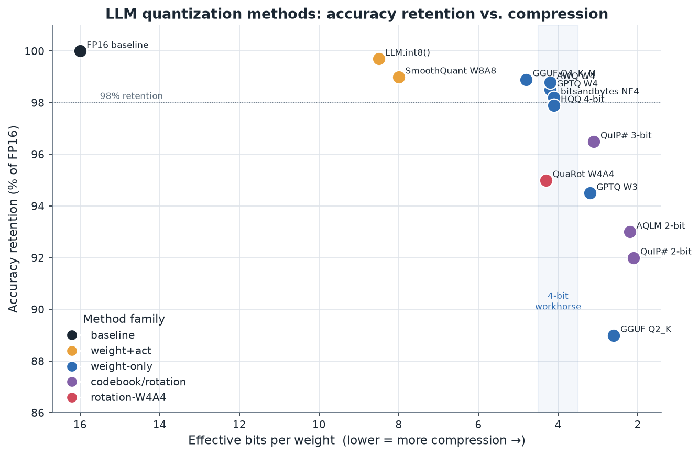
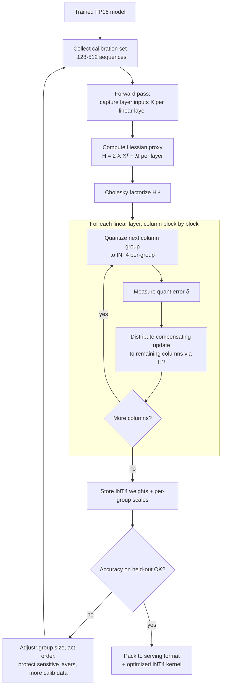
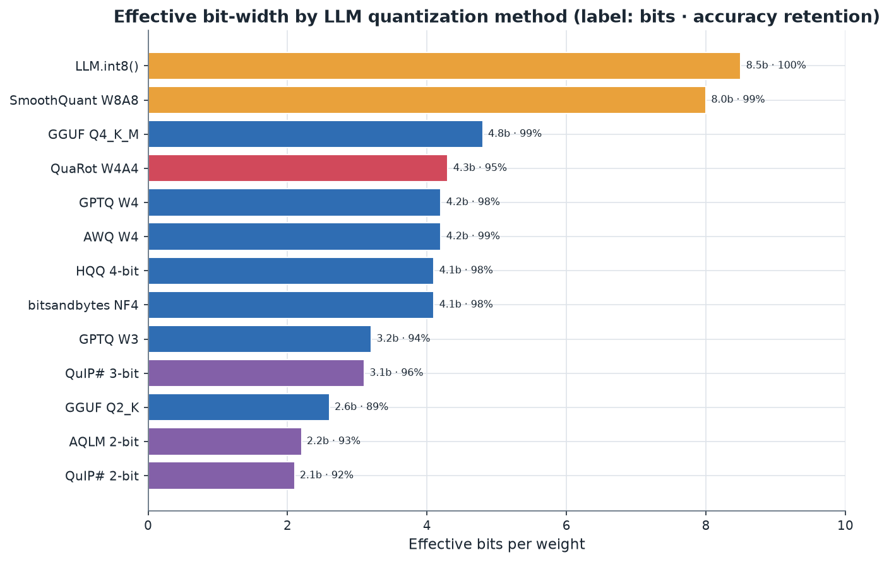

# 05. LLM-Specific Quantization Methods

> **Section scope.** The named methods engineered specifically for large language
> models: the weight-only 4-bit methods (GPTQ, AWQ, HQQ, bitsandbytes/NF4), the
> activation-quantization methods (SmoothQuant, LLM.int8()), the sub-4-bit frontier
> (SpQR, QuIP/QuIP#, AQLM, rotation methods QuaRot/SpinQuant), the distribution and
> serving formats (GGUF/llama.cpp, and the optimized kernels), KV-cache
> quantization, and QLoRA-style quantized fine-tuning. Sections 03 and 04 gave the
> primitives and formats; this section is the applied method zoo, organized so the
> underlying principles (error compensation, outlier handling, granularity) stay
> visible.

## Why LLMs needed their own methods

Classical quantization was developed on CNNs, and it did not transfer cleanly to
large language models for three reasons. First, **scale**: LLMs have billions of
parameters, so QAT (retraining) is prohibitively expensive for most practitioners,
which pushed the field toward *post-training* methods that need only a small
calibration set. Second, **the binding constraint changed**: LLM decoding is
memory-bandwidth-bound, so the goal became weight-*memory* reduction (weight-only
quantization) rather than the compute reduction that drove CNN INT8. Third, and most
importantly, **activation outliers**: as Section 02 recounted, transformers past a
few billion parameters develop emergent large-magnitude activation channels that make
naive activation quantization catastrophic. Every method below is best understood as
a specific answer to one or more of these three pressures — scale (post-training
efficiency), the memory constraint (weight-only 4-bit), and outliers (protection,
migration, rotation).

The methods cluster into families. **Weight-only** methods (GPTQ, AWQ, HQQ, NF4)
quantize weights to 4 bits (or fewer) and keep activations in FP16, targeting the
memory constraint — these are the on-device workhorses. **Weight-and-activation**
methods (SmoothQuant, LLM.int8()) quantize activations too, for compute speedups in
server serving, and must confront outliers directly. **Sub-4-bit** methods (SpQR,
QuIP#, AQLM, QuaRot) push below 4 bits with codebooks and rotations. **Formats and
runtimes** (GGUF, the optimized kernels) turn methods into deployable artifacts. And
**KV-cache** methods address the memory of long context. We take them in that order.

The tradeoff chart above orients the whole section: methods trade compression
(effective bits, horizontal, more compression to the right) against accuracy
retention (vertical). The 4-bit weight-only cluster (blue, ~4.1–4.8 effective bits,
~98% retention) is the dense, well-populated production sweet spot; the sub-4-bit
methods (purple, ~2–3 bits) sacrifice a few points of accuracy for dramatic
compression; and the W8A8 activation methods (amber) sit near-lossless but at 8 bits.
The "frontier" of the chart — the upper-right envelope — is defined by the codebook
and rotation methods that push accuracy up at low bits, and by GPTQ/AWQ that anchor
the 4-bit corner.

## Weight-only 4-bit: the production workhorses

### GPTQ — accurate one-shot quantization via error compensation

**GPTQ** (Frantar et al., 2022) is the canonical accurate 4-bit weight-only method,
and it is the direct application of the error-compensation principle from Section 03.
Recall the idea: quantizing a weight introduces an error, and rather than accepting
it, GPTQ adjusts the *not-yet-quantized* weights in the same layer to compensate, so
the layer's *output* on the calibration data is preserved as well as possible. The
mathematics is the Optimal Brain Surgeon framework: the compensating update is
determined by the inverse of the layer's input second-moment (Hessian) matrix
`H = XXᵀ`. GPTQ's engineering contributions made this tractable at billion-parameter
scale: it processes columns in a fixed order, uses a Cholesky factorization of `H⁻¹`
for numerical stability, applies updates in lazy blocks for GPU efficiency, and
quantizes to per-group granularity (typically g=128). The result: a 4-bit (or 3-bit)
quantization of a very large model in a few GPU-hours, from a calibration set of a few
hundred sequences, with minimal perplexity loss. GPTQ is production-shipped via
AutoGPTQ / GPTQModel and is a first-class citizen in vLLM, TensorRT-LLM, and most
serving stacks. Its main practical caveats are sensitivity to the calibration set and,
historically, a weight-reordering ("act-order"/desc_act) option that improves accuracy
but complicates kernels.

The GPTQ calibration-and-quantize loop is the representative LLM-quantization
workflow, diagrammed below.

### AWQ — activation-aware weight protection

**AWQ** (Lin et al., 2023) takes a different, simpler route to the same 4-bit goal.
Its insight is that a small fraction of weight channels are *salient* — those
connected to high-magnitude activation channels — and protecting them preserves
accuracy far better than treating all weights equally. Rather than keeping salient
weights in higher precision (which breaks hardware uniformity), AWQ finds a
per-channel scaling that, applied to weights and inversely to activations, reduces the
quantization error of the salient channels while keeping everything in uniform 4-bit.
Crucially, AWQ requires **no backpropagation, no Hessian, and no reconstruction** — it
searches for the scaling on a small calibration set by minimizing output error
directly. This makes it fast, robust, and — because it does no weight reordering — very
hardware-kernel-friendly. AWQ generalizes well to instruction-tuned and multimodal
models and is often the default choice where robustness and clean kernels matter. In
the accuracy chart it sits fractionally above GPTQ at 4 bits, and in practice the two
are close enough that kernel availability and tooling fit usually decide between them.

### HQQ — fast, calibration-free quantization

**HQQ** (Half-Quadratic Quantization, 2024) optimizes for a different objective: the
*speed and simplicity of the quantization process itself*. It formulates quantization
as a robust (sparsity-promoting, outlier-tolerant) optimization over the quantization
parameters and solves it with a half-quadratic splitting method that has a closed-form
per-step update — no calibration data and no backpropagation, just a fast iterative
solve on the weights alone. HQQ can quantize a large model to 4-bit or lower in
minutes. Its accuracy is slightly below GPTQ/AWQ at 4 bits but its zero-calibration,
zero-data property is valuable when calibration data is unavailable or when quantizing
many models quickly, and it is popular in the Hugging Face ecosystem for exactly that
reason.

### bitsandbytes, LLM.int8(), and NF4

The **bitsandbytes** library (Dettmers) delivered two landmark capabilities. **LLM.int8()**
(2022) is a weight-*and*-activation INT8 method that achieves no-loss quantization of
large models via mixed-precision outlier decomposition: it identifies the ~0.1% of
outlier activation dimensions and computes them in FP16 while the rest run in INT8,
then recombines. It made INT8 LLM inference lossless and, as Section 02 noted,
*defined* the outlier problem. **NF4** (2023, part of QLoRA) is the 4-bit
NormalFloat format — a non-uniform 4-bit type whose levels sit at the quantiles of a
normal distribution, matched to neural weight statistics, combined with double
quantization of the scales. bitsandbytes made both available as near-transparent
drop-ins for Hugging Face `transformers`, which is much of why 4-bit inference and
fine-tuning became mainstream so fast.

### QLoRA — quantized fine-tuning

**QLoRA** (Dettmers et al., 2023) is not just an inference method but a *fine-tuning*
method, and it deserves emphasis because it changed who could adapt large models. QLoRA
freezes the base model in 4-bit NF4 and trains small low-rank adapters (LoRA) in
BF16 on top, so the memory cost is dominated by the 4-bit frozen weights rather than
full-precision weights plus optimizer state. This let practitioners fine-tune 33B and
65B models on a single consumer or prosumer GPU — a roughly order-of-magnitude
reduction in the hardware needed. QLoRA is the de-facto standard for parameter-efficient
fine-tuning of quantized models and a bridge between the quantization and training
worlds (Section 03's low-precision-training discussion). Variants and successors
(e.g. improvements addressing the quantization-error interaction with the adapters)
continue to refine it.

## Weight-and-activation: compute speedups for serving

### SmoothQuant — migrating outliers from activations to weights

**SmoothQuant** (Xiao et al., 2022) is the reference method for W8A8 activation
quantization. Its elegant, training-free idea (Section 02, 03): because activation
outliers are the obstacle and weights are easy to quantize, migrate the difficulty by
scaling each activation channel *down* by a factor and the corresponding weight
channel *up* by the same factor, preserving the mathematical product but flattening
the activation distribution so INT8 quantization becomes accurate. The migration
strength is a tunable hyperparameter balancing activation and weight quantizability.
SmoothQuant enables near-lossless W8A8 for large models, which gives a real *compute*
speedup on INT8 tensor units — valuable in server serving where throughput matters. It
is standard in server LLM stacks; on the edge it is less common because on-device LLM
inference is usually memory-bound (favoring weight-only) rather than compute-bound.

### OmniQuant and learned equivalent transformations

**OmniQuant** (2023) generalized the SmoothQuant idea by *learning* the equivalent
transformations (the per-channel scaling and clipping thresholds) via a lightweight
block-wise gradient optimization, rather than computing them heuristically. It pushed
W4A4 and low-bit weight-only accuracy forward and represents the trend toward
learned, per-block calibration that sits between pure PTQ and full QAT.

## The sub-4-bit frontier

### SpQR — sparse-quantized representation

**SpQR** (Dettmers et al., 2023) targets near-lossless *sub*-4-bit by combining
aggressive base quantization with sparse outlier isolation: it identifies the small
fraction of outlier weights that cause most of the error and stores them separately in
higher precision (a sparse side-channel), while quantizing the bulk very aggressively.
This achieves close to FP16 quality at ~3–4 bits average, at the cost of a
mixed-dense-sparse execution path. SpQR is more a research/tooling method than a
production default, but its outlier-isolation principle recurs.

### QuIP and QuIP# — incoherence processing and lattice codebooks

**QuIP** (Quantization with Incoherence Processing, 2023) and its successor **QuIP#**
(2024) are the reference methods for 2-bit weight quantization. The core idea is
geometric (Section 02): multiply the weights and the Hessian by random orthogonal
matrices to make them *incoherent* — spreading outlier energy across all dimensions so
the distribution becomes smooth and Gaussian-like, which is far easier to quantize —
where the rotations are structured (e.g. random Hadamard transforms) so they cost
almost nothing at inference and cancel mathematically. **QuIP#** adds a lattice
vector-quantization codebook (based on the E8 lattice, which is the optimal 8-dimensional
sphere packing) for near-information-theoretically-optimal 2-bit quantization, plus a
fine-tuning step to recover residual error. QuIP# is the accuracy leader at 2 bits,
but the codebook decode and the rotations add kernel complexity, so it trades
inference simplicity for compression.

### AQLM — additive (multi-codebook) quantization

**AQLM** (Additive Quantization of Language Models, 2024) brings classical multi-codebook
vector quantization to LLM weights: groups of weights are represented as the *sum* of
vectors selected from several learned codebooks, which is a much richer representation
than a single scale-and-round and reaches strong 2-bit accuracy. AQLM's cost is decode
complexity (multiple codebook lookups and additions per weight group) and slower
kernels, but it demonstrated, alongside QuIP#, that 2-bit LLMs can be genuinely usable —
moving 2-bit from "impossible" to "difficult but demonstrated."

### QuaRot and SpinQuant — rotation for W4A4

**QuaRot** and **SpinQuant** (2024) apply the rotation idea to the harder problem of
*weight-and-activation* 4-bit (W4A4), which unlocks both memory *and* compute savings.
By rotating the model (via Hadamard or learned orthogonal transforms) so that
activation outliers are spread out and removed, they make 4-bit activation quantization
feasible, where naive W4A4 fails badly. **SpinQuant** additionally *learns* the
rotation matrices to maximize accuracy. These methods are the current research frontier
for full 4-bit LLM inference and are the reason W4A4 has moved from "hopeless" toward
"promising but not yet a production default." Their maturity is 🟡 (research/tooling)
pending broader kernel support.

## Distribution and serving: formats and kernels

### GGUF and llama.cpp k-quants

**GGUF** (llama.cpp's format) and its **k-quant** schemes are, by deployment count,
the most widely-used LLM quantization in the world. As Section 04 detailed, the
k-quants use hierarchical super-block scaling and importance-weighted mixed precision
(Q2_K through Q6_K, with `_S`/`_M`/`_L` variants) engineered for CPU SIMD execution.
Their genius is practical: a single self-describing GGUF file, excellent accuracy-per-
byte, and kernels that run everywhere from a Raspberry Pi to an Apple laptop to a phone.
The importance-matrix ("imatrix") extension further improves the k-quants by weighting
the quantization by activation importance measured on a calibration set — an accessible
form of the salience idea AWQ formalizes. GGUF is the reason local LLMs are a mass
phenomenon, and it is the default distribution format for the open-model ecosystem.

### Optimized inference kernels

A method is only as fast as its kernels, and a whole layer of engineering exists to
make quantized matmuls fast on real hardware. **Marlin** (and its successors like
Machete) are highly-optimized 4-bit (W4A16) GPU kernels that approach the theoretical
memory-bound speedup by carefully overlapping dequantization with the matmul.
**EXL2** (ExLlama's format) offers flexible mixed-bit quantization with fast kernels
for consumer GPUs. **EETQ**, **AWQ kernels**, and vendor kernels (TensorRT-LLM's,
vLLM's) round out the ecosystem. The key point: the *format* (GPTQ, AWQ) and the
*kernel* (Marlin, etc.) are separable concerns, and a method's real-world speed depends
on having a good kernel for the target hardware — which is why some theoretically-excellent
methods (AQLM, QuIP#) are accuracy leaders but throughput laggards, and why kernel
availability often decides method choice more than the paper's benchmark.

### FP8 for LLMs

**FP8** (E4M3) quantization of LLMs is increasingly used in server serving, where
native FP8 tensor cores (Hopper, Blackwell) make W8A8-FP8 both accurate (the exponent
handles activation outliers, softening the outlier problem that plagues INT8
activations) and fast. FP8 weight-and-activation is a strong option where the hardware
supports it, and it is spreading to flagship edge silicon. For on-device *weight-only*
memory savings, INT4 still beats FP8 (4 bits vs 8), but for compute-bound phases and
outlier-heavy activations, FP8 is attractive.

## KV-cache quantization

For long-context inference, the KV cache dominates memory, and quantizing it is
essential. As Section 04 noted, keys and values have different statistics — keys have
per-channel outliers, values are milder — so the leading methods handle them
asymmetrically. **KIVI** (2024) quantizes keys per-channel and values per-token to
2-bit with a small full-precision recent-token window, achieving large cache reductions
with minimal quality loss. **KVQuant** pushes toward 3-bit and even lower with
per-channel key quantization, non-uniform datatypes, and outlier isolation, enabling
very long contexts on constrained memory. KV-cache quantization is moving quickly from
research into production runtimes (vLLM, TensorRT-LLM, and on-device stacks) because its
memory payoff is so direct and its accuracy cost, with proper key/value handling, is
small. The practical configuration for an on-device long-context LLM is now often
"W4A16 weights + INT4 or INT8 KV cache," with the two tuned independently.

## The outlier problem in LLMs, concretely

Because so many of these methods are outlier responses, it is worth characterizing the
LLM outlier phenomenon precisely, as it manifests differently than in CNNs. Three
distinct outlier structures appear in large transformers, and different methods target
different ones:

1. **Emergent activation-channel outliers.** Past roughly 6–7B parameters, specific
   *feature dimensions* of the hidden state develop magnitudes 10–100× the median,
   consistently across tokens and layers. These are the outliers LLM.int8() discovered
   and SmoothQuant migrates. They are systematic (the same few channels), which is what
   makes offline migration/protection possible.
2. **Token-wise activation variation.** Different *tokens* have different overall
   activation scales — a rare token or a delimiter can spike the whole vector. This is
   why per-token dynamic activation quantization is preferred over static: the range is
   set per token, absorbing the variation.
3. **Weight outliers.** A small fraction of *weights* are much larger than the rest and
   carry disproportionate importance; SpQR isolates these into a sparse high-precision
   channel, and AWQ protects the weights connected to high-activation channels.

The rotation methods (QuIP#, QuaRot, SpinQuant) are powerful precisely because they
attack the *geometric root* of the problem: an orthogonal transform redistributes the
concentrated outlier energy across all dimensions, so *all three* structures flatten
simultaneously. This is why rotation is the current frontier — it is a more fundamental
remedy than per-channel migration, which handles only the systematic channel outliers.
The intuition for *why* rotation works: outliers represent energy concentrated in a few
coordinates; a random rotation is, with high probability, "incoherent" with any sparse
concentration, so it spreads that energy into a dense, near-Gaussian distribution whose
maximum is far smaller — and a smaller maximum means a finer quantization step for the
same bit budget (Section 03's SQNR argument). The rotations are chosen from structured
families (Hadamard matrices, which are `±1` and computable in `O(n log n)` without
storing the matrix) so they fuse into adjacent linear layers and cost essentially
nothing at inference.

## GPTQ versus AWQ: a detailed comparison

Because GPTQ and AWQ are the two methods a practitioner most often chooses between, a
direct comparison is worthwhile. They reach similar 4-bit accuracy by different routes,
with different practical properties.

**Mechanism.** GPTQ is *corrective*: it quantizes weights and compensates the resulting
error in the remaining weights using second-order (Hessian) information, an inherently
sequential, per-layer optimization. AWQ is *preventive*: it finds a per-channel scaling
that reduces the error of the important channels *before* quantizing, then quantizes
uniformly with simple round-to-nearest. GPTQ optimizes after the fact; AWQ conditions
the problem beforehand.

**Calibration sensitivity.** GPTQ's Hessian is computed from calibration activations, so
it is more sensitive to the calibration set's representativeness; a mismatched
calibration set can bias the compensation. AWQ's scaling search is more robust to
calibration choice, which is part of why AWQ is often preferred for instruction-tuned
and multimodal models where the "right" calibration distribution is unclear.

**Kernel friendliness.** GPTQ's optional activation-order (desc_act) reordering improves
accuracy but permutes weights, complicating kernels and memory layout. AWQ does no
reordering, producing a clean layout that maps directly to fast kernels (and AWQ ships
with its own optimized kernels). For a fixed kernel budget, AWQ's simplicity is an
advantage.

**Speed of quantization.** Both are fast (minutes to a couple of GPU-hours for large
models). GPTQ's sequential Hessian updates are somewhat heavier; AWQ's scaling search is
light.

**Accuracy.** In aggregate benchmarks they are close at 4-bit per-group; AWQ often edges
ahead on instruction-following and multimodal, GPTQ sometimes on pure perplexity. The
honest summary is that at W4 g=128 the difference is small and model-dependent, and the
decision usually turns on kernel/tooling fit and calibration convenience rather than a
decisive accuracy gap. Many teams simply try both and keep whichever validates better on
their task.

## Group size, act-order, and the knobs that matter

The named methods share a set of practical knobs whose settings materially affect the
accuracy/size tradeoff, and understanding them prevents most "my quantized model is bad"
problems:

- **Group size** (Section 03): smaller groups (g=64, g=32) improve accuracy at the cost
  of more scale overhead. g=128 is the standard default; drop to g=64/32 for accuracy-
  critical or lower-bit quantization, understanding the effective-bit inflation.
- **Activation order (act-order / desc_act)** in GPTQ: quantizing columns in order of
  decreasing activation importance improves accuracy but complicates kernels. A common
  choice is to enable it for accuracy and use a kernel that supports it.
- **Symmetric vs. asymmetric**: weight-only methods usually use asymmetric (with a
  per-group zero-point) for accuracy; some kernels prefer symmetric for speed.
- **Protected layers**: keeping the embedding, LM head, and sometimes the first/last
  blocks at 8-bit (or FP16) recovers accuracy at small size cost — a near-universal best
  practice.
- **Calibration set**: size (128–512 sequences is typical) and, more importantly,
  *distribution* — it should match the deployment domain. Quantizing a code model on
  web text, or a chat model on raw pretraining text, degrades the relevant capabilities.

These knobs are why two checkpoints both labeled "4-bit GPTQ" can differ substantially
in quality, and why the "quantized model of unknown provenance" problem (Section 02) is
real. A well-documented quantization states its group size, act-order, protected layers,
and calibration set; an undocumented one is a gamble.

## Quantizing instruction-tuned, multimodal, and MoE models

The methods above were largely developed and benchmarked on base language models, but
real deployments quantize more complex models, each with quirks:

- **Instruction-tuned / chat models** are more sensitive to quantization than their base
  models on the specific behaviors that were fine-tuned in (following formats, refusing
  appropriately, tool-calling), even when perplexity is preserved — the fine-tuned
  behaviors live in relatively fragile weight adjustments. Calibration on
  instruction-formatted data and careful task evaluation (not just perplexity) are
  important. AWQ's robustness makes it a common choice here.
- **Multimodal models** (vision-language) add an image encoder and cross-modal
  projections whose activation statistics differ from the language backbone. The vision
  encoder often tolerates quantization well (it is CNN/ViT-like), but the projection and
  fusion layers can be sensitive, and calibration must include image inputs. Uniform
  application of a text-tuned recipe can degrade visual grounding.
- **Mixture-of-Experts (MoE)** models route each token to a subset of experts, so each
  expert sees only a fraction of tokens and a skewed distribution. Shared calibration
  under-samples rarely-used experts, and quantizing all experts identically ignores their
  differing sensitivities. MoE quantization is an active area; practical approaches
  include per-expert calibration and keeping the router in higher precision (router
  errors misroute tokens, which is costly). MoE also interacts with memory: since only a
  few experts are active per token, weight-only quantization's memory win is especially
  valuable, but the *total* expert weight set must still fit in memory.

The general lesson mirrors Section 03's model-family point: the reference methods work,
but each model class needs its calibration and evaluation adapted to its structure, and
"quantize it like a base LLM" is a starting point, not a finished recipe.

## What the accuracy benchmarks actually show

A recurring question is how much accuracy quantization *really* costs, and the honest
answer requires care about what is measured. On **perplexity** (the historical proxy),
4-bit weight-only quantization of large models is nearly indistinguishable from FP16 —
differences of a few hundredths to tenths of a point, which is why the marketing story
is "4-bit is free." On **downstream task suites** (MMLU, GSM8K, HumanEval,
instruction-following), the picture is more nuanced: 4-bit typically loses 0–2 points on
most tasks, with the loss concentrated in the hardest tasks (multi-step reasoning, code)
where the model has the least margin. At **3-bit**, losses become clearly visible
(several points) and task-dependent. At **2-bit**, even the best methods (QuIP#, AQLM)
lose meaningful capability on hard tasks despite holding perplexity reasonably — a vivid
illustration that perplexity and capability diverge under aggressive quantization.

Three benchmark caveats matter. First, **larger models quantize better**: a 70B model at
4-bit loses less (relatively) than a 7B model at 4-bit, because larger models have more
redundancy to spare — so a method's "accuracy retention" depends heavily on the model
size it was measured on. Second, **the failure is uneven**: aggregate scores hide that
quantization can specifically damage long-context behavior, calibration/confidence, and
rare-but-important capabilities (Section 07). Third, **evaluation setup varies**: group
size, protected layers, and calibration differ across published numbers, so cross-method
comparisons from different papers are only roughly commensurable. The disciplined
conclusion: 4-bit weight-only is genuinely low-cost for most on-device use, 3-bit is a
real tradeoff, 2-bit is for when memory forces it — and any specific claim should be
validated on the actual model and task, not taken from a paper's headline number.

## Kernel engineering: why fast quantized inference is hard

The gap between a method's paper and its production speed is bridged by kernel
engineering, which deserves its own treatment because it explains many method-selection
decisions. A weight-only 4-bit matmul must, per output, read 4-bit weights from memory,
*dequantize* them to a compute precision, and multiply-accumulate against FP16
activations. The challenge is that dequantization is extra work that can bottleneck the
matmul if done naively, erasing the memory-bandwidth win. Fast kernels (Marlin, Machete,
AWQ's kernels, TensorRT-LLM's) solve this by:

- **Overlapping dequantization with computation** so the dequant cost hides behind memory
  loads and tensor-core math.
- **Packing weights in a hardware-friendly layout** that matches the tensor-core tile
  shape and the memory-access pattern, avoiding costly permutations at runtime (which is
  why GPTQ's act-order reordering is a kernel headache).
- **Exploiting the memory-bound regime**: since LLM decode is memory-bound, the kernel's
  job is mostly to move 4-bit weights fast and dequant cheaply; the actual FLOPs are not
  the bottleneck. This is why weight-only 4-bit gives near-4× decode speedup — the
  speedup is fundamentally about reading 4× fewer weight bytes.

Codebook methods (AQLM, QuIP#) are harder to make fast because their decode is a
lookup (and, for AQLM, multiple lookups and additions) rather than a cheap
scale-and-shift, which does not overlap as cleanly with the matmul. This is the concrete
reason 2-bit codebook methods are accuracy leaders but throughput laggards, and why a
method's *kernel* availability on the target hardware often matters more than its
paper accuracy. A method with no fast kernel for your device is, in practice, a memory
optimization only.

## Quantization's interaction with other inference optimizations

Quantization does not operate alone in a modern inference stack, and its interactions
matter. **Speculative decoding** (using a small draft model to propose tokens verified by
the large model) composes well with quantization — both the draft and target can be
quantized — but the draft model's quantization must not degrade its acceptance rate too
much, or the speculative speedup shrinks. **FlashAttention** and other attention kernels
are largely orthogonal to weight quantization but interact with KV-cache quantization
(the attention kernel must read the quantized cache). **Continuous batching** in servers
changes the arithmetic intensity and can shift a workload from memory-bound toward
compute-bound, which changes whether weight-only or W8A8/FP8 is the better choice.
**Paged attention** and KV-cache quantization together determine long-context memory.
The practical point: quantization is one lever in a system, and its optimal setting
depends on the other levers — a fact that Section 06's co-design discussion and
Section 07's tradeoff analysis develop further.

## The method comparison table

The table below is the core reference for this section — 15 methods with their bit-width
support, calibration requirement, accuracy retention (typical, model-dependent), and
adoption maturity. Accuracy figures are illustrative ranges for large (7B+) models and
vary with model, group size, and evaluation; they are directional, not guarantees.

| Method | Bit-width(s) | Quantizes | Calibration | Accuracy retention | Maturity / adoption |
|---|---|---|---|---|---|
| LLM.int8() | W8A8 (INT8) | weights + activations | none (runtime outlier detect) | ~99.7% | 🟢 production (bitsandbytes) |
| SmoothQuant | W8A8 | weights + activations | small (offline scales) | ~99% | 🟢 production (server serving) |
| FP8 (E4M3) | W8A8 (float) | weights + activations | minimal | ~99% | 🟢 DC / 🟡 edge |
| GPTQ | W4/W3 | weight-only | ~128–512 seqs | ~98.5% (W4) | 🟢 reference 4-bit |
| AWQ | W4/W3 | weight-only | small | ~98.8% (W4) | 🟢 reference 4-bit |
| bitsandbytes NF4 | W4 | weight-only | none | ~98.2% | 🟢 production |
| HQQ | W4/W3/W2 | weight-only | none | ~97.9% (W4) | 🟡 popular (HF) |
| GGUF k-quants | 2–8 bit mixed | weight-only | none / imatrix | ~98.9% (Q4_K_M) | 🟢 dominant local format |
| OmniQuant | W4A4/W4 | weight (+act) | learned block-wise | ~96–98% | 🟡 research/tooling |
| SpQR | ~3–4 bit avg | weight-only + sparse | small | ~99% (≈3.5b) | 🟡 research/tooling |
| QuIP# | W2/W3 | weight-only + rotation/codebook | small + finetune | ~92% (2b), ~96.5% (3b) | 🟡 SOTA 2-bit |
| AQLM | W2/W3 | weight-only + codebooks | training-ish | ~93% (2b) | 🟡 tooling; slow kernels |
| QuaRot / SpinQuant | W4A4 | weight + activation + rotation | small (learned rot.) | ~95% (W4A4) | 🟡 research frontier |
| KIVI / KVQuant | KV 2–4 bit | KV cache | none / small | ~98–99% (with window) | 🟢→ production |
| QLoRA (NF4) | W4 + BF16 adapters | weight-only (fine-tune) | training data | ~99% of full FT | 🟢 default PEFT |

The bar chart complements the table by showing effective bits per method with the
accuracy annotation, making the compression ranking explicit: the 2-bit codebook/
rotation methods (QuIP#, AQLM) at the compressed end, the 4-bit workhorses in the
middle, and the 8-bit activation methods at the conservative end.

## SmoothQuant's migration math in detail

SmoothQuant is worth working through precisely because its algebra recurs (in AWQ, in
the rotation methods' conceptual lineage). For a linear layer computing `Y = XW`, note
that inserting a diagonal per-channel scaling `S` and its inverse leaves the product
unchanged: `Y = (X S⁻¹)(S W)`. SmoothQuant chooses `S` so that the *smoothed*
activations `X̂ = X S⁻¹` have their outliers tamed (divided down) while the *adjusted*
weights `Ŵ = S W` remain quantizable (scaled up, but weights have headroom). The
per-channel scale is set as `s_j = max(|X_j|)^α / max(|W_j|)^(1-α)`, where `α` (the
migration strength, typically 0.5) balances how much difficulty moves from activations
to weights. Because activation outliers are systematic (the same channels), the
offline-computed `S` works across inputs. The elegance is that no information is lost —
the product is mathematically identical — yet both operands become quantizable. AWQ uses
the same "scale to protect, preserve the product" algebra but chooses the scaling to
protect *salient weights* rather than to flatten activations, and the rotation methods
generalize the diagonal `S` to a full orthogonal matrix `Q` (with `Q⁻¹ = Qᵀ`), which can
address outliers no diagonal scaling can reach. Seeing SmoothQuant, AWQ, and QuaRot as
three points on a spectrum — diagonal scaling to protect activations, diagonal scaling
to protect weights, full rotation to flatten everything — makes the method family
coherent rather than a list.

## QAT for LLMs: the retraining option

Everything above is post-training; but when PTQ's accuracy is insufficient (typically
at 3-bit and below, or for sensitive fine-tuned behaviors), **quantization-aware
training** for LLMs is the escalation, and a few methods make it tractable despite LLM
scale. **LLM-QAT** (2023) applied QAT to LLMs using *data-free* knowledge distillation —
generating training data from the model itself — to avoid needing the original training
corpus, and quantized both weights and the KV cache. **EfficientQAT** (2024) reduced the
cost of low-bit QAT with a block-wise training scheme followed by end-to-end scale
fine-tuning, making 2–3-bit QAT feasible on large models with modest compute. The
QLoRA-style approaches (freezing quantized weights, training adapters) are a
parameter-efficient middle ground that captures much of QAT's benefit cheaply.

The practical role of LLM QAT: it is the tool you reach for when you have decided to
deploy at an aggressive bit-width (2–3 bit) at scale and can afford some training
compute, and the PTQ methods leave too much accuracy on the table. For most 4-bit
deployments, PTQ (GPTQ/AWQ) suffices and QAT is unnecessary — which is why the
post-training methods dominate. But as sub-4-bit deployment grows (Section 14), and as
quantization-native training (BitNet) matures, the training-side methods are gaining
importance, and the clean PTQ-only story of 2023 is giving way to a spectrum from pure
PTQ through adapter-based recovery to full quantization-aware and quantization-native
training.

## Data-free versus data-driven methods

A useful axis for organizing the method zoo is how much *data* each needs, because
calibration data is a real friction in practice (it must be representative, and for some
domains it is hard to assemble):

- **Data-free**: HQQ and bitsandbytes NF4 quantize from the weights alone, no
  calibration. Fast and frictionless; slightly lower accuracy at a given bit-width.
- **Lightly calibrated**: GPTQ, AWQ, SmoothQuant use a small calibration set (128–512
  sequences) to compute Hessians or scales. Higher accuracy; sensitive to the set's
  representativeness.
- **Training-based**: LLM-QAT, EfficientQAT, AQLM (which trains codebooks), and QuIP#'s
  fine-tuning step use gradient-based optimization. Highest accuracy at low bits;
  highest cost.

The trend over 2023–2026 has been toward *both* extremes simultaneously: data-free
methods (HQQ) for frictionless deployment of the many models people want quantized
quickly, and training-based methods for the frontier low-bit regime where every accuracy
point is fought for. The lightly-calibrated middle (GPTQ/AWQ) remains the pragmatic
default for 4-bit. Choosing among them is partly an accuracy decision and partly a
logistics decision about whether representative calibration data — or training compute —
is available.

## Deployment case studies: from checkpoint to device

Concrete deployment paths illustrate how these methods combine in practice.

**A 7–8B chat model on a flagship phone.** The typical path: start from the FP16 model,
quantize weights to 4-bit with AWQ or GPTQ (g=128, embedding/LM-head kept at 8-bit),
convert to the target runtime's format (GGUF for llama.cpp/MLX-based apps, or the vendor
NPU format via QNN/Core ML/LiteRT), and enable INT8 or INT4 KV-cache quantization for
context. The result fits in ~4–5 GB and decodes at interactive speed on the NPU or GPU.
This is the standard on-device-assistant recipe in 2026.

**A local model on a laptop via llama.cpp/Ollama.** The path: download a GGUF k-quant
(Q4_K_M is the popular accuracy/size sweet spot, or Q5_K_M for more accuracy, Q3/Q2 for
tighter memory), run on CPU with SIMD kernels or on Apple silicon via Metal. Zero
quantization work for the user — the ecosystem publishes pre-quantized GGUF files. This
is the mass-market local-LLM experience.

**A cost-optimized server deployment.** The path: quantize weights to 4-bit (GPTQ/AWQ)
or run FP8 weight+activation on FP8-capable GPUs (Hopper/Blackwell), serve via vLLM or
TensorRT-LLM with Marlin/FP8 kernels, continuous batching, and quantized KV cache. The
goal is throughput-per-dollar; the choice between weight-only 4-bit and FP8 W8A8 depends
on whether the workload (batch size, sequence length) is memory- or compute-bound.

**Fitting a very large model in fixed memory.** The path: when a 70B+ model must fit in
limited VRAM, drop to 3-bit (GPTQ/AWQ with g=64) or 2-bit (QuIP#/AQLM), accepting the
accuracy hit and slower codebook kernels, because the alternative is not running the
model at all. This is the memory-forced frontier.

These cases share a structure: pick the bit-width from the memory budget, pick the method
from the bit-width and the tooling, add KV quantization for context, and validate on the
actual task. The method zoo looks intimidating but collapses to a few well-worn paths in
practice.

## The serving-cost economics of quantization

Quantization's value is often quantified in accuracy terms, but its economic driver is
cost, and the arithmetic is stark. For **on-device**, quantization is frequently the
difference between a model *fitting or not* — a binary outcome, not a marginal one: a 7B
model at FP16 (~14 GB) simply does not run on an 8–12 GB phone, while at 4-bit (~4 GB) it
does. There is no "slower but works" fallback; quantization is the enabler. For
**server serving**, quantization reduces cost along two axes: weight-only 4-bit roughly
quadruples decode throughput (memory-bound), directly cutting cost-per-token ~4×, while
FP8/INT8 weight+activation improves compute-bound throughput. Since inference is the
dominant lifetime cost of a deployed model — a model is trained once but serves billions
of tokens — even a modest quantization speedup compounds into large savings, which is why
every major serving stack invests heavily in quantized kernels. The KV-cache dimension
adds another axis: quantizing the cache lets a server hold more concurrent long-context
sessions in the same memory, increasing effective capacity. The economic logic is why
quantization moved from optional to default in serving: it is not primarily an accuracy
tradeoff but a cost multiplier, and the accuracy cost (near-zero at 4-bit weight-only)
is small enough that the economics dominate the decision.

## The frontier: 2025–2026 developments

The method landscape continues to move, and several directions define the current
frontier (with appropriate confidence caveats, as some are early):

- **Rotation methods maturing toward production.** QuaRot/SpinQuant-style W4A4 and the
  incoherence approach are gaining kernel support and are the most likely path to
  practical full-4-bit (memory + compute) LLM inference. ⚠️ still maturing.
- **MXFP4 inference and training.** As Blackwell-class and edge FP4 hardware spreads,
  MXFP4 quantization (leveraging the hardware-native microscaling format) is emerging as
  a hardware-aligned alternative to software INT4 per-group, potentially simplifying the
  stack by matching the algorithm to the silicon's native format.
- **Quantization-native models.** BitNet-style ternary/low-bit-trained models continue to
  be explored at larger scales; if they hold up, they change the game by making
  post-training quantization unnecessary for the models trained that way.
- **Better KV-cache and long-context quantization** as context windows grow, including
  quantization co-designed with attention-sparsity and cache-eviction methods.
- **Unified, hardware-aware quantization toolchains** that pick method, bit-width, and
  format automatically for a target device — reducing the manual method-selection burden
  this section describes.

The stable core (4-bit weight-only + KV quantization) is unlikely to be displaced soon,
but the frontier is where FP4 hardware, rotation methods, and quantization-native
training are converging, and Section 14 develops these as forward trends.

## Common failure modes and debugging quantized LLMs

Finally, the practical failure catalog, since quantized LLMs fail in characteristic ways
(expanded in Section 07):

- **Repetition and degeneration** at aggressive bit-widths — the model loops or produces
  low-quality text; usually a sign the bit-width is too low or sensitive layers were
  quantized.
- **Silent capability loss** — perplexity looks fine but reasoning/code/instruction-
  following degrades; caught only by task-specific evaluation, not perplexity.
- **Long-context breakdown** — the model works on short prompts but degrades with long
  context, often a KV-cache quantization problem.
- **Calibration-domain mismatch** — a model calibrated on the wrong distribution
  under-performs on the deployment domain.
- **Format/kernel mismatch** — the quantized model runs slowly or falls back to
  higher precision because the target lacks a fast kernel for the chosen scheme.

The debugging loop mirrors Section 03's: measure per-layer error, protect the worst
offenders (raise their precision), validate on the *actual task* rather than perplexity,
and confirm the target has a fast kernel for the final scheme. Most quantized-LLM
problems trace to one of these five causes and resolve with the corresponding remedy.

## Choosing a method: practical guidance

The method zoo collapses to a manageable decision once the deployment is specified:

- **On-device LLM, memory-bound (the common case):** weight-only 4-bit. Use **AWQ** or
  **GPTQ** (both excellent; pick by kernel availability on your target and tooling fit),
  or **GGUF k-quants** if deploying via llama.cpp/Ollama on CPU or Apple silicon. Add
  **KV-cache quantization** (INT8 or INT4) for long context.
- **Need calibration-free / quantize many models fast:** **HQQ** or **bitsandbytes NF4**.
- **Server serving, compute-bound, throughput-critical:** **SmoothQuant** (INT8) or
  **FP8** if the hardware has FP8 tensor cores; these give compute speedups weight-only
  cannot.
- **Extreme compression (fit a bigger model in fixed memory), accuracy-tolerant:**
  **QuIP#** or **AQLM** at 2–3 bits, accepting slower kernels.
- **Full 4-bit including activations (memory + compute):** **QuaRot/SpinQuant** W4A4,
  understanding it is research-frontier.
- **Fine-tuning on limited hardware:** **QLoRA**.
- **Lossless INT8 as a safe default:** **LLM.int8()**.

The meta-guidance: start with 4-bit weight-only (AWQ/GPTQ/GGUF) as the default, add KV
quantization for long context, escalate to W8A8/FP8 only if compute-bound, and reach
for sub-4-bit only when memory forces it and accuracy can absorb the hit. The vast
majority of on-device LLM deployments are well-served by the 4-bit weight-only cluster.

## Codebook quantization math: QuIP# and AQLM

The 2-bit codebook methods are the most mathematically distinctive, and a brief
treatment clarifies why they achieve their accuracy and pay their kernel cost. Uniform
quantization represents each weight independently by rounding to a grid. **Vector
quantization** instead represents a *group* of weights jointly by the nearest entry in a
learned codebook — because it can place codebook entries anywhere in the group's
high-dimensional space, it exploits correlations between weights that per-element rounding
cannot, approaching the rate-distortion optimum. **QuIP#** uses a codebook based on the
**E8 lattice** — the densest known sphere packing in 8 dimensions — so that 8-weight
groups are quantized to lattice points that are, provably, near-optimally distributed;
combined with the incoherence-inducing rotation (which makes the weights match the
lattice's assumed distribution), this yields the best-known 2-bit accuracy. **AQLM** uses
*additive* quantization: each weight group is the sum of vectors chosen from *multiple*
codebooks, a richer representation (`M` codebooks of size `K` give `Kᴹ` effective code
combinations) that captures more structure at the cost of `M` lookups and additions per
group. The accuracy-per-bit of these methods is excellent — genuinely usable 2-bit
models — but the decode is a table lookup (QuIP#) or several lookups plus additions
(AQLM), which does not overlap with the matmul as cleanly as a scale-and-shift, hence
their throughput cost. The tradeoff is fundamental: richer representations compress better
but decode slower, and whether the trade is worth it depends on whether memory or speed is
the binding constraint. For "fit a bigger model in fixed memory," codebooks win; for
"decode as fast as possible," uniform 4-bit with a fast kernel wins.

## On-device fine-tuning and personalization

An emerging use of quantization methods on the edge is not just *inference* but *on-device
adaptation* — personalizing a model to a user's data without sending it to a server, for
privacy and latency. The QLoRA pattern is the enabler: keep the base model frozen in
4-bit, train small LoRA adapters on-device from user interactions, and merge or apply them
at inference. This is attractive because the frozen 4-bit base fits in device memory and
the adapters are tiny (a few megabytes), so the incremental training cost is modest. The
challenges are real — on-device training compute is limited, the interaction between
adapter training and the frozen quantization error needs care (some methods specifically
address the accuracy loss QLoRA's quantization introduces into the adapted model), and
managing many per-user adapters has systems implications. But the direction is
strategically important: it is the path to models that adapt to individuals while keeping
data local, and it depends entirely on quantization to make the base model fit. Apple's
and Qualcomm's on-device stacks (Sections 08–09) are building toward this, and it is a
likely growth area (Section 14). The key insight is that quantization is not only a
deployment-time compression but an *enabler of on-device learning*, because the memory it
frees is what makes local adaptation feasible at all.

## Evaluating and comparing quantized checkpoints

Given the "quantized model of unknown quality" problem, the tooling and practice for
*evaluating* quantized checkpoints has matured and deserves mention. The standard
practice is to run the quantized model through the same task suites as the FP16 baseline
(via harnesses like lm-evaluation-harness) and report the delta, not just the absolute
score, so the quantization cost is isolated from the model's inherent capability.
Perplexity on a held-out set is a quick sanity check but insufficient — a small perplexity
delta can hide a large task delta, so task evaluation is essential. Increasingly,
publishers of quantized checkpoints report the group size, method, protected layers,
calibration set, and per-task deltas, which is what distinguishes a trustworthy
quantization from a gamble. For practitioners, the workflow is: quantize with a documented
recipe, evaluate on the *deployment-relevant* tasks (not generic benchmarks), compare the
delta to a tolerance, and iterate on the knobs (group size, protected layers, method) if
the delta is too large. This evaluation discipline — treating a quantization as a change
that must be measured on the tasks that matter — is the single most important practice for
avoiding the silent-capability-loss failure mode, and it is why the mature end of the
ecosystem increasingly ships quantized checkpoints with published evaluation numbers
rather than bare weights.

## The progression of methods within the LLM era

It helps to see the methods not as a flat list but as a rapid progression, each solving a
limitation of its predecessors. The sequence, compressed into roughly three years, was:
**LLM.int8()** (late 2022) proved large models could be quantized losslessly to INT8 and
*named* the outlier problem, but INT8 only halves memory. **GPTQ** (late 2022) broke the
4-bit barrier for weights with accurate error compensation, cutting memory 4×, but needed
careful calibration and reordering. **SmoothQuant** (late 2022) solved activation
quantization for W8A8 compute speedups by migrating outliers, but only reached 8-bit.
**GGUF/llama.cpp and QLoRA/NF4** (2023) made 4-bit *deployable* (CPU/laptop) and
*trainable* (single-GPU fine-tuning), turning the research result into a mass ecosystem.
**AWQ** (2023) matched GPTQ with a simpler, more robust, more kernel-friendly approach,
becoming the co-standard. **SpQR** (2023) pushed toward near-lossless sub-4-bit via
outlier isolation. Then the sub-4-bit wave: **QuIP/QuIP#** and **AQLM** (2023–2024) made
2-bit genuinely usable with rotations and codebooks; **QuaRot/SpinQuant** (2024) extended
rotations to W4A4 for combined memory-and-compute savings; **HQQ** (2024) made
quantization fast and data-free; and **KIVI/KVQuant** (2024) tackled the KV cache for long
context. Most recently (2025–2026), the frontier has been **FP8/FP4 hardware-aligned
quantization**, **rotation methods maturing toward production**, and
**quantization-native training** (BitNet lineage) challenging the post-training paradigm
altogether.

Each step in this progression addressed a specific limitation: INT8 → 4-bit (memory),
weight-only → weight+activation (compute), post-hoc → trainable (fine-tuning), 4-bit →
2-bit (extreme memory), and software → hardware-aligned formats (co-design). The
remarkable thing is the *pace* — three years from "INT8 is hard" to "2-bit is usable and
FP4 hardware ships" — driven, as Section 02 argued, by the open-source dynamic and the
shared substrate of open model weights. The pace has consequences for anyone building on
these methods: the "best" method is a moving target, tooling churns, and the durable bet
is on the *principles* (error compensation, outlier handling, rotation, per-group
granularity, hardware-aligned formats) rather than any specific named method, because the
principles persist while the acronyms turn over. That is the through-line this section has
tried to keep visible beneath the method zoo: the names change, the primitives do not.

## Adoption snapshot: what production actually uses

Cutting through the method zoo to what is genuinely deployed at scale in 2026: on the
**server** side, the dominant configurations are 4-bit weight-only (GPTQ/AWQ via
vLLM/TensorRT-LLM with Marlin-class kernels) for cost-optimized memory-bound serving, and
FP8 weight+activation on FP8-capable GPUs for throughput-bound serving, both with
quantized KV cache for long context. On the **local/desktop** side, GGUF k-quants via
llama.cpp/Ollama/LM Studio are overwhelmingly dominant — the Q4_K_M and Q5_K_M variants in
particular. On **mobile/edge**, weight-only 4-bit through vendor runtimes (QNN, Core ML,
LiteRT) and MLX/llama.cpp is standard, with the vendor NPUs executing INT4/INT8. The
sub-4-bit methods (QuIP#, AQLM), despite their research prominence, see limited production
use — they appear mainly where memory is the hard constraint and slower kernels are
acceptable. The rotation W4A4 methods are on the cusp of production as kernels mature. QAT
and quantization-native training are used by a small number of teams deploying at
aggressive bit-widths or building low-bit-native models. The gap between the research
frontier (2-bit, W4A4, FP4) and production reality (4-bit weight-only + KV quantization)
is the recurring theme of this database, and it is wide but closing — each year a bit more
of the frontier crosses into production as tooling, kernels, and hardware catch up to the
algorithms. For a practitioner, the safe reading is: the 4-bit weight-only cluster plus KV
quantization is the boring, proven, near-universal choice, and anything more aggressive
should be adopted deliberately, validated on the actual task, and confirmed to have fast
kernels on the target — the frontier is real but it is still the frontier.

## Synthesis

The LLM-quantization method zoo, for all its acronyms, reduces to a few recurring
principles applied at scale: **error compensation** (GPTQ), **salience/importance
weighting** (AWQ, imatrix), **outlier migration** (SmoothQuant), **outlier isolation**
(LLM.int8(), SpQR), **rotation/incoherence** (QuIP#, QuaRot, SpinQuant), **learned
codebooks** (AQLM, QuIP#), and **non-uniform formats** (NF4). Each named method is a
particular combination of these primitives tuned for a particular bit-width and
constraint, wrapped in tooling and kernels that determine whether it is actually
deployable. The production reality in 2026 is stable: 4-bit weight-only (GPTQ/AWQ/GGUF)
plus KV-cache quantization is the on-device default; W8A8/FP8 (SmoothQuant/FP8) is the
compute-bound server choice; and sub-4-bit (QuIP#/AQLM) is the memory-forced frontier.
The next section turns from the algorithms to the silicon and compilers that must
execute them — the hardware–software co-design that determines which of these methods
actually run fast on a given device.

---

*Next: [06 — Hardware–Software Co-Design for Quantized Inference](./06-hw-sw-codesign.md).*
