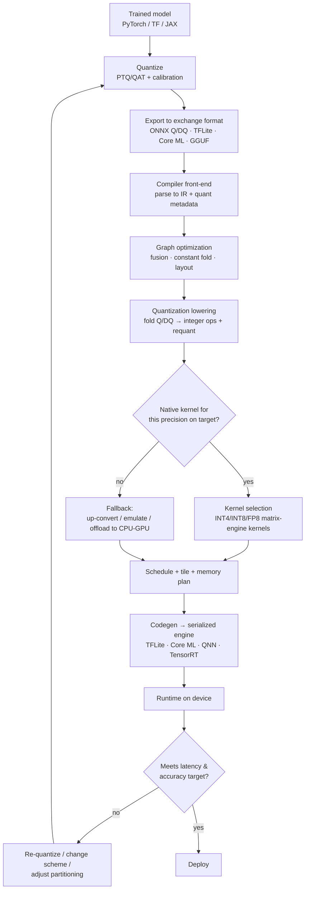

# 06. Hardware–Software Co-Design for Quantized Inference

> **Section scope.** How a quantized model actually becomes fast execution on real
> silicon: the matrix engines (NPU/DSP) that run low-precision math, the compiler
> toolchains that map a quantized graph onto them, the memory-bandwidth physics that
> makes quantization worthwhile, the interaction of quantization with sparsity, and
> the heterogeneous-execution and fallback realities of edge deployment. This is the
> "Compile" box from Section 01's pipeline, opened up. The thesis, foreshadowed
> throughout: in 2026 the accuracy and speed of a quantized model are as much
> properties of the hardware and compiler as of the quantization algorithm.

## The co-design thesis

For the first years of quantization, the mental model was linear: train a model,
quantize it, hand it to the hardware. That model is now wrong. Modern quantization is
**co-designed** — the quantization scheme is chosen with the target silicon's supported
formats and granularities in mind, the numeric formats themselves (microscaling/MX) are
designed to match hardware-natural block sizes, and the compiler mediates between what
the algorithm wants and what the silicon can execute. A quantization scheme that ignores
the target produces a model that either runs slowly (falling back to emulated or
higher-precision paths) or is rejected by the compiler. The three parties — the
quantization algorithm, the compiler, and the matrix engine — must agree, and this
section is about how that agreement is (and is not) reached.

The stakes are concrete. The *same* 4-bit model can decode 4× faster than FP16 on
hardware with a fast INT4 weight-only kernel, or barely faster on hardware that unpacks
INT4 to INT8 and runs the compute at INT8 — the algorithm is identical; the outcome
depends entirely on the hardware/compiler. Understanding this is what separates a
realistic deployment plan from a spec-sheet fantasy.

## Matrix engines: how NPUs and DSPs execute quantized math

The heart of every AI accelerator is a **matrix engine** — hardware specialized for the
multiply-accumulate (MAC) operations that dominate neural networks. The dominant designs:

- **Systolic arrays** (Google TPU, many NPUs) are 2D grids of MAC units through which
  data flows rhythmically; each cell multiplies and accumulates and passes results to
  its neighbor. They are extremely efficient for large, regular matrix multiplies but
  can under-utilize on small or irregular ones.
- **SIMD/vector engines with MAC arrays** (Qualcomm Hexagon's HVX vector and tensor
  units, DSP-derived designs) process wide vectors in parallel and are more flexible for
  the mixed workloads of a real model (convolutions, attention, elementwise ops).
- **Tensor cores** (NVIDIA) are specialized matrix-multiply units within a GPU that
  operate on small tiles at specific precisions (INT8, INT4, FP8, FP4), fed by the
  GPU's flexible programmable cores.

What matters for quantization is the **native precision support** of these engines. A
matrix engine has physical datapaths for specific formats: an INT8 MAC array multiplies
8-bit operands and accumulates into INT32. Whether the engine has *native* INT4, INT2,
FP8, or FP4 datapaths determines whether a model in that format gets a real compute
speedup or merely a memory saving (with the compute done after unpacking to a supported
width). This is the single most important hardware fact for quantization, and it is why
the precision-support matrix below is the section's key table.

The accumulator is part of the story too. Low-precision products accumulate into a wider
integer (typically INT32) or float (FP16/FP32) to avoid overflow across the reduction
(Section 04). The accumulator width and the efficiency of the **requantization** step
(narrowing the wide accumulator back to the next layer's low-precision input) are
hardware characteristics that affect real throughput. Engines also have dedicated units
or fast paths for the range-sensitive nonlinearities (softmax, LayerNorm) that Section 03
flagged — whether these run efficiently on-engine or force a costly detour to the CPU is
a real differentiator.

## The precision-support landscape

The heatmap summarizes native (●), emerging/partial (◐), and absent (—) support for each
precision format across current-generation edge silicon. Reading it: **INT8 and FP16 are
universal** — every serious edge accelerator runs them natively. **INT4** is now broadly
supported natively (Qualcomm, MediaTek, NVIDIA, Intel, AMD) with some vendors partial.
**FP8** is emerging, led by Qualcomm's 2025 flagship and NVIDIA. **INT2 and FP4** are the
frontier, present natively only on the newest flagship silicon (Qualcomm INT2, NVIDIA
Blackwell FP4) and absent elsewhere. The pattern confirms Sections 01 and 04: the
sub-8-bit formats show a clear hardware-ahead-of-software, flagship-first diffusion
pattern, and support claims for the newest formats carry confidence flags. The same data
as a table, with the tooling context:

| Hardware (representative) | INT8 | INT4 | INT2 | FP8 | FP4 | Native low-bit note |
|---|---|---|---|---|---|---|
| Qualcomm Hexagon (8 Elite Gen 5) | ● | ● | ● | ● | ◐ | Breadth leader; INT2+FP8 in 2025 flagship ⚠️ |
| Apple Neural Engine (A19/M5) | ● | ◐ | — | ◐ | — | Core ML/MLX exposed; details undisclosed ⚠️ |
| MediaTek APU (Dimensity 9400) | ● | ● | ◐ | ◐ | — | NeuroPilot; strong INT4 |
| Samsung Exynos NPU | ● | ◐ | — | ◐ | — | ENN SDK |
| Google Tensor / Edge TPU | ● | ◐ | — | — | — | INT8-centric (LiteRT) |
| NVIDIA Jetson (Orin→Blackwell) | ● | ● | — | ● | ● | Broadest low-FP (Blackwell FP4) |
| Intel NPU (Core Ultra) | ● | ● | — | ◐ | — | OpenVINO |
| AMD Ryzen AI (XDNA 2) | ● | ● | — | ◐ | — | Block FP focus |
| ARM Ethos NPU IP | ● | ◐ | — | — | — | Vela compiler; INT8-first |
| Huawei Ascend / HiAI | ● | ● | — | ◐ | — | Ascend DaVinci cores |

Legend: ● native · ◐ emerging/partial or SDK-limited · — none/unknown. Newest-format
cells carry ⚠️ confidence flags; vendor disclosure of low-bit internals is often
incomplete (Apple especially).

## The compiler toolchain: from framework to silicon

Between a quantized model file and the matrix engine sits a compiler stack that does the
hard work of mapping high-level operators to hardware kernels. The stages, common across
vendors even where the names differ:

1. **Import / front-end.** The model (ONNX, TFLite, PyTorch-exported, Core ML) is parsed
   into the compiler's intermediate representation (IR). Quantization information travels
   here as either explicit quantize/dequantize (Q/DQ) nodes or quantized operator types.
2. **Graph optimization.** Constant folding, dead-code elimination, and — critically —
   **operator fusion**: merging a matmul, its bias add, its requantization, and often a
   following activation into a single fused kernel, so intermediate results never leave
   the fast on-chip memory. Fusion is where much of the real speedup lives.
3. **Quantization lowering.** Q/DQ nodes are folded into the operators they surround,
   turning "dequantize → FP matmul → quantize" into a genuine integer matmul with
   requantization. The compiler resolves scales and zero-points into fixed-point
   multiply-and-shift sequences.
4. **Operator lowering / kernel selection.** Each graph operator is matched to a hardware
   kernel for the target precision. If no native kernel exists for the requested
   precision, the compiler must **fall back** — emulate, up-convert, or offload to
   another processor — which is where silent slowdowns originate.
5. **Scheduling and memory planning.** Operators are ordered, tiled to fit on-chip
   buffers, and assigned memory, minimizing DRAM traffic (the dominant cost). Tiling
   decisions interact with the quantization block size.
6. **Code generation.** The final serialized engine (a TFLite model, a Core ML `.mlmodel`,
   a QNN context binary, a TensorRT engine) that the runtime loads and executes.

The feedback edge (`M → N → B`) is the co-design loop in action: a scheme that compiles
but runs slowly (because it hit a fallback) or loses accuracy sends the engineer back to
re-quantize with the hardware's constraints more firmly in mind.

## How quantization is represented in the graph

A subtlety that trips up cross-tool workflows is *how* quantization is encoded in the
exchange format, because the encodings are not interchangeable. Two dominant
representations:

- **QDQ (Quantize-DeQuantize) format**: the graph keeps floating-point operators but
  brackets tensors with explicit `QuantizeLinear`/`DequantizeLinear` node pairs carrying
  the scale and zero-point. The compiler is expected to fold these into integer
  operators. This is flexible and is the ONNX and TFLite direction; it cleanly separates
  "what precision" from "which operator."
- **QOperator format**: the graph uses explicitly quantized operator types (e.g.
  `QLinearConv`, `QLinearMatMul`) that consume and produce integers directly. More
  compact but less flexible.

The ONNX quantization representation (both QDQ and QOperator variants exist) is the
nearest thing to a cross-vendor standard, but vendor compilers each have quirks in what
they accept, which per-channel/per-group schemes they support, and how they handle
mixed precision — so a model quantized for one target frequently needs re-export or
re-quantization for another. This representational fragmentation is a real friction in
the ecosystem and a driver of the standardization efforts in Section 15.

## Memory bandwidth: why quantization is a data-movement optimization

The roofline model explains *why* quantization pays off, and it does so differently for
different workloads. The roofline plots attainable throughput against **arithmetic
intensity** (FLOPs per byte of memory traffic). Below the "ridge point," a workload is
**memory-bound** — throughput is limited by how fast data moves from DRAM, not by compute
— and above it, **compute-bound**. The two ways quantization helps map directly onto the
two regions:

- **Memory-bound workloads (LLM decode).** Each generated token streams the entire weight
  set from DRAM; the matmuls have low arithmetic intensity (few FLOPs per weight byte,
  because the batch is small). Quantizing weights from 16 to 4 bits cuts the bytes moved
  by 4×, which — since the workload is bandwidth-limited — cuts latency ~4×. On the
  roofline, this *moves the workload right* (higher arithmetic intensity per byte) and up
  along the bandwidth-limited slope. This is the dominant on-device-LLM win, and note it
  requires no faster *compute* at all — only a weight-only quantization and a kernel that
  reads 4-bit weights.
- **Compute-bound workloads (vision CNN, LLM prefill).** These have high arithmetic
  intensity and are limited by the matrix engine's peak throughput. Quantizing to a
  format with a *faster matrix engine* (INT8, FP8) *raises the roof* — more MACs per
  second — giving a compute speedup. This requires native low-precision compute
  datapaths, which is why the precision-support matrix matters here.

The roofline is the single best mental model for hardware-aware quantization: identify
whether the workload is memory- or compute-bound, and choose weight-only (move right) or
weight+activation (raise the roof) accordingly. It also explains why TOPS figures
mislead — a high peak-TOPS (a high roof) does nothing for a memory-bound workload sitting
far below the ridge point; memory bandwidth, not TOPS, is the binding constraint for LLM
decode.

## Sparsity and quantization together

Quantization reduces bits per weight; **sparsity** reduces the number of weights. They
are complementary compression axes, and hardware increasingly accelerates both. The most
production-relevant form is **structured sparsity**, especially NVIDIA's **2:4 sparsity**
(exactly 2 of every 4 weights are zero), which the tensor cores accelerate ~2× because
the regular pattern lets the hardware skip the zeros efficiently. Combined with INT8 or
INT4 quantization, 2:4 sparsity stacks a further ~2× on the quantization gains — a
combined ~8× over dense FP16 in favorable cases.

The interaction has caveats. Unstructured sparsity (arbitrary zeros) compresses more but
is hard for hardware to exploit — the irregular pattern defeats the regular datapaths of
matrix engines — so it mostly helps storage, not compute, on typical NPUs. And, as
Section 03 warned, pruning removes redundancy the network was using to absorb
quantization noise, so aggressive sparsity plus aggressive quantization can degrade more
than the sum of the parts; the two must be co-tuned. On the edge, structured sparsity is
less universally supported than quantization, so quantization remains the primary lever,
with sparsity a secondary multiplier where the hardware supports it (some NPUs and NVIDIA
tensor cores). The frontier is *quantization + sparsity + low-rank* co-optimization, which
Section 14 revisits.

## Heterogeneous execution and the fallback problem

An edge SoC is heterogeneous: CPU, GPU, NPU, and often a DSP, each with different
precision support and performance characteristics. A real model is **partitioned** across
them by the runtime — the NPU runs the quantized matmuls and convolutions it supports, the
GPU or CPU handles operators the NPU lacks (unusual activations, dynamic shapes, control
flow), and data moves between them. This partitioning is where much practical performance
is won or lost:

- **Fallback penalties.** When the NPU cannot execute an operator (an unsupported
  precision, an unsupported op, a dynamic shape), the runtime falls back to the CPU/GPU.
  Each fallback incurs a data transfer and a synchronization, and a model with many
  fallbacks can be *slower* than running everything on the GPU, because it thrashes
  between processors. A single unsupported operator in the middle of a graph can force a
  costly round-trip.
- **The "supported precision" trap.** If the NPU supports INT8 but the model is INT4 and
  the NPU lacks native INT4, the runtime may run the whole model on the GPU instead,
  silently forfeiting the NPU. The spec sheet said "INT4" (as a storage format the tools
  accept) but the fast path did not materialize.
- **Operator coverage.** The breadth of operators a vendor's NPU compiler supports is as
  important as its precision support. A cutting-edge model with a novel attention variant
  may have no NPU path at all until the vendor adds operator support — a common reason new
  model architectures run poorly on edge NPUs at first.

The practical implication: deploying quantized models to edge NPUs is an exercise in
staying within the compiler's supported-operator and supported-precision envelope, and the
best real-world performance often comes from choosing a quantization scheme and model
architecture that the target's compiler maps *entirely* onto the NPU with no fallbacks —
another face of the co-design thesis.

## The compiler-stack landscape

The compiler layer has both vendor-specific and cross-vendor ecosystems, and knowing the
players clarifies the tooling sections that follow:

- **Vendor compilers**: Qualcomm's QNN / AI Engine Direct (and the AIMET quantization
  front-end), Apple's Core ML compiler, MediaTek's NeuroPilot, ARM's Vela (for Ethos),
  Intel's OpenVINO, NVIDIA's TensorRT. These produce the best performance on their target
  because they know the silicon intimately, at the cost of portability.
- **Cross-vendor / open compilers**: **Apache TVM** (with its quantization and BYOC
  backends), **MLIR** (the compiler infrastructure underpinning many modern stacks,
  including IREE and Torch-MLIR), **IREE** (an MLIR-based runtime targeting many
  backends), **XLA** (Google's, for TF/JAX), and Meta's **Glow** and **ExecuTorch** (the
  PyTorch-native edge path). These aim for portability across targets, mapping quantized
  IR onto whichever backend is present.
- **The MLIR convergence.** A notable trend is the industry's convergence on **MLIR** as
  the common compiler infrastructure, which is gradually reducing the fragmentation —
  quantization dialects in MLIR (and the broader effort to standardize quantized-operator
  semantics) aim to let a quantized model target many backends without per-vendor
  re-export. This is slow, ongoing, and important: the compiler fragmentation is one of
  the largest sources of friction in edge quantization, and MLIR is the leading candidate
  to reduce it.

## Case study: mapping a W4A16 LLM onto a mobile NPU

To make the pipeline concrete, trace a 4-bit weight-only LLM to a phone. The weights are
quantized (AWQ, g=128, embedding/LM-head at INT8) and exported. The vendor compiler (say,
QNN) imports the graph, folds the Q/DQ metadata, and selects kernels: the 4-bit weight
matmuls map to the Hexagon tensor engine's INT4 weight-only path (dequantize-in-kernel
against FP16 activations), the attention softmax and LayerNorm are placed on a
higher-precision path or a dedicated unit, and the KV cache is quantized to INT8. The
compiler tiles the matmuls to fit the on-chip memory, schedules the operators to keep the
NPU busy, and emits a context binary. At runtime, decode is memory-bound, so the 4-bit
weights (4× less traffic) yield the ~4× token-rate improvement — *provided* the INT4
weight-only kernel exists and the softmax/LayerNorm placement did not force CPU fallbacks.
If a fallback occurs (say, an unsupported RMSNorm variant), the engineer either changes the
model to a supported normalization or accepts the penalty. This is the co-design loop in
miniature: the algorithm (AWQ 4-bit), the compiler (kernel selection, fusion, placement),
and the engine (INT4 datapath, memory bandwidth) all had to agree for the speedup to
materialize.

## Failure modes of the compile-and-deploy step

The characteristic ways co-design goes wrong, as a checklist:

- **Precision fallback** — the requested precision lacks a native kernel; compute silently
  runs higher-precision or off-NPU.
- **Operator fallback** — an unsupported op forces CPU offload and processor thrashing.
- **Granularity mismatch** — the model's group size does not match the hardware's native
  block, forcing repacking or rejection.
- **Missing fusion** — the compiler fails to fuse requantization/activation, so
  intermediates spill to DRAM and kill the bandwidth win.
- **Dynamic shapes** — variable sequence lengths or control flow that the NPU compiler
  cannot handle statically.
- **Accuracy drift from compiler rounding** — the compiler's fixed-point requantization
  differs subtly from the quantization tool's, introducing unexpected error.

Each maps to a remedy: match the scheme to native precisions and block sizes, stay within
supported operators, verify fusion, use static shapes where possible, and validate the
*compiled* model's accuracy on-device (not just the quantization tool's simulated
accuracy). The recurring lesson is that "the model quantized fine in PyTorch" says nothing
about how it runs on the target until it has been through the target's compiler and
measured on the device.

## Summary

Hardware–software co-design is where quantization theory meets physical reality. The
matrix engine's native precision support decides whether a low-bit format yields compute
speedup or only memory saving; the compiler decides whether the scheme maps cleanly onto
the engine or falls back; memory bandwidth (the roofline) decides which quantization
strategy — weight-only or weight+activation — actually helps a given workload; and the
heterogeneous SoC's partitioning and fallback behavior decide real-world performance. The
numeric formats have evolved (microscaling/MX) specifically to close the gap between what
algorithms want and what silicon executes, and the compiler ecosystem is slowly
converging (MLIR) to reduce fragmentation. The through-line is that a quantization
decision is never purely a software decision: it is a negotiation with the silicon and the
compiler, and the next four sections' vendor roadmaps (08–11) are, in effect, detailed
maps of what each vendor's side of that negotiation offers.

---

*Next: [07 — Pros, Cons, and Deployment Tradeoffs](./07-tradeoffs.md).*
