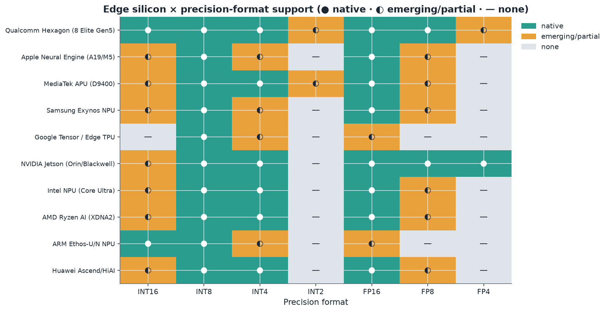
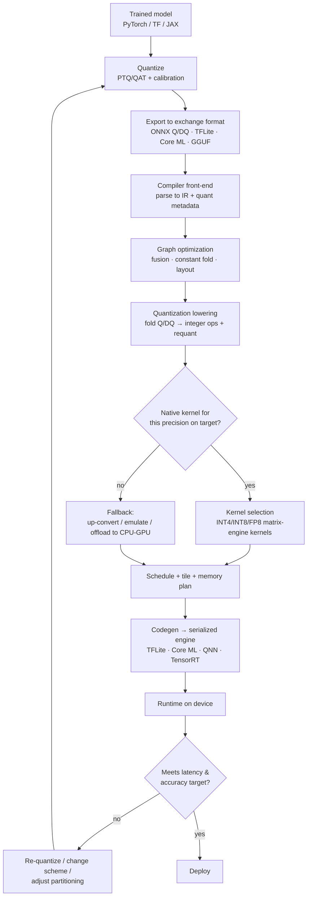
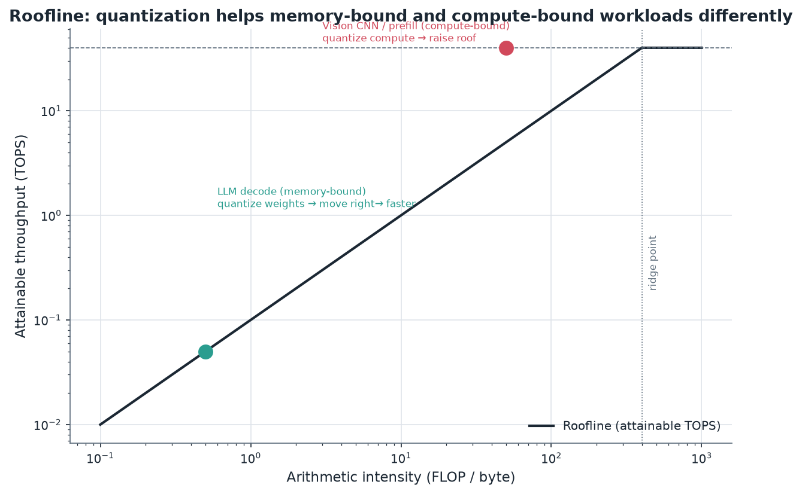

# 06. Hardware–Software Co-Design for Quantized Inference

> **Section scope.** How a quantized model actually becomes fast execution on real
> silicon: the matrix engines (NPU/DSP) that run low-precision math, the compiler
> toolchains that map a quantized graph onto them, the memory-bandwidth physics that
> makes quantization worthwhile, the interaction of quantization with sparsity, and
> the heterogeneous-execution and fallback realities of edge deployment. This is the
> "Compile" box from Section 01's pipeline, opened up. The thesis, foreshadowed
> throughout: in 2026 the accuracy and speed of a quantized model are as much
> properties of the hardware and compiler as of the quantization algorithm.

## The co-design thesis

For the first years of quantization, the mental model was linear: train a model,
quantize it, hand it to the hardware. That model is now wrong. Modern quantization is
**co-designed** — the quantization scheme is chosen with the target silicon's supported
formats and granularities in mind, the numeric formats themselves (microscaling/MX) are
designed to match hardware-natural block sizes, and the compiler mediates between what
the algorithm wants and what the silicon can execute. A quantization scheme that ignores
the target produces a model that either runs slowly (falling back to emulated or
higher-precision paths) or is rejected by the compiler. The three parties — the
quantization algorithm, the compiler, and the matrix engine — must agree, and this
section is about how that agreement is (and is not) reached.

The stakes are concrete. The *same* 4-bit model can decode 4× faster than FP16 on
hardware with a fast INT4 weight-only kernel, or barely faster on hardware that unpacks
INT4 to INT8 and runs the compute at INT8 — the algorithm is identical; the outcome
depends entirely on the hardware/compiler. Understanding this is what separates a
realistic deployment plan from a spec-sheet fantasy.

## Matrix engines: how NPUs and DSPs execute quantized math

The heart of every AI accelerator is a **matrix engine** — hardware specialized for the
multiply-accumulate (MAC) operations that dominate neural networks. The dominant designs:

- **Systolic arrays** (Google TPU, many NPUs) are 2D grids of MAC units through which
  data flows rhythmically; each cell multiplies and accumulates and passes results to
  its neighbor. They are extremely efficient for large, regular matrix multiplies but
  can under-utilize on small or irregular ones.
- **SIMD/vector engines with MAC arrays** (Qualcomm Hexagon's HVX vector and tensor
  units, DSP-derived designs) process wide vectors in parallel and are more flexible for
  the mixed workloads of a real model (convolutions, attention, elementwise ops).
- **Tensor cores** (NVIDIA) are specialized matrix-multiply units within a GPU that
  operate on small tiles at specific precisions (INT8, INT4, FP8, FP4), fed by the
  GPU's flexible programmable cores.

What matters for quantization is the **native precision support** of these engines. A
matrix engine has physical datapaths for specific formats: an INT8 MAC array multiplies
8-bit operands and accumulates into INT32. Whether the engine has *native* INT4, INT2,
FP8, or FP4 datapaths determines whether a model in that format gets a real compute
speedup or merely a memory saving (with the compute done after unpacking to a supported
width). This is the single most important hardware fact for quantization, and it is why
the precision-support matrix below is the section's key table.

The accumulator is part of the story too. Low-precision products accumulate into a wider
integer (typically INT32) or float (FP16/FP32) to avoid overflow across the reduction
(Section 04). The accumulator width and the efficiency of the **requantization** step
(narrowing the wide accumulator back to the next layer's low-precision input) are
hardware characteristics that affect real throughput. Engines also have dedicated units
or fast paths for the range-sensitive nonlinearities (softmax, LayerNorm) that Section 03
flagged — whether these run efficiently on-engine or force a costly detour to the CPU is
a real differentiator.

## The precision-support landscape

The heatmap summarizes native (●), emerging/partial (◐), and absent (—) support for each
precision format across current-generation edge silicon. Reading it: **INT8 and FP16 are
universal** — every serious edge accelerator runs them natively. **INT4** is now broadly
supported natively (Qualcomm, MediaTek, NVIDIA, Intel, AMD) with some vendors partial.
**FP8** is emerging, led by Qualcomm's 2025 flagship and NVIDIA. **INT2 and FP4** are the
frontier, present natively only on the newest flagship silicon (Qualcomm INT2, NVIDIA
Blackwell FP4) and absent elsewhere. The pattern confirms Sections 01 and 04: the
sub-8-bit formats show a clear hardware-ahead-of-software, flagship-first diffusion
pattern, and support claims for the newest formats carry confidence flags. The same data
as a table, with the tooling context:

| Hardware (representative) | INT8 | INT4 | INT2 | FP8 | FP4 | Native low-bit note |
|---|---|---|---|---|---|---|
| Qualcomm Hexagon (8 Elite Gen 5) | ● | ● | ● | ● | ◐ | Breadth leader; INT2+FP8 in 2025 flagship ⚠️ |
| Apple Neural Engine (A19/M5) | ● | ◐ | — | ◐ | — | Core ML/MLX exposed; details undisclosed ⚠️ |
| MediaTek APU (Dimensity 9400) | ● | ● | ◐ | ◐ | — | NeuroPilot; strong INT4 |
| Samsung Exynos NPU | ● | ◐ | — | ◐ | — | ENN SDK |
| Google Tensor / Edge TPU | ● | ◐ | — | — | — | INT8-centric (LiteRT) |
| NVIDIA Jetson (Orin→Blackwell) | ● | ● | — | ● | ● | Broadest low-FP (Blackwell FP4) |
| Intel NPU (Core Ultra) | ● | ● | — | ◐ | — | OpenVINO |
| AMD Ryzen AI (XDNA 2) | ● | ● | — | ◐ | — | Block FP focus |
| ARM Ethos NPU IP | ● | ◐ | — | — | — | Vela compiler; INT8-first |
| Huawei Ascend / HiAI | ● | ● | — | ◐ | — | Ascend DaVinci cores |

Legend: ● native · ◐ emerging/partial or SDK-limited · — none/unknown. Newest-format
cells carry ⚠️ confidence flags; vendor disclosure of low-bit internals is often
incomplete (Apple especially).

## The compiler toolchain: from framework to silicon

Between a quantized model file and the matrix engine sits a compiler stack that does the
hard work of mapping high-level operators to hardware kernels. The stages, common across
vendors even where the names differ:

1. **Import / front-end.** The model (ONNX, TFLite, PyTorch-exported, Core ML) is parsed
   into the compiler's intermediate representation (IR). Quantization information travels
   here as either explicit quantize/dequantize (Q/DQ) nodes or quantized operator types.
2. **Graph optimization.** Constant folding, dead-code elimination, and — critically —
   **operator fusion**: merging a matmul, its bias add, its requantization, and often a
   following activation into a single fused kernel, so intermediate results never leave
   the fast on-chip memory. Fusion is where much of the real speedup lives.
3. **Quantization lowering.** Q/DQ nodes are folded into the operators they surround,
   turning "dequantize → FP matmul → quantize" into a genuine integer matmul with
   requantization. The compiler resolves scales and zero-points into fixed-point
   multiply-and-shift sequences.
4. **Operator lowering / kernel selection.** Each graph operator is matched to a hardware
   kernel for the target precision. If no native kernel exists for the requested
   precision, the compiler must **fall back** — emulate, up-convert, or offload to
   another processor — which is where silent slowdowns originate.
5. **Scheduling and memory planning.** Operators are ordered, tiled to fit on-chip
   buffers, and assigned memory, minimizing DRAM traffic (the dominant cost). Tiling
   decisions interact with the quantization block size.
6. **Code generation.** The final serialized engine (a TFLite model, a Core ML `.mlmodel`,
   a QNN context binary, a TensorRT engine) that the runtime loads and executes.

The feedback edge (`M → N → B`) is the co-design loop in action: a scheme that compiles
but runs slowly (because it hit a fallback) or loses accuracy sends the engineer back to
re-quantize with the hardware's constraints more firmly in mind.

## How quantization is represented in the graph

A subtlety that trips up cross-tool workflows is *how* quantization is encoded in the
exchange format, because the encodings are not interchangeable. Two dominant
representations:

- **QDQ (Quantize-DeQuantize) format**: the graph keeps floating-point operators but
  brackets tensors with explicit `QuantizeLinear`/`DequantizeLinear` node pairs carrying
  the scale and zero-point. The compiler is expected to fold these into integer
  operators. This is flexible and is the ONNX and TFLite direction; it cleanly separates
  "what precision" from "which operator."
- **QOperator format**: the graph uses explicitly quantized operator types (e.g.
  `QLinearConv`, `QLinearMatMul`) that consume and produce integers directly. More
  compact but less flexible.

The ONNX quantization representation (both QDQ and QOperator variants exist) is the
nearest thing to a cross-vendor standard, but vendor compilers each have quirks in what
they accept, which per-channel/per-group schemes they support, and how they handle
mixed precision — so a model quantized for one target frequently needs re-export or
re-quantization for another. This representational fragmentation is a real friction in
the ecosystem and a driver of the standardization efforts in Section 15.

## Memory bandwidth: why quantization is a data-movement optimization

The roofline model explains *why* quantization pays off, and it does so differently for
different workloads. The roofline plots attainable throughput against **arithmetic
intensity** (FLOPs per byte of memory traffic). Below the "ridge point," a workload is
**memory-bound** — throughput is limited by how fast data moves from DRAM, not by compute
— and above it, **compute-bound**. The two ways quantization helps map directly onto the
two regions:

- **Memory-bound workloads (LLM decode).** Each generated token streams the entire weight
  set from DRAM; the matmuls have low arithmetic intensity (few FLOPs per weight byte,
  because the batch is small). Quantizing weights from 16 to 4 bits cuts the bytes moved
  by 4×, which — since the workload is bandwidth-limited — cuts latency ~4×. On the
  roofline, this *moves the workload right* (higher arithmetic intensity per byte) and up
  along the bandwidth-limited slope. This is the dominant on-device-LLM win, and note it
  requires no faster *compute* at all — only a weight-only quantization and a kernel that
  reads 4-bit weights.
- **Compute-bound workloads (vision CNN, LLM prefill).** These have high arithmetic
  intensity and are limited by the matrix engine's peak throughput. Quantizing to a
  format with a *faster matrix engine* (INT8, FP8) *raises the roof* — more MACs per
  second — giving a compute speedup. This requires native low-precision compute
  datapaths, which is why the precision-support matrix matters here.

The roofline is the single best mental model for hardware-aware quantization: identify
whether the workload is memory- or compute-bound, and choose weight-only (move right) or
weight+activation (raise the roof) accordingly. It also explains why TOPS figures
mislead — a high peak-TOPS (a high roof) does nothing for a memory-bound workload sitting
far below the ridge point; memory bandwidth, not TOPS, is the binding constraint for LLM
decode.

## Sparsity and quantization together

Quantization reduces bits per weight; **sparsity** reduces the number of weights. They
are complementary compression axes, and hardware increasingly accelerates both. The most
production-relevant form is **structured sparsity**, especially NVIDIA's **2:4 sparsity**
(exactly 2 of every 4 weights are zero), which the tensor cores accelerate ~2× because
the regular pattern lets the hardware skip the zeros efficiently. Combined with INT8 or
INT4 quantization, 2:4 sparsity stacks a further ~2× on the quantization gains — a
combined ~8× over dense FP16 in favorable cases.

The interaction has caveats. Unstructured sparsity (arbitrary zeros) compresses more but
is hard for hardware to exploit — the irregular pattern defeats the regular datapaths of
matrix engines — so it mostly helps storage, not compute, on typical NPUs. And, as
Section 03 warned, pruning removes redundancy the network was using to absorb
quantization noise, so aggressive sparsity plus aggressive quantization can degrade more
than the sum of the parts; the two must be co-tuned. On the edge, structured sparsity is
less universally supported than quantization, so quantization remains the primary lever,
with sparsity a secondary multiplier where the hardware supports it (some NPUs and NVIDIA
tensor cores). The frontier is *quantization + sparsity + low-rank* co-optimization, which
Section 14 revisits.

## Heterogeneous execution and the fallback problem

An edge SoC is heterogeneous: CPU, GPU, NPU, and often a DSP, each with different
precision support and performance characteristics. A real model is **partitioned** across
them by the runtime — the NPU runs the quantized matmuls and convolutions it supports, the
GPU or CPU handles operators the NPU lacks (unusual activations, dynamic shapes, control
flow), and data moves between them. This partitioning is where much practical performance
is won or lost:

- **Fallback penalties.** When the NPU cannot execute an operator (an unsupported
  precision, an unsupported op, a dynamic shape), the runtime falls back to the CPU/GPU.
  Each fallback incurs a data transfer and a synchronization, and a model with many
  fallbacks can be *slower* than running everything on the GPU, because it thrashes
  between processors. A single unsupported operator in the middle of a graph can force a
  costly round-trip.
- **The "supported precision" trap.** If the NPU supports INT8 but the model is INT4 and
  the NPU lacks native INT4, the runtime may run the whole model on the GPU instead,
  silently forfeiting the NPU. The spec sheet said "INT4" (as a storage format the tools
  accept) but the fast path did not materialize.
- **Operator coverage.** The breadth of operators a vendor's NPU compiler supports is as
  important as its precision support. A cutting-edge model with a novel attention variant
  may have no NPU path at all until the vendor adds operator support — a common reason new
  model architectures run poorly on edge NPUs at first.

The practical implication: deploying quantized models to edge NPUs is an exercise in
staying within the compiler's supported-operator and supported-precision envelope, and the
best real-world performance often comes from choosing a quantization scheme and model
architecture that the target's compiler maps *entirely* onto the NPU with no fallbacks —
another face of the co-design thesis.

## The compiler-stack landscape

The compiler layer has both vendor-specific and cross-vendor ecosystems, and knowing the
players clarifies the tooling sections that follow:

- **Vendor compilers**: Qualcomm's QNN / AI Engine Direct (and the AIMET quantization
  front-end), Apple's Core ML compiler, MediaTek's NeuroPilot, ARM's Vela (for Ethos),
  Intel's OpenVINO, NVIDIA's TensorRT. These produce the best performance on their target
  because they know the silicon intimately, at the cost of portability.
- **Cross-vendor / open compilers**: **Apache TVM** (with its quantization and BYOC
  backends), **MLIR** (the compiler infrastructure underpinning many modern stacks,
  including IREE and Torch-MLIR), **IREE** (an MLIR-based runtime targeting many
  backends), **XLA** (Google's, for TF/JAX), and Meta's **Glow** and **ExecuTorch** (the
  PyTorch-native edge path). These aim for portability across targets, mapping quantized
  IR onto whichever backend is present.
- **The MLIR convergence.** A notable trend is the industry's convergence on **MLIR** as
  the common compiler infrastructure, which is gradually reducing the fragmentation —
  quantization dialects in MLIR (and the broader effort to standardize quantized-operator
  semantics) aim to let a quantized model target many backends without per-vendor
  re-export. This is slow, ongoing, and important: the compiler fragmentation is one of
  the largest sources of friction in edge quantization, and MLIR is the leading candidate
  to reduce it.

## Case study: mapping a W4A16 LLM onto a mobile NPU

To make the pipeline concrete, trace a 4-bit weight-only LLM to a phone. The weights are
quantized (AWQ, g=128, embedding/LM-head at INT8) and exported. The vendor compiler (say,
QNN) imports the graph, folds the Q/DQ metadata, and selects kernels: the 4-bit weight
matmuls map to the Hexagon tensor engine's INT4 weight-only path (dequantize-in-kernel
against FP16 activations), the attention softmax and LayerNorm are placed on a
higher-precision path or a dedicated unit, and the KV cache is quantized to INT8. The
compiler tiles the matmuls to fit the on-chip memory, schedules the operators to keep the
NPU busy, and emits a context binary. At runtime, decode is memory-bound, so the 4-bit
weights (4× less traffic) yield the ~4× token-rate improvement — *provided* the INT4
weight-only kernel exists and the softmax/LayerNorm placement did not force CPU fallbacks.
If a fallback occurs (say, an unsupported RMSNorm variant), the engineer either changes the
model to a supported normalization or accepts the penalty. This is the co-design loop in
miniature: the algorithm (AWQ 4-bit), the compiler (kernel selection, fusion, placement),
and the engine (INT4 datapath, memory bandwidth) all had to agree for the speedup to
materialize.

## Failure modes of the compile-and-deploy step

The characteristic ways co-design goes wrong, as a checklist:

- **Precision fallback** — the requested precision lacks a native kernel; compute silently
  runs higher-precision or off-NPU.
- **Operator fallback** — an unsupported op forces CPU offload and processor thrashing.
- **Granularity mismatch** — the model's group size does not match the hardware's native
  block, forcing repacking or rejection.
- **Missing fusion** — the compiler fails to fuse requantization/activation, so
  intermediates spill to DRAM and kill the bandwidth win.
- **Dynamic shapes** — variable sequence lengths or control flow that the NPU compiler
  cannot handle statically.
- **Accuracy drift from compiler rounding** — the compiler's fixed-point requantization
  differs subtly from the quantization tool's, introducing unexpected error.

Each maps to a remedy: match the scheme to native precisions and block sizes, stay within
supported operators, verify fusion, use static shapes where possible, and validate the
*compiled* model's accuracy on-device (not just the quantization tool's simulated
accuracy). The recurring lesson is that "the model quantized fine in PyTorch" says nothing
about how it runs on the target until it has been through the target's compiler and
measured on the device.

## Dataflow: how matrix engines move data

Beyond the precision of a matrix engine, its **dataflow** — the pattern by which weights,
activations, and partial sums move through the array — determines its efficiency, and it
interacts with quantization. The canonical taxonomy (from the Eyeriss line of research)
distinguishes:

- **Weight-stationary**: weights are loaded into the array and held while activations
  stream through, reusing each weight across many activations. Efficient when weights are
  reused heavily (large batch or large spatial dimensions). Most systolic arrays are
  weight-stationary or a variant. For quantized inference, weight-stationary designs
  benefit doubly from weight quantization: fewer bits to load into the stationary array,
  and the loaded weights are reused, amortizing the load.
- **Output-stationary**: each output's accumulator stays in place while inputs stream,
  minimizing partial-sum movement. Good for deep reductions.
- **Row-stationary / hybrid**: balances reuse of weights, activations, and partial sums,
  as in Eyeriss, optimizing overall data movement.

Why this matters for quantization: the *dominant cost is data movement, not arithmetic*
(the next subsection quantifies this), so a dataflow that maximizes reuse of the quantized
operands minimizes the number of expensive DRAM accesses. When a workload is memory-bound
(LLM decode), the weights cannot be reused much (batch size ~1), so no dataflow saves the
day — only reducing the *bytes per weight* (quantization) helps, which is why weight-only
quantization is the LLM lever regardless of dataflow. When a workload is compute-bound
(vision, large-batch), a good dataflow keeps the quantized operands on-chip and the
low-precision arithmetic fast, compounding the quantization benefit. The dataflow and the
quantization scheme are thus co-dependent: the best combination keeps low-precision
operands resident and reused, and the compiler's tiling decisions (which choose the
effective dataflow for each layer) must respect the quantization block structure.

## The on-chip memory hierarchy

Every accelerator has a memory hierarchy — registers, on-chip SRAM buffers, and off-chip
DRAM — with each level roughly an order of magnitude larger, slower, and more
energy-costly to access than the one above. The entire game of efficient inference is
keeping data in the fast levels and minimizing traffic to DRAM. Quantization helps at
every level: 4-bit weights take a quarter the SRAM of FP16, so more of the model fits
on-chip, more can be reused before eviction, and less must be re-fetched from DRAM. A
model that fits entirely in on-chip SRAM (small models, tinyML) avoids DRAM almost
entirely — the ideal case — and quantization is what makes a given model fit. For large
models that cannot fit on-chip, quantization reduces the DRAM traffic proportionally,
which for the memory-bound decode case translates directly to speed.

The **tiling** the compiler performs is precisely the management of this hierarchy: it
breaks large matmuls into tiles sized to fit the on-chip buffers, so each tile's operands
are loaded once, fully reused, and evicted. Quantization block sizes interact with tiling
— a per-group scale boundary that does not align with a tile boundary complicates the
kernel, which is another reason the MX formats fix a hardware-friendly block size (32) that
tiles cleanly. The memory hierarchy is also why *fusion* matters so much: a fused
matmul-bias-requant-activation keeps intermediates in registers/SRAM instead of writing
them to DRAM and reading them back, and an unfused graph pays the DRAM round-trip at every
operator boundary. The compiler's job is to make the quantized model's data movement fit
the hierarchy, and quantization's job is to make the data small enough that it can.

## The energy cost of data movement

The physical reason quantization matters so much is energy asymmetry, and the numbers are
stark. In a modern process, an integer multiply-accumulate costs on the order of a
picojoule or less, but moving a single 32-bit word from off-chip DRAM costs on the order of
hundreds of picojoules to nanojoules — **two to three orders of magnitude more than the
computation it feeds**. Moving data from on-chip SRAM is cheaper than DRAM but still costs
far more than the MAC. This asymmetry means that for the energy budget of an edge device,
*the bytes you move dominate the joules you spend*, and quantization — which reduces bytes
moved proportionally to the bit-width reduction — is first and foremost an *energy*
optimization. A 4-bit weight moves a quarter the bytes of a 16-bit weight, saving roughly
a quarter the (dominant) data-movement energy, which is why quantization extends battery
life and reduces thermal throttling as much as it speeds inference. This is also why
in-memory computing (below) is pursued: it attacks the data-movement energy directly by
computing where the data lives. Section 07 quantifies the energy-efficiency gains of
quantization across bit-widths; the point here is the mechanism — data movement is the
energy bottleneck, and fewer bits means fewer bytes moved means less energy, at every
level of the hierarchy.

## Requantization in hardware, in detail

The requantization step — narrowing a wide INT32 accumulator back to the low-precision
input of the next layer — is a small but pervasive piece of hardware/software co-design
worth understanding, because it is where the per-layer scales physically meet. After an
INT8 matmul accumulates into INT32, the result must be scaled by the combined factor
`s_input · s_weight / s_output` and rounded to the next layer's integer range. Doing this
in floating point would defeat the integer pipeline, so the Jacob et al. scheme (Section
02) approximates the real-valued scale as a fixed-point multiplier and a bit-shift: the
INT32 accumulator is multiplied by an integer and right-shifted, with rounding. Hardware
provides this as a fast fixed-point "requantize" operation. Per-channel and per-group
quantization complicate it — there is a different scale per channel or group, so the
requantization multiplier varies across the output, which the hardware must support
efficiently. The efficiency and flexibility of the requantization unit (does it support
per-channel scales? per-group? asymmetric zero-point correction?) is a real hardware
differentiator that spec sheets rarely mention but that determines which quantization
schemes run fast. A subtle correctness issue also lives here: the compiler's requantization
rounding must match what the quantization tool assumed, or accuracy drifts — one of the
listed failure modes — which is why validating the *compiled* model's accuracy on-device is
non-negotiable.

## Quantization-aware compilation techniques

Modern compilers do more than map operators one-to-one; several techniques specifically
serve quantized models:

- **Fusion patterns** for quantized graphs: matmul+bias+requant+activation, conv+BN+relu
  (with BN pre-folded), and attention-block fusions that keep the quantized intermediates
  on-chip.
- **Layout transformation**: choosing the memory layout (channel ordering, tiling, weight
  packing) that matches the matrix engine's access pattern — 4-bit weights are packed two
  per byte in a layout the kernel can unpack efficiently, and getting this wrong forces
  slow unpacking.
- **Autotuning**: compilers like TVM search over kernel implementations (tile sizes,
  unroll factors, vectorization) to find the fastest for a given operator/shape/precision
  on the target — important because the optimal kernel for a quantized matmul differs from
  the FP one.
- **Mixed-precision scheduling**: placing the precision transitions (INT8 island → FP16
  softmax → INT8 island) to minimize conversion overhead, and deciding which processor
  runs each island.
- **Graph-level precision propagation**: inferring the precision of intermediate tensors
  from the Q/DQ annotations and propagating them so the whole graph is consistently typed.

These techniques are why a good compiler extracts far more performance from the same
quantized model than a naive one, and why the vendor compilers (which know their silicon's
kernels and layouts) usually beat portable compilers on their home hardware — a tension
between performance and portability that the MLIR convergence hopes to ease.

## Batching, arithmetic intensity, and the memory-compute crossover

A crucial systems subtlety: whether a workload is memory- or compute-bound is not fixed by
the model but by the *batch size* and sequence handling, which changes the optimal
quantization strategy. LLM **decode** at batch size 1 is deeply memory-bound (each token
re-reads all weights for one token's worth of compute), so weight-only quantization is the
lever. As the **batch size grows** (a server batching many requests), the same weights are
reused across many tokens in a single weight load, arithmetic intensity rises, and the
workload drifts toward compute-bound — at which point *activation* quantization (W8A8/FP8)
starts to matter because the compute becomes the bottleneck. LLM **prefill** (processing a
long prompt) is compute-bound even at batch 1 because it processes many tokens in parallel.
This is why server serving with continuous batching may favor FP8 W8A8 (compute speedup
across the large effective batch) while the same model on a phone at batch 1 favors 4-bit
weight-only (memory speedup). The crossover point — the batch size at which a workload
moves from memory- to compute-bound — is a key systems quantity, and the roofline is the
tool for reasoning about it. The practical upshot: the "right" quantization scheme depends
not just on the model and hardware but on the *serving regime*, and a scheme optimal for
on-device single-stream inference may be suboptimal for batched server serving of the same
model.

## In-memory and analog computing

The most radical response to the data-movement bottleneck is **compute-in-memory (CIM)**:
performing the multiply-accumulate operations *inside* or immediately adjacent to the
memory array where the weights are stored, so the weights never move. Analog CIM uses the
physics of memory cells (resistive RAM, flash, SRAM) to compute a matrix-vector product in
the analog domain — the bit-line currents sum the products — in a single step, potentially
orders of magnitude more energy-efficient than digital MAC arrays for the dominant matmul.
CIM has a natural affinity with quantization: analog computation has limited precision (the
analog-to-digital converters and device variability effectively quantize), so CIM is
inherently a low-precision paradigm, and quantization-aware training that targets the CIM
array's effective precision is essential to accuracy. Several startups (Section 13) and
research groups pursue analog and digital CIM. The maturity is 🔴→🟡: digital
near-memory compute is appearing in products, but analog CIM at scale faces challenges
(ADC overhead, device variability, programming energy) that keep it largely research-stage
for now. It is, however, one of the most-watched directions because it attacks the
fundamental energy bottleneck that quantization only mitigates — and if it matures, it
would make ultra-low-precision quantization not just beneficial but *mandatory*, since the
analog substrate is intrinsically low-precision.

## The economics and design of NPU silicon

A brief note on why the hardware landscape looks the way it does. Designing an NPU
involves choosing which precisions to support in silicon, and each supported format costs
area (datapaths, requantization units) and verification effort. Vendors provision formats
*ahead* of demand because silicon design cycles run two to three years and being late to a
format that becomes important (as INT4 did for LLMs) is costlier than the area of
supporting one that turns out niche. This is why flagship silicon accumulates format
support (Qualcomm's INT2/FP8 in 2025) before the software widely uses it — the recurring
hardware-ahead-of-software pattern is a rational response to long design cycles and format
uncertainty. It also explains the *breadth* strategy of leaders like Qualcomm (support
every plausible format so no software direction is foreclosed) versus the *focus* strategy
of others (Google's INT8-centric Edge TPU, betting on a narrower format set for
efficiency). For a buyer, the implication is that flagship silicon's format breadth is
partly future-proofing that current software cannot yet exploit — real, but not immediately
cashable, which is why the maturity and confidence flags on new-format support matter.

## Runtime and deployment stacks

Finally, below the compiler sits the **runtime** that loads the compiled engine and
executes it on-device, managing the heterogeneous processors, memory allocation, and the
NPU/GPU/CPU partitioning at execution time. The major edge runtimes — TensorFlow Lite /
LiteRT, Core ML, ONNX Runtime (with its execution providers, including NPU providers),
Qualcomm's QNN runtime, ExecuTorch, MLX, and llama.cpp — each mediate between the compiled
model and the silicon, and each has its own supported-operator and supported-precision
envelope. The runtime is where the fallback decisions of the "heterogeneous execution"
discussion actually happen, and its quality (how well it keeps work on the NPU, how
efficiently it handles precision islands and data transfers) materially affects real
performance. For a deployment, the full stack — quantization tool → exchange format →
compiler → runtime → silicon — must all support the chosen scheme end to end, and a gap
at any layer (an unsupported precision in the runtime even if the compiler emitted it)
breaks the fast path. This end-to-end dependency is the practical face of co-design: it is
not enough for the algorithm and the silicon to be compatible; every layer between them
must be too.

## Memory bandwidth and on-chip resources across edge silicon

Because the roofline analysis shows memory bandwidth — not peak TOPS — is the binding
constraint for the memory-bound LLM-decode case, a bandwidth-oriented comparison is more
useful than a TOPS table for reasoning about on-device generative AI. The table below
gives representative figures (illustrative and approximate; exact values vary by
configuration and are vendor-reported where noted ⚠️). The point is the *ratios and the
relationship to model size*, not precise numbers.

| Platform (representative) | Memory type | Approx bandwidth | Typical RAM | Implication for quantized LLM decode |
|---|---|---|---|---|
| Flagship phone SoC (Snapdragon 8 Elite Gen 5) | LPDDR5X | ~70–80 GB/s ⚠️ | 12–16 GB | 4-bit 7B fits + decodes at interactive rate |
| Apple M-series (M5) | Unified LPDDR5X | ~150 GB/s ⚠️ | 16–32 GB | Larger 4-bit models + MoE feasible on-device |
| Mid-range phone SoC | LPDDR5 | ~40–50 GB/s ⚠️ | 6–8 GB | 4-bit 3–4B class; 7B tight |
| NVIDIA Jetson Orin | LPDDR5 | ~200 GB/s ⚠️ | 8–64 GB | High-throughput edge LLM/vision |
| Laptop NPU (Core Ultra / Ryzen AI) | System LPDDR5 | ~100–120 GB/s ⚠️ | 16–32 GB | 4-bit 7–13B on-device |
| Microcontroller + Ethos-U | On-chip SRAM / low-BW flash | <10 GB/s | KB–MB | tinyML only; INT8 small models |

The table makes the on-device-LLM reality concrete: whether a quantized model runs well is
governed by (1) does it *fit* in RAM at the chosen bit-width, and (2) is the memory
*bandwidth* enough for an acceptable token rate. Both are quantization-dependent — 4-bit
weights both fit in less RAM and stream faster than FP16 — which is why quantization is the
enabling technology for on-device generative AI, and why bandwidth and RAM, not TOPS, are
the numbers to check. A chip with high TOPS but low bandwidth will disappoint on LLM
decode; a chip with modest TOPS but good bandwidth and enough RAM will do well.

## Compiler and runtime stacks compared

The tooling that turns a quantized model into a running engine varies in portability,
performance, and quantization support. A second comparison table orients the vendor
sections:

| Stack | Owner | Portability | Quantization support | Best for |
|---|---|---|---|---|
| TensorRT / TensorRT-LLM | NVIDIA | NVIDIA only | INT8/INT4/FP8/FP4, strong | NVIDIA GPU/Jetson, max performance |
| Core ML (+ Core ML Tools) | Apple | Apple only | INT8/INT4 palettization, per-block | Apple devices |
| QNN / AI Engine Direct (+AIMET) | Qualcomm | Qualcomm only | INT4/INT8/INT16/FP8 | Snapdragon NPU, max performance |
| LiteRT (TFLite) | Google | Cross-vendor (delegates) | INT8-centric, growing INT4 | Mobile, broad reach |
| OpenVINO (+ NNCF) | Intel | Intel-centric, some cross | INT8/INT4/FP8 | Intel CPU/GPU/NPU |
| ONNX Runtime | Microsoft/community | Cross-vendor (EPs) | QDQ/QOperator INT8/INT4 | Portable exchange + serving |
| Apache TVM | Community | Cross-vendor (BYOC) | Flexible, autotuned | Research, custom targets |
| ExecuTorch | Meta/PyTorch | Cross-vendor | PyTorch-native quant flows | PyTorch edge deployment |
| MLX | Apple | Apple silicon | Native low-bit, LLM-focused | On-device LLM on Apple |
| llama.cpp / GGUF | Community | Very broad (CPU/Metal/etc.) | GGUF k-quants 2–8 bit | Local LLM, broad hardware |

The portability–performance tension is visible: the vendor-locked stacks (TensorRT, Core
ML, QNN) extract maximum performance on their silicon because they own the kernels and
know the hardware, while the cross-vendor stacks (ONNX Runtime, TVM, LiteRT, ExecuTorch)
trade some peak performance for the ability to target many devices. The choice depends on
whether a deployment targets one silicon family (use the vendor stack) or must span many
(use a portable stack and accept per-target tuning). The MLIR convergence is an attempt to
get portability *without* the performance penalty, by sharing compiler infrastructure
across the vendor and open stacks.

## Profiling and optimizing quantized models on device

Co-design is ultimately an empirical discipline: the only way to know how a quantized
model runs is to profile it on the target. The essential measurements are the **layer-wise
latency breakdown** (which operators dominate, and whether any are falling back off-NPU),
the **processor occupancy** (is the NPU actually doing the work, or is the CPU/GPU picking
up fallbacks?), the **memory bandwidth utilization** (is decode bandwidth-bound as
expected?), and the **on-device accuracy** (does the compiled model match the quantization
tool's simulated accuracy?). Vendor profilers (Qualcomm's, Apple's Instruments/Core ML
performance reports, NVIDIA's Nsight) expose these. The optimization loop is: profile,
find the operators that fall back or dominate, adjust the model (swap an unsupported op,
change the quantization scheme to a supported precision/granularity, re-tile), and
re-profile. This loop is where the abstract co-design principles become concrete
engineering, and it is why a realistic deployment timeline includes on-device profiling and
iteration, not just a one-shot quantize-and-ship. The most common surprises it surfaces are
unexpected fallbacks (a single unsupported op tanking performance) and accuracy drift
between the simulated and compiled models — both invisible until measured on the device.

## The DSP heritage of mobile NPUs

A historical note that illuminates the present: many mobile NPUs descend from **digital
signal processors**, and the lineage shapes their quantization behavior. Qualcomm's Hexagon
began as a DSP for modem and audio processing before gaining vector (HVX) and tensor
extensions for AI; DSPs have used fixed-point (integer) arithmetic for decades because it
is energy-efficient, so the DSP heritage predisposed these engines toward integer
quantized execution from the start. This is part of why mobile NPUs were INT8-native early
and why they handle the fixed-point requantization arithmetic efficiently — it is what
DSPs always did. The heritage also explains some flexibility differences: DSP-derived
vector engines handle the irregular operations of a real model (varied convolutions,
attention, elementwise ops) more gracefully than a pure systolic array optimized only for
large regular matmuls, at some peak-efficiency cost. Understanding that a mobile NPU is
often "a DSP that grew tensor units" clarifies both its strengths (efficient integer
math, flexible operator support) and the design choices in its quantization support, and
it is a thread that recurs in the Qualcomm and MediaTek roadmaps of Sections 09–10.

## Summary

Hardware–software co-design is where quantization theory meets physical reality. The
matrix engine's native precision support decides whether a low-bit format yields compute
speedup or only memory saving; the compiler decides whether the scheme maps cleanly onto
the engine or falls back; memory bandwidth (the roofline) decides which quantization
strategy — weight-only or weight+activation — actually helps a given workload; and the
heterogeneous SoC's partitioning and fallback behavior decide real-world performance. The
numeric formats have evolved (microscaling/MX) specifically to close the gap between what
algorithms want and what silicon executes, and the compiler ecosystem is slowly
converging (MLIR) to reduce fragmentation. The through-line is that a quantization
decision is never purely a software decision: it is a negotiation with the silicon and the
compiler, and the next four sections' vendor roadmaps (08–11) are, in effect, detailed
maps of what each vendor's side of that negotiation offers.

---

*Next: [07 — Pros, Cons, and Deployment Tradeoffs](./07-tradeoffs.md).*
