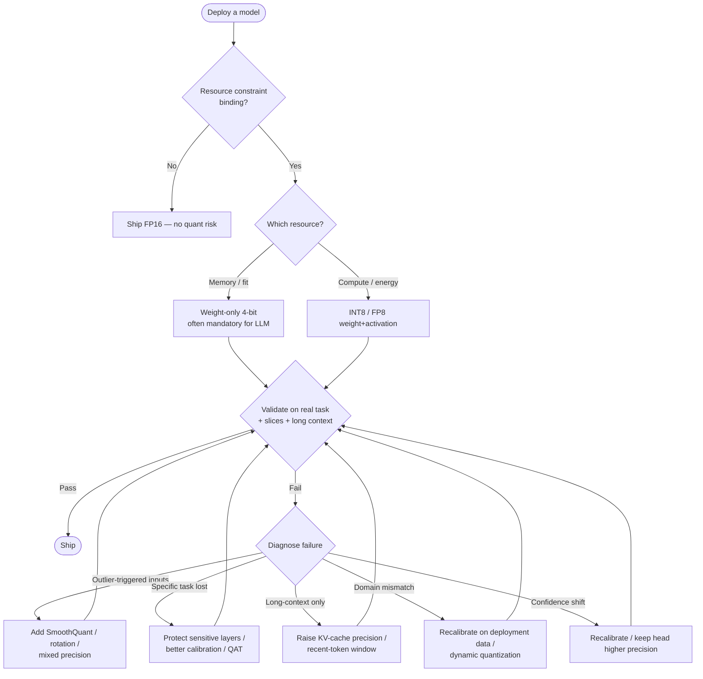

# 07. Pros, Cons, and Deployment Tradeoffs

> **Section scope.** A balanced accounting of what quantization gives and what it
> costs: the accuracy-loss patterns, the latency/throughput and memory gains, the
> energy-efficiency wins, the deployment and tooling complexity, and — most
> importantly — the *failure modes* that aggregate metrics hide (outlier sensitivity,
> task-specific degradation, long-context breakdown). It closes with a tradeoff
> analysis organized by use case, because the right answer genuinely differs across
> vision, LLM, speech, and multimodal deployments.

## The core bargain

Quantization is a bargain: it trades a controlled, usually-small loss of accuracy for
large, near-linear reductions in memory, latency, and energy. The bargain is favorable
across a wide operating range — at INT8 and 4-bit-weight-only it is close to free — and
becomes progressively worse as bit-width drops, until below some threshold the accuracy
loss exceeds any resource win. The whole of this section is about characterizing that
bargain precisely: how good it is, where it breaks, and how the answer depends on the
workload. The essential asymmetry to hold in mind: **the resource wins are smooth and
predictable, but the accuracy costs are lumpy and workload-dependent** — which is why
quantization requires validation rather than blind application.

The chart captures the bargain's shape (illustrative). Energy per inference falls steadily
with bit-width — INT8 saves ~45%, INT4 ~68%, INT2 ~80% versus FP16 — while accuracy
retention (red) holds near 100% through INT4 and then collapses below it. The visual gap
between the smoothly-declining energy bars and the cliff-edged accuracy line *is* the
tradeoff: you want to move right (less energy) until just before the accuracy line falls
off, and where that cliff sits depends on the model and task.

## The pros: what quantization delivers

### Memory footprint reduction

The most direct win. Memory scales linearly with bit-width: INT8 halves weight memory,
INT4 quarters it, INT2 is one-eighth. For LLMs this is often *binary* in consequence — a
7B model fits on a phone at 4-bit and does not at FP16 — rather than a marginal
improvement. Reduced memory also means more of the model fits in fast on-chip memory
(Section 06), compounding the latency and energy benefits, and it frees memory for larger
context (KV cache), larger batch, or a bigger model.

### Latency and throughput gains

For **memory-bound** workloads (LLM decode), latency improves nearly in proportion to the
weight-bit reduction, because the workload is limited by weight traffic from DRAM —
weight-only 4-bit gives roughly 4× faster decode. For **compute-bound** workloads (vision,
prefill), throughput improves in proportion to the matrix engine's low-precision speedup —
INT8 tensor units typically ~2× FP16, and lower precisions more where natively supported.
The gains are real and among the largest available short of changing the model
architecture, which is why quantization is a first-line optimization.

### Energy efficiency

Because data movement dominates energy (Section 06), and quantization reduces bytes moved
proportionally, energy per inference falls substantially with bit-width — the ~45–80%
reductions in the chart. On battery-and-thermally-constrained edge devices this is often
the *primary* motivation: quantization extends battery life, reduces heat, and lets a
device sustain inference longer before throttling. For always-on workloads (wake-word,
ambient sensing), the energy win determines whether continuous inference is feasible at
all within the power budget.

The multi-axis view shows energy, memory, and (memory-bound) latency all falling together
as precision drops, with the accuracy annotation as the counterweight. The three resource
axes move roughly together because they share the same underlying cause — fewer bits means
less data to store, move, and (where natively supported) compute — while accuracy is the
independent axis that eventually forces a stop.

## The cons: what quantization costs

### Accuracy loss and its patterns

The headline cost, but its *pattern* matters more than its average. Accuracy loss is:

- **Small and predictable at INT8 and 4-bit-weight-only** — sub-1% for vision, 0–2 task
  points for LLMs — where it is essentially a solved, low-risk optimization.
- **Steep and non-linear below 4 bits** — the SQNR cliff (Section 03) means each bit
  removed below ~4 costs disproportionately more accuracy.
- **Concentrated, not uniform** — the loss is not spread evenly across inputs; it
  concentrates on the hardest cases, rarest inputs, and most-sensitive capabilities,
  which is why aggregate metrics understate the risk (below).

### Deployment and tooling complexity

Quantization is not free in engineering effort. It adds a calibration step (and the need
for representative calibration data), a validation burden (accuracy must be re-checked,
ideally on-device and on the real task), and the co-design complexity of Section 06
(matching the scheme to the hardware, avoiding fallbacks). Advanced schemes (QAT,
mixed-precision, rotation methods) add more. The complexity is manageable and increasingly
tool-supported, but it is real, and it is a reason some teams ship FP16 when they could
ship quantized — the accuracy is safe and the effort is lower. This tooling-complexity cost
is easy to underestimate in planning and is a legitimate part of the tradeoff.

### The reproducibility and provenance cost

As Sections 02 and 05 noted, a quantized checkpoint's quality depends on undocumented
choices (group size, calibration set, protected layers), so quantized models carry a
provenance risk that float models do not — "4-bit GPTQ" is not a specification. This is a
subtle cost: it shifts burden onto consumers to validate, and onto producers to document.

## The failure modes aggregate metrics hide

This is the most important part of the section, because it is where naive quantization
goes wrong in ways a single accuracy number does not reveal. A model can retain 99%
aggregate accuracy while failing badly on specific, important slices.

- **Outlier sensitivity.** As established throughout, large-magnitude activation/weight
  outliers dominate the quantization range; unhandled, they cause catastrophic loss
  concentrated on the inputs that trigger them. This is the root failure that SmoothQuant,
  rotation, and mixed-precision address, and it is why "it worked on my test set" can hide
  failures on the outlier-triggering inputs the test set under-sampled.
- **Task-specific degradation.** Quantization can preserve perplexity or top-1 while
  specifically damaging a capability — multi-step reasoning, code generation, factual
  precision, instruction-following, or a fine-tuned behavior — because those capabilities
  live in fragile weight configurations with little margin. This is why LLM quantization
  must be evaluated on task suites, not perplexity, and why instruction-tuned models need
  extra care.
- **Long-context breakdown.** A model may work on short inputs but degrade as context
  grows, typically due to KV-cache quantization error compounding over the sequence, or
  position-dependent activation ranges the calibration missed. Long-context is a distinct
  failure axis that short-prompt evaluation misses entirely.
- **Calibration-distribution mismatch.** A model calibrated on one distribution and
  deployed on another (clean vs. noisy images, web text vs. code, one language vs. another)
  has mis-set ranges and degrades on the deployment distribution — a failure that only
  domain-matched evaluation catches.
- **Confidence/calibration shift.** Quantization can systematically shift a model's output
  probabilities (over- or under-confidence), which matters for downstream decisions,
  thresholding, and safety even when top-1 accuracy is preserved. Classification systems
  with confidence thresholds are especially exposed.
- **Rare-class and tail degradation.** In classification and detection, quantization often
  hits rare classes and small objects hardest, because they had the least representational
  margin — a fairness and safety concern in domains like medical imaging or autonomous
  perception.

The unifying lesson: **evaluate quantization on the slices and tasks that matter, not just
the aggregate**, because the failures are concentrated exactly where a single number hides
them. A responsible quantization workflow includes slice-based and task-based validation,
not just a top-line accuracy check.

## The quantization decision and failure-diagnosis flow

The following diagram encodes both the "should I / how aggressively" decision and the
"why is my quantized model failing" diagnosis, since they are two sides of the tradeoff.

## Tradeoffs by use case

The tradeoff's shape genuinely differs across workloads, and the table below is the
section's core reference — what quantization buys, what it risks, and the recommended
operating point for each major use case.

| Use case | Primary constraint | Sweet-spot scheme | Main risk | Notes |
|---|---|---|---|---|
| Vision CNN (classification/detection) | Compute + energy | INT8 W8A8 per-channel | Rare-class/small-object loss | Near-lossless; INT4 emerging |
| On-device LLM (chat/assist) | Memory bandwidth | W4A16 (AWQ/GPTQ) + KV quant | Reasoning/instruction loss, long-context | 4-bit near-standard |
| Server LLM serving | Throughput/cost | FP8 or W8A8 (SmoothQuant); W4 for memory | Calibration for W8A8 | Regime depends on batch size |
| Speech (ASR/TTS) | Latency + energy (streaming) | INT8, INT8 QAT | Streaming state drift, accent/rare words | RNN/streaming needs care |
| Multimodal (VLM) | Memory + mixed compute | 4-bit LLM backbone + INT8 vision | Visual grounding loss, fusion layers | Calibrate with images |
| Diffusion (image gen) | Compute + memory | INT8 W8A8 | Per-step error compounding, artifacts | Sub-8-bit research-stage |
| tinyML (always-on sensing) | Energy (µJ budget) | INT8/INT4, sometimes binary | Task-dependent accuracy | Model must fit on-chip SRAM |
| Recommendation/embedding | Memory (huge tables) | INT8/INT4 embeddings | Rare-item degradation | Embedding-table quant dominates |

The pattern across the table: **memory-bound generative workloads favor weight-only 4-bit,
compute-bound workloads favor INT8/FP8 weight+activation, streaming and iterative workloads
(speech, diffusion) need extra care for error accumulation, and every use case has a
characteristic failure slice** (rare classes for vision, reasoning for LLMs, long-context
for chat, streaming drift for speech, per-step artifacts for diffusion) that its validation
must specifically target.

## A second comparison: aggressiveness vs. risk by bit-width

| Bit-width | Resource win vs FP16 | Accuracy risk | Engineering effort | When to use |
|---|---|---|---|---|
| INT8 (W8A8) | ~2× | Very low | Low (PTQ) | Default for vision/audio; safe everywhere |
| W4A16 (weight-only) | ~4× memory/decode | Low (LLMs) | Low–medium (PTQ + calib) | On-device LLM default |
| W8A8 + SmoothQuant/FP8 | ~2× compute | Low | Medium (calibration) | Compute-bound serving |
| W4A4 | ~4× mem + compute | Medium–high | High (rotation methods) | Research frontier; both wins |
| 3-bit | ~5× | Medium–high | Medium–high | Memory-forced; validate hard |
| 2-bit | ~8× | High | High (codebook/QAT) | Only when memory forces it |
| Binary/ternary | ~16× | Very high (unless native-trained) | Very high (QAT/native) | tinyML easy tasks; research |

## The honest bottom line

Quantization's tradeoff is, for the common cases, extraordinarily favorable — INT8 and
4-bit-weight-only deliver large resource wins for accuracy costs small enough to be
negligible in most applications, which is why they are defaults rather than options. The
tradeoff worsens predictably with aggressiveness, and the *risk* is less the average
accuracy loss than the concentrated, slice-specific failures that aggregate metrics hide.
The disciplined stance is therefore not "quantize as aggressively as possible" but "quantize
to the least aggressive scheme that meets the resource constraint, and validate on the
tasks and slices that matter." Follow that and quantization is one of the highest-leverage,
lowest-regret optimizations in edge AI; ignore the validation discipline and it is a source
of subtle, hard-to-diagnose production failures. The vendor sections that follow (08–11)
describe the silicon that determines *which* points on this tradeoff curve are actually
reachable on a given device.

---

*Next: [08 — Apple Roadmap](./08-apple.md).*
