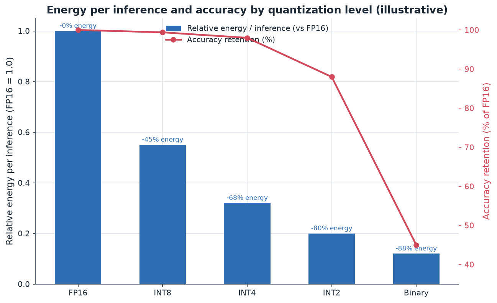
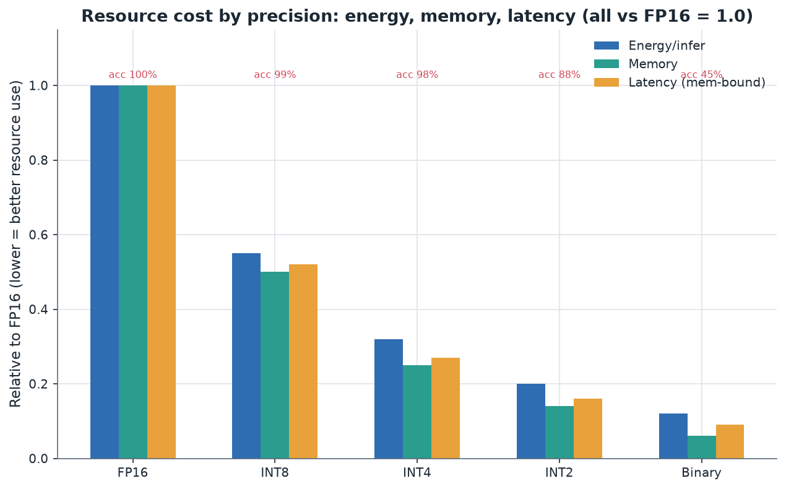

# 07. Pros, Cons, and Deployment Tradeoffs

> **Section scope.** A balanced accounting of what quantization gives and what it
> costs: the accuracy-loss patterns, the latency/throughput and memory gains, the
> energy-efficiency wins, the deployment and tooling complexity, and — most
> importantly — the *failure modes* that aggregate metrics hide (outlier sensitivity,
> task-specific degradation, long-context breakdown). It closes with a tradeoff
> analysis organized by use case, because the right answer genuinely differs across
> vision, LLM, speech, and multimodal deployments.

## The core bargain

Quantization is a bargain: it trades a controlled, usually-small loss of accuracy for
large, near-linear reductions in memory, latency, and energy. The bargain is favorable
across a wide operating range — at INT8 and 4-bit-weight-only it is close to free — and
becomes progressively worse as bit-width drops, until below some threshold the accuracy
loss exceeds any resource win. The whole of this section is about characterizing that
bargain precisely: how good it is, where it breaks, and how the answer depends on the
workload. The essential asymmetry to hold in mind: **the resource wins are smooth and
predictable, but the accuracy costs are lumpy and workload-dependent** — which is why
quantization requires validation rather than blind application.

The chart captures the bargain's shape (illustrative). Energy per inference falls steadily
with bit-width — INT8 saves ~45%, INT4 ~68%, INT2 ~80% versus FP16 — while accuracy
retention (red) holds near 100% through INT4 and then collapses below it. The visual gap
between the smoothly-declining energy bars and the cliff-edged accuracy line *is* the
tradeoff: you want to move right (less energy) until just before the accuracy line falls
off, and where that cliff sits depends on the model and task.

## The pros: what quantization delivers

### Memory footprint reduction

The most direct win. Memory scales linearly with bit-width: INT8 halves weight memory,
INT4 quarters it, INT2 is one-eighth. For LLMs this is often *binary* in consequence — a
7B model fits on a phone at 4-bit and does not at FP16 — rather than a marginal
improvement. Reduced memory also means more of the model fits in fast on-chip memory
(Section 06), compounding the latency and energy benefits, and it frees memory for larger
context (KV cache), larger batch, or a bigger model.

### Latency and throughput gains

For **memory-bound** workloads (LLM decode), latency improves nearly in proportion to the
weight-bit reduction, because the workload is limited by weight traffic from DRAM —
weight-only 4-bit gives roughly 4× faster decode. For **compute-bound** workloads (vision,
prefill), throughput improves in proportion to the matrix engine's low-precision speedup —
INT8 tensor units typically ~2× FP16, and lower precisions more where natively supported.
The gains are real and among the largest available short of changing the model
architecture, which is why quantization is a first-line optimization.

### Energy efficiency

Because data movement dominates energy (Section 06), and quantization reduces bytes moved
proportionally, energy per inference falls substantially with bit-width — the ~45–80%
reductions in the chart. On battery-and-thermally-constrained edge devices this is often
the *primary* motivation: quantization extends battery life, reduces heat, and lets a
device sustain inference longer before throttling. For always-on workloads (wake-word,
ambient sensing), the energy win determines whether continuous inference is feasible at
all within the power budget.

The multi-axis view shows energy, memory, and (memory-bound) latency all falling together
as precision drops, with the accuracy annotation as the counterweight. The three resource
axes move roughly together because they share the same underlying cause — fewer bits means
less data to store, move, and (where natively supported) compute — while accuracy is the
independent axis that eventually forces a stop.

## The cons: what quantization costs

### Accuracy loss and its patterns

The headline cost, but its *pattern* matters more than its average. Accuracy loss is:

- **Small and predictable at INT8 and 4-bit-weight-only** — sub-1% for vision, 0–2 task
  points for LLMs — where it is essentially a solved, low-risk optimization.
- **Steep and non-linear below 4 bits** — the SQNR cliff (Section 03) means each bit
  removed below ~4 costs disproportionately more accuracy.
- **Concentrated, not uniform** — the loss is not spread evenly across inputs; it
  concentrates on the hardest cases, rarest inputs, and most-sensitive capabilities,
  which is why aggregate metrics understate the risk (below).

### Deployment and tooling complexity

Quantization is not free in engineering effort. It adds a calibration step (and the need
for representative calibration data), a validation burden (accuracy must be re-checked,
ideally on-device and on the real task), and the co-design complexity of Section 06
(matching the scheme to the hardware, avoiding fallbacks). Advanced schemes (QAT,
mixed-precision, rotation methods) add more. The complexity is manageable and increasingly
tool-supported, but it is real, and it is a reason some teams ship FP16 when they could
ship quantized — the accuracy is safe and the effort is lower. This tooling-complexity cost
is easy to underestimate in planning and is a legitimate part of the tradeoff.

### The reproducibility and provenance cost

As Sections 02 and 05 noted, a quantized checkpoint's quality depends on undocumented
choices (group size, calibration set, protected layers), so quantized models carry a
provenance risk that float models do not — "4-bit GPTQ" is not a specification. This is a
subtle cost: it shifts burden onto consumers to validate, and onto producers to document.

## The failure modes aggregate metrics hide

This is the most important part of the section, because it is where naive quantization
goes wrong in ways a single accuracy number does not reveal. A model can retain 99%
aggregate accuracy while failing badly on specific, important slices.

- **Outlier sensitivity.** As established throughout, large-magnitude activation/weight
  outliers dominate the quantization range; unhandled, they cause catastrophic loss
  concentrated on the inputs that trigger them. This is the root failure that SmoothQuant,
  rotation, and mixed-precision address, and it is why "it worked on my test set" can hide
  failures on the outlier-triggering inputs the test set under-sampled.
- **Task-specific degradation.** Quantization can preserve perplexity or top-1 while
  specifically damaging a capability — multi-step reasoning, code generation, factual
  precision, instruction-following, or a fine-tuned behavior — because those capabilities
  live in fragile weight configurations with little margin. This is why LLM quantization
  must be evaluated on task suites, not perplexity, and why instruction-tuned models need
  extra care.
- **Long-context breakdown.** A model may work on short inputs but degrade as context
  grows, typically due to KV-cache quantization error compounding over the sequence, or
  position-dependent activation ranges the calibration missed. Long-context is a distinct
  failure axis that short-prompt evaluation misses entirely.
- **Calibration-distribution mismatch.** A model calibrated on one distribution and
  deployed on another (clean vs. noisy images, web text vs. code, one language vs. another)
  has mis-set ranges and degrades on the deployment distribution — a failure that only
  domain-matched evaluation catches.
- **Confidence/calibration shift.** Quantization can systematically shift a model's output
  probabilities (over- or under-confidence), which matters for downstream decisions,
  thresholding, and safety even when top-1 accuracy is preserved. Classification systems
  with confidence thresholds are especially exposed.
- **Rare-class and tail degradation.** In classification and detection, quantization often
  hits rare classes and small objects hardest, because they had the least representational
  margin — a fairness and safety concern in domains like medical imaging or autonomous
  perception.

The unifying lesson: **evaluate quantization on the slices and tasks that matter, not just
the aggregate**, because the failures are concentrated exactly where a single number hides
them. A responsible quantization workflow includes slice-based and task-based validation,
not just a top-line accuracy check.

## The quantization decision and failure-diagnosis flow

The following diagram encodes both the "should I / how aggressively" decision and the
"why is my quantized model failing" diagnosis, since they are two sides of the tradeoff.

## Tradeoffs by use case

The tradeoff's shape genuinely differs across workloads, and the table below is the
section's core reference — what quantization buys, what it risks, and the recommended
operating point for each major use case.

| Use case | Primary constraint | Sweet-spot scheme | Main risk | Notes |
|---|---|---|---|---|
| Vision CNN (classification/detection) | Compute + energy | INT8 W8A8 per-channel | Rare-class/small-object loss | Near-lossless; INT4 emerging |
| On-device LLM (chat/assist) | Memory bandwidth | W4A16 (AWQ/GPTQ) + KV quant | Reasoning/instruction loss, long-context | 4-bit near-standard |
| Server LLM serving | Throughput/cost | FP8 or W8A8 (SmoothQuant); W4 for memory | Calibration for W8A8 | Regime depends on batch size |
| Speech (ASR/TTS) | Latency + energy (streaming) | INT8, INT8 QAT | Streaming state drift, accent/rare words | RNN/streaming needs care |
| Multimodal (VLM) | Memory + mixed compute | 4-bit LLM backbone + INT8 vision | Visual grounding loss, fusion layers | Calibrate with images |
| Diffusion (image gen) | Compute + memory | INT8 W8A8 | Per-step error compounding, artifacts | Sub-8-bit research-stage |
| tinyML (always-on sensing) | Energy (µJ budget) | INT8/INT4, sometimes binary | Task-dependent accuracy | Model must fit on-chip SRAM |
| Recommendation/embedding | Memory (huge tables) | INT8/INT4 embeddings | Rare-item degradation | Embedding-table quant dominates |

The pattern across the table: **memory-bound generative workloads favor weight-only 4-bit,
compute-bound workloads favor INT8/FP8 weight+activation, streaming and iterative workloads
(speech, diffusion) need extra care for error accumulation, and every use case has a
characteristic failure slice** (rare classes for vision, reasoning for LLMs, long-context
for chat, streaming drift for speech, per-step artifacts for diffusion) that its validation
must specifically target.

## A second comparison: aggressiveness vs. risk by bit-width

| Bit-width | Resource win vs FP16 | Accuracy risk | Engineering effort | When to use |
|---|---|---|---|---|
| INT8 (W8A8) | ~2× | Very low | Low (PTQ) | Default for vision/audio; safe everywhere |
| W4A16 (weight-only) | ~4× memory/decode | Low (LLMs) | Low–medium (PTQ + calib) | On-device LLM default |
| W8A8 + SmoothQuant/FP8 | ~2× compute | Low | Medium (calibration) | Compute-bound serving |
| W4A4 | ~4× mem + compute | Medium–high | High (rotation methods) | Research frontier; both wins |
| 3-bit | ~5× | Medium–high | Medium–high | Memory-forced; validate hard |
| 2-bit | ~8× | High | High (codebook/QAT) | Only when memory forces it |
| Binary/ternary | ~16× | Very high (unless native-trained) | Very high (QAT/native) | tinyML easy tasks; research |

## Quantifying the memory win in practice

The memory win is worth making concrete because its consequences are often binary rather
than marginal. Weight memory is `parameters × bits / 8` bytes. A 7B-parameter model needs
~14 GB at FP16, ~7 GB at INT8, ~3.5 GB at INT4, and ~1.75 GB at INT2 (before scale
overhead). Against the RAM budgets of Section 06 — 6–8 GB on a mid-range phone, 12–16 GB on
a flagship — the FP16 model simply does not load, the INT8 model is tight, and the INT4
model fits comfortably with room for activations, the KV cache, and the rest of the system.
Scale this to a 70B model (140 GB FP16, 35 GB INT4) and the same logic explains why 4-bit is
what lets a large model run on a single high-end GPU or workstation rather than a multi-GPU
server. The KV cache adds to this: at long context it can consume gigabytes, so quantizing
it (INT8/INT4) is what keeps long-context inference within the memory budget. The practical
framing is a fitting problem: compute the total memory (quantized weights + KV cache +
activations + runtime overhead) at each candidate bit-width, compare to the device budget,
and the lowest bit-width that fits with margin — subject to passing accuracy validation — is
the answer. Because the win is linear in bit-width, halving the bits halves the dominant
memory term, and this predictability is what makes the memory tradeoff easy to plan even
though the accuracy tradeoff is not.

## Quantifying latency and throughput

The latency win divides by regime (Section 06's roofline). For **memory-bound LLM decode**,
per-token latency is approximately the weight bytes divided by memory bandwidth, so it
scales with bit-width: a 7B model at FP16 (14 GB) on 70 GB/s bandwidth needs ~200 ms/token
just for weight movement, while at INT4 (3.5 GB) it needs ~50 ms/token — the ~4× speedup
that makes on-device generation interactive. This is why the memory-bound latency column in
the data tracks the memory column so closely: for decode, latency *is* memory movement. For
**compute-bound** workloads (vision, prefill, large-batch serving), latency scales with the
matrix engine's low-precision throughput — INT8 tensor units are typically ~2× FP16, and
lower precisions faster where natively supported — so the win depends on native precision
support rather than bit-count alone. The important caveat, repeated from Section 06: the
compute win requires a native low-precision datapath and a good kernel; the memory win
requires only fewer weight bytes and a kernel that reads them, which is why the memory win
is more reliably realized across diverse hardware than the compute win. A realistic latency
estimate therefore starts by classifying the workload's regime and then applies the
appropriate scaling — bit-width for memory-bound, native-throughput-ratio for compute-bound
— rather than assuming a single "quantization speedup" number.

## Energy efficiency in depth

Energy is where quantization's edge value is often decisive, and the mechanism (Section 06)
is that data movement dominates energy, so fewer bits means proportionally less
data-movement energy at every level of the memory hierarchy. The compounding is important:
a 4-bit weight uses a quarter the DRAM-transfer energy of FP16, *and* a quarter the SRAM
energy when cached, *and*, where native low-precision compute exists, less arithmetic
energy per MAC. For an always-on workload the arithmetic is stark: a wake-word detector that
must run continuously has a fixed power budget (often single-digit milliwatts), and whether
the model fits that budget depends directly on its precision — INT8 or INT4 may be feasible
where FP16 is not, making quantization the enabler of the always-on use case rather than an
optimization of it. For a battery device running periodic inference (photo processing,
transcription), the energy win translates to battery life and to how much inference the
device can do before thermal throttling forces it to slow down — a real user-facing quality
difference. The energy tradeoff has the same shape as the others: smooth, predictable
savings with bit-width, counterweighted by the accuracy cliff, with the added feature that
below some power budget the choice is not "faster vs. slower" but "runs at all vs. does not."

## Robustness, adversarial, and safety implications

Quantization interacts with model robustness and safety in ways that are under-appreciated
and belong in an honest tradeoff accounting. The effects cut both ways. On one hand,
quantization's added noise can *slightly* improve robustness to some input perturbations
(the coarser representation is less sensitive to tiny input changes) — a minor, unreliable
benefit. On the other hand, several genuine risks exist:

- **Adversarial robustness can degrade.** Quantization can create new decision-boundary
  artifacts that adversarial attacks exploit, and a model's certified or empirical
  robustness does not automatically survive quantization — it must be re-evaluated. There is
  also research on quantization-specific attacks that behave differently on the quantized vs.
  full-precision model.
- **Safety-behavior degradation.** For LLMs, the fine-tuned behaviors that implement safety
  (refusing harmful requests, avoiding certain content) live in the same fragile weight
  configurations as other fine-tuned capabilities, and aggressive quantization can weaken
  them while leaving general capability intact — meaning a quantized model may be *less
  safe* than its float parent in ways a capability benchmark misses. This is a real concern
  for deployed assistant models and argues for safety-specific evaluation of quantized
  checkpoints, not just capability evaluation.
- **Backdoor and integrity considerations.** Because quantization is often applied by third
  parties and distributed as opaque checkpoints (the provenance problem), the supply chain
  for quantized models is a place where integrity matters — a maliciously-quantized
  checkpoint could embed behaviors the float model lacks. This is a governance rather than a
  purely technical concern, but it belongs in the risk column.

The disciplined stance is that quantization changes the model's function in ways that can
affect robustness and safety, so any property that mattered about the float model — certified
robustness, safety behaviors, calibration — must be *re-validated* on the quantized model
rather than assumed to carry over. This is an extension of the "evaluate on what matters"
principle to the robustness and safety dimensions.

## Fairness and the distribution of accuracy loss

A tradeoff that deserves explicit attention: quantization's accuracy loss is not distributed
uniformly across a model's inputs or across demographic or class groups, and this has
fairness implications. Because quantization hits the least-represented, lowest-margin cases
hardest (rare classes, tail inputs, under-represented groups in the training distribution),
a quantized model can show *larger* accuracy degradation on minority groups or rare-but-
important cases than its aggregate metric suggests — effectively amplifying existing
disparities. In domains like medical imaging, biometric systems, and content moderation,
this is a substantive concern: a model that is "99% as accurate overall" after quantization
might be meaningfully worse on the specific populations or cases where errors are most
costly. The remedy is, again, disaggregated evaluation — measuring the quantization delta
per group and per slice, not just in aggregate — and treating a quantization that
disproportionately harms a vulnerable slice as a failure to be fixed (mixed precision, better
calibration including the affected slice, or a less aggressive scheme) rather than accepted.
This is an ethical dimension of the tradeoff that a resource-versus-accuracy framing alone
misses, and it is increasingly part of responsible deployment practice.

## The maintenance and lifecycle cost

Beyond the one-time quantization effort, there is an ongoing lifecycle cost that a full
accounting includes. Every time the underlying model is updated (a new version, a
fine-tune, a safety patch), the quantization must be redone and re-validated — the quantized
artifact is derived from the float model and does not update itself. For a frequently-updated
model this is a recurring pipeline cost. Maintaining *multiple* quantized variants (different
bit-widths for different device tiers, different formats for different runtimes) multiplies
this: each variant needs its own quantization, validation, and maintenance. The
provenance/documentation burden (recording group sizes, calibration sets, protected layers,
and per-task deltas for each variant) is part of this cost. None of this is prohibitive, and
tooling increasingly automates it, but it is a real, ongoing cost that distinguishes a
quantized deployment from simply shipping the float model, and it should be budgeted rather
than discovered. The lifecycle cost is a reason some teams standardize on a single quantized
variant (e.g. 4-bit weight-only) across their device fleet rather than optimizing each tier
separately — accepting a slightly sub-optimal point on the tradeoff curve in exchange for a
simpler, cheaper-to-maintain pipeline.

## When not to quantize

An honest tradeoff section must include the cases where quantization is the wrong choice:

- **No binding resource constraint.** If the float model already fits and runs fast enough
  within the power budget, quantization adds risk and effort for no benefit — ship FP16.
- **Extreme accuracy sensitivity with no margin.** For a safety-critical model where even a
  small, concentrated accuracy loss is unacceptable and cannot be validated away, the risk
  may not be worth it, or only the most conservative scheme (INT8 QAT with exhaustive
  validation) is acceptable.
- **Rapidly-changing models where the maintenance cost dominates.** If the model updates
  constantly and the quantization+validation pipeline cannot keep up, the lifecycle cost may
  exceed the benefit.
- **Hardware without native support for the beneficial scheme.** If the target cannot execute
  the quantization scheme natively (falling back to higher precision), the win may not
  materialize and the effort is wasted (Section 06).
- **When a better lever exists.** Sometimes a smaller model, a distilled model, or an
  architectural change delivers the resource win with less risk than quantizing a larger
  model — quantization is one lever among several, and not always the best one.

Recognizing these cases is part of the discipline: quantization is a high-leverage default
for resource-constrained edge deployment, but it is a means to an end (fitting the resource
budget), not an end in itself, and when the budget is already met or the risk is
unjustified, the right amount of quantization is none.

## Case studies: the tradeoff in specific deployments

Concrete deployments make the abstract tradeoff tangible.

**A photo-enhancement feature on a flagship phone.** The model is a vision CNN, compute- and
energy-bound, run on demand when the user takes a photo. INT8 W8A8 per-channel is the sweet
spot: ~2× faster and ~45% less energy than FP16, with sub-1% quality loss invisible to
users. The risk (rare-scene degradation) is validated on a diverse image set. The tradeoff
is overwhelmingly favorable — this is the "quantization is nearly free" case.

**An on-device assistant on a mid-range phone.** The model is a 3–4B LLM, memory-bound,
constrained by 6–8 GB RAM. Here quantization is *enabling*, not optimizing: 4-bit weight-only
is the difference between the assistant existing and not. The tradeoff accepts a small
reasoning-quality loss (validated on the assistant's actual task distribution) because the
alternative is no on-device assistant at all. KV-cache quantization is added for conversation
length. This is the "quantization is mandatory" case.

**A real-time translation earbud.** The model is a streaming speech model, latency- and
energy-critical, with a tiny power budget. INT8 (with QAT to recover the streaming-state
accuracy that PTQ loses) is chosen; the risk is accent and rare-word degradation and
streaming drift, validated on diverse speakers. The energy budget makes quantization
non-negotiable, but the streaming dynamics demand the extra QAT effort — the "quantization
needed but requires care" case.

**A safety-critical medical-imaging classifier.** Here the tradeoff is *unfavorable* by
default: the concentrated accuracy loss on rare (often the most clinically important) cases,
and the fairness concern across patient groups, mean aggressive quantization is
inappropriate. If quantized at all, it is conservative (INT8 QAT) with exhaustive
disaggregated validation, and FP16 is a legitimate choice. This is the "quantize
cautiously or not at all" case.

These four span the spectrum — nearly-free, mandatory-and-enabling, needed-but-careful, and
cautious-or-not — and the lesson is that "should I quantize and how aggressively" has no
universal answer; it is set by the resource constraint's severity and the cost of the
characteristic failure slice, which is exactly what the use-case table above encodes.

## A cost-benefit decision framework

Pulling the tradeoff into a decision procedure, the questions to answer in order are:

1. **Is a resource constraint binding?** (Memory fit, latency target, energy/thermal
   budget.) If no, ship FP16 — quantization adds risk for no benefit.
2. **Which resource, and what is the workload regime?** Memory-bound (→ weight-only) or
   compute-bound (→ weight+activation), at the intended batch size. This selects the
   scheme family (Sections 03, 06).
3. **What is the least-aggressive bit-width that meets the constraint with margin?** Compute
   the memory/latency/energy at each candidate; pick the mildest that fits. Aggression is a
   cost, not a goal.
4. **Does the target execute that scheme natively?** (Section 06.) If not, adjust the scheme
   to a supported precision/granularity, or reconsider.
5. **Does it pass validation on the real task, slices, long context, and — where relevant —
   robustness/safety/fairness?** If not, escalate (finer granularity, protect layers, outlier
   handling, QAT) per the diagnosis flow.
6. **Is the lifecycle cost acceptable?** (Re-quantization on updates, multiple variants.) If
   the maintenance cost dominates, simplify to a single conservative variant.

The framework's spirit is *minimal sufficient quantization*: the mildest scheme that meets
the constraint, validated on what matters, executed natively, and maintainable. This inverts
the naive instinct to compress as much as possible, and it is the posture that treats
quantization as a controlled engineering tradeoff rather than a race to the lowest bit-width.

## Quantization versus alternative compression

Quantization is not the only way to hit a resource budget, and a complete tradeoff analysis
considers the alternatives and their combination. **A smaller or distilled model** achieves
the resource win by reducing parameters rather than bits, often with *less* risk than
quantizing a larger model to the same footprint — a distilled 3B model may beat a 2-bit-
quantized 7B model at the same memory, because 2-bit quantization is fragile while distillation
preserves a clean float model. **Pruning/sparsity** (Section 06) reduces parameter count and
composes with quantization but is less universally hardware-accelerated. **Architectural
efficiency** (efficient attention, MoE, smaller hidden dimensions) reduces cost structurally.
The practical guidance: quantization is usually the *first* lever because it is
low-risk-per-unit-benefit at INT8/4-bit and requires no retraining, but at the aggressive end
(sub-4-bit) the risk rises to where a smaller/distilled model may be the better path to the
same footprint. The strongest deployments *combine* levers — a right-sized (possibly distilled)
architecture, quantized to 4-bit weight-only, with quantized KV cache, and sparsity where the
hardware accelerates it — spending each lever's low-risk budget rather than pushing any single
one to its fragile extreme. Seeing quantization as one member of a compression toolkit, rather
than the only tool, leads to better tradeoff decisions than treating "how low can I quantize"
as the whole question.

## Measuring the tradeoff: metrics and methodology

Finally, a note on *how* to measure the tradeoff credibly, since the whole section rests on
measurement. The resource axes should be measured on the *target device* (not estimated from
bit-counts): actual memory footprint, actual on-device latency (decode and prefill separately
for LLMs), and actual energy (via device power measurement) — because Section 06's effects
(fallbacks, native support, bandwidth) make on-device numbers diverge from paper estimates.
The accuracy axis should be measured with the *deployment-relevant* evaluation: task suites
not perplexity for LLMs, disaggregated by slice for fairness-sensitive applications,
including long-context and robustness/safety where they matter, and always as a *delta* from
the float baseline to isolate the quantization cost. The tradeoff should then be reported as
the full picture — resource win *and* the disaggregated accuracy cost *and* the residual
risks — rather than a single "X% smaller, Y% accuracy" headline that hides the concentrated
failures. This measurement discipline is what turns quantization from a gamble into an
engineering decision, and it is the methodological backbone that every recommendation in this
section assumes.

## The honest bottom line

Quantization's tradeoff is, for the common cases, extraordinarily favorable — INT8 and
4-bit-weight-only deliver large resource wins for accuracy costs small enough to be
negligible in most applications, which is why they are defaults rather than options. The
tradeoff worsens predictably with aggressiveness, and the *risk* is less the average
accuracy loss than the concentrated, slice-specific failures that aggregate metrics hide.
The disciplined stance is therefore not "quantize as aggressively as possible" but "quantize
to the least aggressive scheme that meets the resource constraint, and validate on the
tasks and slices that matter." Follow that and quantization is one of the highest-leverage,
lowest-regret optimizations in edge AI; ignore the validation discipline and it is a source
of subtle, hard-to-diagnose production failures. The vendor sections that follow (08–11)
describe the silicon that determines *which* points on this tradeoff curve are actually
reachable on a given device.

---

*Next: [08 — Apple Roadmap](./08-apple.md).*
