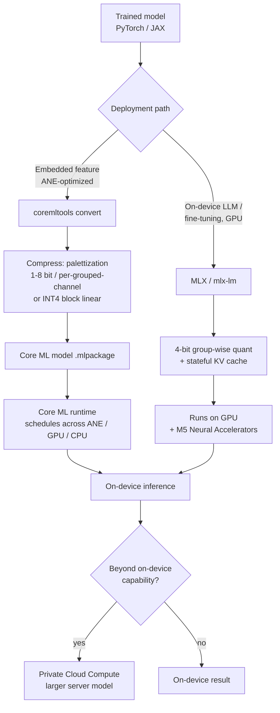

# 08. Apple Roadmap

> **Section scope.** Apple's quantization and on-device-AI stack: the Neural Engine
> (ANE) evolution from the A11 to the M5, the Core ML quantization tooling
> (palettization, linear/block-wise quantization, joint compression), the MLX
> framework, and the on-device LLM strategy embodied in Apple Intelligence.
> **Confidence note:** Apple discloses less about its silicon internals than most
> vendors — TOPS figures are vendor-claimed and not independently verified, and the
> ANE's exact supported numeric formats are largely inferred from Core ML Tools
> documentation rather than published datasheets. Claims below are flagged
> accordingly.

## Apple's distinguishing strategy: own the whole stack

Apple is unique among the players in this database in controlling the entire stack from
silicon to shipping application: it designs the Neural Engine, the Core ML compiler and
runtime, the MLX framework, the operating system, and the on-device models (Apple
Intelligence) that run on all of it. This vertical integration is the defining fact of
Apple's quantization story. Where Qualcomm or MediaTek must expose their NPU through an
SDK to third-party developers who bring their own models, Apple co-designs its
quantization tooling with the specific models it ships, and can tune the ANE, the
compiler, and the model together. The consequence is a quantization stack optimized for
Apple's own use cases (on-device foundation models, image processing, computational
photography) and exposed to developers through Core ML at a higher level of abstraction
than the low-level NPU SDKs of competitors — Apple hides the ANE's internals and asks
developers to trust the compiler to map their quantized Core ML model onto the best
available compute unit (ANE, GPU, or CPU).

This strategy has a cost in transparency: Apple publishes little about the ANE's
microarchitecture, its exact supported precisions, or verified performance, which is why
this section carries more confidence flags than the others. What is observable is the
tooling (Core ML Tools is open source and well-documented), the shipping behavior (what
Apple Intelligence actually does on-device), and the vendor-claimed specifications.

## The Neural Engine evolution

The Apple Neural Engine debuted in the **A11 Bionic** (2017) with two cores and a
vendor-claimed 0.6 TOPS, initially used for Face ID and photography features. It has grown
across every generation since, reaching 16 cores with the A14/M1 (2020) and rising in
throughput through the A17 Pro, A18, A19, and the M-series to the M5 (2025).

The throughput growth (vendor TOPS, not independently verified) shows the ANE's steady
scaling, with the A17 Pro (2023) marking a notable jump to ~35 TOPS that coincided with
Apple's on-device generative-AI push, and the M-series (M4, M5) pushing higher for the
Mac's larger thermal budget. The important caveats: these TOPS are vendor-claimed and
conflate precision and utilization (Section 04's spec-sheet warning applies fully), and
the *architecturally* significant changes are not always visible in the TOPS number — the
M5's introduction of **Neural Accelerators inside each GPU core** (2025) is a more
consequential shift for LLM workloads than a TOPS increment, because it brings
matrix-multiply acceleration to the GPU where much on-device LLM work (via MLX) actually
runs.

| ANE / chip generation | Year | NE cores | Vendor TOPS ⚠️ | Precision (inferred) | Notes |
|---|---|---|---|---|---|
| A11 | 2017 | 2 | 0.6 | ~FP16/INT8 | First ANE; Face ID, photos |
| A12 | 2018 | 8 | 5 | INT8/FP16 | 8-core NE |
| A13 | 2019 | 8 | 6 | INT8/FP16 | Faster NE |
| A14 / M1 | 2020 | 16 | 11 | INT8/FP16 | 16-core; M1 brings ANE to Mac |
| A15 | 2021 | 16 | 15.8 | INT8/FP16 | — |
| A16 | 2022 | 16 | 17 | INT8/FP16 | — |
| A17 Pro / M3 | 2023 | 16 | 35 / 18 | INT8/FP16 | On-device genAI push |
| A18 / M4 | 2024 | 16 | 35 / 38 | INT8/FP16 (INT4 via Core ML) | Apple Intelligence launch silicon |
| A19 / M5 | 2025 | 16 | ~40 / ~45 | INT8/FP16; M5 GPU neural accel | M5 GPU matrix acceleration ⚠️ |

Legend: ⚠️ vendor-claimed / inferred; Apple does not publish the ANE's exact numeric-format
support, so precision columns are inferred from Core ML Tools capabilities and shipping
behavior, not datasheets.

## Core ML quantization tooling

Apple's quantization capabilities are exposed through **Core ML Tools (coremltools)**, the
open-source library that converts and optimizes models for Apple silicon. Its compression
capabilities have grown substantially, and understanding them is the practical core of
Apple's quantization story. There are three families of weight compression, which can be
combined:

- **Linear quantization** — standard affine integer quantization (Section 03), supporting
  8-bit and, since iOS 18 / macOS Sequoia (2024), **4-bit block-wise** weight quantization.
  Block-wise (per-group) INT4 is the mechanism that makes 4-bit LLM weights viable, and
  Apple's documentation notes it works especially well for models running on the **GPU**
  (via MLX or Core ML's GPU path).
- **Palettization (weight clustering)** — Apple's distinctive approach, in which weights are
  clustered (k-means) into a small codebook (lookup table) of centroids, and each weight is
  stored as an index into the table. Palettization supports 1- to 8-bit (the index width),
  and since iOS 18 a **per-grouped-channel** mode normalizes weights per output-channel
  group before palettizing, improving accuracy. Palettization is the non-uniform,
  codebook-style quantization of Section 04, and Apple's guidance is that it typically works
  **best on the Neural Engine** for runtime-memory and latency gains — a notable point,
  suggesting the ANE is optimized for lookup-table-style weight decode rather than (or in
  addition to) uniform integer.
- **Pruning / sparsity** — Core ML supports weight sparsity, which composes with the above
  for **joint compression** (e.g. palettized + sparse).

The palettization-vs-linear-quantization split maps onto Apple's compute units: **INT4
block-wise linear quantization for the GPU, palettization for the ANE** is the rough
guidance, reflecting that the two engines have different native strengths. This is a
concrete instance of the co-design theme — the quantization scheme is chosen to match the
target compute unit within Apple's own silicon. Core ML Tools also supports **activation
quantization** and **calibration-based (data-informed) and training-time (QAT-style)**
compression workflows, and — important for LLMs — a **stateful KV cache** (since 2024) that
lets Core ML reuse the attention cache across decoding steps rather than recomputing or
recopying it.

## MLX: the on-device LLM framework

**MLX** (introduced 2023) is Apple's open-source array framework for machine learning on
Apple silicon, designed from the ground up for the unified-memory architecture (where CPU,
GPU, and ANE share memory, avoiding copies). MLX has become the preferred path for running
and *fine-tuning* LLMs on Apple hardware, with native support for low-bit quantization
(4-bit and lower weight quantization, group-wise) and a growing ecosystem (`mlx-lm` for
language models). MLX matters to the quantization story for several reasons: it exposes
quantization directly to developers at the framework level (more flexibly than Core ML's
compile-and-run model), it runs primarily on the **GPU** (and, with the M5, the GPU's new
Neural Accelerators), and it supports on-device *training* and fine-tuning, enabling the
QLoRA-style on-device personalization of Section 05. Apple's own research (e.g. exploring
LLMs with MLX on the M5) demonstrates 4-bit quantized models (Qwen, GPT-OSS-class) and MoE
models running on-device via MLX, signaling that MLX + GPU is Apple's high-performance
on-device LLM path, complementary to Core ML + ANE for embedded model features.

## Apple Intelligence: quantization in a shipping product

**Apple Intelligence** (announced 2024) is the clearest window into Apple's applied
quantization, because it is a mass-deployed on-device LLM system. Its architecture uses an
on-device foundation model of roughly **3 billion parameters**, quantized for on-device
execution, paired with a larger server model (running on **Private Cloud Compute**) for
harder tasks. The on-device model uses aggressive weight quantization (Apple has described
a mixed low-bit scheme — on the order of ~3.5–4 bits per weight average via a combination of
palettization and low-bit quantization ⚠️, exact scheme partially disclosed) with
**task-specific LoRA adapters** loaded on demand: the base quantized model is frozen, and
small adapters specialize it for individual features (summarization, writing tools, etc.),
which is exactly the quantized-base-plus-adapters pattern of Section 05 deployed at scale.
This design is a template for on-device generative AI: a small, heavily-quantized foundation
model kept resident in memory, specialized by swappable adapters, with a cloud fallback for
capability beyond the on-device model's reach. The quantization is what makes the ~3B model
fit and run within a phone's memory and power budget; without it, the on-device tier would
not exist.

## The Apple deployment pipeline

The two paths — Core ML (for embedded model features, ANE-optimized) and MLX (for
high-performance on-device LLMs, GPU-optimized) — are shown below.

## Precision support: what is known and inferred

Apple's non-disclosure makes a precise precision-support table impossible, but the tooling
and shipping behavior support the following inferences (all appropriately flagged):

| Capability | Status | Confidence basis |
|---|---|---|
| INT8 weight+activation (Core ML) | 🟢 production | Core ML Tools docs, long-shipping |
| Weight palettization 1–8 bit | 🟢 production | Core ML Tools docs |
| Per-grouped-channel palettization | 🟢 production (iOS 18+) | Core ML Tools docs |
| INT4 block-wise weight quant | 🟢 production (iOS 18+) | Core ML Tools docs; GPU-favored |
| Stateful KV-cache quantization | 🟢 production (2024+) | Core ML Tools / research |
| MLX 4-bit group-wise quant | 🟢 production | MLX open source |
| FP8 on ANE/GPU | 🟡 unclear | Not documented; inferred possible ⚠️ |
| INT2 / sub-4-bit native | 🔴 not documented | No evidence of native support |
| ANE exact numeric formats | ⚠️ undisclosed | Inferred from tooling only |

The honest summary: Apple demonstrably supports the production-relevant schemes (INT8, 4-bit
weight-only via linear or palettization, KV-cache quantization) through excellent tooling,
but the low-level details (exact ANE datapaths, FP8 support, sub-4-bit) are undisclosed, and
any claim about them is inference, not fact. This opacity is a genuine limitation for
developers who need to reason about performance, and it is a deliberate strategic choice —
Apple asks developers to target the abstraction (Core ML) and trust the compiler.

## Strengths, gaps, and outlook

**Strengths.** Apple's whole-stack control yields a tightly co-designed quantization
experience: Core ML Tools is mature and well-documented, palettization is a distinctive and
effective non-uniform approach well-matched to the ANE, MLX is a strong on-device LLM and
fine-tuning path, and Apple Intelligence proves the stack works at mass scale. The
unified-memory architecture is a real advantage for on-device LLMs (no CPU-GPU-ANE copies),
and Apple ships the models, so its quantization is validated end-to-end in products used by
hundreds of millions.

**Gaps.** The transparency deficit is the main one — developers cannot fully reason about
ANE precision support or verify performance claims. Apple also lags the flagship Android
SoCs on *disclosed* aggressive-format support (no public INT2 or FP4 story comparable to
Qualcomm's), though whether this reflects a real capability gap or just non-disclosure is
unknown. And the ANE-vs-GPU split (palettization for ANE, INT4 linear for GPU, MLX on GPU)
adds complexity — the best path depends on the model and compute unit.

**Outlook (speculative ⚠️).** The M5's GPU Neural Accelerators signal Apple investing in
GPU-side matrix acceleration for LLMs, complementing the ANE; expect continued growth of MLX
as the on-device LLM path, deeper on-device model quantization for Apple Intelligence, and
probable adoption of lower-bit and possibly low-FP formats as the industry converges on them
— but Apple's roadmap is unusually opaque, so forward claims carry low confidence. The
strategic direction is clear even if the technical specifics are not: Apple is committed to
on-device AI, quantization is central to it, and the whole-stack co-design is Apple's
durable advantage.

## Master database contributions

This section contributes the following entities to the master database (Section 16): Apple
(chipmaker, ANE), Core ML / coremltools (framework), MLX (framework), and Apple Intelligence
(on-device model system) — see the consolidated table in Section 16.

---

*Next: [09 — Qualcomm Roadmap](./09-qualcomm.md).*
