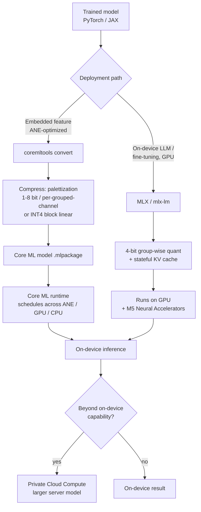

# 08. Apple Roadmap

> **Section scope.** Apple's quantization and on-device-AI stack: the Neural Engine
> (ANE) evolution from the A11 to the M5, the Core ML quantization tooling
> (palettization, linear/block-wise quantization, joint compression), the MLX
> framework, and the on-device LLM strategy embodied in Apple Intelligence.
> **Confidence note:** Apple discloses less about its silicon internals than most
> vendors — TOPS figures are vendor-claimed and not independently verified, and the
> ANE's exact supported numeric formats are largely inferred from Core ML Tools
> documentation rather than published datasheets. Claims below are flagged
> accordingly.

## Apple's distinguishing strategy: own the whole stack

Apple is unique among the players in this database in controlling the entire stack from
silicon to shipping application: it designs the Neural Engine, the Core ML compiler and
runtime, the MLX framework, the operating system, and the on-device models (Apple
Intelligence) that run on all of it. This vertical integration is the defining fact of
Apple's quantization story. Where Qualcomm or MediaTek must expose their NPU through an
SDK to third-party developers who bring their own models, Apple co-designs its
quantization tooling with the specific models it ships, and can tune the ANE, the
compiler, and the model together. The consequence is a quantization stack optimized for
Apple's own use cases (on-device foundation models, image processing, computational
photography) and exposed to developers through Core ML at a higher level of abstraction
than the low-level NPU SDKs of competitors — Apple hides the ANE's internals and asks
developers to trust the compiler to map their quantized Core ML model onto the best
available compute unit (ANE, GPU, or CPU).

This strategy has a cost in transparency: Apple publishes little about the ANE's
microarchitecture, its exact supported precisions, or verified performance, which is why
this section carries more confidence flags than the others. What is observable is the
tooling (Core ML Tools is open source and well-documented), the shipping behavior (what
Apple Intelligence actually does on-device), and the vendor-claimed specifications.

## The Neural Engine evolution

The Apple Neural Engine debuted in the **A11 Bionic** (2017) with two cores and a
vendor-claimed 0.6 TOPS, initially used for Face ID and photography features. It has grown
across every generation since, reaching 16 cores with the A14/M1 (2020) and rising in
throughput through the A17 Pro, A18, A19, and the M-series to the M5 (2025).

The throughput growth (vendor TOPS, not independently verified) shows the ANE's steady
scaling, with the A17 Pro (2023) marking a notable jump to ~35 TOPS that coincided with
Apple's on-device generative-AI push, and the M-series (M4, M5) pushing higher for the
Mac's larger thermal budget. The important caveats: these TOPS are vendor-claimed and
conflate precision and utilization (Section 04's spec-sheet warning applies fully), and
the *architecturally* significant changes are not always visible in the TOPS number — the
M5's introduction of **Neural Accelerators inside each GPU core** (2025) is a more
consequential shift for LLM workloads than a TOPS increment, because it brings
matrix-multiply acceleration to the GPU where much on-device LLM work (via MLX) actually
runs.

| ANE / chip generation | Year | NE cores | Vendor TOPS ⚠️ | Precision (inferred) | Notes |
|---|---|---|---|---|---|
| A11 | 2017 | 2 | 0.6 | ~FP16/INT8 | First ANE; Face ID, photos |
| A12 | 2018 | 8 | 5 | INT8/FP16 | 8-core NE |
| A13 | 2019 | 8 | 6 | INT8/FP16 | Faster NE |
| A14 / M1 | 2020 | 16 | 11 | INT8/FP16 | 16-core; M1 brings ANE to Mac |
| A15 | 2021 | 16 | 15.8 | INT8/FP16 | — |
| A16 | 2022 | 16 | 17 | INT8/FP16 | — |
| A17 Pro / M3 | 2023 | 16 | 35 / 18 | INT8/FP16 | On-device genAI push |
| A18 / M4 | 2024 | 16 | 35 / 38 | INT8/FP16 (INT4 via Core ML) | Apple Intelligence launch silicon |
| A19 / M5 | 2025 | 16 | ~40 / ~45 | INT8/FP16; M5 GPU neural accel | M5 GPU matrix acceleration ⚠️ |

Legend: ⚠️ vendor-claimed / inferred; Apple does not publish the ANE's exact numeric-format
support, so precision columns are inferred from Core ML Tools capabilities and shipping
behavior, not datasheets.

## Core ML quantization tooling

Apple's quantization capabilities are exposed through **Core ML Tools (coremltools)**, the
open-source library that converts and optimizes models for Apple silicon. Its compression
capabilities have grown substantially, and understanding them is the practical core of
Apple's quantization story. There are three families of weight compression, which can be
combined:

- **Linear quantization** — standard affine integer quantization (Section 03), supporting
  8-bit and, since iOS 18 / macOS Sequoia (2024), **4-bit block-wise** weight quantization.
  Block-wise (per-group) INT4 is the mechanism that makes 4-bit LLM weights viable, and
  Apple's documentation notes it works especially well for models running on the **GPU**
  (via MLX or Core ML's GPU path).
- **Palettization (weight clustering)** — Apple's distinctive approach, in which weights are
  clustered (k-means) into a small codebook (lookup table) of centroids, and each weight is
  stored as an index into the table. Palettization supports 1- to 8-bit (the index width),
  and since iOS 18 a **per-grouped-channel** mode normalizes weights per output-channel
  group before palettizing, improving accuracy. Palettization is the non-uniform,
  codebook-style quantization of Section 04, and Apple's guidance is that it typically works
  **best on the Neural Engine** for runtime-memory and latency gains — a notable point,
  suggesting the ANE is optimized for lookup-table-style weight decode rather than (or in
  addition to) uniform integer.
- **Pruning / sparsity** — Core ML supports weight sparsity, which composes with the above
  for **joint compression** (e.g. palettized + sparse).

The palettization-vs-linear-quantization split maps onto Apple's compute units: **INT4
block-wise linear quantization for the GPU, palettization for the ANE** is the rough
guidance, reflecting that the two engines have different native strengths. This is a
concrete instance of the co-design theme — the quantization scheme is chosen to match the
target compute unit within Apple's own silicon. Core ML Tools also supports **activation
quantization** and **calibration-based (data-informed) and training-time (QAT-style)**
compression workflows, and — important for LLMs — a **stateful KV cache** (since 2024) that
lets Core ML reuse the attention cache across decoding steps rather than recomputing or
recopying it.

## MLX: the on-device LLM framework

**MLX** (introduced 2023) is Apple's open-source array framework for machine learning on
Apple silicon, designed from the ground up for the unified-memory architecture (where CPU,
GPU, and ANE share memory, avoiding copies). MLX has become the preferred path for running
and *fine-tuning* LLMs on Apple hardware, with native support for low-bit quantization
(4-bit and lower weight quantization, group-wise) and a growing ecosystem (`mlx-lm` for
language models). MLX matters to the quantization story for several reasons: it exposes
quantization directly to developers at the framework level (more flexibly than Core ML's
compile-and-run model), it runs primarily on the **GPU** (and, with the M5, the GPU's new
Neural Accelerators), and it supports on-device *training* and fine-tuning, enabling the
QLoRA-style on-device personalization of Section 05. Apple's own research (e.g. exploring
LLMs with MLX on the M5) demonstrates 4-bit quantized models (Qwen, GPT-OSS-class) and MoE
models running on-device via MLX, signaling that MLX + GPU is Apple's high-performance
on-device LLM path, complementary to Core ML + ANE for embedded model features.

## Apple Intelligence: quantization in a shipping product

**Apple Intelligence** (announced 2024) is the clearest window into Apple's applied
quantization, because it is a mass-deployed on-device LLM system. Its architecture uses an
on-device foundation model of roughly **3 billion parameters**, quantized for on-device
execution, paired with a larger server model (running on **Private Cloud Compute**) for
harder tasks. The on-device model uses aggressive weight quantization (Apple has described
a mixed low-bit scheme — on the order of ~3.5–4 bits per weight average via a combination of
palettization and low-bit quantization ⚠️, exact scheme partially disclosed) with
**task-specific LoRA adapters** loaded on demand: the base quantized model is frozen, and
small adapters specialize it for individual features (summarization, writing tools, etc.),
which is exactly the quantized-base-plus-adapters pattern of Section 05 deployed at scale.
This design is a template for on-device generative AI: a small, heavily-quantized foundation
model kept resident in memory, specialized by swappable adapters, with a cloud fallback for
capability beyond the on-device model's reach. The quantization is what makes the ~3B model
fit and run within a phone's memory and power budget; without it, the on-device tier would
not exist.

## The Apple deployment pipeline

The two paths — Core ML (for embedded model features, ANE-optimized) and MLX (for
high-performance on-device LLMs, GPU-optimized) — are shown below.

## Precision support: what is known and inferred

Apple's non-disclosure makes a precise precision-support table impossible, but the tooling
and shipping behavior support the following inferences (all appropriately flagged):

| Capability | Status | Confidence basis |
|---|---|---|
| INT8 weight+activation (Core ML) | 🟢 production | Core ML Tools docs, long-shipping |
| Weight palettization 1–8 bit | 🟢 production | Core ML Tools docs |
| Per-grouped-channel palettization | 🟢 production (iOS 18+) | Core ML Tools docs |
| INT4 block-wise weight quant | 🟢 production (iOS 18+) | Core ML Tools docs; GPU-favored |
| Stateful KV-cache quantization | 🟢 production (2024+) | Core ML Tools / research |
| MLX 4-bit group-wise quant | 🟢 production | MLX open source |
| FP8 on ANE/GPU | 🟡 unclear | Not documented; inferred possible ⚠️ |
| INT2 / sub-4-bit native | 🔴 not documented | No evidence of native support |
| ANE exact numeric formats | ⚠️ undisclosed | Inferred from tooling only |

The honest summary: Apple demonstrably supports the production-relevant schemes (INT8, 4-bit
weight-only via linear or palettization, KV-cache quantization) through excellent tooling,
but the low-level details (exact ANE datapaths, FP8 support, sub-4-bit) are undisclosed, and
any claim about them is inference, not fact. This opacity is a genuine limitation for
developers who need to reason about performance, and it is a deliberate strategic choice —
Apple asks developers to target the abstraction (Core ML) and trust the compiler.

## Strengths, gaps, and outlook

**Strengths.** Apple's whole-stack control yields a tightly co-designed quantization
experience: Core ML Tools is mature and well-documented, palettization is a distinctive and
effective non-uniform approach well-matched to the ANE, MLX is a strong on-device LLM and
fine-tuning path, and Apple Intelligence proves the stack works at mass scale. The
unified-memory architecture is a real advantage for on-device LLMs (no CPU-GPU-ANE copies),
and Apple ships the models, so its quantization is validated end-to-end in products used by
hundreds of millions.

**Gaps.** The transparency deficit is the main one — developers cannot fully reason about
ANE precision support or verify performance claims. Apple also lags the flagship Android
SoCs on *disclosed* aggressive-format support (no public INT2 or FP4 story comparable to
Qualcomm's), though whether this reflects a real capability gap or just non-disclosure is
unknown. And the ANE-vs-GPU split (palettization for ANE, INT4 linear for GPU, MLX on GPU)
adds complexity — the best path depends on the model and compute unit.

**Outlook (speculative ⚠️).** The M5's GPU Neural Accelerators signal Apple investing in
GPU-side matrix acceleration for LLMs, complementing the ANE; expect continued growth of MLX
as the on-device LLM path, deeper on-device model quantization for Apple Intelligence, and
probable adoption of lower-bit and possibly low-FP formats as the industry converges on them
— but Apple's roadmap is unusually opaque, so forward claims carry low confidence. The
strategic direction is clear even if the technical specifics are not: Apple is committed to
on-device AI, quantization is central to it, and the whole-stack co-design is Apple's
durable advantage.

## The ANE architecture and its quantization implications

Although Apple does not publish the ANE's microarchitecture, enough is known from research
(including independent reverse-engineering work and Apple's own developer guidance) to
characterize its quantization-relevant properties. The ANE is a matrix-multiply accelerator
optimized for the convolution and (increasingly) transformer operations of Apple's
workloads, designed above all for **energy efficiency** — it exists to run neural workloads
at a fraction of the power the GPU would use, which is why Apple routes on-device features to
it. Its design favors specific data layouts and operation shapes, and models must be
structured to match (Apple's research on "Deploying Transformers on the Apple Neural Engine"
details how to restructure attention to run efficiently on the ANE, using a specific
principle of splitting operations to match the ANE's preferred tensor shapes). The
quantization implication is that the ANE's efficiency is maximized when the model uses the
compression schemes the ANE decodes cheaply — which Apple's guidance indicates is
**palettization** (lookup-table decode) rather than, or alongside, uniform integer. This is
an unusually strong signal that Apple's silicon is co-designed with a *non-uniform*
(codebook) quantization approach, distinguishing it from the integer-centric NPUs of the
Android ecosystem, and it reflects the Deep-Compression/codebook lineage of Section 04
embedded in hardware.

The ANE also imposes constraints developers must respect: it handles some operations
natively and falls back to GPU/CPU for others (Section 06's heterogeneous-execution
reality), it prefers static shapes, and its performance is sensitive to the model structure.
Apple's **Core ML performance tools** (and the internal "Talaria" tooling Apple has described
for analyzing on-device model latency and power) help developers understand where a model
runs and why, but the fundamental opacity remains — developers optimize by measurement and
by following Apple's guidance rather than by reasoning from a published spec. For
quantization specifically, this means the practical workflow is to try the recommended
schemes (palettization for ANE, INT4 linear for GPU), measure on-device, and iterate — the
co-design loop, conducted through a somewhat opaque interface.

## The ANE generation history in detail

Each ANE generation added capability aligned with Apple's evolving on-device ambitions. The
**A11 (2017)** ANE was narrow — two cores, dedicated to Face ID and photography — and did not
expose to third-party developers initially. The **A12 (2018)** opened the ANE to Core ML
developers and jumped to eight cores, making on-device inference broadly available. The
**A14/M1 (2020)** reached sixteen cores and, crucially, brought the ANE to the Mac,
unifying the compute story across Apple's product lines. The **A17 Pro (2023)** roughly
doubled throughput to ~35 TOPS, arriving just as on-device generative AI became a strategic
priority, and its successors (A18/M4, 2024) were the launch silicon for Apple Intelligence —
the generation where the ANE's throughput and the Core ML quantization tooling (INT4
block-wise, per-grouped-channel palettization, stateful KV cache, all landing in
iOS 18/macOS Sequoia) came together to make a ~3B on-device LLM viable. The **M5 (2025)**
marked a strategic addition on the *GPU* side — Neural Accelerators within each GPU core —
reflecting that high-performance on-device LLM work (via MLX) runs on the GPU, so Apple
brought matrix acceleration there rather than only scaling the ANE. Reading the generation
history, the ANE evolved from a fixed-function photography accelerator into a general
on-device neural engine, and the 2023–2025 period is when Apple's silicon, tooling, and
models converged on on-device generative AI — with quantization (INT4, palettization, KV
cache) as the enabling layer at every step.

## Core ML Tools: the optimization workflow in depth

Core ML Tools' compression capabilities deserve a fuller treatment because they are the
practical interface most developers use. The library organizes compression into a workflow:
a model is converted to Core ML format, then optimized via one or more of quantization,
palettization, and pruning, with a choice of *how much data and training* to invest:

- **Post-training (data-free) compression** — apply palettization or quantization directly to
  the trained weights, no data required. Fastest, lowest accuracy at aggressive settings.
- **Calibration-based (data-informed) compression** — use a small calibration dataset to set
  activation ranges and inform the compression (e.g. choosing palettization centroids or
  quantization scales that minimize error on real data). Better accuracy.
- **Training-time compression (fine-tuning)** — insert the compression into a fine-tuning
  loop (QAT-style, Section 03), letting the weights adapt to the quantization/palettization.
  Best accuracy at aggressive bit-widths, highest cost.

This mirrors the PTQ-to-QAT escalation ladder of Section 03, exposed through a unified API.
Core ML Tools also supports **joint compression** — combining, for example, per-grouped-
channel palettization with sparsity, or quantization with pruning — to stack compression
gains, and it handles **activation quantization** (not just weights) for models where the
compute (not just memory) benefits. For LLMs specifically, the **stateful model** support
(2024) is important: it lets the KV cache persist across Core ML predictions as model state,
avoiding the recomputation and copying that would otherwise make on-device autoregressive
decoding slow. The combination — INT4 or palettized weights, activation quantization where
useful, and a stateful quantized KV cache — is Apple's on-device LLM recipe, and it is
expressible entirely within Core ML Tools, which is why the library is the practical center
of Apple's quantization story.

## MLX in depth

MLX deserves fuller treatment as the increasingly-dominant on-device LLM path. Designed for
Apple silicon's unified memory, MLX avoids the host-device data transfers that frameworks
ported from the discrete-GPU world incur, which matters enormously for LLM inference where
data movement dominates. MLX exposes quantization directly: `mlx.core` supports **group-wise
weight quantization** to 4-bit (and other bit-widths), and the `mlx-lm` package provides
ready quantization and inference of popular LLM architectures, plus **LoRA/QLoRA fine-tuning**
on-device. The framework's design philosophy — lazy computation, composable function
transformations, unified memory — makes it ergonomic for research and for building on-device
LLM applications, and Apple's own machine-learning research group publishes MLX-based work
(including the M5 LLM exploration demonstrating 4-bit Qwen and MoE models on-device). The
strategic reading is that MLX is Apple's answer to llama.cpp and PyTorch for Apple silicon:
a native, unified-memory-optimized framework where quantization is a first-class capability,
targeting the GPU (and M5's GPU Neural Accelerators) for performance. For developers building
on-device LLM features that exceed what Core ML's embedded-model path handles well, MLX is
the high-performance, flexible option, and its growth is a significant part of Apple's
on-device quantization trajectory.

## Apple Intelligence architecture in depth

Apple Intelligence is worth dissecting further as the reference example of production
on-device quantization. Apple has disclosed that the system uses an on-device foundation
model of roughly 3 billion parameters and a larger server-based model, with an orchestration
layer routing requests to the appropriate tier. The on-device model is quantized aggressively
— Apple has described using a mixed-precision scheme averaging in the neighborhood of
3.5–4 bits per weight ⚠️ (combining low-bit palettization with higher precision for sensitive
layers, consistent with the mixed-precision best practices of Sections 03 and 05) — to fit and
run within a phone's memory and power envelope. The distinctive architectural choice is the
**adapter** approach: rather than shipping many specialized models, Apple ships one quantized
base model and a library of small **LoRA adapters**, each specializing the base for a specific
feature (writing tools, summarization, etc.), loaded on demand. This is the quantized-base-
plus-adapters pattern of Section 05 at production scale, and it is memory-efficient (one
resident base, tiny swappable adapters) and update-friendly (adapters can be updated
independently of the base). The **Private Cloud Compute** tier handles requests beyond the
on-device model's capability, with a privacy architecture designed so that even Apple cannot
access the data — a design that makes the on-device tier's capability (and thus its
quantization) strategically important, because maximizing what runs on-device minimizes cloud
dependence. In 2025 Apple also opened access to the on-device foundation model to third-party
developers via a framework, extending the quantized on-device model as a platform capability.
Apple Intelligence is, in short, a large-scale validation of the on-device-quantization thesis:
a heavily-quantized small foundation model, specialized by adapters, is capable enough to power
a mass-market AI feature set, and quantization is what makes it fit.

## Apple's research contributions

Apple's machine-learning research group has made public contributions relevant to quantization
and efficient on-device inference, which both advance the field and signal Apple's priorities.
Beyond the ANE-optimized-transformer work mentioned above, Apple has published on efficient
on-device LLM inference (including the Llama-on-Core-ML work demonstrating INT4 + stateful KV
cache), on the MLX framework and its use for on-device LLMs, and on model-compression and
efficient-architecture techniques. Apple's research tends to be applied — oriented toward what
runs well on Apple silicon — rather than pursuing the aggressive-bit-width frontier that
academic groups chase, consistent with its whole-stack, ship-it product focus. This applied
orientation means Apple is a consumer and integrator of the field's quantization advances
(adopting INT4, KV-cache quantization, adapters) more than a source of novel low-bit
algorithms, and its contribution is in demonstrating how to make these techniques work
reliably at mass-market scale on real silicon — arguably a harder and more impactful problem
than the last accuracy point at 2-bit.

## The unified-memory advantage

A structural advantage worth isolating is Apple's **unified memory architecture (UMA)**, in
which the CPU, GPU, and ANE share a single pool of high-bandwidth memory. For quantized LLM
inference this is significant because it eliminates the copies that a discrete-GPU system pays
when moving data between host and device memory — the model, the KV cache, and the activations
live in one place accessible to all compute units. Combined with quantization (which shrinks
the model to fit comfortably in the shared pool) and the M-series' substantial memory
bandwidth (~150 GB/s on M5 ⚠️, higher on Pro/Max variants), UMA makes Apple silicon a strong
on-device LLM platform: a 4-bit quantized model fits in unified memory, streams at the
bandwidth the memory-bound decode needs, and is accessible to GPU (via MLX), ANE (via Core ML),
and CPU without copies. This is part of why Apple silicon has become a favored platform for
local LLM experimentation (via MLX, llama.cpp's Metal backend, Ollama, and others), and it is
an advantage the discrete-accelerator competitors structurally lack. The interaction of UMA and
quantization is a clean example of hardware and compression co-designing to enable a use case
neither achieves alone.

## Palettization versus linear quantization: the technical tradeoff

Because palettization is Apple's distinctive quantization approach, understanding when it
beats linear (uniform integer) quantization is practically useful. **Palettization**
(codebook/lookup-table, Section 04's non-uniform family) stores a small table of centroid
values and represents each weight by an index; an `n`-bit palettization has `2ⁿ` centroids.
Its advantages: it can place centroids optimally for the weight distribution (better
accuracy-per-bit than uniform for the bell-shaped weights), and — importantly for Apple — the
decode is a table lookup that the ANE handles efficiently. Its disadvantages: the lookup adds
a step, and at higher bit-widths the codebook grows. **Linear quantization** (uniform affine)
has cheaper decode (scale-and-shift) and maps well to the GPU's integer/float units. Apple's
guidance — palettization for the ANE, INT4 block-wise linear for the GPU — reflects that the
two compute units have different decode efficiencies. The choice also depends on the model:
palettization's per-grouped-channel mode (normalizing per output-channel group before
clustering) narrows the accuracy gap to linear per-group quantization, and for very
aggressive compression the codebook approach (like AQLM/QuIP# of Section 05) can retain more
accuracy per bit. In practice, Apple developers targeting the ANE for a memory-and-latency-
sensitive feature reach for palettization, while those running LLMs on the GPU via MLX or
Core ML's GPU path use INT4 linear per-group — and the two can even be mixed across a model.
This dual approach is a distinctive feature of Apple's stack that reflects its heterogeneous
compute units and its codebook-friendly ANE.

## Developer experience: quantizing a model for Apple silicon

The practical developer workflow illustrates Apple's abstraction-first philosophy. A developer
with a PyTorch model converts it with `coremltools`, choosing a compression configuration
(e.g. 4-bit per-grouped-channel palettization, or INT4 block-wise linear quantization),
optionally providing calibration data or a fine-tuning loop for higher accuracy. The output
is a Core ML model that the runtime schedules across ANE, GPU, and CPU automatically — the
developer does not (and largely cannot) explicitly target the ANE; they express the model and
its compression, and the compiler and runtime decide placement. Performance analysis is done
by measurement (Core ML performance reports, Instruments, and the on-device profiling Apple
provides) rather than by reasoning from a spec. For LLMs, the developer might instead use
`mlx-lm`, quantizing to 4-bit group-wise and running on the GPU, with more explicit control.
The experience is higher-level than the Android NPU SDKs (QNN, NeuroPilot) — Apple trades the
low-level control those offer for a simpler abstraction and the promise that the compiler
knows the silicon best. For most developers this is a productivity win; for those needing to
squeeze maximum performance or reason precisely about the hardware, the opacity is a
limitation. The net is a developer experience optimized for Apple's own priorities —
shipping reliable on-device features quickly — rather than for maximal low-level tunability.

## Apple versus the Android SoC approach

Contrasting Apple with the Android SoC vendors (Qualcomm, MediaTek, Samsung, Sections 09–11)
sharpens both. The differences are structural:

| Dimension | Apple | Android SoC vendors (Qualcomm/MediaTek) |
|---|---|---|
| Stack control | Whole stack (silicon → OS → models) | Silicon + SDK; OEMs and app devs bring models |
| Developer interface | High-level (Core ML), compiler-decides placement | Lower-level NPU SDKs (QNN, NeuroPilot) + high-level (LiteRT) |
| Quantization style | Palettization (codebook) + linear; ANE-tuned | Integer-centric (INT4/INT8/INT2), explicit |
| Disclosure | Opaque (ANE internals undisclosed) | More disclosed (published format support) |
| Aggressive formats (disclosed) | INT4, palettization; no public INT2/FP4 | INT2, FP8 disclosed (Qualcomm 2025) |
| On-device model | Ships own (Apple Intelligence ~3B) | OEM/third-party models |
| Memory architecture | Unified (UMA) advantage | Typically shared but less uniformly optimized |

The comparison reveals two philosophies: Apple's **integrated, opaque, ship-the-model**
approach optimizes for a controlled end-to-end experience and leans on codebook quantization
matched to its ANE, while the Android vendors' **open-SDK, disclosed-format, bring-your-model**
approach optimizes for a broad developer and OEM ecosystem and leans on integer quantization
with explicit format support. Neither is strictly better; they reflect different business
models (Apple sells integrated devices; Qualcomm/MediaTek sell silicon to OEMs). For
quantization specifically, Apple's approach means developers work at a higher abstraction and
trust the compiler, while Android developers have more control and more disclosed capability
to target — including more aggressive disclosed formats (INT2, FP8) than Apple publicly
offers, though Apple's non-disclosure means the real capability gap is unknown.

## Beyond LLMs: quantization in vision and computational photography

It is worth remembering that the ANE's original and still-dominant workload is not LLMs but
**vision and computational photography** — the ANE was created for Face ID and photo
processing, and it runs the many neural models behind Apple's camera pipeline (semantic
segmentation, deep fusion, portrait effects, subject isolation), on-device speech (dictation,
Siri), and accessibility features. These vision and audio models are quantized (typically
INT8, increasingly with palettization) and run on the ANE for energy efficiency, executing
continuously or on-demand within tight power budgets. This large, mature, quantized-vision
workload is the foundation on which Apple's on-device-AI capability was built, and it is why
Apple's quantization tooling and ANE were mature before the LLM era arrived — the
computational-photography use case drove years of investment in efficient quantized on-device
inference. The LLM use case (Apple Intelligence) is the newer, more visible layer, but the
quantized-vision substrate is larger by inference volume and equally dependent on the same
Core ML quantization stack. A complete picture of Apple's quantization footprint includes the
billions of daily quantized vision and audio inferences behind the camera and Siri, not just
the on-device LLM.

## Case study: a quantized LLM on an iPhone

To make Apple's stack concrete, consider deploying a ~3B or ~7B LLM on an iPhone, per Apple's
own demonstrated recipe. The model is quantized to INT4 (block-wise linear, group size ~32–128,
with the embedding and output layers kept higher precision), reducing a 7B model from ~14 GB
to ~3.5–4 GB so it fits in the phone's unified memory. A **stateful KV cache** is used so the
attention cache persists across decoding steps as Core ML model state, avoiding recomputation.
The model runs on the GPU (for the compute-heavy path) or is structured for the ANE where the
ANE's efficiency helps, with the runtime scheduling placement. Decode is memory-bound, so the
4-bit weights (a quarter the FP16 traffic) deliver the interactive token rate, and the
unified memory means no copies between compute units. The result is a capable LLM running
entirely on-device, privately, at interactive speed — exactly the Apple Intelligence on-device
tier, or a third-party equivalent built with the same tools. The case illustrates every
element of Apple's quantization story: INT4 weight quantization for the memory win, KV-cache
quantization/statefulness for context, unified memory for copy-free execution, and the Core
ML/MLX tooling that ties it together. It also illustrates the constraint — the model must fit
the memory budget at the chosen bit-width, which for a phone caps the practical on-device
model size, which is why Apple's on-device foundation model is ~3B rather than larger, with the
Private Cloud Compute tier handling what exceeds the on-device envelope.

## On-device personalization and the adapter strategy

Apple's adapter-based architecture points toward a personalization capability that
quantization uniquely enables. Because the base model is quantized and frozen, and behavior
is specialized through small LoRA adapters, the architecture is naturally suited to
**on-device personalization**: adapters can, in principle, be trained or refined on a user's
own data locally (using MLX's on-device fine-tuning), producing a model specialized to the
individual without that data ever leaving the device. This is the on-device-personalization
thesis of Section 05 realized on Apple's stack, and it aligns tightly with Apple's privacy
positioning — a model that adapts to the user while keeping data local is a differentiated
capability that Apple's whole-stack control and quantization-enabled small resident model make
feasible. Whether and how far Apple pushes user-specific on-device adapter training is a
forward question (⚠️ speculative), but the architecture is built for it, and quantization is
the enabler: only because the base model is compressed to fit in memory is there room to also
train and store personal adapters on-device. The adapter approach also solves a deployment
problem — updating one small adapter is far cheaper than reshipping a multi-gigabyte model —
which matters for a platform that must update features across a huge installed base.

## Why on-device AI is strategic for Apple

Apple's heavy investment in quantization and on-device AI is not incidental; it serves several
strategic priorities that explain the whole-stack commitment. **Privacy** is central to
Apple's brand, and on-device inference (enabled by quantization fitting models on the device)
keeps user data local, a genuine differentiator that Private Cloud Compute extends even to the
cloud tier. **Latency and offline capability** — on-device models respond instantly and work
without connectivity, a better user experience for many features. **Cost** — running inference
on the user's device rather than Apple's servers shifts the compute cost to hardware the user
already paid for, avoiding the per-query server cost that cloud-AI competitors bear at scale.
And **differentiation** — Apple's silicon and integration let it offer on-device capabilities
competitors relying on cloud AI cannot match. Quantization is the technical linchpin of all
four: it is what makes capable models fit on the device, and thus what makes the privacy,
latency, cost, and differentiation benefits achievable. This strategic alignment is why Apple's
quantization investment is deep and sustained rather than opportunistic, and why the whole-stack
co-design — silicon, tooling, models — is worth the enormous engineering cost to Apple. For the
competitive landscape, it means Apple is committed to pushing on-device quantization forward as
a matter of strategy, not just engineering convenience.

## Limitations and criticisms

A balanced account notes the genuine limitations of Apple's approach. The **opacity** is the
most-cited: developers and analysts cannot verify Apple's performance claims, cannot reason
precisely about ANE precision support, and must optimize by measurement — a real friction and
a barrier to the kind of open benchmarking that clarifies the Android silicon landscape. The
**abstraction** cuts both ways: convenient for typical developers, constraining for those who
need low-level control (some turn to MLX or llama.cpp precisely to escape Core ML's
compiler-decides-placement model). Apple's **disclosed aggressive-format support lags** the
Android flagships (no public INT2/FP4 story), and while this may reflect non-disclosure rather
than absence, it means Apple cannot be credited with capabilities it does not document. The
**palettization-vs-linear split** and the ANE-vs-GPU placement complexity add real decision
burden. And Apple Intelligence's **on-device model capability**, bounded by what fits in phone
memory even at aggressive quantization, is limited relative to frontier cloud models — the
~3B on-device tier handles many tasks but leans on the server tier for hard ones, so
quantization enables but also bounds the on-device experience. These are not fatal criticisms —
Apple's stack demonstrably works at scale — but they are the honest other side of the
whole-stack, opaque, ship-the-model strategy, and they matter for anyone evaluating Apple's
platform against the more open, more disclosed alternatives.

## A note on verification and reading Apple's numbers

Because this section leans more than others on inferred and vendor-claimed information, a
methodological note is warranted. Apple's TOPS figures should be read with the skepticism
Section 04 prescribed for all vendor throughput claims — they are peak numbers at unspecified
precision and utilization, not comparable across vendors, and Apple does not publish the
measurement methodology. The ANE's precision support is inferred from Core ML Tools
capabilities (which describe what the *tooling* can produce) and from shipping behavior (what
Apple Intelligence demonstrably does), not from a datasheet, so statements like "the ANE
supports INT4" really mean "Core ML can compress to INT4 and target the ANE, and it runs" —
which is what matters practically but is not the same as a documented hardware datapath. Where
this section states a precision or a scheme as production, it is grounded in the open-source
Core ML Tools documentation or Apple's own published research; where it speculates about
undisclosed internals (FP8 support, exact per-weight bit budgets in Apple Intelligence,
future roadmap), it is flagged. This epistemic care is not pedantry: Apple's opacity means the
confident-sounding numbers circulating in coverage of its chips are frequently vendor claims
repeated without verification, and a technical reference must distinguish what is documented
(the tooling, the shipping behavior) from what is asserted (the TOPS, the internals). The
practical guidance for anyone evaluating Apple silicon for quantized deployment is to trust
the tooling documentation and on-device measurement over the spec-sheet TOPS, and to validate
performance and accuracy on the actual target device — the same discipline Section 06 and
Section 07 prescribed, applied with extra force where the vendor discloses least.

## Master database contributions

This section contributes the following entities to the master database (Section 16): Apple
(chipmaker, ANE), Core ML / coremltools (framework), MLX (framework), and Apple Intelligence
(on-device model system) — see the consolidated table in Section 16.

In summary, Apple's quantization story is one of quiet, deep, whole-stack integration: a
Neural Engine that evolved from a photography accelerator into a general on-device neural
engine, a Core ML tooling stack whose distinctive palettization sits alongside conventional
linear and block-wise quantization, an MLX framework that has become the high-performance
on-device LLM path on the unified-memory architecture, and a shipping product — Apple
Intelligence — that validates the entire approach at the scale of hundreds of millions of
devices with a quantized ~3B foundation model specialized by adapters. The defining
characteristics are the codebook-friendly ANE (a hardware bet on non-uniform quantization
unusual among mobile SoCs), the unified-memory advantage for copy-free quantized inference,
and the strategic commitment to on-device AI for privacy, latency, cost, and differentiation
reasons — with the persistent caveat that Apple's opacity means much of the technical detail
is inferred rather than documented, and every performance claim deserves the skepticism a
non-disclosing vendor invites.

---

*Next: [09 — Qualcomm Roadmap](./09-qualcomm.md).*
