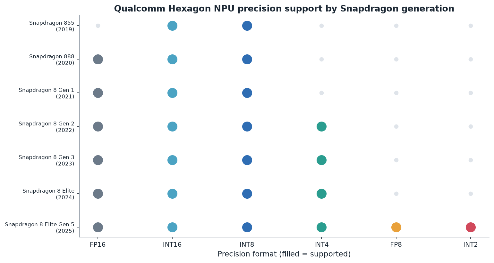
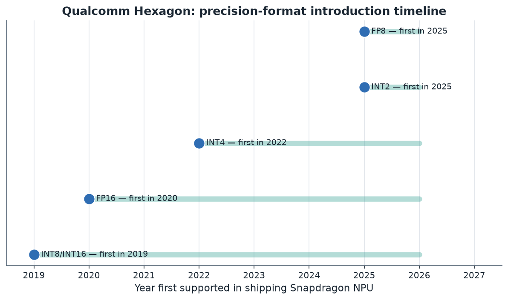
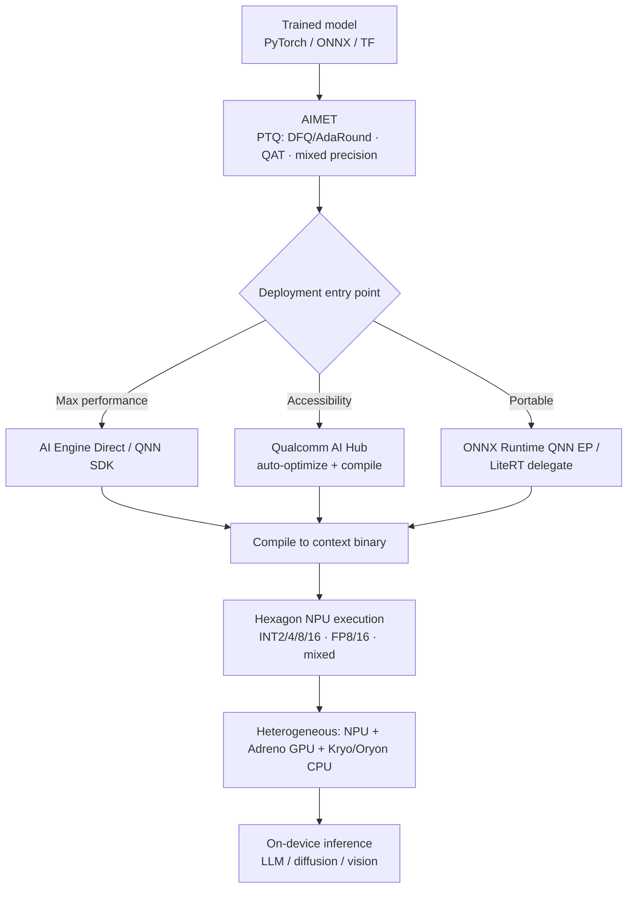

# 09. Qualcomm Roadmap

> **Section scope.** Qualcomm's quantization stack: the Hexagon NPU's evolution from
> a DSP into a generative-AI engine, the AIMET quantization toolkit (and the
> outsized quantization-research contributions of Qualcomm AI Research), the AI
> Engine Direct / QNN SDK and Qualcomm AI Hub, and the Snapdragon platform's
> INT2/INT4/INT8/mixed-precision and FP8 support. Qualcomm is, by the framing of
> Section 01, the **silicon-and-research breadth leader** among mobile SoC vendors —
> and, unusually, also a first-rank *quantization research* contributor.

## Qualcomm's distinguishing position: silicon + research + tooling

Qualcomm occupies a distinctive position because it leads on three axes at once: it ships
the broadest-precision mobile NPU (the Hexagon NPU in the Snapdragon 8 Elite Gen 5 supports
INT2/INT4/INT8/INT16 and FP8/FP16), it maintains a mature quantization toolkit (AIMET) and
deployment SDK (AI Engine Direct/QNN, plus the newer Qualcomm AI Hub), and — the point most
often missed — **Qualcomm AI Research is one of the most influential quantization research
groups in the world**. Several of the foundational techniques of Sections 02–03 originated
there: Data-Free Quantization (Nagel et al.), AdaRound (Nagel et al.), and a long line of
quantization papers came from Qualcomm's research arm. This means Qualcomm's tooling is not
just a wrapper around others' methods; it implements techniques Qualcomm itself invented,
and the silicon is co-designed with deep in-house quantization expertise. Among the vendors
in this database, Qualcomm's combination of silicon breadth, tooling maturity, and original
research is unmatched — Apple ships the models but publishes little research; NVIDIA leads on
tooling but in a different (data-center-adjacent) market; Qualcomm does all three in the
mobile/edge space.

## The Hexagon NPU: from DSP to generative-AI engine

The Hexagon NPU's lineage is the DSP heritage of Section 06 made concrete. Hexagon began as
a **digital signal processor** for modem and audio workloads, using fixed-point (integer)
arithmetic — which predisposed it toward quantized execution from the start. Over successive
Snapdragon generations it accreted AI-specific capabilities: the **HVX (Hexagon Vector
eXtensions)** added wide vector processing, then a dedicated **tensor accelerator** was added
for matrix operations, and the scalar, vector, and tensor units were fused into a unified
NPU. The architecture's evolution tracks the industry's quantization frontier closely.

The precision-support matrix shows the accretion. INT8 and INT16 have been present since the
tensor-accelerator era; FP16 was added around the Snapdragon 888 (2020); **INT4 arrived with
the Snapdragon 8 Gen 2 (2022)**, alongside "micro-tile inferencing" (a technique for
efficiently processing the small tiles of a quantized matmul); the Snapdragon 8 Gen 3 (2023)
was explicitly redesigned for **generative AI** with mixed precision across INT4/INT8/INT16/
FP16, Direct Link, and shared-memory concurrency; and the **Snapdragon 8 Elite Gen 5 (2025)**
added **INT2 and FP8**, reaching the broadest precision support of any shipping mobile NPU
(~80 TOPS vendor-claimed ⚠️).

The format-introduction timeline makes the leadership visible: Qualcomm brought INT4 to mass-
market mobile in 2022 (contemporaneous with the LLM-quantization research wave) and INT2/FP8
in 2025, provisioning silicon for the sub-4-bit and low-FP frontier ahead of broad software
use — the hardware-ahead-of-software pattern of Sections 04 and 06, executed by the breadth
leader.

| Snapdragon platform | Year | NPU precision support | Quantization-relevant advance |
|---|---|---|---|
| Snapdragon 855 (Hexagon 690) | 2019 | INT8, INT16 | Dedicated tensor accelerator |
| Snapdragon 888 (Hexagon 780) | 2020 | INT8, INT16, FP16 | Fused scalar/vector/tensor NPU |
| Snapdragon 8 Gen 1 | 2021 | INT8, INT16, FP16 | Larger NPU |
| Snapdragon 8 Gen 2 | 2022 | **INT4**, INT8, INT16, FP16 | INT4 + micro-tile inferencing |
| Snapdragon 8 Gen 3 | 2023 | INT4, INT8, INT16, FP16 (mixed) | Gen-AI redesign; on-device LLMs/diffusion |
| Snapdragon 8 Elite | 2024 | INT4, INT8, INT16, FP16 | Oryon CPU; larger NPU, agentic focus |
| Snapdragon 8 Elite Gen 5 | 2025 | **INT2**, INT4, INT8, INT16, **FP8**, FP16 | Broadest precision; ~80 TOPS ⚠️ |

Legend: ⚠️ vendor-claimed throughput, not independently verified. Precision support is from
Qualcomm's published platform briefs (higher confidence than Apple's undisclosed internals).

## AIMET: the quantization toolkit

**AIMET (AI Model Efficiency Toolkit)** is Qualcomm's open-source library for quantizing and
compressing models, and it is notable for implementing techniques Qualcomm AI Research
invented. AIMET provides:

- **Post-training quantization (PTQ)** — including Qualcomm's own **Data-Free Quantization**
  (cross-layer equalization + bias correction, Section 03) and **AdaRound** (learned rounding,
  Section 02/03), both originating at Qualcomm AI Research. This is a case where the vendor's
  tooling embeds the vendor's research directly.
- **Quantization-aware training (QAT)** — for recovering accuracy at aggressive bit-widths.
- **Mixed-precision** configuration — assigning per-layer bit-widths, aligned with the
  Hexagon NPU's mixed-precision execution.
- **Compression** — pruning and other techniques composing with quantization.

AIMET is complemented by **AIMET Model Zoo** (pre-quantized reference models) and integrates
with the deployment path (QNN). Its design goal is to let developers find an accurate
quantization configuration for the target Snapdragon NPU quickly, iterating on granularity,
bit-width, and technique. Because AIMET implements the DFQ and AdaRound methods that are also
foundational to the broader field, using AIMET is in effect using the reference
implementations of techniques other tools also adopted — a reflection of Qualcomm's research
depth.

## AI Engine Direct (QNN), Qualcomm AI Hub, and the deployment stack

Deploying a quantized model to a Snapdragon NPU goes through Qualcomm's **AI Engine Direct**
SDK (also called **QNN**, the Qualcomm Neural Network SDK), the low-level interface that
compiles a model to a context binary the Hexagon NPU executes. QNN is the performance path —
lower-level than a portable runtime, giving direct access to the NPU's capabilities, at the
cost of more integration effort. To reduce that effort, Qualcomm introduced **Qualcomm AI
Hub** (2024), a higher-level service that takes a model (from PyTorch, ONNX, etc.), optimizes
and compiles it for a target Snapdragon device, and provides pre-optimized models — lowering
the barrier to on-device deployment. The stack also includes support for standard runtimes
(ONNX Runtime with a QNN execution provider, LiteRF/TFLite delegates) for developers who
prefer a portable entry point. The layered structure — QNN for maximum performance, AI Hub
and standard-runtime delegates for accessibility — mirrors the portability/performance tension
of Section 06, with Qualcomm offering both ends.

## On-device generative AI: what Qualcomm has demonstrated

Qualcomm has been aggressive in demonstrating on-device generative AI as proof of its
quantization stack. It publicly demonstrated **Stable Diffusion running entirely on a
Snapdragon phone** (2023) — a compute-heavy diffusion model quantized (INT8) to run on the
Hexagon NPU — and has shown **multi-billion-parameter LLMs (Llama-class) running on-device**
at interactive speed, quantized to INT4. It has demonstrated larger models (7B, and larger via
the 8 Elite generation) and multimodal models on-device, and has pushed an **"agentic AI"**
framing for the 8 Elite Gen 5 generation. These demonstrations are vendor-produced and their
performance figures are vendor claims (⚠️), but they are meaningful as existence proofs: they
show the Hexagon NPU plus INT4 (and now INT2/FP8) quantization can run the generative
workloads that define current edge AI, and they signal Qualcomm's strategic bet that on-device
generative AI is the differentiator for its silicon. The Stable Diffusion and on-device LLM
demos in particular validated that quantization (INT8 for diffusion, INT4 for LLM weights)
plus a capable NPU makes previously-cloud-only workloads run on a phone.

## Beyond phones: Snapdragon X and the PC push

Qualcomm extended its NPU strategy to laptops with the **Snapdragon X** series (Snapdragon X
Elite/Plus, 2024), bringing a Hexagon NPU (~45 TOPS ⚠️) to Windows **Copilot+ PCs**, which
Microsoft defined with a 40+ TOPS NPU requirement. This put Qualcomm's quantization stack into
the PC market, competing with Intel and AMD (Section 11) for on-device AI PC workloads. The
same quantization tooling (AIMET, QNN, AI Hub) targets these NPUs, and the same INT4/INT8
mixed-precision approach applies. The PC push matters for the quantization landscape because
it extends the mobile-derived, integer-centric, aggressively-quantized NPU approach into a
market historically dominated by x86 CPUs and discrete GPUs, and it makes on-device quantized
LLM inference a mainstream laptop capability. It also broadens the installed base targeting
Qualcomm's quantization schemes, reinforcing INT4 weight-only as a cross-device standard.

## Qualcomm AI Research: an underappreciated quantization powerhouse

The point most worth emphasizing, because it is least appreciated outside the field, is that
**Qualcomm AI Research is a top-tier quantization research group**. Its contributions include
Data-Free Quantization (the cross-layer-equalization + bias-correction method that enables
calibration-free INT8), AdaRound (the learned-rounding method that reframed PTQ as output-error
optimization and seeded GPTQ's lineage), and a sustained output of quantization papers on
mixed precision, transformer quantization, and low-bit methods. This research directly informs
Qualcomm's silicon and tooling — the Hexagon NPU's mixed-precision support and micro-tile
inferencing reflect research-driven understanding of what quantized workloads need, and AIMET
ships the research methods as product features. The strategic significance is a virtuous
loop: research informs silicon design, silicon capabilities inform research directions, and
tooling delivers both to developers. Few vendors have this loop; it is a durable advantage
that keeps Qualcomm at the frontier of mobile quantization, and it is why Qualcomm's
precision-support leadership is not accidental but the output of deep in-house expertise. For
the master database (Section 16), Qualcomm AI Research is a research-lab entity as significant
as any academic group in Section 12.

## Precision support, confidence-flagged

| Capability | Status | Confidence basis |
|---|---|---|
| INT8/INT16 (Hexagon) | 🟢 production | Platform briefs, long-shipping |
| FP16 | 🟢 production | Platform briefs |
| INT4 weight quantization | 🟢 production (since 8 Gen 2) | Platform briefs; demonstrated LLMs |
| Mixed precision (INT4/8/16) | 🟢 production (since 8 Gen 3) | Platform briefs |
| INT2 | 🟡 silicon (8 Elite Gen 5) | Platform brief; software adoption unverified ⚠️ |
| FP8 | 🟡 silicon (8 Elite Gen 5) | Platform brief; software maturity emerging ⚠️ |
| FP4 | ◐ / unclear | Not clearly disclosed for mobile ⚠️ |
| AIMET PTQ (DFQ/AdaRound) | 🟢 production | Open-source AIMET |
| AIMET QAT | 🟢 production | Open-source AIMET |

Qualcomm's disclosure is better than Apple's — platform briefs list precision support
explicitly — so the confidence levels here are generally higher, though the *software adoption*
of the newest formats (INT2, FP8) and their real-world accuracy on production models remain to
be independently demonstrated, hence the flags.

## Strengths, gaps, and outlook

**Strengths.** Broadest disclosed precision support in mobile (INT2 through FP16), mature and
research-backed tooling (AIMET implementing Qualcomm's own DFQ/AdaRound), a layered deployment
stack (QNN for performance, AI Hub for accessibility), demonstrated on-device generative AI
(diffusion and LLMs), extension to the PC market (Snapdragon X / Copilot+), and the unmatched
research-silicon-tooling loop via Qualcomm AI Research. Qualcomm is the mobile quantization
breadth leader on nearly every axis. Crucially, these strengths reinforce one another: the
research produces the techniques, the techniques inform the silicon's precision and execution
design, the silicon's capabilities are exposed through tooling that ships those same techniques,
and the broad OEM installed base makes the resulting schemes de-facto industry targets — a
compounding advantage no competitor fully replicates, and the reason Qualcomm's leadership in
mobile quantization is structural rather than a matter of any single product generation.

**Gaps.** The tooling, while powerful, has a steeper learning curve than the desktop
ecosystems (QNN is lower-level than, say, Core ML's abstraction), which is part of why AI Hub
was created. Vendor performance claims (TOPS, "X% faster") are numerous and not independently
verified (⚠️). And the newest formats (INT2, FP8) are silicon-ahead-of-software — the hardware
supports them but the accuracy-preserving toolchains and real production use lag, as with every
sub-8-bit format across the industry.

**Outlook (partly speculative ⚠️).** Expect continued precision-frontier leadership (likely FP4
and refined INT2 in future generations), deeper AI Hub integration to lower the deployment
barrier, growth in the PC/Copilot+ market, continued on-device generative-AI and agentic
framing, and ongoing quantization research output from Qualcomm AI Research feeding the silicon.
Qualcomm's strategic bet — that on-device generative AI runs on aggressively-quantized models on
a broad-precision NPU — is well-aligned with where the field is going, and its research depth
makes it likely to stay at or near the frontier.

Looking further out, several forces will shape Qualcomm's quantization trajectory. The
industry convergence on the microscaling (MX) formats (Section 04) — which Qualcomm helped
standardize as an OCP participant — suggests future Hexagon generations will likely add native
MXFP4/MXFP8 support, aligning the mobile NPU with the data-center format direction and
simplifying model portability across the edge-cloud boundary. The maturation of rotation methods
and quantization-native training (Section 05) could make the INT2 hardware Qualcomm already ships
genuinely useful, closing the software-lags-silicon gap the 8 Elite Gen 5 currently embodies.
And the agentic-AI framing Qualcomm has adopted implies on-device models that run longer and more
autonomously, intensifying the energy and memory pressures that make quantization essential —
which plays to Qualcomm's strengths. The competitive pressure from MediaTek (Section 10) on
silicon and from Apple on integration will keep Qualcomm investing, and its research arm gives it
the means to respond. The most likely trajectory is continued precision-frontier leadership,
deeper tooling accessibility, broader cross-market reach, and a steady closing of the
silicon-software gap on the aggressive formats it has already provisioned — all anchored by the
research-silicon-tooling loop that is its structural advantage.

## Inside the Hexagon NPU: scalar, vector, tensor, and micro-tile inferencing

The Hexagon NPU's internal structure explains its quantization strengths. It fuses three kinds
of processing unit: **scalar** accelerators (for control and elementwise operations),
**vector** accelerators (the HVX SIMD units, for parallel elementwise and reduction work), and
**tensor** accelerators (for the matrix multiplies that dominate neural networks). The 8 Elite
Gen 5 generation reportedly increased the counts of these units substantially. This
heterogeneous-within-the-NPU design lets the Hexagon handle the mixed operation types of a real
model — the matmuls on the tensor units, the activations and normalizations on the vector
units, control on the scalar units — without offloading to the GPU or CPU, which minimizes the
fallback penalties of Section 06. For quantization specifically, the tensor accelerator's
native support for INT4/INT8/INT16 (and now INT2/FP8) is what turns a quantized model into a
compute speedup rather than just a memory saving.

**Micro-tile inferencing**, introduced with the Snapdragon 8 Gen 2 and refined since, is a
Qualcomm-specific technique worth understanding. It breaks the quantized matmul into small
tiles processed efficiently through the tensor accelerator, improving utilization for the
irregular, memory-bound patterns of generative-AI workloads (where large regular matmuls are
less common than in vision). This is a hardware-software co-design response to the shift from
convolutional vision (large regular matmuls, systolic-array-friendly) to transformer
generative AI (smaller, memory-bound matmuls) — Qualcomm engineered the NPU's execution to
suit the new workload. **Direct Link** (8 Gen 3) and large shared-memory concurrency further
optimize the data movement for on-device LLMs, addressing the memory-bandwidth bottleneck that
Section 06's roofline identified as the binding constraint for LLM decode. These techniques
illustrate that Qualcomm's NPU advantage is not just precision breadth but execution
efficiency tuned for quantized generative workloads — the co-design the whole database keeps
returning to.

## The heterogeneous Snapdragon compute fabric

The Hexagon NPU does not work alone; it is one engine in Snapdragon's heterogeneous compute
fabric, and Qualcomm's framing emphasizes using all of them together. Alongside the NPU sit the
**Adreno GPU** (which can also run neural workloads, and is used for some LLM and graphics-
adjacent AI), the **Kryo** (and newer **Oryon**, from the Nuvia acquisition) **CPU** cores,
and a low-power **Sensing Hub** for always-on workloads. Qualcomm's "heterogeneous computing"
message is that different AI workloads (or different parts of one workload) map best to
different engines: the NPU for sustained, efficient quantized inference; the GPU for parallel
workloads and some LLM paths; the CPU for control and small models; the Sensing Hub for
always-on, ultra-low-power sensing (wake-word, activity detection) where INT8/INT4 tiny models
run continuously within a microwatt-to-milliwatt budget. Quantization is central across the
fabric — the NPU and Sensing Hub are integer-centric by design, and the whole fabric is built
to run quantized models efficiently. For a developer, the runtime and Qualcomm's tooling
handle the partitioning (Section 06's heterogeneous execution), and the goal is to keep the
quantized workload on the efficient NPU/Sensing Hub rather than falling back to the
power-hungry CPU/GPU. This fabric view is how Qualcomm thinks about on-device AI — not as an
NPU in isolation but as a coordinated set of engines, with quantization as the common language
that lets models run efficiently on the integer-optimized ones.

## AIMET workflow in depth

AIMET's practical workflow follows the PTQ-to-QAT escalation of Section 03, exposed through a
PyTorch- and ONNX-friendly API. A typical flow: import the trained model, apply
**cross-layer equalization** and **bias correction** (Qualcomm's DFQ techniques) to make the
model quantization-friendly with no data, then apply **AdaRound** (learned rounding) with a
small calibration set to recover INT4/INT8 accuracy, configure **per-channel** (and per-group)
quantization and **mixed precision** (per-layer bit-widths), simulate the quantized accuracy,
and — if PTQ is insufficient — escalate to **QAT** with fine-tuning. AIMET's quantization
simulation ("QuantSim") lets developers evaluate quantized accuracy before deploying, and its
integration with the QNN deployment path means the AIMET-quantized model targets the Hexagon
NPU's supported schemes. The key practical value is that AIMET's methods are the *reference
implementations* of DFQ and AdaRound — a developer using AIMET is using the techniques'
originators' code, tuned for Qualcomm silicon. AIMET also supports **AIMET ONNX** (for the ONNX
ecosystem) and provides the **AIMET Model Zoo** of pre-quantized models as starting points.
The workflow's alignment with the Hexagon NPU's capabilities (per-channel, per-group, mixed
precision, INT4/INT8) means AIMET quantization maps cleanly to the hardware, avoiding the
scheme-hardware mismatches of Section 06. This tight tool-silicon co-design, backed by the
research that produced the methods, is AIMET's distinguishing strength over generic
quantization toolkits.

## Qualcomm AI Research: the technique lineage in detail

Qualcomm AI Research's quantization contributions deserve enumeration because they are so
central to the field. **Data-Free Quantization** (Nagel, van Baalen, Blankevoort, Welling,
ICCV 2019) introduced cross-layer equalization and bias correction, enabling INT8 quantization
with no calibration data — a foundational PTQ technique now in every toolkit. **AdaRound**
(Nagel et al., ICML 2020) showed that learned per-weight rounding to minimize output error
beats nearest-rounding, reframing PTQ as a local optimization and seeding the lineage that
leads to GPTQ. Qualcomm researchers also contributed to **mixed-precision** methods,
**transformer quantization** analysis (including work on the activation-outlier problem),
**quantization-aware training** advances, and surveys that shaped the field's understanding
(the widely-cited "A White Paper on Neural Network Quantization" came from Qualcomm AI
Research). This body of work means Qualcomm did not merely adopt quantization — it helped
*invent* the modern PTQ toolkit. The strategic consequence is the research-silicon-tooling loop:
the researchers who understand quantization deeply inform how the Hexagon NPU is designed
(what precisions and granularities to support, how to execute them efficiently) and what AIMET
implements. This loop is rare — most silicon vendors consume quantization research rather than
produce it — and it is a durable reason Qualcomm stays at the mobile-quantization frontier.
In the master database, Qualcomm AI Research ranks alongside the academic labs of Section 12 as
a primary source of quantization technique.

## Case study: an INT4 LLM on the Hexagon NPU

To ground the stack, trace a 7B LLM to a Snapdragon phone. The model is quantized with AIMET
to INT4 weight-only (per-channel/per-group, with sensitive layers — embedding, output — kept at
INT8 or FP16, and mixed precision configured for the Hexagon's capabilities). AIMET's QuantSim
validates the accuracy; the model is compiled via QNN (or AI Hub) to a Hexagon context binary.
On-device, the INT4 weights (a quarter the FP16 traffic) let the memory-bound decode run at
interactive speed on the Hexagon NPU, with micro-tile inferencing and Direct Link optimizing
the small memory-bound matmuls, and the KV cache quantized to reduce its memory. The tensor
accelerator executes the INT4 matmuls natively (real compute path, not unpacked emulation),
the vector units handle the normalizations and activations, and the workload stays on the NPU
(avoiding CPU/GPU fallback). The result is a capable on-device LLM — the kind Qualcomm
demonstrates publicly — enabled by the combination of INT4 quantization (memory win), native
INT4 hardware (efficient execution), micro-tile inferencing (utilization on memory-bound
matmuls), and AIMET's accurate quantization (preserving capability). The case shows every
layer of the Qualcomm stack working together, and it is the on-device generative-AI story
Qualcomm's strategy is built around. The same recipe on the Snapdragon 8 Elite Gen 5 could use
INT2 for parts of the model or FP8 for activations, pushing further — though those newer formats'
accuracy on production models remains to be independently demonstrated (⚠️).

## The Qualcomm AI Stack and cross-platform strategy

Qualcomm unifies its tooling under the **Qualcomm AI Stack**, a framework spanning its product
lines — mobile (Snapdragon), PC (Snapdragon X), automotive (Snapdragon Ride), IoT, and XR —
with common tooling (AIMET, QNN/AI Engine Direct, AI Hub) so that a quantization workflow
transfers across targets. This cross-platform strategy matters because it makes Qualcomm's
integer-centric, aggressively-quantized NPU approach a consistent target across a huge range of
devices, from earbuds to cars. For quantization, it means the same AIMET-quantized INT4/INT8
model can, in principle, target Snapdragon silicon across markets, and the same research and
tooling investment amortizes across all of them. The automotive and XR markets in particular
have stringent power and latency constraints that make quantization essential, and Qualcomm's
unified stack extends its mobile-derived quantization expertise into them. The breadth of the
AI Stack is part of why Qualcomm's quantization influence is large — it is not confined to
phones but spans the edge-computing landscape, making Qualcomm's precision choices (INT4, INT2,
FP8) de-facto targets that model authors and tool builders must support to reach Qualcomm's
broad installed base.

## Business context: the OEM model and its quantization implications

A structural difference from Apple worth noting: Qualcomm sells silicon and tooling to OEMs
(Samsung, Xiaomi, and many others) and to app developers, rather than shipping its own devices
and models. This shapes its quantization strategy. Because OEMs and third-party developers bring
their own models, Qualcomm must expose its NPU's capabilities through SDKs (QNN, AIMET, AI Hub)
and support standard formats and runtimes (ONNX, LiteRT) so a broad ecosystem can target its
silicon — hence the emphasis on disclosed precision support, open-source tooling, and
accessibility (AI Hub). This is the opposite of Apple's integrated, opaque, ship-the-model
approach, and it is why Qualcomm discloses more (it must, to enable its ecosystem) and why its
tooling is developer-facing. The OEM model also means Qualcomm's quantization schemes become
industry targets — because so many devices use Snapdragon, supporting Qualcomm's INT4/INT8/INT2
NPU is important for any model author targeting Android, which amplifies Qualcomm's influence on
the practical quantization landscape beyond its own tooling. The business model and the
quantization strategy are thus tightly linked: selling silicon to a broad ecosystem requires
open, disclosed, well-tooled quantization support, which Qualcomm provides, reinforcing its
position as the mobile quantization platform.

## Developer experience and the tooling learning curve

The developer experience on Qualcomm silicon reflects the OEM/ecosystem model: more control
and more disclosure than Apple, but a steeper learning curve. A developer quantizing for
Snapdragon typically uses AIMET to produce an accurately-quantized model (choosing DFQ/AdaRound
PTQ or QAT, configuring granularity and mixed precision), then deploys via QNN (maximum
performance, but a lower-level SDK requiring understanding of the Hexagon execution model) or
via Qualcomm AI Hub (which automates much of the optimization and compilation, lowering the
barrier). The QNN path rewards expertise with performance but demands it; the AI Hub path
trades some control for accessibility, which is precisely why Qualcomm built it — the low-level
SDK's learning curve was a real adoption barrier. Portable entry points (ONNX Runtime's QNN
execution provider, LiteRT delegates) let developers start from familiar tooling at some
performance cost. Compared to Apple's single high-level abstraction (Core ML), Qualcomm offers
a spectrum from low-level control (QNN) to high-level convenience (AI Hub), which suits its
diverse ecosystem of sophisticated OEMs and ordinary app developers but means there is no
single "right" path — the choice depends on the developer's performance needs and expertise.
The tooling maturity is high, but the surface area is larger than Apple's, reflecting the
different business model. For a developer, the practical guidance is: use AIMET for
quantization, start with AI Hub for accessibility, and drop to QNN when maximum performance
justifies the added integration effort.

## Competitive comparison: Qualcomm, Apple, and MediaTek

A direct comparison sharpens Qualcomm's position among the mobile leaders (MediaTek is
Section 10):

| Dimension | Qualcomm | Apple | MediaTek |
|---|---|---|---|
| NPU | Hexagon (DSP-derived) | Neural Engine | APU |
| Disclosed precision breadth | INT2–FP16 + FP8 (broadest) | INT4 + palettization (opaque) | INT4–FP16 + emerging |
| Quantization tooling | AIMET (research-backed) | Core ML Tools | NeuroPilot |
| Quantization research | Top-tier (DFQ, AdaRound) | Applied, less published | Growing |
| Business model | Silicon + SDK to OEMs | Whole-stack, own devices | Silicon + SDK to OEMs |
| Disclosure | High (platform briefs) | Low (opaque ANE) | Medium |
| Deployment accessibility | QNN + AI Hub (spectrum) | Core ML (single abstraction) | NeuroPilot |
| Cross-market stack | AI Stack (mobile→auto→XR) | Apple devices only | Mobile-focused, expanding |

The comparison positions Qualcomm as the **disclosure-and-breadth-and-research leader** among
the three: it supports and discloses more precision formats than Apple, backs its tooling with
original research neither of the others matches, and spans more markets via the AI Stack. Its
relative weakness is the tooling learning curve (addressed by AI Hub) versus Apple's simpler
abstraction. MediaTek (Section 10) competes closely on silicon but with less research depth and
narrower disclosed format leadership. The three-way comparison recurs in Sections 10–11; the
Qualcomm takeaway is breadth plus research depth plus cross-market reach.

## Case study: Stable Diffusion on a Snapdragon phone

Qualcomm's 2023 demonstration of Stable Diffusion running entirely on a Snapdragon phone is
worth dissecting as a quantization achievement. Stable Diffusion is compute-heavy (a large
U-Net run over dozens of denoising steps) and, as Section 03/07 noted, diffusion models are
sensitive to quantization because per-step error compounds over the denoising trajectory.
Qualcomm quantized the model to INT8 (with careful handling to preserve image quality across
steps) and ran it on the Hexagon NPU, generating an image in under a second — a workload
previously requiring a data-center GPU. The achievement illustrates several themes: INT8
quantization (rather than aggressive sub-8-bit) was the right choice for the quantization-
sensitive diffusion model (Section 07's use-case table), the Hexagon NPU's native INT8 compute
provided the throughput (a compute-bound workload, so the compute path mattered, unlike
memory-bound LLM decode), and the co-design of quantization scheme, NPU capability, and model
structure made the previously-impossible possible on a phone. It also demonstrated Qualcomm's
strategy of using headline on-device generative-AI demos to validate its quantization stack.
The performance figures are vendor-produced (⚠️), but the existence proof — a full diffusion
model running on-device via INT8 quantization and the Hexagon NPU — is the meaningful result,
and it presaged the on-device image-generation features that followed across the industry.

## Beyond mobile: automotive, XR, and always-on sensing

Qualcomm's quantization reach extends well beyond phones through the AI Stack, and these markets
have distinctive quantization constraints. **Automotive** (Snapdragon Ride) runs perception and
increasingly generative/assistant models under strict safety, latency, and power constraints,
where quantization is essential but the safety-criticality (Section 07) demands careful,
conservative, well-validated schemes — a domain where the fairness and rare-case-degradation
concerns of Section 07 are acute (a perception model must not degrade on rare-but-critical
objects). **XR (extended reality)** (Snapdragon XR) has extreme power and latency constraints
(all-day wearable, low-latency for comfort), making quantization mandatory for the on-device
vision, tracking, and increasingly AI-assistant workloads. **Always-on sensing** via the
Snapdragon Sensing Hub runs tiny quantized models (INT8/INT4, sometimes lower) continuously for
wake-word, audio, and activity detection within a microwatt-to-milliwatt budget — the tinyML
regime where quantization is existential (the model must fit and run within the power budget or
not exist). Across these markets, the common thread is that quantization is the enabling
technology for on-device AI under tight constraints, and Qualcomm's unified tooling and
broad-precision NPU apply across all of them. This breadth means Qualcomm's quantization
influence spans the edge-computing landscape, and its precision choices propagate across
markets far beyond the phone — reinforcing its role as a de-facto quantization platform for the
edge.

## INT2 and FP8: what the 2025 frontier formats mean

The Snapdragon 8 Elite Gen 5's addition of INT2 and FP8 (2025) is strategically significant
and worth analyzing rather than just noting. **INT2** in a mass-market phone NPU signals that
Qualcomm expects sub-4-bit quantization to matter for on-device models — likely for fitting
larger models (bigger models quantize better at low bits, Section 07) or specific
quantization-native or codebook-quantized models (Section 05). The caveat is severe: as
Section 05 established, general INT2 quantization of normally-trained models is fragile and
needs advanced methods (QuIP#/AQLM codebooks or quantization-native training), so INT2 hardware
support does not mean INT2 is broadly usable — the accuracy-preserving software must catch up,
and whether Qualcomm's tooling exposes accurate INT2 workflows is unverified (⚠️). **FP8**
support is more immediately useful: FP8's outlier-robust range (Section 04) makes it attractive
for *activation* quantization of transformers, potentially enabling W8A8-FP8 compute speedups
on-device for the compute-bound prefill phase, complementing INT4 weight-only for the
memory-bound decode. FP8 also aligns Qualcomm with the data-center direction (NVIDIA, OCP FP8
standard), easing model portability. The honest reading of both: Qualcomm is provisioning
silicon for the sub-8-bit frontier ahead of the software — the recurring pattern — betting that
being early is better than being late given long silicon design cycles. Whether INT2 and FP8
deliver production value on the 8 Elite Gen 5 depends on tooling and model support that will
develop over the generation's life, and until independent low-bit accuracy benchmarks appear,
these capabilities are best treated as forward-looking silicon investments rather than
immediately-cashable features — hence their 🟡 maturity and ⚠️ flags. Their presence, however,
confirms Qualcomm's intent to stay at the precision frontier.

## The Snapdragon X PC push in depth

Qualcomm's entry into Windows laptops with Snapdragon X (2024) deserves fuller treatment
because it extends mobile quantization into a new market with different dynamics. Microsoft's
**Copilot+ PC** specification required a 40+ TOPS NPU, and Qualcomm's Snapdragon X Elite/Plus
(with a Hexagon NPU rated ~45 TOPS ⚠️) was the launch silicon, ahead of Intel and AMD's
qualifying parts. This brought Qualcomm's integer-centric, aggressively-quantized NPU approach —
and its AIMET/QNN/AI Hub tooling — into the PC market. The significance for quantization: PCs
have more memory and power than phones, enabling larger on-device models (7–13B class at
4-bit), but the same quantization principles apply (INT4 weight-only for memory-bound LLM
decode, INT8/FP16 for vision). The Copilot+ features (on-device language and image models) run
on quantized models on the NPU, making quantized on-device inference a mainstream laptop
capability. It also intensified the NPU competition with Intel (OpenVINO, Core Ultra) and AMD
(Ryzen AI), all now shipping 40+ TOPS NPUs for the same Copilot+ target (Section 11). For
Qualcomm, the PC push broadens the installed base targeting its quantization schemes and
validates the mobile-derived NPU approach in a larger-device context. For the ecosystem, it
means INT4 weight-only on-device LLM inference is now a cross-device expectation from phones to
laptops, with Qualcomm a leader in both — reinforcing the 4-bit-weight-only standard the whole
database keeps returning to.

## A note on verification

As with Apple, Qualcomm's performance claims warrant the skepticism Section 04 prescribed.
Qualcomm's TOPS figures (e.g. ~80 TOPS for the 8 Elite Gen 5) and "X% faster / Y% more
efficient" generation-over-generation claims are vendor-produced and rarely accompanied by
independent, reproducible benchmarks — they conflate precision, utilization, and methodology,
and are not comparable across vendors. Qualcomm's on-device generative-AI demos (Stable
Diffusion, on-device LLMs) are real existence proofs but their headline performance numbers are
vendor-measured under favorable conditions. What has higher confidence is the **disclosed
precision support** (platform briefs explicitly list the supported formats, which is more than
Apple provides) and the **tooling** (AIMET is open source and its methods are published). So
this section treats Qualcomm's precision-support claims as reasonably solid (official platform
documentation) while flagging the throughput and speedup claims as vendor assertions, and
flagging the *software maturity and real-world accuracy* of the newest formats (INT2, FP8) as
unverified pending independent benchmarks. The practical guidance mirrors the rest of the
database: trust the disclosed format support and the open tooling, discount the TOPS and
percentage-improvement marketing, and validate performance and accuracy on the actual target
device — the discipline that separates a realistic assessment from a spec-sheet reading.

## The on-device model ecosystem on Snapdragon

Unlike Apple, which ships its own models, Qualcomm cultivates an *ecosystem* of models optimized
for its silicon, and this ecosystem is part of its quantization story. Qualcomm AI Hub provides a
library of pre-optimized, pre-quantized models (vision, speech, and increasingly LLMs) ready to
run on Snapdragon, lowering the barrier for developers who do not want to quantize from scratch.
Qualcomm has worked with model providers to bring popular open models (Llama-class LLMs, Stable
Diffusion, Whisper, and others) to Snapdragon in quantized form, and its demonstrations often
feature these community models to show real-world capability. This ecosystem approach means the
practical quantization work is increasingly done *for* the developer — a pre-quantized model from
AI Hub, validated on Snapdragon, ready to deploy — which is the accessibility play that
complements the low-level QNN control path. For the broader landscape, Qualcomm's optimization of
popular open models for its silicon reinforces the standard quantization schemes (INT4 weight-only,
INT8) and makes Snapdragon a well-supported target for the open-model ecosystem. The combination
of a broad-precision NPU, research-backed tooling, and a growing library of pre-quantized models
is what makes Qualcomm's platform practical for on-device AI at ecosystem scale, not just in
vendor demos.

## Summary

Qualcomm's quantization story is the most complete among the mobile SoC vendors: it leads on
disclosed precision breadth (INT2 through FP16 plus FP8 in the 2025 flagship), it backs its
tooling with original, field-defining research (Data-Free Quantization and AdaRound came from
Qualcomm AI Research), it offers a spectrum of deployment paths from the low-level QNN SDK to the
accessible AI Hub, it has demonstrated the full range of on-device generative AI (diffusion and
LLMs) as existence proofs, and it has extended the whole approach from phones to PCs, automotive,
XR, and always-on sensing via the unified AI Stack. The defining characteristic is the
research-silicon-tooling loop — a rare virtuous cycle in which in-house quantization research
informs NPU design and ships as tooling features — which keeps Qualcomm at the frontier of mobile
quantization. The honest caveats are the tooling learning curve (mitigated by AI Hub), the usual
unverified vendor performance claims, and the software-lags-silicon reality for the newest formats
(INT2, FP8), whose production accuracy remains to be independently demonstrated. But on the core
question of who leads mobile quantization in silicon and tooling, Qualcomm has the strongest
overall case, and its influence — via the huge Snapdragon installed base and its role in defining
the practical precision targets — extends across the entire edge-AI landscape.

## Master database contributions

This section contributes: Qualcomm (chipmaker, Hexagon NPU), AIMET (framework/PTQ+QAT tool),
AI Engine Direct/QNN (framework/compiler), Qualcomm AI Hub (framework), and Qualcomm AI Research
(research-lab) — see Section 16. Note that Qualcomm AI Research appears in both this section and
the academic-landscape section (12), reflecting its unusual dual role as both an industrial
silicon vendor's research arm and a primary source of foundational quantization technique — a
duality that itself illustrates the blurring of the industry-academia boundary that Section 12
develops as a theme, and one of the clearest signals that the most consequential quantization
work now happens where industrial silicon expertise and academic research method meet.

---

*Next: [10 — MediaTek Roadmap](./10-mediatek.md).*
