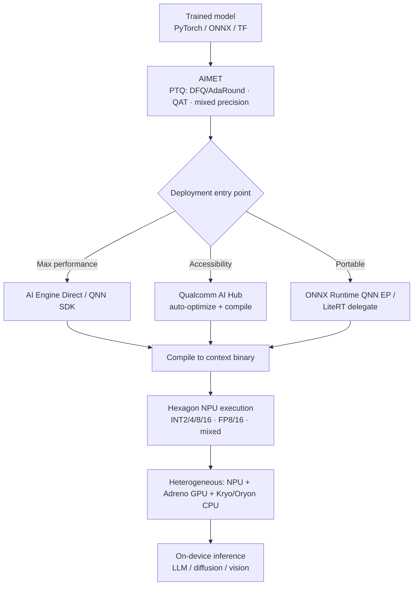

# 09. Qualcomm Roadmap

> **Section scope.** Qualcomm's quantization stack: the Hexagon NPU's evolution from
> a DSP into a generative-AI engine, the AIMET quantization toolkit (and the
> outsized quantization-research contributions of Qualcomm AI Research), the AI
> Engine Direct / QNN SDK and Qualcomm AI Hub, and the Snapdragon platform's
> INT2/INT4/INT8/mixed-precision and FP8 support. Qualcomm is, by the framing of
> Section 01, the **silicon-and-research breadth leader** among mobile SoC vendors —
> and, unusually, also a first-rank *quantization research* contributor.

## Qualcomm's distinguishing position: silicon + research + tooling

Qualcomm occupies a distinctive position because it leads on three axes at once: it ships
the broadest-precision mobile NPU (the Hexagon NPU in the Snapdragon 8 Elite Gen 5 supports
INT2/INT4/INT8/INT16 and FP8/FP16), it maintains a mature quantization toolkit (AIMET) and
deployment SDK (AI Engine Direct/QNN, plus the newer Qualcomm AI Hub), and — the point most
often missed — **Qualcomm AI Research is one of the most influential quantization research
groups in the world**. Several of the foundational techniques of Sections 02–03 originated
there: Data-Free Quantization (Nagel et al.), AdaRound (Nagel et al.), and a long line of
quantization papers came from Qualcomm's research arm. This means Qualcomm's tooling is not
just a wrapper around others' methods; it implements techniques Qualcomm itself invented,
and the silicon is co-designed with deep in-house quantization expertise. Among the vendors
in this database, Qualcomm's combination of silicon breadth, tooling maturity, and original
research is unmatched — Apple ships the models but publishes little research; NVIDIA leads on
tooling but in a different (data-center-adjacent) market; Qualcomm does all three in the
mobile/edge space.

## The Hexagon NPU: from DSP to generative-AI engine

The Hexagon NPU's lineage is the DSP heritage of Section 06 made concrete. Hexagon began as
a **digital signal processor** for modem and audio workloads, using fixed-point (integer)
arithmetic — which predisposed it toward quantized execution from the start. Over successive
Snapdragon generations it accreted AI-specific capabilities: the **HVX (Hexagon Vector
eXtensions)** added wide vector processing, then a dedicated **tensor accelerator** was added
for matrix operations, and the scalar, vector, and tensor units were fused into a unified
NPU. The architecture's evolution tracks the industry's quantization frontier closely.

The precision-support matrix shows the accretion. INT8 and INT16 have been present since the
tensor-accelerator era; FP16 was added around the Snapdragon 888 (2020); **INT4 arrived with
the Snapdragon 8 Gen 2 (2022)**, alongside "micro-tile inferencing" (a technique for
efficiently processing the small tiles of a quantized matmul); the Snapdragon 8 Gen 3 (2023)
was explicitly redesigned for **generative AI** with mixed precision across INT4/INT8/INT16/
FP16, Direct Link, and shared-memory concurrency; and the **Snapdragon 8 Elite Gen 5 (2025)**
added **INT2 and FP8**, reaching the broadest precision support of any shipping mobile NPU
(~80 TOPS vendor-claimed ⚠️).

The format-introduction timeline makes the leadership visible: Qualcomm brought INT4 to mass-
market mobile in 2022 (contemporaneous with the LLM-quantization research wave) and INT2/FP8
in 2025, provisioning silicon for the sub-4-bit and low-FP frontier ahead of broad software
use — the hardware-ahead-of-software pattern of Sections 04 and 06, executed by the breadth
leader.

| Snapdragon platform | Year | NPU precision support | Quantization-relevant advance |
|---|---|---|---|
| Snapdragon 855 (Hexagon 690) | 2019 | INT8, INT16 | Dedicated tensor accelerator |
| Snapdragon 888 (Hexagon 780) | 2020 | INT8, INT16, FP16 | Fused scalar/vector/tensor NPU |
| Snapdragon 8 Gen 1 | 2021 | INT8, INT16, FP16 | Larger NPU |
| Snapdragon 8 Gen 2 | 2022 | **INT4**, INT8, INT16, FP16 | INT4 + micro-tile inferencing |
| Snapdragon 8 Gen 3 | 2023 | INT4, INT8, INT16, FP16 (mixed) | Gen-AI redesign; on-device LLMs/diffusion |
| Snapdragon 8 Elite | 2024 | INT4, INT8, INT16, FP16 | Oryon CPU; larger NPU, agentic focus |
| Snapdragon 8 Elite Gen 5 | 2025 | **INT2**, INT4, INT8, INT16, **FP8**, FP16 | Broadest precision; ~80 TOPS ⚠️ |

Legend: ⚠️ vendor-claimed throughput, not independently verified. Precision support is from
Qualcomm's published platform briefs (higher confidence than Apple's undisclosed internals).

## AIMET: the quantization toolkit

**AIMET (AI Model Efficiency Toolkit)** is Qualcomm's open-source library for quantizing and
compressing models, and it is notable for implementing techniques Qualcomm AI Research
invented. AIMET provides:

- **Post-training quantization (PTQ)** — including Qualcomm's own **Data-Free Quantization**
  (cross-layer equalization + bias correction, Section 03) and **AdaRound** (learned rounding,
  Section 02/03), both originating at Qualcomm AI Research. This is a case where the vendor's
  tooling embeds the vendor's research directly.
- **Quantization-aware training (QAT)** — for recovering accuracy at aggressive bit-widths.
- **Mixed-precision** configuration — assigning per-layer bit-widths, aligned with the
  Hexagon NPU's mixed-precision execution.
- **Compression** — pruning and other techniques composing with quantization.

AIMET is complemented by **AIMET Model Zoo** (pre-quantized reference models) and integrates
with the deployment path (QNN). Its design goal is to let developers find an accurate
quantization configuration for the target Snapdragon NPU quickly, iterating on granularity,
bit-width, and technique. Because AIMET implements the DFQ and AdaRound methods that are also
foundational to the broader field, using AIMET is in effect using the reference
implementations of techniques other tools also adopted — a reflection of Qualcomm's research
depth.

## AI Engine Direct (QNN), Qualcomm AI Hub, and the deployment stack

Deploying a quantized model to a Snapdragon NPU goes through Qualcomm's **AI Engine Direct**
SDK (also called **QNN**, the Qualcomm Neural Network SDK), the low-level interface that
compiles a model to a context binary the Hexagon NPU executes. QNN is the performance path —
lower-level than a portable runtime, giving direct access to the NPU's capabilities, at the
cost of more integration effort. To reduce that effort, Qualcomm introduced **Qualcomm AI
Hub** (2024), a higher-level service that takes a model (from PyTorch, ONNX, etc.), optimizes
and compiles it for a target Snapdragon device, and provides pre-optimized models — lowering
the barrier to on-device deployment. The stack also includes support for standard runtimes
(ONNX Runtime with a QNN execution provider, LiteRF/TFLite delegates) for developers who
prefer a portable entry point. The layered structure — QNN for maximum performance, AI Hub
and standard-runtime delegates for accessibility — mirrors the portability/performance tension
of Section 06, with Qualcomm offering both ends.

## On-device generative AI: what Qualcomm has demonstrated

Qualcomm has been aggressive in demonstrating on-device generative AI as proof of its
quantization stack. It publicly demonstrated **Stable Diffusion running entirely on a
Snapdragon phone** (2023) — a compute-heavy diffusion model quantized (INT8) to run on the
Hexagon NPU — and has shown **multi-billion-parameter LLMs (Llama-class) running on-device**
at interactive speed, quantized to INT4. It has demonstrated larger models (7B, and larger via
the 8 Elite generation) and multimodal models on-device, and has pushed an **"agentic AI"**
framing for the 8 Elite Gen 5 generation. These demonstrations are vendor-produced and their
performance figures are vendor claims (⚠️), but they are meaningful as existence proofs: they
show the Hexagon NPU plus INT4 (and now INT2/FP8) quantization can run the generative
workloads that define current edge AI, and they signal Qualcomm's strategic bet that on-device
generative AI is the differentiator for its silicon. The Stable Diffusion and on-device LLM
demos in particular validated that quantization (INT8 for diffusion, INT4 for LLM weights)
plus a capable NPU makes previously-cloud-only workloads run on a phone.

## Beyond phones: Snapdragon X and the PC push

Qualcomm extended its NPU strategy to laptops with the **Snapdragon X** series (Snapdragon X
Elite/Plus, 2024), bringing a Hexagon NPU (~45 TOPS ⚠️) to Windows **Copilot+ PCs**, which
Microsoft defined with a 40+ TOPS NPU requirement. This put Qualcomm's quantization stack into
the PC market, competing with Intel and AMD (Section 11) for on-device AI PC workloads. The
same quantization tooling (AIMET, QNN, AI Hub) targets these NPUs, and the same INT4/INT8
mixed-precision approach applies. The PC push matters for the quantization landscape because
it extends the mobile-derived, integer-centric, aggressively-quantized NPU approach into a
market historically dominated by x86 CPUs and discrete GPUs, and it makes on-device quantized
LLM inference a mainstream laptop capability. It also broadens the installed base targeting
Qualcomm's quantization schemes, reinforcing INT4 weight-only as a cross-device standard.

## Qualcomm AI Research: an underappreciated quantization powerhouse

The point most worth emphasizing, because it is least appreciated outside the field, is that
**Qualcomm AI Research is a top-tier quantization research group**. Its contributions include
Data-Free Quantization (the cross-layer-equalization + bias-correction method that enables
calibration-free INT8), AdaRound (the learned-rounding method that reframed PTQ as output-error
optimization and seeded GPTQ's lineage), and a sustained output of quantization papers on
mixed precision, transformer quantization, and low-bit methods. This research directly informs
Qualcomm's silicon and tooling — the Hexagon NPU's mixed-precision support and micro-tile
inferencing reflect research-driven understanding of what quantized workloads need, and AIMET
ships the research methods as product features. The strategic significance is a virtuous
loop: research informs silicon design, silicon capabilities inform research directions, and
tooling delivers both to developers. Few vendors have this loop; it is a durable advantage
that keeps Qualcomm at the frontier of mobile quantization, and it is why Qualcomm's
precision-support leadership is not accidental but the output of deep in-house expertise. For
the master database (Section 16), Qualcomm AI Research is a research-lab entity as significant
as any academic group in Section 12.

## Precision support, confidence-flagged

| Capability | Status | Confidence basis |
|---|---|---|
| INT8/INT16 (Hexagon) | 🟢 production | Platform briefs, long-shipping |
| FP16 | 🟢 production | Platform briefs |
| INT4 weight quantization | 🟢 production (since 8 Gen 2) | Platform briefs; demonstrated LLMs |
| Mixed precision (INT4/8/16) | 🟢 production (since 8 Gen 3) | Platform briefs |
| INT2 | 🟡 silicon (8 Elite Gen 5) | Platform brief; software adoption unverified ⚠️ |
| FP8 | 🟡 silicon (8 Elite Gen 5) | Platform brief; software maturity emerging ⚠️ |
| FP4 | ◐ / unclear | Not clearly disclosed for mobile ⚠️ |
| AIMET PTQ (DFQ/AdaRound) | 🟢 production | Open-source AIMET |
| AIMET QAT | 🟢 production | Open-source AIMET |

Qualcomm's disclosure is better than Apple's — platform briefs list precision support
explicitly — so the confidence levels here are generally higher, though the *software adoption*
of the newest formats (INT2, FP8) and their real-world accuracy on production models remain to
be independently demonstrated, hence the flags.

## Strengths, gaps, and outlook

**Strengths.** Broadest disclosed precision support in mobile (INT2 through FP16), mature and
research-backed tooling (AIMET implementing Qualcomm's own DFQ/AdaRound), a layered deployment
stack (QNN for performance, AI Hub for accessibility), demonstrated on-device generative AI
(diffusion and LLMs), extension to the PC market (Snapdragon X / Copilot+), and the unmatched
research-silicon-tooling loop via Qualcomm AI Research. Qualcomm is the mobile quantization
breadth leader on nearly every axis.

**Gaps.** The tooling, while powerful, has a steeper learning curve than the desktop
ecosystems (QNN is lower-level than, say, Core ML's abstraction), which is part of why AI Hub
was created. Vendor performance claims (TOPS, "X% faster") are numerous and not independently
verified (⚠️). And the newest formats (INT2, FP8) are silicon-ahead-of-software — the hardware
supports them but the accuracy-preserving toolchains and real production use lag, as with every
sub-8-bit format across the industry.

**Outlook (partly speculative ⚠️).** Expect continued precision-frontier leadership (likely FP4
and refined INT2 in future generations), deeper AI Hub integration to lower the deployment
barrier, growth in the PC/Copilot+ market, continued on-device generative-AI and agentic
framing, and ongoing quantization research output from Qualcomm AI Research feeding the silicon.
Qualcomm's strategic bet — that on-device generative AI runs on aggressively-quantized models on
a broad-precision NPU — is well-aligned with where the field is going, and its research depth
makes it likely to stay at or near the frontier.

## Master database contributions

This section contributes: Qualcomm (chipmaker, Hexagon NPU), AIMET (framework/PTQ+QAT tool),
AI Engine Direct/QNN (framework/compiler), Qualcomm AI Hub (framework), and Qualcomm AI Research
(research-lab) — see Section 16.

---

*Next: [10 — MediaTek Roadmap](./10-mediatek.md).*
