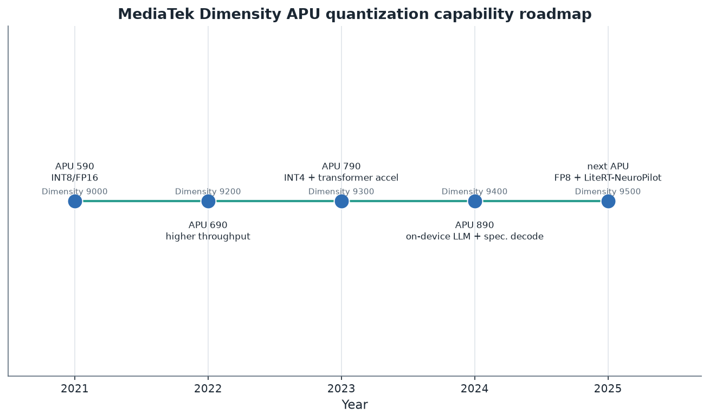
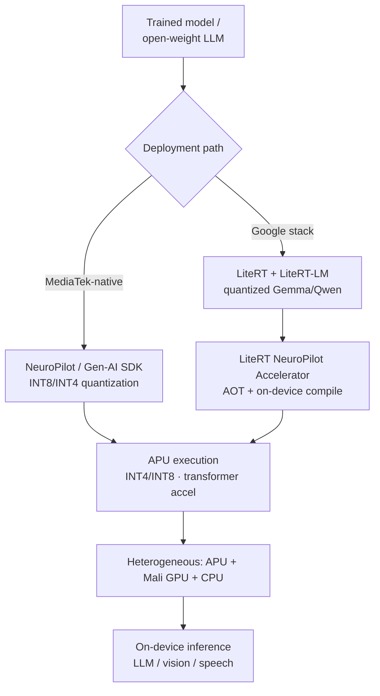
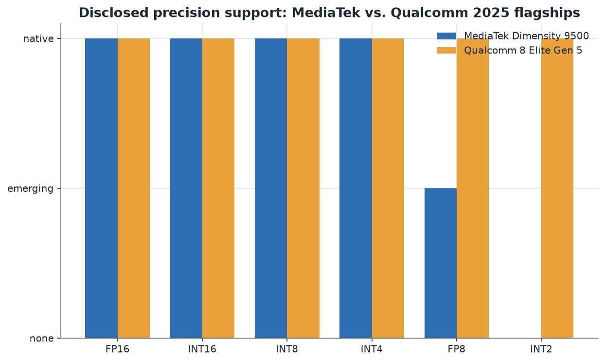

# 10. MediaTek Roadmap

> **Section scope.** MediaTek's quantization and on-device-AI stack: the APU (AI
> Processing Unit) evolution across the Dimensity flagship line, the NeuroPilot SDK
> (and its Gen-AI extensions), the notable LiteRT–NeuroPilot integration that makes
> Dimensity NPUs first-class LiteRT targets, and MediaTek's competitive positioning
> against Qualcomm. MediaTek is the other half of the Android flagship-SoC duopoly,
> and its quantization story is one of a strong fast-follower closing the gap with —
> and in some workloads matching — the market leader.

## MediaTek's position: the scaled fast-follower

MediaTek is, by shipment volume, one of the largest smartphone-chip vendors in the world,
with the **Dimensity** line competing directly against Qualcomm's Snapdragon at the flagship
tier and dominating large parts of the mid-range. Its quantization strategy mirrors this
market position: MediaTek is a **fast-follower** that tracks the precision-format frontier
closely (INT4 arrived on Dimensity roughly contemporaneously with Snapdragon; on-device LLM
support followed quickly), pairs competitive silicon with the **NeuroPilot** SDK, and
differentiates increasingly on *ecosystem integration* — most notably the deep
**LiteRT (TFLite) integration** that makes Dimensity NPUs first-class targets for Google's
on-device-LLM stack. Where Qualcomm leads on disclosed precision breadth and original
research, MediaTek competes on silicon parity, aggressive on-device-LLM enablement, and
tight integration with the broader Android/Google AI tooling ecosystem. For a large fraction
of the world's smartphones, MediaTek's APU and NeuroPilot are the quantization substrate.

## The APU evolution across the Dimensity line

MediaTek's neural accelerator is the **APU (AI Processing Unit)**, and it has evolved across
the Dimensity flagship generations in step with the industry's quantization frontier.

The roadmap tracks the key transitions: the **Dimensity 9000 (2021, APU 590)** established
the flagship APU with INT8/FP16; the **Dimensity 9200 (2022, APU 690)** improved throughput;
the **Dimensity 9300 (2023, APU 790)** was the generative-AI inflection, adding **INT4**
support, a hardware **transformer accelerator**, and mixed-precision execution aimed at
on-device LLMs; the **Dimensity 9400 (2024, APU 890)** deepened on-device-LLM support
(including hardware support for techniques like speculative decoding to accelerate
generation); and the **Dimensity 9500 (2025)** pushed on-device-LLM performance to the
point of running models like Gemma-3n at high throughput (MediaTek/Google-reported ~1600
tokens/second prefill and ~28 tokens/second decode at 4K context for a Gemma-3n-E2B-class
model ⚠️), with FP8 entering the picture. The generation-over-generation story is a steady
climb up the quantization frontier, closely paralleling Qualcomm's — INT4 for LLM weights,
mixed precision, transformer-specific acceleration, and on-device generative AI as the
organizing goal.

| Dimensity flagship | Year | APU | Precision support | Quantization-relevant advance |
|---|---|---|---|---|
| Dimensity 9000 | 2021 | APU 590 | INT8, INT16, FP16 | First flagship APU |
| Dimensity 9200 | 2022 | APU 690 | INT8, INT16, FP16 | Higher AI throughput |
| Dimensity 9300 | 2023 | APU 790 | **INT4**, INT8, INT16, FP16 | Gen-AI; transformer accelerator; INT4 |
| Dimensity 9400 | 2024 | APU 890 | INT4, INT8, INT16, FP16 | On-device LLM; speculative decoding support |
| Dimensity 9500 | 2025 | next-gen APU | INT4, INT8, INT16, FP16, **FP8** | High-throughput on-device LLM; LiteRT integration |

Legend: ⚠️ performance figures are vendor/partner-reported. Precision support from MediaTek
platform materials.

## NeuroPilot: MediaTek's quantization and deployment SDK

**NeuroPilot** is MediaTek's SDK for deploying AI models to Dimensity (and other MediaTek)
silicon. It provides model conversion, optimization, and — central to this database —
**quantization** to INT8 and INT4, reducing model size and power while preserving accuracy
for mobile constraints. NeuroPilot handles the mapping of a quantized model onto the APU's
heterogeneous resources and supports standard framework inputs (TensorFlow/TFLite, ONNX,
PyTorch via conversion). The **NeuroPilot Gen-AI SDK** extends this specifically for
generative models, adding the LLM-oriented capabilities (efficient KV-cache handling,
LLM-specific quantization, and generation optimizations) needed for on-device chatbots and
assistants. NeuroPilot's role is analogous to Qualcomm's AIMET+QNN: it is the path from a
trained model to an APU-executable quantized engine, exposing the INT4/INT8 quantization the
APU executes natively. MediaTek's tooling is generally regarded as competent and improving,
though historically with somewhat less research pedigree and less disclosed depth than
Qualcomm's AIMET — a gap MediaTek has narrowed by leaning on ecosystem integration (below)
rather than solely on proprietary tooling.

## The LiteRT–NeuroPilot integration: a strategic differentiator

MediaTek's most distinctive quantization-relevant move is the deep integration between
**Google's LiteRT** (the runtime formerly known as TensorFlow Lite) and **NeuroPilot**,
which makes Dimensity NPUs **first-class targets for on-device LLMs through Google's stack**.
The LiteRT NeuroPilot Accelerator exposes a unified Compiled Model API with both
ahead-of-time and on-device compilation on supported Dimensity SoCs, and it targets concrete
open-weight models — Gemma-3 (270M, 1B), Gemma-3n, Qwen3-0.6B, EmbeddingGemma — running them
through LiteRT and LiteRT-LM on the MediaTek NPU. The reported performance (up to ~12× CPU
and ~10× GPU throughput for these LLM workloads on a Dimensity 9500-class NPU ⚠️) is
significant.

This integration matters for several reasons. First, it lowers the barrier to on-device LLM
deployment on MediaTek silicon dramatically — developers using Google's LiteRT stack (the
reference mobile-AI runtime) get MediaTek NPU acceleration without wrestling with a
proprietary SDK, using the *quantized* models the stack ships. Second, it aligns MediaTek
with Google's on-device-AI direction (Gemma models, LiteRT, the Android AI stack), which is
strategically valuable given Google's platform influence over Android. Third, it exemplifies
the quantization-deployment reality of Section 06: the value is in the *end-to-end path* from
a quantized model through a runtime (LiteRT) to native NPU execution (via NeuroPilot), and
MediaTek's investment in making that path smooth is a competitive differentiator distinct
from raw silicon specs. For the on-device-LLM ecosystem, the LiteRT–NeuroPilot integration
makes Dimensity a well-supported, quantization-friendly target through the most widely-used
mobile-AI runtime — arguably narrowing Qualcomm's tooling lead more effectively than a
proprietary alternative could.

## On-device generative AI: MediaTek's demonstrations

Like Qualcomm, MediaTek has demonstrated on-device generative AI as proof of its stack. The
Dimensity 9300 and 9400 generations showcased on-device LLMs (including Llama-class and
Google Gemma models) running via INT4 quantization on the APU, and the Dimensity 9400
introduced hardware support for **speculative decoding** — a generation-acceleration technique
(Section 05) that MediaTek brought into the NPU's capabilities, showing attention to the
systems-level optimizations around quantized inference, not just the quantization itself. The
Dimensity 9500 generation's LiteRT-based Gemma-3n throughput figures (high prefill and decode
rates ⚠️) position MediaTek as competitive with Qualcomm on on-device-LLM performance. These
demonstrations, like Qualcomm's, are vendor/partner-produced with vendor-measured performance
(⚠️), but they establish that MediaTek's APU plus INT4 quantization runs the generative
workloads defining current edge AI, and that MediaTek is investing in the surrounding systems
techniques (speculative decoding, efficient KV cache) that make quantized on-device LLMs
practical.

## MediaTek versus Qualcomm: the flagship duopoly

The direct comparison with Qualcomm (Section 09) frames MediaTek's position.

On disclosed precision support, MediaTek's 2025 flagship matches Qualcomm on INT4/INT8/INT16/
FP16 and is adding FP8, but Qualcomm's 8 Elite Gen 5 leads on the aggressive frontier with
disclosed **INT2** and native FP8 — the one clear precision-breadth gap. On tooling, Qualcomm's
AIMET has more research pedigree, but MediaTek's LiteRT integration arguably offers a smoother
path for the large population of developers using Google's stack. The fuller comparison:

| Dimension | MediaTek | Qualcomm |
|---|---|---|
| NPU | APU (transformer accelerator) | Hexagon (DSP-derived) |
| Disclosed precision frontier | INT4–FP16 + emerging FP8 | INT2–FP16 + FP8 (broader) |
| Native SDK | NeuroPilot / Gen-AI SDK | AIMET + AI Engine Direct (QNN) |
| Ecosystem integration | Deep LiteRT–NeuroPilot (Google stack) | ONNX RT / LiteRT delegates + AI Hub |
| Quantization research | Growing, less published | Top-tier (DFQ, AdaRound) |
| On-device LLM systems | Speculative decoding, KV cache | Micro-tile, Direct Link |
| Market | Flagship + strong mid-range volume | Flagship + PC/auto/XR breadth |

The picture is of a close duopoly: MediaTek matches Qualcomm on the production-relevant
formats (INT4/INT8) and on-device-LLM capability, trails on the disclosed aggressive frontier
(INT2) and research depth, and leads (or at least differentiates) on Google-stack integration.
For most on-device-AI use cases — which are well-served by INT4 weight-only quantization —
MediaTek and Qualcomm are close substitutes, and the choice often comes down to the broader SoC
(CPU, modem, price) rather than the quantization stack specifically. MediaTek's strategy of
riding the LiteRT ecosystem rather than only competing on proprietary tooling is a smart
fast-follower play that leverages Google's platform influence.

## Strengths, gaps, and outlook

**Strengths.** Silicon parity with Qualcomm on production-relevant precisions (INT4/INT8),
a hardware transformer accelerator and on-device-LLM systems features (speculative decoding,
efficient KV cache), the competent NeuroPilot/Gen-AI SDK, and — the standout — the deep LiteRT
integration that makes Dimensity a first-class, quantization-friendly target through Google's
widely-used runtime. Huge shipment volume means MediaTek's quantization support reaches an
enormous installed base, especially in the mid-range where much of the world's smartphone
volume sits.

**Gaps.** Trails Qualcomm on the disclosed aggressive-format frontier (no disclosed INT2), has
less original quantization research pedigree, and historically less-deep proprietary tooling
(mitigated by the LiteRT strategy). Vendor performance claims are, as always, unverified (⚠️).

**Outlook (partly speculative ⚠️).** Expect MediaTek to continue tracking the precision
frontier closely (likely FP8 maturation and eventual sub-4-bit/MX-format support), to deepen
the LiteRT/Google-stack integration as a differentiator, and to keep investing in on-device-LLM
systems optimization. Its fast-follower position on silicon plus its ecosystem-integration
strategy is well-suited to the market: for the large volume of Android devices where INT4
weight-only on-device LLMs are the goal, MediaTek is a strong, well-tooled option, and the
LiteRT integration may prove a durable advantage as Google's on-device-AI stack grows.

## Inside the APU: architecture and the transformer accelerator

MediaTek's APU is a heterogeneous neural accelerator that, like Qualcomm's Hexagon, combines
different processing units for the mixed operation types of real models, and its evolution
reflects the shift from convolutional vision to transformer generative AI. The Dimensity 9300's
APU 790 introduced a dedicated **hardware transformer accelerator** — a recognition that the
attention and feed-forward operations of transformers benefit from specialized hardware
distinct from the convolution-optimized units that served vision. This transformer accelerator,
combined with INT4 weight quantization and mixed-precision execution, is what makes on-device
LLMs practical on Dimensity. The APU is designed for energy-efficient sustained inference (the
edge constraint of Section 06), and MediaTek's generation-over-generation improvements have
focused increasingly on the memory-bandwidth and generation-throughput characteristics that
matter for LLM decode — the memory-bound regime of the roofline. The APU also handles the
always-on and vision/camera workloads that dominate a phone's neural inference volume, quantized
to INT8, running continuously within tight power budgets. Architecturally, the APU's story
parallels the Hexagon's: an accelerator that grew transformer-specific capabilities and
low-bit precision support as the workload shifted to generative AI, co-designed with the
quantization schemes (INT4 weight-only, mixed precision) that the new workloads require. The
transformer accelerator in particular is MediaTek's answer to the same problem Qualcomm solved
with micro-tile inferencing — how to execute the memory-bound, irregular matmuls of generative
transformers efficiently — and its presence signals MediaTek's serious investment in on-device
generative AI rather than treating it as a checkbox.

## NeuroPilot's quantization workflow in depth

NeuroPilot's practical workflow follows the familiar arc: import a trained model (from TFLite,
ONNX, or via conversion from PyTorch), apply quantization (INT8 or INT4, with calibration for
accuracy), configure the mapping to the APU's resources, and compile to an APU-executable form.
The **NeuroPilot Gen-AI SDK** adds LLM-specific steps: handling the KV cache efficiently,
applying LLM-appropriate weight quantization (INT4 weight-only per-group, the on-device-LLM
standard of Section 05), and integrating generation optimizations. NeuroPilot supports the
post-training quantization that suffices for most INT8/INT4 deployments and provides paths for
accuracy recovery where needed. Compared to Qualcomm's AIMET, NeuroPilot has historically been
somewhat more of a deployment tool than a research-grade quantization toolkit — it does the job
of producing an APU-ready quantized model competently, but has not been the source of novel
quantization *methods* the way AIMET (via Qualcomm AI Research's DFQ and AdaRound) has. MediaTek
has compensated for this by embracing the LiteRT integration, effectively outsourcing part of
the quantization-tooling story to Google's mature stack while providing the NPU-native execution
layer. For developers, this means two viable paths: NeuroPilot-native for maximum MediaTek-
specific control, or LiteRT (with the NeuroPilot accelerator) for a smoother, more portable,
Google-ecosystem-aligned experience with quantized models. The dual-path availability is a
strength — it meets developers where they are — and the LiteRT path in particular lowers the
barrier for the many developers already using Google's mobile-AI tooling.

## The mid-range story: democratizing on-device quantization

A distinctive aspect of MediaTek's role that Qualcomm shares less is its **enormous mid-range
volume**. Beyond the flagship Dimensity 9000-series, MediaTek ships the Dimensity 8000-series,
7000-series, and lower tiers, plus the Helio line, into a vast number of mid-range and
budget devices — a large fraction of the world's smartphones, especially in emerging markets.
These chips also include APUs (of varying capability) that support INT8 and, increasingly, INT4
quantization. The significance for the quantization landscape is **democratization**: on-device
AI, enabled by quantization, is not confined to expensive flagships but reaches the mass-market
mid-range through MediaTek's volume, meaning quantized on-device inference (vision, speech, and
increasingly small LLMs) is available to billions of users on affordable devices. This matters
for the reach of on-device AI — the memory and power constraints are tighter on mid-range
silicon, making quantization even more essential (a mid-range chip with 6-8 GB RAM absolutely
requires 4-bit to run a capable LLM), and MediaTek's mid-range APUs are what bring quantized
on-device AI to the price tiers where most of the world's phones sell. While the flagship
Dimensity vs. Snapdragon competition gets the attention, MediaTek's mid-range quantization
support arguably has broader real-world impact by volume, extending on-device AI down the price
curve. This democratization role is a genuine and underappreciated part of MediaTek's
contribution to the practical quantization landscape.

## Speculative decoding and systems-level quantization support

The Dimensity 9400's introduction of hardware support for **speculative decoding** deserves
emphasis because it illustrates MediaTek's attention to the *systems* around quantized
inference, not just the quantization itself. Speculative decoding (Section 05) accelerates LLM
generation by using a small, fast "draft" model to propose several tokens that the large model
then verifies in parallel — turning some of the memory-bound sequential decode into more
parallel, higher-throughput work. Both the draft and target models can be quantized (INT4),
and the technique composes with quantization to further speed on-device generation. MediaTek
bringing speculative decoding into the APU's supported capabilities shows recognition that
on-device LLM performance depends on the *combination* of quantization and generation-systems
techniques — the interaction Section 05 discussed. Alongside efficient KV-cache handling (also
quantizable) and the transformer accelerator, speculative-decoding support positions the
Dimensity APU for the full on-device-LLM optimization stack, not just weight quantization. This
systems-level attention is part of how MediaTek competes with Qualcomm's micro-tile inferencing
and Direct Link — both vendors are optimizing not just the quantized matmul but the whole
generation pipeline, recognizing that quantization is necessary but not sufficient for fast
on-device generation.

## Case study: an on-device Gemma model via LiteRT on Dimensity

The Dimensity 9500 + LiteRT running Gemma-3n is a concrete case worth tracing. Google's Gemma
models are distributed in LiteRT-compatible quantized form (INT4/INT8 weight quantization). A
developer using LiteRT-LM targets the model at a Dimensity NPU via the LiteRT NeuroPilot
Accelerator, which compiles the quantized model (ahead-of-time or on-device) for the APU. On
the Dimensity 9500-class NPU, the quantized Gemma-3n-E2B model reportedly reaches ~1600
tokens/second prefill and ~28 tokens/second decode at 4K context (⚠️ partner-reported) — with
the prefill (compute-bound) benefiting from the APU's transformer acceleration and the decode
(memory-bound) benefiting from the INT4 weights' reduced memory traffic. The reported ~10-12×
speedup over CPU/GPU for these LLM workloads reflects the APU's native quantized execution
versus the general-purpose processors. The case exemplifies the LiteRT–NeuroPilot value: a
developer gets NPU-accelerated on-device LLM inference of a quantized open model through
Google's standard runtime, without proprietary-SDK friction. It also illustrates the
now-standard on-device-LLM recipe (INT4 weight quantization, quantized KV cache, NPU execution)
working on MediaTek silicon through the Google ecosystem — the end-to-end path that makes
quantized on-device LLMs practical, delivered via ecosystem integration rather than a walled
proprietary stack.

## Beyond phones: Genio, Pentonic, and automotive

MediaTek's quantization reach extends beyond smartphones into IoT, smart displays, TVs, and
automotive, broadening the footprint of its APU and NeuroPilot quantization stack. The
**Genio** platform targets IoT and edge devices (smart home, industrial, retail) with
APU-equipped SoCs running quantized vision and audio models within tight power and cost budgets
— the tinyML-to-midrange edge regime where quantization is essential. The **Pentonic** line
powers smart TVs with on-device AI for image processing and increasingly assistant features,
quantized for the TV SoC's constraints. MediaTek also has **automotive** offerings (including
work with NVIDIA on automotive AI) where on-device quantized inference serves in-cabin and
perception workloads under the safety and power constraints Section 07 flagged. Across these
markets, NeuroPilot provides the common quantization and deployment tooling, and the APU
provides INT8/INT4 native execution, extending MediaTek's mobile-derived quantization expertise
into the broader edge. Like Qualcomm's cross-market AI Stack, MediaTek's multi-market presence
means its quantization support reaches well beyond phones, and its precision choices (INT4/INT8)
propagate across device categories. The breadth reinforces MediaTek's role as a high-volume
provider of quantized on-device AI across the consumer-edge landscape, from budget phones to TVs
to IoT.

## Developer experience and the Google-ecosystem bet

MediaTek's developer experience reflects its strategic bet on ecosystem integration. A
developer can use NeuroPilot directly for MediaTek-specific optimization, but the increasingly
prominent path is through **LiteRT** — using Google's runtime and quantized models (Gemma and
others) with MediaTek NPU acceleration handled transparently by the LiteRT NeuroPilot
Accelerator. This is a deliberate strategic choice: rather than trying to out-tool Qualcomm's
AIMET/QNN with a competing proprietary stack, MediaTek aligns with Google's mobile-AI ecosystem,
which most Android developers already use, and provides best-in-class NPU acceleration through
it. For developers, this lowers friction substantially — quantized on-device LLM inference on
MediaTek silicon through familiar Google tooling — and it leverages Google's platform influence
over Android to MediaTek's benefit. The bet's risk is dependence on Google's roadmap and
priorities, but the alignment is strategically sound given Google's centrality to Android AI. The
net developer experience is arguably *simpler* than Qualcomm's for the common case of deploying a
quantized open LLM, precisely because MediaTek leans on Google's mature runtime rather than
requiring developers to master a proprietary SDK — a fast-follower turning ecosystem alignment
into a genuine advantage.

## MediaTek's history: from budget follower to flagship contender

MediaTek's trajectory contextualizes its quantization strategy. For much of its history,
MediaTek was known as a value-oriented chip supplier — competent, cost-effective silicon for
mid-range and budget devices, trailing Qualcomm at the high end. The Dimensity line, launched
around 2020, represented MediaTek's serious push into the flagship tier, and by the Dimensity
9300/9400/9500 generations it had achieved genuine parity with (and in some benchmarks
leadership over) Snapdragon on CPU, GPU, and increasingly AI. This history shapes the
quantization story in two ways. First, MediaTek's fast-follower instinct — track the leader
closely, match the important capabilities, compete on value and integration — is exactly how it
approached quantization: INT4 and on-device LLM support arrived promptly after Qualcomm's, not
years later. Second, MediaTek's deep experience in cost-constrained mid-range silicon gave it
expertise in efficiency and quantization at the low end, which it carried up into the flagship
line. The result is a vendor that reached flagship-tier AI capability relatively quickly and
that brings quantized on-device AI across a uniquely broad price range. The competitive
implication is that the Android flagship SoC market is now a genuine duopoly on AI capability,
not a Qualcomm monopoly with a distant follower — MediaTek's quantization stack is close enough
to Qualcomm's that the choice between them, for on-device AI purposes, is often a wash, decided
by other SoC factors. This is a significant change from a few years earlier and reflects
MediaTek's successful investment in closing the AI gap.

## Business context: the volume play and OEM relationships

MediaTek's business model, like Qualcomm's, is selling silicon and tooling to OEMs rather than
shipping its own devices, and this shapes its quantization approach similarly — it must expose
NPU capabilities through SDKs (NeuroPilot) and support standard runtimes (LiteRT) so a broad
ecosystem can target its silicon. But MediaTek's distinctive business characteristic is
*volume*: it is among the largest smartphone chip vendors by unit shipments, driven heavily by
mid-range and emerging-market devices. This volume gives MediaTek's quantization support
enormous reach and makes its precision choices (INT4/INT8) important industry targets — a model
author wanting to reach the broad Android market, including mid-range and emerging markets, must
support MediaTek's APUs, just as they must support Snapdragon. MediaTek's OEM relationships span
a wide range of device makers, and its cost-competitiveness makes it the choice for many
value-oriented flagships and the dominant mid-range option. For the quantization landscape, this
means MediaTek is a high-leverage target: supporting its NeuroPilot/LiteRT path and its INT4/INT8
APU execution reaches a huge, price-diverse installed base. The LiteRT integration amplifies this
— by making Dimensity a first-class LiteRT target, MediaTek ensures that the quantized models in
Google's ecosystem run well on its broad device base, aligning its volume advantage with Google's
platform influence. The business logic reinforces the technical strategy: high volume plus
ecosystem integration makes MediaTek's quantization support broadly consequential.

## Vision and always-on quantization: the volume workloads

While on-device LLMs get the attention, the highest-*volume* quantized inference on MediaTek
silicon remains vision, camera, and always-on audio — the workloads that run constantly on every
phone. MediaTek's APUs (flagship and mid-range) run quantized (typically INT8) models for
computational photography (noise reduction, HDR, scene detection, portrait effects),
video processing, on-device speech (voice commands, dictation), and always-on sensing, within
the tight power budgets these continuous or frequent workloads demand. This large quantized-vision
substrate, like Apple's, predates the LLM era and represents the bulk of on-device inference by
volume across MediaTek's device base. NeuroPilot's quantization tooling and the APU's INT8
execution serve these workloads, and their efficiency (enabled by quantization) is what lets
mid-range phones offer capable camera and voice features within their power and thermal budgets.
A complete picture of MediaTek's quantization footprint includes the billions of daily quantized
vision and audio inferences across its huge device base, not just the newer on-device-LLM
capability — and it is this mature vision-quantization foundation, built over years of mid-range
and flagship camera competition, on which MediaTek's on-device-generative-AI capability was
built. The quantization expertise developed for computational photography transferred directly to
the LLM era, which is part of why MediaTek closed the generative-AI gap with Qualcomm as quickly
as it did.

## Quantization challenges and MediaTek-specific considerations

A balanced account notes the challenges MediaTek faces in quantization. Historically, MediaTek's
proprietary tooling (NeuroPilot) has been less mature and less openly documented than Qualcomm's
AIMET, and its quantization *research* output is thinner — MediaTek consumes quantization
techniques more than it originates them, unlike Qualcomm's research-producing arm. This is part
of why the LiteRT integration is strategically important: it lets MediaTek offer a best-in-class
quantized-LLM deployment path by leaning on Google's mature tooling rather than closing the
tooling gap entirely on its own. There is also the general software-lags-silicon challenge for
newer formats (FP8 on the Dimensity 9500) — the hardware support precedes broad, accuracy-
validated software use, as everywhere in the industry. And MediaTek's disclosure, while
reasonable, is thinner than Qualcomm's detailed platform briefs, making precise capability
assessment harder (hence this section's coarser tables). None of these is disqualifying —
MediaTek's quantization stack is competitive and improving — but they are the honest gaps
relative to Qualcomm: less research pedigree, historically less-deep proprietary tooling
(mitigated by LiteRT), and thinner disclosure. MediaTek's strategic response — ecosystem
integration over proprietary tooling depth — is a sensible way to compete given these gaps, and
it may prove more effective than trying to match Qualcomm's research-driven approach head-on.

## The competitive dynamic over time

The MediaTek-Qualcomm competitive dynamic in on-device AI has evolved from Qualcomm-dominance
toward genuine parity, and the trajectory matters for the landscape. A few years ago, Qualcomm's
Hexagon plus AIMET was clearly ahead on mobile AI, with MediaTek a capable but trailing
follower. The Dimensity 9300/9400/9500 generations, the transformer accelerator, the on-device-
LLM systems features (speculative decoding), and especially the LiteRT integration have closed
much of the gap for practical on-device-AI purposes. Qualcomm retains leads on the disclosed
aggressive-format frontier (INT2), research depth, and cross-market breadth (PC, auto, XR), but
for the core mobile on-device-AI use case — running INT4-quantized LLMs and INT8 vision models
efficiently — the two are close substitutes. This parity benefits the ecosystem: competition
drives both vendors to advance their quantization capabilities faster, and model authors and
tool builders can target both with similar schemes (INT4 weight-only being the common
denominator). It also means the choice between MediaTek and Qualcomm for a given device is
increasingly decided by factors other than the quantization stack — price, modem, CPU/GPU, OEM
relationships — with the AI capability being roughly comparable. For the quantization landscape,
the healthy duopoly ensures that both of the dominant Android SoC families support the standard
quantization schemes well, which stabilizes INT4 weight-only as the cross-vendor on-device-LLM
standard and gives model authors two large, well-tooled targets rather than one.

## The NVIDIA partnership and premium ambitions

A notable strategic development is MediaTek's collaboration with NVIDIA, spanning automotive
(where the two have partnered on in-vehicle AI platforms combining MediaTek SoCs with NVIDIA
GPU/AI technology) and, reportedly, efforts toward AI PC and premium computing silicon. For the
quantization story, this partnership is significant because it potentially brings NVIDIA's
mature quantization and AI software ecosystem (TensorRT, the CUDA quantization stack, FP8/FP4
expertise from the data center) into contact with MediaTek's edge silicon. NVIDIA is the
industry's quantization-tooling leader (Section 11), and any deep collaboration could uplift the
software side of MediaTek's stack — its historical relative weakness. The automotive context is
particularly quantization-relevant: in-vehicle AI (perception, in-cabin assistants) runs under
strict power, latency, and safety constraints where quantization is essential, and combining
MediaTek's efficient edge silicon with NVIDIA's AI software and quantization expertise targets
exactly that. While the full scope and outcomes of the partnership are still developing
(⚠️ forward-looking), it signals MediaTek's ambitions beyond mid-range mobile into premium and
automotive AI, potentially with NVIDIA's quantization ecosystem as a force-multiplier for
MediaTek's traditionally weaker software side. This is a development worth watching, as it could
reshape MediaTek's quantization-tooling position from fast-follower to something stronger by
borrowing NVIDIA's software maturity.

## Summary

MediaTek's quantization story is that of a successful fast-follower that has reached genuine
parity with Qualcomm on the production-relevant precisions (INT4/INT8) and on-device-LLM
capability, while differentiating through ecosystem integration rather than proprietary tooling
depth. Its APU evolved a hardware transformer accelerator and on-device-LLM systems features
(speculative decoding, efficient KV cache) in step with the generative-AI shift; its NeuroPilot
and Gen-AI SDK provide competent quantization and deployment; and its standout move — the deep
LiteRT–NeuroPilot integration making Dimensity a first-class target for Google's on-device-LLM
stack — arguably offers a smoother path to quantized on-device LLMs than a proprietary
alternative, leveraging Google's platform influence. MediaTek's enormous volume, especially in
the mid-range, extends quantized on-device AI down the price curve to billions of users, a
democratization role of underappreciated real-world impact. The honest gaps relative to Qualcomm
— less quantization research pedigree, historically thinner proprietary tooling, no disclosed
INT2, thinner disclosure — are real but narrowing, and MediaTek's strategy of aligning with
Google's ecosystem and (increasingly) partnering with NVIDIA is a sensible way to compete. The
net is a healthy Android SoC duopoly in which both dominant vendors support the standard
quantization schemes well, stabilizing INT4 weight-only as the cross-vendor on-device-LLM
standard and giving the ecosystem two large, well-tooled targets. For a very large fraction of
the world's smartphones, MediaTek's APU and its quantization stack are the on-device-AI
substrate, making MediaTek a consequential player in the practical quantization landscape even
where it trails on the research and disclosed-format frontiers.

## Forward outlook and the format frontier

Looking ahead, MediaTek's quantization trajectory will likely be shaped by several forces. The
FP8 support entering the Dimensity 9500 generation will need software maturation to deliver
production value — the familiar silicon-ahead-of-software gap — and MediaTek will likely follow
the industry toward the microscaling (MX) formats (MXFP4/MXFP8) as they standardize, and
possibly toward sub-4-bit (INT2 or codebook) support to match Qualcomm's disclosed frontier. The
LiteRT integration is MediaTek's most promising differentiator and will likely deepen as Google's
on-device-AI stack (Gemma models, LiteRT-LM, the Android AI ecosystem) grows — a bet on Google's
platform gravity that positions MediaTek well if Google's on-device-AI ambitions succeed. The
NVIDIA partnership could uplift MediaTek's software and quantization tooling, addressing its
historical relative weakness. And MediaTek's volume advantage means whatever schemes it supports
reach an enormous, price-diverse installed base, keeping its precision choices industry-relevant.
The most likely trajectory is continued fast-following on the format frontier (FP8 maturation, MX
formats, eventual sub-4-bit), deepening ecosystem integration as the primary differentiator, and
selective premium/automotive expansion via partnerships — all anchored by the volume and
cost-competitiveness that are MediaTek's structural strengths. MediaTek is unlikely to overtake
Qualcomm on the research-and-disclosed-format frontier, but it does not need to: for the mass
market's on-device-AI needs, which INT4 weight-only quantization serves well, MediaTek's stack is
competitive, well-integrated, and broadly deployed, which is what matters for real-world impact.

## What MediaTek's rise means for the quantization landscape

Stepping back, MediaTek's ascent to AI parity with Qualcomm has a broader significance for the
quantization landscape worth articulating. It confirms that the standard on-device quantization
schemes (INT4 weight-only, INT8 vision, quantized KV cache) are now table stakes across the
Android SoC market, supported by both dominant vendors — which stabilizes them as the industry
defaults and gives model authors confidence that targeting these schemes reaches essentially the
whole Android market. It demonstrates that ecosystem integration (the LiteRT strategy) can be as
effective a competitive lever as proprietary tooling depth, which may influence how other vendors
approach their quantization stacks. And it reinforces that the on-device-AI competition is now
about the *whole stack* — silicon, tooling, ecosystem integration, and systems-level generation
optimization — not just NPU specs, echoing the co-design thesis of Section 06. For anyone building
on-device AI for Android, the practical takeaway is that both Qualcomm and MediaTek are strong,
well-tooled targets for quantized inference, that INT4 weight-only is the safe cross-vendor
standard, and that the Google/LiteRT path (well-supported on both, and especially deeply
integrated on MediaTek) is an increasingly attractive route to quantized on-device LLMs. MediaTek's
rise has made the Android on-device-AI landscape a genuine two-horse race, to the ecosystem's
benefit.

## Note on table completeness

MediaTek discloses less generation-by-generation precision detail than Qualcomm, so the APU
table above is somewhat coarser than the Qualcomm equivalent, and some entries (exact APU
model numbers, precise per-generation format additions) are inferred from platform materials
and partner reports rather than detailed datasheets. Where MediaTek's disclosures are thinner,
this section says so rather than overstating precision — consistent with the database's
confidence discipline.

## Master database contributions

This section contributes: MediaTek (chipmaker, APU), NeuroPilot / Gen-AI SDK (framework), and
the LiteRT–NeuroPilot integration (noted under LiteRT in Section 11's Google discussion and the
master table) — see Section 16.

The MediaTek entry in the master database is tagged production-shipped with official-spec
confidence for the core INT4/INT8 support (well-documented in platform materials and validated by
the numerous on-device-LLM demonstrations), and with lower confidence for the newest FP8 support
and the vendor/partner-reported throughput figures, which await independent verification. This
mixed confidence profile is typical of the vendor sections: the production-relevant capabilities
are solid, while the frontier formats and the headline performance numbers carry the flags that
the database's methodology (Section 17) prescribes for vendor claims not yet independently
corroborated.

---

*Next: [11 — Other Major Players](./11-other-players.md).*
