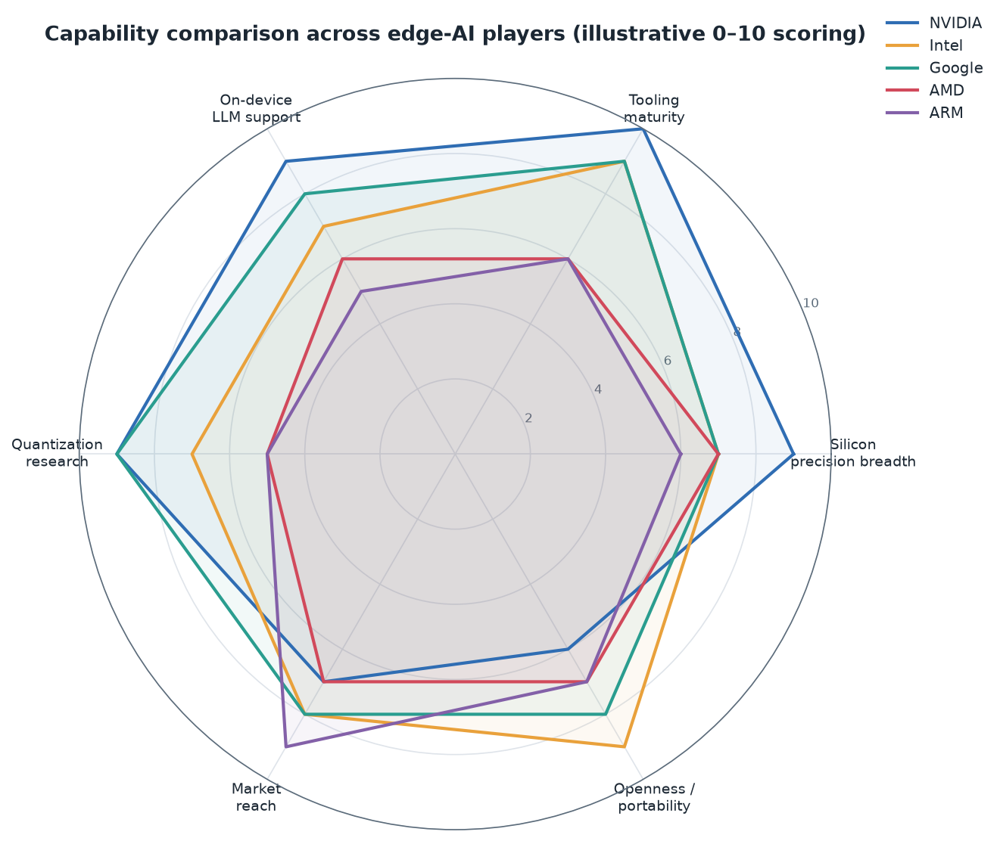
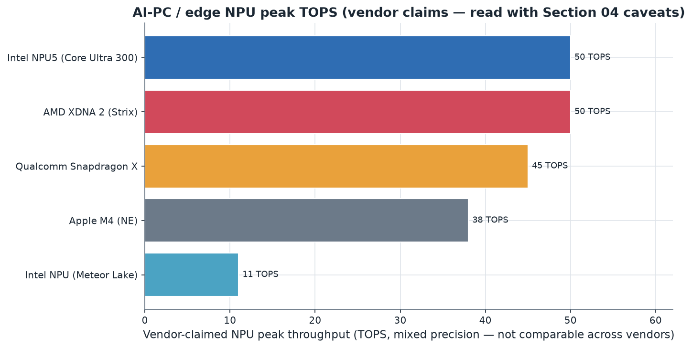

# 11. Other Major Players

> **Section scope.** The edge-AI quantization stacks of the seven major players
> beyond Apple, Qualcomm, and MediaTek: **Samsung** (Exynos NPU), **Google** (Tensor
> SoC, Edge TPU, LiteRT/TFLite), **NVIDIA** (Jetson, TensorRT), **Intel** (OpenVINO,
> Neural Compressor, Core Ultra NPU), **AMD** (Ryzen AI, XDNA), **ARM** (Ethos NPU IP,
> KleidiAI), and **Huawei** (Ascend, HiAI). Each subsection gives the roadmap and
> tooling; a master cross-player table and a capability radar close the section. This
> is the broadest section because the edge-AI silicon landscape is genuinely
> multipolar beyond the mobile-SoC leaders.

## Orientation: a multipolar landscape

Beyond the three mobile-SoC leaders, the edge-AI world spans PC silicon (Intel, AMD,
Qualcomm), embedded and robotics (NVIDIA Jetson, ARM IP), a mobile-plus-datacenter integrator
(Google), a vertically-integrated smartphone maker (Samsung), and a vertically-integrated
challenger under sanctions constraints (Huawei). Their quantization approaches vary widely — from
NVIDIA's tooling-and-format leadership to ARM's ubiquitous IP-licensing model to AMD's
distinctive block-FP16 bet — but all converge on the same core: INT8 as baseline, weight-only
INT4 for on-device LLMs, and a race toward FP8/FP4 and the microscaling formats. This section
maps each player's contribution.

The radar (illustrative 0–10 scoring across six dimensions) previews the section's conclusions:
NVIDIA leads on tooling, research, and silicon breadth but has narrower edge market reach; Intel
and Google lead on tooling and openness; ARM leads on market reach (its IP is everywhere) but
scores lower on tooling depth; and the others occupy distinct niches. No single player dominates
all dimensions, which is the multipolar reality.

## Samsung — Exynos NPU and Galaxy AI

**Silicon.** Samsung is unusual as both a chipmaker (Exynos SoCs, with an integrated NPU) and a
device maker (Galaxy phones), and it uses both its own Exynos silicon and Qualcomm Snapdragon in
its phones depending on region and model. The **Exynos NPU** has evolved across generations
(Exynos 2400, 2500-class) with INT8 and FP16 support and increasingly INT4 for on-device LLM
weights ⚠️ (Samsung discloses less detail than Qualcomm). Samsung Foundry also manufactures chips,
giving it process expertise, and Samsung's memory business (it is a leading DRAM/HBM maker) gives
it a stake in the memory-bandwidth side of the quantization equation (Section 06).

**Tooling.** Samsung provides the **ENN (Exynos Neural Network) SDK** for deploying quantized
models to the Exynos NPU, supporting INT8/INT4 quantization and the usual conversion-and-compile
flow. The tooling is competent but less openly documented and less research-backed than
Qualcomm's AIMET — Samsung's quantization story is more about enabling its own devices than
courting a broad third-party developer ecosystem.

**On-device AI.** Samsung's **Galaxy AI** (2024+) brings on-device generative AI features (live
translation, writing assist, photo editing) to Galaxy phones, running quantized models on the NPU
(Exynos or Snapdragon depending on the device) — and notably, Samsung partners with Google
(Gemini Nano) and Qualcomm for some of these features, so Galaxy AI is a hybrid of Samsung's own
and partners' models and silicon. This partner-dependence is characteristic: Samsung is a major
device and silicon maker whose on-device-AI stack leans on Google's and Qualcomm's quantization
ecosystems as much as its own.

**Assessment.** Samsung is a significant player by virtue of its device volume and silicon/memory
capabilities, but its *quantization-specific* leadership is modest — its NPU and ENN SDK trail
Qualcomm's and MediaTek's in disclosed capability and ecosystem, and it relies substantially on
partners (Google, Qualcomm) for its on-device generative AI. Its strengths are vertical
integration (silicon + devices + memory + foundry) and volume; its gaps are quantization-tooling
depth and disclosure. Maturity: 🟢 for INT8/INT4 on Exynos, 🟡 for the newer formats and the
ENN tooling's breadth.

## Google — Tensor SoC, Edge TPU, and LiteRT (the reference toolchain)

Google's quantization footprint is unusually broad because it spans silicon, the reference mobile
quantization toolchain, and shipping on-device models.

**Edge TPU and Coral.** Google's **Edge TPU** (2018+) is an INT8-centric inference accelerator (in
Coral dev boards and embedded products), a deliberate bet on INT8 as the efficient edge numeric —
it does not chase format breadth but optimizes for INT8 efficiency. It is a niche but influential
product, having popularized dedicated edge inference silicon.

**Tensor SoC.** Google's **Tensor** SoCs (Pixel phones, G1 through G5-class) integrate an NPU (and
Google's TPU-derived AI capabilities) for on-device AI, and are the silicon behind Pixel's
on-device features and **Gemini Nano** (Google's on-device LLM). Google co-designs the Tensor
silicon with its own models and the Android AI stack. Precision support centers on INT8 with
growing INT4 for LLM weights ⚠️.

**LiteRT / TFLite — the reference toolchain.** Google's most consequential quantization
contribution is **LiteRT (formerly TensorFlow Lite)**, the reference mobile quantization and
inference toolchain that essentially every mobile developer has used. TFLite's INT8 PTQ and QAT
(built on the Jacob et al. scheme, Section 02) *defined* how mobile quantization is done, and its
converter, quantization APIs, and delegate architecture (routing to vendor NPUs) are foundational
infrastructure. LiteRT's evolution toward on-device LLMs (LiteRT-LM, the Gemma models, and the
NeuroPilot/vendor-accelerator integrations discussed in Section 10) makes it the cross-vendor
runtime for quantized on-device inference. Google also provides the **AI Edge** tooling and the
**MediaPipe** framework. This toolchain leadership — the reference way to quantize and deploy on
mobile — is Google's standout quantization asset, more influential than its silicon.

**Assessment.** Google is a top-tier quantization player through *software* (LiteRT is the
reference mobile toolchain) and *research* (Google Research's contributions to quantization,
including the foundational INT8 scheme and ongoing efficient-ML work), with solid but not
market-leading silicon (Tensor, Edge TPU). Its INT8-centric, tooling-and-research-led approach is
distinct from the format-breadth race. Maturity: 🟢 for LiteRT INT8/INT4 tooling and Edge TPU
INT8, 🟡 for Tensor's aggressive-format support.

## NVIDIA — Jetson and TensorRT (the tooling leader)

NVIDIA is the outlier that leads on nearly every quantization dimension, though its *edge*
footprint (Jetson) is smaller than its data-center dominance.

**Silicon.** NVIDIA's **Jetson** platform (Orin, and Blackwell-based successors) brings the GPU +
tensor-core architecture to the edge (robotics, autonomous machines, edge servers), with native
support for INT8, INT4, FP8, and — on Blackwell — **FP4/MXFP4**, the broadest low-precision format
support in edge silicon. The tensor cores also support 2:4 structured sparsity (Section 06),
stacking with quantization. Jetson is the high-performance edge option where power budgets allow.

**Tooling — the leader.** NVIDIA's **TensorRT** and **TensorRT-LLM** are the most mature
quantization and inference toolchains in existence, supporting INT8 (with entropy calibration,
Section 02), INT4 weight-only (GPTQ/AWQ), FP8, FP4, and mixed precision, with highly-optimized
kernels. The broader CUDA ecosystem, the **Model Optimizer** (NVIDIA's quantization toolkit), and
integration with every training framework make NVIDIA's quantization tooling the reference for
performance. NVIDIA also drove the FP8 and FP4/microscaling formats (Section 04) — its Hopper and
Blackwell architectures and its participation in the OCP standards make it a *format* leader too.

**Assessment.** NVIDIA leads on silicon precision breadth (FP4 on Blackwell), tooling maturity
(TensorRT is the gold standard), research, and format leadership (FP8/FP4). Its relative weakness
is *edge market reach* — Jetson is a smaller market than mobile SoCs, and NVIDIA's dominance is
in the data center, adjacent to but distinct from the mobile/consumer edge this database centers
on. For the edge, NVIDIA is the performance-and-tooling leader in the robotics/embedded/edge-server
niche. Maturity: 🟢 across the board for its supported formats.

## Intel — OpenVINO, Neural Compressor, and the Core Ultra NPU

Intel is a quantization-tooling leader in the x86/PC and edge space, with a strong software story
and improving silicon.

**Silicon.** Intel's **Core Ultra** processors integrate an NPU that has scaled rapidly — from
~11 TOPS in the first Meteor Lake generation to **~50 TOPS in the NPU 5 (Core Ultra 300 / Panther
Lake, 2026)** ⚠️ — meeting the Copilot+ PC bar. The NPU supports INT8 and INT4, with the OpenVINO
runtime routing workloads across CPU, integrated GPU, and NPU by model and thermal state. Intel
also has the **Gaudi** data-center accelerators and Arc GPUs, but the Core Ultra NPU is its
edge/PC quantization story.

**Tooling — a leader.** Intel's **OpenVINO** is one of the most mature cross-hardware inference
toolkits, with strong quantization support (INT8, INT4, FP8-emerging) via the **Neural Network
Compression Framework (NNCF)**, and Intel's **Neural Compressor** is a widely-used, framework-
agnostic quantization library (PTQ, QAT, mixed precision, supporting the major LLM methods). Intel's
quantization tooling is notably *open* and *portable* — OpenVINO targets Intel CPU/GPU/NPU and
Neural Compressor works across frameworks — making Intel a tooling-and-openness leader.

**Assessment.** Intel leads on quantization tooling maturity and openness (OpenVINO, Neural
Compressor are reference cross-hardware tools), with rapidly-improving NPU silicon (NPU 5 at 50
TOPS) for the AI-PC market. Its bet — that the runtime should transparently pick CPU/GPU/NPU — is a
distinctive co-design stance. Maturity: 🟢 for INT8/INT4 tooling and Core Ultra NPU, 🟡 for FP8 and
the newest silicon.

## AMD — Ryzen AI, XDNA, and the block-FP16 bet

AMD's edge-AI quantization story centers on the **Ryzen AI** NPU (based on the **XDNA**
architecture, from the Xilinx acquisition) and a distinctive numeric-format choice.

**Silicon.** AMD's **XDNA 2** NPU (in Strix Point / Ryzen AI 300, 2024+) delivers up to ~50 TOPS
(INT8) ⚠️ and is notable for supporting **Block FP16** — a block floating-point format (Section 04)
that AMD has bet on for on-device models, offering higher precision than INT8 while retaining
efficiency. XDNA 2 has specialized accelerators for INT4, INT8, and BF16 MAC arrays, plus hardware
primitives for **softmax, layer norm, and KV-cache streaming** — a transformer-aware design
(addressing exactly the range-sensitive-nonlinearity and KV-cache concerns of Sections 03 and 05).
AMD demonstrated a Block-FP16 Stable Diffusion 3 model as the "first BF16/Block-FP16 NPU model,"
showcasing its higher-precision-on-NPU approach.

**Tooling.** AMD provides the **Ryzen AI Software** stack and the **Quark** quantization toolkit
(supporting INT8/INT4 and the major methods), plus the broader **ROCm** ecosystem for its GPUs.
AMD's tooling is less mature than NVIDIA's or Intel's but improving, and its XDNA architecture's
transformer-aware hardware primitives are a genuine quantization-relevant strength.

**Assessment.** AMD's distinctive contribution is the **Block FP16 bet** — using block
floating-point for higher-precision on-device inference rather than pushing purely to low integer
— and its transformer-aware NPU hardware (native softmax/layernorm/KV-cache). Its tooling trails
the leaders. Maturity: 🟢 for INT8/INT4/BF16 on XDNA 2, 🟡 for the tooling ecosystem's breadth.

## ARM — Ethos NPU IP, KleidiAI, and ubiquity

ARM is unique as an **IP licensor** rather than a chipmaker — its designs are inside a huge
fraction of the world's edge devices, which gives it enormous reach and a distinctive role in the
quantization landscape.

**IP.** ARM licenses the **Ethos** NPU IP (Ethos-U microNPUs for microcontroller-class tinyML, and
Ethos-N NPUs for richer edge devices), which chipmakers integrate into their SoCs. Ethos is
**INT8- and INT4-centric** (not FP16), optimized for efficient quantized inference in
power-constrained devices — a deliberate integer-quantization bet appropriate for the tinyML-to-
midrange edge. ARM's **Cortex-M** CPUs (with **CMSIS-NN**) run quantized (INT8) models on
microcontrollers, the foundation of tinyML. ARM's CPU cores also increasingly include AI-
acceleration instructions (SME/SVE, and the newer scalable matrix extensions).

**Tooling.** ARM provides the **Vela** compiler (for Ethos-U), and — significantly — **KleidiAI**,
a library of optimized AI micro-kernels (including quantized matmul kernels) that integrate into
frameworks (LiteRT, ExecuTorch, llama.cpp) to accelerate quantized inference on ARM CPUs and NPUs.
KleidiAI is ARM's play to make quantized inference fast across the vast ARM ecosystem without each
developer hand-optimizing. ARM also collaborates on **ExecuTorch** (the PyTorch edge runtime).

**Assessment.** ARM's contribution is *ubiquity and the integer-quantization foundation* — its
INT8/INT4 Ethos IP and CMSIS-NN/KleidiAI kernels underpin quantized inference across an enormous
range of devices, especially the tinyML and mid-range edge where its IP dominates. Its
quantization stance is firmly integer-centric and efficiency-first. Maturity: 🟢 for INT8/INT4
Ethos and CMSIS-NN, 🟡 for the newer matrix extensions and KleidiAI's breadth.

## Huawei — Ascend, HiAI, and the DaVinci NPU

Huawei is a vertically-integrated challenger with capable silicon, operating under US sanctions
constraints that shape its ecosystem.

**Silicon.** Huawei's **Ascend** AI processors (data center and edge) and its **Kirin** mobile SoCs
use the **DaVinci** NPU architecture, which was one of the earliest dedicated mobile NPUs (Kirin
970, 2017) and supports INT8, INT4, and FP16 ⚠️. Ascend is Huawei's data-center-to-edge AI
silicon line, positioned as a domestic alternative to NVIDIA within China given export controls.

**Tooling.** Huawei provides the **HiAI** SDK (mobile) and the **CANN** (Compute Architecture for
Neural Networks) toolkit and **MindSpore** framework (for Ascend), with quantization support
(INT8/INT4). The tooling is capable within Huawei's ecosystem but less globally adopted, partly
due to sanctions limiting Huawei's access to Western ecosystems and vice versa.

**Assessment.** Huawei has genuine silicon and quantization capability (the DaVinci NPU was an
early mobile-NPU leader, and Ascend is a serious AI accelerator), and it does its own quantization
research, but its ecosystem is **bifurcated by geopolitics** — strong within China's domestic
market and the MindSpore/Ascend ecosystem, constrained globally. Its quantization approach is
integer-centric (INT8/INT4) like the other mobile players. Maturity: 🟢 for INT8/INT4 within its
ecosystem, with the caveat that its global adoption and disclosure are limited by sanctions.
Confidence on specifics is lower (⚠️) given limited Western-accessible documentation.

## Deep dive: Samsung's dual-track strategy

Samsung's quantization story is complicated by its dual role as both a merchant chipmaker and a
device OEM, and by its pragmatic willingness to use competitors' silicon. In its flagship Galaxy
phones, Samsung has historically split between its own Exynos SoCs and Qualcomm Snapdragon by
region and model — a hedge that means Samsung's on-device-AI features must run on *both* Exynos and
Snapdragon NPUs, pushing Samsung toward cross-vendor quantization approaches (and toward Google's
LiteRT and Gemini Nano, which run on both). The Exynos NPU itself is capable — Samsung has
integrated NPUs since the Exynos 9820 era and its recent generations support INT8/INT4 for
on-device LLMs — but Samsung discloses relatively little about the NPU's precise precision support
and quantization internals, placing it between Qualcomm's detailed disclosure and Apple's opacity.
Samsung's **memory business** is a quietly important angle: as one of the world's largest makers of
DRAM and high-bandwidth memory, Samsung has a direct stake in the memory-bandwidth side of the
quantization equation (Section 06's roofline), and its memory innovations (LPDDR5X/6, and
processing-in-memory research) intersect with the data-movement bottleneck that quantization
addresses. Samsung has published research on processing-in-memory (PIM) for AI, which — as Section
06 noted — is a complementary attack on the same energy bottleneck quantization mitigates. Samsung
Foundry's process technology also matters, as the NPU's efficiency depends on the manufacturing
node. **Galaxy AI**, launched in 2024, is Samsung's on-device-AI banner, offering live translation,
generative photo editing, writing assistance, and transcription — a hybrid of Samsung's own models,
Google's Gemini Nano (running on-device), and cloud services, with the on-device portions quantized
to run on the phone's NPU (Exynos or Snapdragon). This partner-heavy approach is characteristic:
Samsung's quantization leadership is modest relative to Qualcomm and even MediaTek, and it leans on
Google's and Qualcomm's ecosystems, but its enormous device volume and its silicon/memory/foundry
integration make it a structurally important player whose quantization *choices* (which formats to
support in Exynos, which partner models to ship) influence a large installed base. The honest
assessment is that Samsung is a volume-and-integration giant whose quantization-specific tooling and
disclosure lag the leaders, compensated by its scale and its willingness to integrate the best
available partner technology.

## Deep dive: Google's three-layer quantization presence

Google's quantization footprint is worth expanding because it operates at three distinct layers,
each significant. At the **silicon** layer, the Edge TPU and the Tensor SoC represent two different
bets: the Edge TPU is a deliberately INT8-focused, efficiency-optimized inference ASIC that helped
prove the dedicated-edge-inference concept and remains in embedded and IoT products via Coral,
while the Tensor SoC (in Pixel phones) integrates a mobile NPU co-designed with Google's own models
and the Android AI stack. Tensor's design priority has been on-device features and Gemini Nano
rather than raw benchmark leadership, and Google discloses less about Tensor's NPU internals than
Qualcomm does about Hexagon. At the **software** layer, Google's contribution is arguably the most
important in the entire mobile-quantization landscape: **TensorFlow Lite / LiteRT** defined how
mobile quantization is done. The TFLite converter's INT8 PTQ and QAT flows, built on the Jacob et
al. integer-arithmetic scheme (which itself came from Google, Section 02), are the reference
implementation that the entire mobile ecosystem learned from, and the delegate architecture (which
routes quantized subgraphs to vendor NPUs via QNN, NeuroPilot, Core ML, etc.) is the mechanism by
which cross-vendor quantized deployment works at all. The rebranding to LiteRT and its extension to
on-device LLMs (LiteRT-LM, running quantized Gemma models, with the first-class NPU integrations
of Section 10) positions Google's runtime as the cross-vendor standard for quantized on-device
inference. At the **model and research** layer, Google Research and DeepMind have contributed
foundational quantization work (the original INT8 scheme, ongoing efficient-ML and
quantization-aware-training research) and ship quantized on-device models — **Gemini Nano** (the
on-device tier of the Gemini family) runs quantized on Pixel and, via partnerships, other Android
devices, and the open **Gemma** models are distributed in quantized form and are the reference
on-device-LLM targets for the LiteRT/NeuroPilot stacks. This three-layer presence — capable
silicon, the reference toolchain, and shipping quantized models plus research — makes Google a
top-tier quantization player whose influence flows primarily through *software and models* rather
than silicon dominance, distinguishing it from the silicon-led mobile-SoC vendors. Google's
strategic position is that it can define the quantized-on-device-AI experience across the whole
Android ecosystem through LiteRT and Gemma/Gemini Nano, regardless of whose silicon runs
underneath — a software-and-models leadership that complements the hardware vendors rather than
competing head-on.

## Deep dive: NVIDIA's edge presence and format leadership

NVIDIA's quantization leadership, while centered on the data center, extends to the edge in ways
that shape the whole field's direction. The **Jetson** platform brings NVIDIA's GPU-plus-tensor-core
architecture to robotics, autonomous machines, industrial vision, and edge servers — a
higher-power, higher-performance edge niche than mobile phones, where the power budget allows the
full quantization toolkit. Jetson Orin and its Blackwell-based successors support INT8, INT4, FP8,
and FP4/MXFP4, plus 2:4 structured sparsity, giving edge developers the broadest low-precision
format menu available, executed through the same **TensorRT** stack that dominates data-center
inference. TensorRT and **TensorRT-LLM** are, by consensus, the most mature and highest-performance
quantization-and-inference toolchains in existence — they implement INT8 with sophisticated
calibration, INT4 weight-only (GPTQ/AWQ), FP8, FP4, mixed precision, and the optimized kernels
(building on the Marlin lineage and NVIDIA's own) that extract near-theoretical speedups. NVIDIA's
**Model Optimizer** (formerly AMMO) is its dedicated quantization toolkit, and the broader CUDA
ecosystem means every quantization method is implemented and optimized for NVIDIA first. Beyond
tooling, NVIDIA is a **format leader**: its Hopper architecture productionized FP8, its Blackwell
architecture productionized FP4/NVFP4/MXFP4 and demonstrated FP4 *training* (Section 04), and its
participation in the OCP standards drives the microscaling-format direction the whole industry is
converging on. This format leadership means NVIDIA effectively sets the pace for the sub-8-bit
frontier that the mobile vendors then follow — when NVIDIA ships FP4 tensor cores and the tooling
to use them, it pulls the whole ecosystem toward FP4. NVIDIA's edge weakness is purely one of
*market scope*: Jetson serves robotics/embedded/edge-server rather than the mass consumer mobile
market, so NVIDIA's edge footprint is smaller than its data-center dominance and than the mobile
SoC vendors' phone volume. But on every *capability* dimension — silicon format breadth, tooling
maturity, kernel performance, research, and format leadership — NVIDIA is at or near the top,
making it the reference against which other quantization stacks are measured, and the source of
much of the format innovation that eventually reaches the consumer edge.

## Deep dive: Intel's runtime-decides philosophy

Intel's quantization approach is distinguished by a clear philosophy — that developers should not
have to choose between CPU, integrated GPU, and NPU, and that the runtime should transparently pick
the optimal path by model and thermal state. This philosophy is embodied in **OpenVINO**, Intel's
mature cross-hardware inference toolkit, which abstracts the heterogeneous Intel silicon (CPU with
AVX-512/AMX, integrated Arc GPU, and the Core Ultra NPU) behind a runtime that routes quantized
workloads to the best available engine. OpenVINO's quantization support, via the **Neural Network
Compression Framework (NNCF)**, covers INT8, INT4 (weight-only for LLMs), and emerging FP8, with
PTQ and QAT flows. Separately, Intel's **Neural Compressor** is a framework-agnostic quantization
library widely used beyond Intel hardware — it supports the major LLM quantization methods (GPTQ,
AWQ, SmoothQuant, and others) and integrates with PyTorch, TensorFlow, and ONNX, making it one of
the reference *open* quantization toolkits. The **Core Ultra NPU** silicon has scaled aggressively
to meet the AI-PC opportunity: from ~11 TOPS in the first-generation Meteor Lake NPU to ~50 TOPS in
the NPU 5 (Core Ultra 300 / Panther Lake, 2026), a nearly 5× increase in a few generations,
reflecting the competitive pressure of the Copilot+ PC market. Intel also has the **Gaudi**
data-center accelerators (from the Habana acquisition) and Arc discrete GPUs, but the Core Ultra
NPU plus OpenVINO is its edge/PC quantization story. Intel's strengths are tooling maturity and
openness — OpenVINO and Neural Compressor are reference cross-hardware tools that many developers
use even on non-Intel silicon — and its rapidly-improving NPU. Its runtime-decides philosophy is a
distinctive and pragmatic co-design stance that matches the heterogeneous reality of Section 06,
letting quantized models run wherever is most efficient without developer micromanagement. Intel's
position in the AI-PC NPU race (against AMD and Qualcomm) has made it invest heavily in both the
silicon and the quantization tooling, and its open, portable tooling gives it influence beyond its
own hardware.

## Deep dive: AMD's Block FP16 differentiation

AMD's most interesting quantization contribution is its **Block FP16** bet, which deserves fuller
treatment because it represents a distinct point in the format design space (Section 04). While the
industry has largely pushed toward low *integer* precision (INT4/INT8) for on-device models, AMD's
XDNA 2 NPU emphasizes **block floating-point at 16-bit** — a block FP format that offers
higher precision than INT8 while retaining much of the efficiency, positioned as a sweet spot for
on-device models where quality matters (image generation, higher-fidelity inference). AMD
demonstrated this with a Block-FP16 Stable Diffusion 3 model, marketed as the first BF16/Block-FP16
NPU model, arguing that the higher precision improves image quality while the block format keeps the
memory footprint and throughput competitive. This is a genuinely different stance from the low-integer
race — AMD is betting that for some on-device workloads, a higher-precision block-float format is
preferable to aggressive integer quantization, trading some compression for quality and simplicity
(no calibration-sensitive low-integer quantization needed). The XDNA 2 NPU (from the Xilinx/FPGA
heritage, which brings flexible datapath design) supports INT4, INT8, and BF16 MAC arrays, and
notably includes **hardware primitives for softmax, layer normalization, and KV-cache streaming** —
directly addressing the range-sensitive-nonlinearity problem (Section 03) and the KV-cache memory
problem (Section 05) in silicon, a transformer-aware design that reflects AMD's attention to the
actual bottlenecks of on-device LLM inference. AMD's tooling — the **Ryzen AI Software** stack and
the **Quark** quantization toolkit — is less mature than NVIDIA's or Intel's but functional and
improving, and the broader **ROCm** ecosystem serves its GPUs. AMD's overall quantization position
is that of a capable challenger with a distinctive format bet (Block FP16), transformer-aware NPU
hardware, and improving-but-trailing tooling, competing hard in the AI-PC NPU market against Intel
and Qualcomm. The Block FP16 approach is worth watching as a counterpoint to the low-integer
consensus — if higher-precision block-float proves preferable for quality-sensitive on-device
workloads, AMD's bet could look prescient; if the industry's low-integer-plus-microscaling direction
wins, AMD will likely follow it, as its XDNA architecture's flexibility allows.

## Deep dive: ARM's ubiquitous integer foundation

ARM's role as an IP licensor gives it a uniquely pervasive but often-invisible position in the
quantization landscape, worth expanding because ARM's designs underpin so much of the edge. ARM does
not make chips; it licenses CPU cores (Cortex-A, Cortex-M), GPU designs (Mali), and NPU IP (Ethos)
that chipmakers (including MediaTek, Samsung, and many smaller vendors) integrate into their SoCs.
This means ARM's quantization-relevant design choices propagate across an enormous fraction of the
world's edge devices. The **Ethos** NPU line is firmly integer-centric: **Ethos-U** microNPUs
(Ethos-U55, U65, U85) target microcontroller-class tinyML with INT8 and increasingly INT4, pairing
with Cortex-M CPUs for always-on sensing, keyword spotting, and simple vision within microwatt-to-
milliwatt budgets, while **Ethos-N** NPUs target richer edge devices. ARM's deliberate integer-only
(no FP16) stance for Ethos reflects the tinyML-to-midrange efficiency priority — for these
power-constrained devices, integer quantization is not optional but foundational. ARM's **Cortex-M**
CPUs running **CMSIS-NN** (ARM's optimized neural-network kernel library) are the substrate for a
huge amount of tinyML, and ARM's CPU cores increasingly include AI-acceleration instructions (the
Scalable Vector Extension and the newer Scalable Matrix Extension, SME, which accelerates the matmuls
of quantized inference on the CPU itself). ARM's tooling includes the **Vela** compiler (which maps
quantized networks onto Ethos-U) and, importantly, **KleidiAI** — a library of hand-optimized AI
micro-kernels (including quantized matmul kernels for INT4/INT8) that ARM integrates into the major
frameworks (LiteRT, ExecuTorch, llama.cpp, MediaPipe) so that quantized inference runs fast on ARM
CPUs and NPUs everywhere, without each developer re-optimizing. KleidiAI is strategically significant
because it makes ARM's ubiquitous CPUs into competent quantized-inference engines through the
frameworks developers already use — a play to ensure quantized on-device AI runs well on the ARM
cores that are in nearly every phone and edge device. ARM's overall contribution is *the integer-
quantization foundation of the edge*: its INT8/INT4 IP and kernels underpin quantized inference
across the tinyML-to-midrange spectrum, and while ARM does not chase format breadth or ship its own
chips, its ubiquity makes its integer-centric quantization stance a de-facto foundation that the
entire edge ecosystem builds on.

## Deep dive: Huawei's constrained but capable stack

Huawei's quantization story is technically capable but shaped decisively by geopolitics, and an
honest account addresses both. Technically, Huawei was an early mobile-NPU leader — the Kirin 970
(2017) with its **DaVinci**-architecture NPU was among the first dedicated mobile neural
accelerators, contemporaneous with Apple's first Neural Engine — and Huawei has continued to develop
the DaVinci architecture across its Kirin mobile SoCs and its **Ascend** AI accelerators (which span
edge to data center). The DaVinci NPU supports INT8, INT4, and FP16, and Huawei does its own
quantization research and provides quantization tooling through the **HiAI** mobile SDK, the **CANN**
(Compute Architecture for Neural Networks) toolkit, and the **MindSpore** deep-learning framework
(Huawei's alternative to PyTorch/TensorFlow). Within China, Ascend is positioned as a domestic
alternative to NVIDIA for AI training and inference, given US export controls that restrict China's
access to NVIDIA's most capable chips — making Huawei's Ascend a strategically important part of
China's domestic AI-hardware ecosystem, with quantization (to fit models on the available silicon)
correspondingly important. The **geopolitical bifurcation** is the defining constraint: US sanctions
limit Huawei's access to leading-edge foundry processes (affecting its silicon competitiveness) and
to Western software ecosystems, while also limiting Western adoption of Huawei's tooling — the result
is a capable quantization stack that is strong within China's domestic ecosystem (MindSpore/Ascend/
CANN) but largely separate from the global PyTorch/ONNX/LiteRT ecosystem that the other players share.
For the quantization landscape, Huawei represents a partially-decoupled parallel track: it develops
and deploys quantized on-device and data-center AI within its ecosystem, using integer-centric
(INT8/INT4) approaches similar to the other mobile players, but its global influence and the
Western-accessible documentation of its capabilities are limited by the geopolitical situation. This
makes confidence on Huawei's precise current capabilities lower (⚠️) than for the other players, and
it makes Huawei a reminder that the quantization landscape, like the broader semiconductor industry,
is increasingly shaped by geopolitical decoupling — a theme with implications for standardization
(Section 15) and the future (Section 14).

## The AI-PC NPU war and its quantization implications

A cross-cutting development worth isolating is the **AI-PC NPU competition** among Intel, AMD, and
Qualcomm (with Apple as the integrated alternative), catalyzed by Microsoft's Copilot+ PC
specification (40+ TOPS NPU). This three-way race has driven rapid NPU scaling — Intel from 11 to 50
TOPS, AMD to ~50 TOPS, Qualcomm's Snapdragon X at ~45 TOPS — and, more importantly for this database,
intense investment in the *quantization tooling* needed to actually use those NPUs. The Copilot+
features (on-device language models, image generation, live captions) run on **quantized** models on
the NPU, so the NPU war is also a quantization-tooling war: Intel's OpenVINO, AMD's Ryzen AI SW/Quark,
and Qualcomm's AIMET/QNN/AI Hub all compete to make quantized on-device inference easy and fast on
their respective NPUs. The competition benefits the ecosystem by pushing all three toward better
quantization support (INT4 weight-only for LLMs, INT8 for vision, emerging FP8) and better tooling,
and it establishes the AI PC as a major new venue for quantized on-device inference alongside phones.
The quantization implication is that the PC, with its larger memory and power budget than a phone,
enables larger on-device quantized models (7-13B class at 4-bit), making the AI PC a more capable
on-device-AI platform than the phone for memory-hungry workloads — and the NPU war ensures the
tooling to exploit this matures quickly. This is a significant expansion of the quantized-on-device-AI
frontier from mobile into the PC, with three vendors racing to lead it.

## The tinyML tier: quantization at the extreme edge

Finally, a tier that spans several of these players deserves note: **tinyML**, the extreme low-power
edge (microcontrollers, always-on sensors, wearables) where quantization is most existential.
Here ARM (Ethos-U, Cortex-M, CMSIS-NN) provides the dominant IP, but the tier also involves
specialized silicon from many smaller vendors and the tinyML software ecosystem (TensorFlow Lite for
Microcontrollers, ExecuTorch, and vendor tools). In this tier, models must fit in kilobytes-to-
megabytes of on-chip SRAM and run within microwatt-to-milliwatt power budgets, so quantization to
INT8 (and increasingly INT4, and even binary/ternary for the simplest tasks) is not an optimization
but a precondition of the model existing at all — the accuracy-tolerant, energy-critical corner of
the tradeoff space (Section 07). tinyML applications (keyword spotting, wake-word, anomaly detection,
simple gesture and activity recognition, predictive maintenance) run quantized models continuously on
battery or energy-harvested power, and the quantization is often paired with aggressive model
architecture optimization and pruning. This tier is where the binary/ternary and sub-4-bit research
of Sections 02 and 04 finds its most natural production home, because the tasks are simple enough to
tolerate the accuracy loss and the energy budget makes extreme quantization worthwhile. ARM's
integer-centric IP dominates it, but it is a genuinely multi-vendor space, and it is the quantization
frontier's opposite pole from the LLM race — extreme efficiency for simple tasks rather than fitting
large models. Together, the tinyML tier and the LLM tier bracket the full range of edge quantization,
from 1-bit wake-word detectors to 4-bit billion-parameter language models, all served by the same
core quantization principles applied at different points on the accuracy-efficiency tradeoff.

## Master cross-player comparison table

The consolidated view across all seven players (plus the Section 08–10 leaders for context):

| Player | NPU / silicon | Precision support | Primary tooling | Tooling maturity | Target market | Distinctive stance |
|---|---|---|---|---|---|---|
| Apple | Neural Engine | INT8, INT4, palettized, FP16 | Core ML, MLX | High | Own devices | Whole-stack; palettization |
| Qualcomm | Hexagon | INT2–16, FP8, FP16 | AIMET, QNN, AI Hub | High | Mobile + PC/auto/XR | Breadth + research |
| MediaTek | APU | INT4–16, FP16, FP8 | NeuroPilot, LiteRT | Medium–High | Mobile (broad price) | LiteRT integration |
| Samsung | Exynos NPU | INT8, INT4, FP16 | ENN SDK | Medium | Own devices + Exynos | Vertical integration |
| Google | Tensor, Edge TPU | INT8-centric, INT4 | LiteRT (reference), AI Edge | High | Mobile + embedded | Reference toolchain |
| NVIDIA | Jetson (GPU+tensor) | INT8, INT4, FP8, FP4 | TensorRT / TensorRT-LLM | Very high | Robotics/edge-server | Tooling + format leader |
| Intel | Core Ultra NPU | INT8, INT4, FP8-emerging | OpenVINO, Neural Compressor | Very high | AI PC, edge | Open, portable tooling |
| AMD | Ryzen AI (XDNA 2) | INT4, INT8, BF16, Block FP16 | Ryzen AI SW, Quark | Medium | AI PC | Block FP16 bet |
| ARM | Ethos IP, Cortex-M | INT8, INT4 | Vela, KleidiAI, CMSIS-NN | Medium | tinyML–midrange (IP) | Ubiquitous integer IP |
| Huawei | Ascend, Kirin (DaVinci) | INT8, INT4, FP16 | HiAI, CANN, MindSpore | Medium | China + edge | Vertically integrated |

The AI-PC NPU TOPS bar (vendor claims, read with Section 04's skepticism) shows the rapid NPU
scaling in the PC market — Intel and AMD both at ~50 TOPS, Qualcomm's Snapdragon X at ~45, all
racing past the Copilot+ 40-TOPS bar — but recall that TOPS is a near-useless cross-vendor metric,
and the *quantization tooling and memory bandwidth* matter more than the peak number for real
on-device workloads.

## Automotive edge AI: a cross-player battleground

Automotive is an increasingly important edge-AI quantization battleground that cuts across several
players and deserves its own treatment. In-vehicle AI spans perception (camera/radar/lidar
processing for ADAS and autonomy), in-cabin monitoring (driver attention, occupant detection), and
increasingly generative in-cabin assistants — all running on-device under strict power, thermal,
latency, and *safety* constraints. Quantization is essential (the compute and power budgets demand
it) but the safety-criticality (Section 07) makes it delicate: a quantized perception model must not
degrade on rare-but-critical objects (the fairness/rare-case concern), and automotive-grade
validation is far more rigorous than consumer. The players competing here include **NVIDIA** (Drive
platform, the performance leader for high-end autonomy, with the full TensorRT quantization stack),
**Qualcomm** (Snapdragon Ride), **MediaTek** (partnering with NVIDIA), **Intel/Mobileye** (Mobileye's
EyeQ chips run heavily-quantized perception networks — Mobileye has deep expertise in quantizing
vision models for automotive), and various others. Mobileye in particular is a notable
quantization-intensive player: its EyeQ SoCs run perception at low precision with automotive-grade
reliability, representing years of expertise in safety-critical quantized vision. The automotive
quantization challenge is distinctive — it combines the tight edge constraints that make
quantization necessary with the safety requirements that make aggressive quantization risky,
forcing conservative, exhaustively-validated schemes (often INT8 with QAT rather than aggressive
sub-8-bit). As vehicles add generative in-cabin AI, the on-device-LLM quantization techniques of
Section 05 enter automotive too, subject to the same safety-validation rigor. Automotive is thus a
high-stakes venue where the quantization tradeoff is managed conservatively, and it is a market
where NVIDIA's tooling leadership and Mobileye's/Qualcomm's automotive-specific expertise compete.

## The open-source quantization tooling that spans vendors

A cross-cutting reality worth emphasizing is that much of the practical quantization work happens in
*open-source, vendor-neutral* tooling that spans all these players, and this shared layer is as
important as any single vendor's stack. The Hugging Face ecosystem (transformers, the quantization
backends integrating bitsandbytes, GPTQ, AWQ, HQQ, and others), llama.cpp/GGUF, ONNX Runtime, Apache
TVM, and the PyTorch quantization flows (including ExecuTorch for edge) are the tools most developers
actually use to quantize models, and they target *multiple* vendors' hardware through backends,
delegates, and execution providers. Intel's Neural Compressor and OpenVINO, and ARM's KleidiAI, are
notable for being vendor-associated yet broadly useful across hardware. This shared open-source layer
means that the quantization *methods* (Section 05) are largely vendor-neutral — a model quantized
with GPTQ or AWQ can, in principle, target many vendors' silicon — while the *deployment* to specific
NPUs is where the vendor-specific tooling (QNN, Core ML, NeuroPilot, TensorRT, OpenVINO) takes over.
The practical workflow for many developers is therefore: quantize with vendor-neutral open-source
tools (or download a pre-quantized model), then deploy to the target via the vendor's runtime or a
portable runtime (ONNX Runtime, LiteRT) with the appropriate backend. This layered reality — neutral
quantization methods, vendor-specific deployment — is why the standardization of the *exchange*
format and quantized-operator semantics (Section 15) matters so much, and it is why no single
vendor's tooling fully captures the quantization landscape: the shared open-source layer is the
common ground on which the vendor-specific layers build. For the multipolar landscape, this shared
layer is a unifying force that partially offsets the fragmentation of the vendor-specific stacks.

## Geopolitics and the bifurcation of the quantization ecosystem

The quantization landscape, like the broader semiconductor industry, is increasingly shaped by
geopolitics, and this deserves explicit treatment because it affects the ecosystem's structure. US
export controls on advanced chips and manufacturing equipment to China have created a partial
**bifurcation**: Huawei (Ascend, MindSpore, CANN) and other Chinese players are building a
domestic AI-hardware-and-software ecosystem partly decoupled from the Western PyTorch/ONNX/NVIDIA
ecosystem, with quantization playing a heightened role (quantization helps fit models onto the
less-advanced silicon that sanctions permit domestically, and onto the domestic accelerators being
developed as NVIDIA alternatives). This bifurcation has several implications for quantization.
First, it creates parallel tooling ecosystems (MindSpore/CANN vs. PyTorch/ONNX) with potentially
diverging quantization approaches and standards, complicating the standardization picture (Section
15). Second, it raises the strategic importance of quantization within China, as a way to maximize
the AI capability achievable on sanctions-constrained hardware. Third, it means the quantization
landscape is not a single global ecosystem but increasingly two partially-separate ones, with the
Western ecosystem (the focus of most of this database) and a Chinese domestic ecosystem developing
in parallel with limited cross-flow. For a complete picture, the Chinese domestic ecosystem —
Huawei's Ascend, plus other domestic AI-chip efforts and the models being built on them — is a
significant and growing part of the quantization world, even if it is less visible in the
Western-accessible literature this database mostly draws on. The geopolitical dimension is a
structural force shaping where quantization research and deployment happen, and it is likely to
intensify, making the landscape more multipolar not just technically but geopolitically.

## Foundries, process nodes, and the physical substrate

An underlying factor across all these players is the **foundry and process-node** dimension, which
shapes NPU efficiency and thus the practical value of quantization. NPU energy efficiency depends on
the manufacturing process (a smaller node means lower energy per operation), and access to
leading-edge nodes (TSMC's and Samsung's most advanced processes) is a competitive factor. Apple,
Qualcomm, MediaTek, NVIDIA, AMD, and Google (via TSMC) have access to leading-edge nodes, giving
their NPUs strong efficiency; Samsung has its own foundry; Huawei's access to leading-edge nodes is
constrained by sanctions, affecting its silicon competitiveness. The process node interacts with
quantization because the energy savings from quantization (fewer bits moved and computed) compound
with the energy savings from a better process — both attack the energy budget that constrains edge
AI. The physical substrate also determines memory bandwidth (the roofline's binding constraint,
Section 06): the memory technology (LPDDR5X, LPDDR6, and the on-package memory some designs use) and
its integration affect how fast quantized weights can be streamed, which for memory-bound LLM decode
is the performance determinant. Samsung and SK Hynix (and Micron) as memory makers, and the SoC
vendors' memory-integration choices, thus matter to the quantization value proposition. This
physical-substrate layer is easy to overlook in a quantization-focused analysis, but it is the
foundation on which the quantization gains are realized — a better process and faster memory
amplify quantization's benefits, and access to them is unevenly distributed across the players,
partly for geopolitical reasons.

## Who leads which market: a segmentation

Pulling the player analysis into a market segmentation clarifies the multipolar picture. In
**flagship mobile**, the leaders are Qualcomm, Apple, and MediaTek (Sections 08-10), with Samsung and
Google (Tensor) as integrated device-makers using their own and partners' silicon. In the **AI PC**,
the race is Intel, AMD, and Qualcomm (with Apple as the integrated Mac alternative), all pushing
40-50+ TOPS NPUs and competing on quantization tooling. In **robotics/embedded/edge-server**, NVIDIA
(Jetson) leads on performance with its full quantization stack, with ARM-based and other solutions in
lower-power niches. In **tinyML/microcontroller**, ARM's IP (Ethos, Cortex-M, CMSIS-NN, KleidiAI)
dominates, with a multi-vendor silicon ecosystem. In **automotive**, NVIDIA, Qualcomm, Mobileye/Intel,
and others compete under safety constraints. In **the Chinese domestic market**, Huawei (Ascend/Kirin)
and other domestic players lead a partially-decoupled ecosystem. And in **cross-vendor tooling**,
NVIDIA (TensorRT), Intel (OpenVINO/Neural Compressor), Google (LiteRT), and the open-source ecosystem
(Hugging Face, llama.cpp, ONNX Runtime) provide the methods and runtimes that span the hardware. This
segmentation shows why no single player dominates: the edge-AI market is many markets, each with
different constraints (power, safety, cost, performance) and different leaders, unified only by the
common quantization baseline (INT8, weight-only INT4). The multipolar reality is not a transitional
state toward consolidation but a reflection of the genuinely diverse requirements of edge AI, from
microwatt sensors to automotive perception to AI PCs — and quantization is the common technology that
serves all of them, adapted to each segment's constraints.

## Emerging and adjacent players

Beyond the ten major players, the landscape includes emerging and adjacent participants worth noting
briefly (with the startups covered fully in Section 13). **RISC-V-based** AI accelerators are
emerging as an open-ISA alternative, with several vendors building NPUs on RISC-V cores, potentially
important for the open-hardware and Chinese-domestic ecosystems. **Cloud providers'** custom
inference silicon (AWS Inferentia, Google's TPU for cloud, Microsoft's Maia) are data-center-focused
but influence the quantization ecosystem through the formats and methods they adopt. **Specialized
AI-accelerator companies** (some covered in Section 13) build custom silicon with distinctive
quantization stances (native low-bit, in-memory compute, block floating point). And **traditional
embedded/DSP vendors** (Texas Instruments, NXP, Renesas, and others) integrate NPUs into their
microcontrollers and application processors for industrial and automotive edge, running quantized
INT8 models. This long tail, plus the RISC-V and cloud-silicon developments, means the quantization
landscape is even broader than the ten major players suggest, and it is continually expanding as new
entrants build AI silicon. The common thread across all of them is the reliance on quantization to
make AI fit their power, cost, and memory constraints — quantization is the universal enabling
technology of the entire multipolar edge-AI landscape, from the largest players to the smallest
niche accelerators.

## Processing-in-memory: a shared frontier

Several of these players — Samsung and SK Hynix (memory makers), and various research efforts — are
pursuing **processing-in-memory (PIM)**, which intersects with quantization in an important way
(building on Section 06's compute-in-memory discussion). PIM places computation inside or adjacent to
the memory array, attacking the data-movement energy that dominates edge-AI power (Section 06's
energy asymmetry). Samsung has demonstrated HBM-PIM and LPDDR-PIM products aimed at accelerating the
memory-bound matmuls of AI, and the approach has a natural affinity with quantization: PIM's in-memory
computation is inherently limited-precision (the analog or near-memory compute has restricted
accuracy), so it pairs with low-bit quantization, and PIM's whole value proposition — avoiding weight
movement — is complementary to quantization's reduction of the bytes-per-weight. For memory-bound LLM
decode specifically, PIM addresses the same bottleneck quantization does (weight movement from memory),
so PIM plus aggressive weight quantization could compound to dramatically reduce the energy and
latency of on-device generation. PIM remains largely research-and-early-product (🟡→🔴) rather than
mainstream, facing challenges (integration complexity, programming models, the analog-precision
limits), but it is a shared frontier that several major players (especially the memory makers Samsung
and SK Hynix) are investing in, and it represents a hardware-level attack on the same data-movement
problem that quantization addresses at the representation level. If PIM matures, it would make
ultra-low-precision quantization not just beneficial but necessary (the in-memory substrate is
intrinsically low-precision), tightening the co-design between quantization and memory technology.
The memory makers' involvement is strategically notable — it means the quantization frontier is being
pushed not only by the SoC/NPU vendors but by the memory industry, from the other side of the
memory-compute boundary.

## The developer's cross-vendor reality

For a developer targeting multiple vendors' hardware — a common situation, since an app might run on
iPhones, Snapdragon and MediaTek Android phones, and AI PCs — the multipolar landscape is a practical
challenge that shapes how quantization is done in practice. The reality is that a single quantized
model rarely deploys optimally across all targets without per-vendor work: the exchange-format
fragmentation (Section 06), the differing native precision support, and the vendor-specific runtimes
mean that reaching the whole market requires either targeting a portable runtime (LiteRT, ONNX
Runtime) that abstracts the vendors at some performance cost, or maintaining per-vendor quantized
variants and deployment paths. Many developers pragmatically choose the portable-runtime path for
breadth (LiteRT with vendor delegates/accelerators reaches Android broadly; ONNX Runtime with
execution providers reaches many targets) and accept that maximum per-device performance would require
vendor-specific tuning they cannot afford across every target. The pre-quantized-model ecosystem
helps: for LLMs, downloading a GGUF or a vendor-optimized model (from Qualcomm AI Hub, or a LiteRT
Gemma model) offloads the quantization work. But the cross-vendor reality remains that the fragmented
landscape imposes a real tax on developers who must reach diverse hardware, and it is why the
standardization efforts (Section 15) and the portable runtimes are so valuable — they are the tools
that make the multipolar landscape tractable for developers who cannot optimize separately for ten
different quantization stacks. The practical guidance for a cross-vendor developer is to use a
portable runtime and standard quantization schemes (INT8, weight-only INT4) as the common denominator,
accept some per-device performance loss versus vendor-specific optimization, and reserve vendor-
specific tuning for the highest-value targets — a pragmatic accommodation to the multipolar reality
that trades peak performance for reach.

## Synthesis: the multipolar quantization landscape

Across all ten players (these seven plus Apple/Qualcomm/MediaTek), several patterns hold. **INT8
is universal and weight-only INT4 is near-universal** — every serious player supports the
production baselines. **Tooling leadership is concentrated** in NVIDIA (TensorRT), Intel
(OpenVINO/Neural Compressor), and Google (LiteRT), which are the reference toolchains, while the
mobile-SoC vendors (Qualcomm, Apple, MediaTek) lead in shipped mobile silicon. **The format
frontier (FP8, FP4/MX) is led by NVIDIA** with the mobile vendors following. **Distinctive bets**
differentiate the players: Apple's palettization, AMD's Block FP16, ARM's ubiquitous integer IP,
Google's reference toolchain, NVIDIA's format leadership. And **the landscape is genuinely
multipolar** — no single player leads on all dimensions, the AI-PC market has three-way NPU
competition (Intel/AMD/Qualcomm), the mobile market is a three-way race (Qualcomm/MediaTek/Apple),
and the embedded/tinyML space runs on ARM IP. For anyone building quantized edge AI, the practical
consequence is a fragmented target landscape unified only by the common INT8/INT4 baseline — which
is precisely why the standardization efforts of Section 15 (ONNX, MX formats, MLIR) matter, and
why the co-design discipline of Section 06 (validate on the actual target) is essential across
such a diverse set of silicon and tooling.

## Master database contributions

This section contributes ten-plus entities to the master database (Section 16): Samsung, Google
(+ LiteRT, Edge TPU, Gemini Nano), NVIDIA (+ TensorRT, Jetson), Intel (+ OpenVINO, Neural
Compressor), AMD (+ Ryzen AI, Quark), ARM (+ Ethos, KleidiAI), and Huawei (+ Ascend, HiAI, CANN) —
see Section 16.

---

*Next: [12 — Academic Research Landscape](./12-academia.md).*
