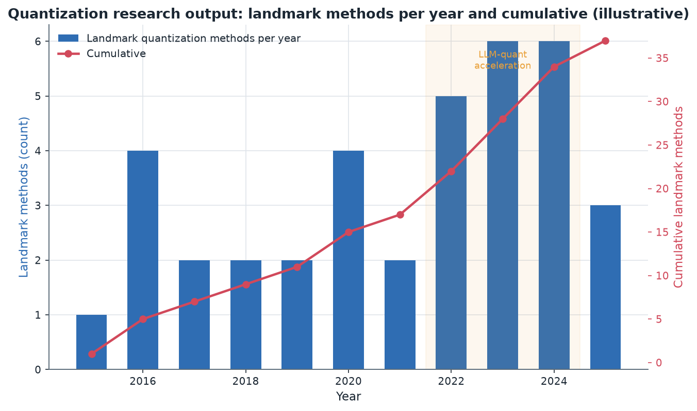
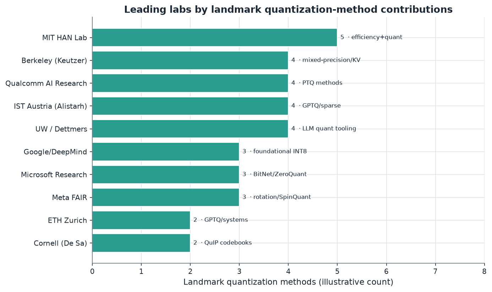

# 12. Academic Research Landscape

> **Section scope.** The research groups, laboratories, and individuals driving
> quantization forward: the leading academic and industrial-research labs, the
> landmark papers and their real-world adoption paths, and the currently active
> research directions. A recurring theme (foreshadowed in Section 09) is that the
> industry–academia boundary in quantization is unusually blurred — many landmark
> methods came from corporate research labs (Qualcomm AI Research, Microsoft, Meta,
> Google) as much as universities, and the most influential academic groups
> collaborate closely with industry.

## Orientation: a small, fast-moving, high-impact field

Quantization research is a relatively small field by headcount — a few dozen highly-active groups
worldwide — but its impact is outsized because its results ship almost immediately (Section 02's
open-source dynamic). Unlike some areas of ML where research-to-production takes years,
quantization methods (GPTQ, AWQ, QuIP#) often go from paper to widely-deployed tooling in weeks
to months. This tight coupling means the leading researchers are unusually influential: a single
group's method can become the way millions of models are quantized. The field also sits at a
distinctive intersection — it requires deep understanding of numerics, optimization, hardware, and
the specific models being compressed — which concentrates expertise in groups that span these areas.

The output chart (illustrative counts of landmark methods per year) shows the field's acceleration:
a steady trickle through the INT8 era (2015–2021), then a sharp acceleration in 2022–2024 as the
LLM-quantization wave (highlighted) drew in researchers and produced GPTQ, SmoothQuant, AWQ, QuIP#,
AQLM, the rotation methods, and more in rapid succession. The cumulative curve's steepening in
2022–2024 reflects the field's growth as LLMs made quantization strategically central.

## The leading labs and researchers

The following are the most influential groups driving quantization research, with their focus and
notable output. This is not exhaustive — the field is broader — but it captures the groups whose work
recurs throughout this database. The selection criterion is impact on the *deployed* state of
quantization: groups whose methods or infrastructure are actually used, not merely cited. By that
measure the list is fairly stable — the same names (Han, Alistarh, Dettmers, Nagel, Keutzer, De Sa)
recur across the landmark methods — which itself says something about the field's concentration: a
relatively small number of groups have produced a large share of the methods that ship. This
concentration is a feature of a young, fast-moving field where a strong method quickly becomes a
standard, and it means that tracking a manageable number of groups gives a good view of the whole
frontier.

### MIT HAN Lab (Song Han)

Song Han's group at MIT is arguably the single most influential academic group in efficient deep
learning and quantization. Han's PhD work produced **Deep Compression** (Section 02), and his lab
has since produced **AWQ** (the reference activation-aware 4-bit method), **SmoothQuant** (the
reference W8A8 activation method), and a broad body of work on efficient ML — TinyML, once-for-all
networks, hardware-aware NAS, efficient vision and LLM architectures, and the TorchSparse/efficient-
inference systems. The lab's defining characteristic is **co-design**: it works across the algorithm-
hardware boundary, producing methods (AWQ, SmoothQuant) engineered for real hardware efficiency, not
just paper accuracy. Its influence on this database is pervasive — AWQ and SmoothQuant are central to
Section 05, and the co-design philosophy of Section 06 is very much the HAN Lab worldview. Han's
group also has strong industry ties (much of the work is co-developed with NVIDIA, and Han co-founded
efficiency-focused companies), exemplifying the blurred industry-academia boundary.

### Qualcomm AI Research (Markus Nagel, Tijmen Blankevoort, and colleagues)

As detailed in Section 09, Qualcomm AI Research is a top-tier quantization group despite being a
corporate lab. It produced **Data-Free Quantization** and **AdaRound** (the foundational
calibration-free-INT8 and learned-rounding methods, Section 02–03), plus influential surveys ("A
White Paper on Neural Network Quantization") and ongoing work on mixed precision, transformer
quantization, and low-bit methods. Its distinguishing feature is the research-silicon-tooling loop —
its research directly informs the Hexagon NPU and ships in AIMET. Several of its researchers have
moved between Qualcomm and other labs/companies, spreading its influence.

### IST Austria (Dan Alistarh)

Dan Alistarh's group at IST Austria is a powerhouse of LLM-compression research. It co-produced
**GPTQ** (the reference accurate 4-bit method, with ETH Zurich), **SpQR** (sparse-quantized
representation), the **Marlin** high-performance 4-bit kernels, and extensive work on the theory and
practice of compressing large models (sparsity, quantization, and their combination). The group's
strength is rigorous, systems-aware compression that ships as fast tooling — GPTQ and Marlin are
production-relevant, not just papers. Alistarh's group represents the European center of gravity in
LLM-quantization research.

### University of Washington / Tim Dettmers and collaborators

Tim Dettmers (with Luke Zettlemoyer at UW, and collaborators; Dettmers has since moved to CMU/AI2)
produced a remarkable string of landmark work: **LLM.int8()** and the **bitsandbytes** library (which
made INT8 and 4-bit LLM inference/fine-tuning accessible), **QLoRA** and the **NF4** format (which
democratized fine-tuning), and **SpQR** (with IST Austria). Dettmers' work is distinguished by its
combination of research insight and *practical tooling* — bitsandbytes is used by an enormous number
of practitioners — making him one of the most impactful individuals in applied LLM quantization. The
emphasis on accessibility (running big models on limited hardware) has shaped the whole field's
democratizing ethos.

### UC Berkeley (Kurt Keutzer's group and collaborators)

Berkeley's group (Kurt Keutzer and many students/collaborators, including Amir Gholami, Sehoon Kim,
and others) produced **HAWQ** (Hessian-aware mixed precision), **Q-BERT**, **ZeroQ**, **SqueezeLLM**,
**KVQuant** (KV-cache quantization), and **I-BERT** (integer-only transformers), plus the broader
SqueezeNet/efficient-architecture lineage. The group's focus is mixed-precision quantization,
Hessian-based sensitivity analysis, and increasingly LLM and KV-cache quantization. It is a
foundational academic contributor to the mixed-precision and sensitivity-analysis strands of
Sections 03 and 05.

### Microsoft Research

Microsoft Research produced **BitNet** and **BitNet b1.58** (the quantization-native ternary-training
line that is the most-watched sub-4-bit direction, Sections 02/05), **ZeroQuant** (per-token dynamic
+ group quantization), and **LLM-QAT** (data-free quantization-aware training for LLMs). Microsoft's
work spans the aggressive frontier (quantization-native training) and practical serving quantization
(ZeroQuant, integrated into DeepSpeed). BitNet in particular represents a bold research bet on
training-for-low-precision that could reshape the field if it scales.

### Cornell (Christopher De Sa) and the QuIP line

Chris De Sa's group at Cornell produced **QuIP** and **QuIP#** (the incoherence-processing and
lattice-codebook methods that made 2-bit quantization viable, Section 05), representing the
theoretically-deepest strand of low-bit quantization — bringing ideas from information theory,
lattices, and randomized numerical linear algebra to weight quantization. The QuIP line is the
academic frontier of extreme (2-bit) quantization accuracy.

### Meta AI (FAIR) and the rotation line

Meta's FAIR produced **SpinQuant** (learned rotations for W4A4) and contributed to **LLM-QAT** and
other quantization work, plus the **ExecuTorch** edge-deployment path. Meta's open-model releases
(Llama) also indirectly drove the field by providing the substrate everyone quantizes. The rotation
methods (QuaRot from other groups, SpinQuant from Meta) are the current frontier for full 4-bit
(weight+activation) LLM inference.

### Google Research / DeepMind

Google produced the **foundational integer-arithmetic INT8 scheme** (Jacob et al., Section 02) that
underpins all mobile quantization, plus ongoing efficient-ML and quantization-aware-training research,
and the LiteRT/TFLite tooling that operationalized it (Section 11). Google's contribution is
foundational and infrastructural more than frontier-chasing, but its INT8 scheme is the bedrock of the
entire mobile-quantization edifice.

### Other notable groups

The field includes many more contributors: **ETH Zurich** (Torsten Hoefler's group, GPTQ co-authors
and systems work); **KAIST and Seoul National University** (Korean groups active in LLM quantization,
including SqueezeLLM-adjacent and outlier-handling work); **Tsinghua and other Chinese universities**
(increasingly active in efficient LLMs and quantization, e.g. the KIVI KV-cache work); **NVIDIA
Research** (FP8/FP4 formats, TensorRT quantization); **Intel Labs / Habana**; and numerous individual
contributors across academia and industry. The field is genuinely global, with strong groups in the
US, Europe, Korea, and China.

| Lab / group | Lead(s) | Focus area | Notable output |
|---|---|---|---|
| MIT HAN Lab | Song Han | Efficiency + co-design | Deep Compression, AWQ, SmoothQuant, TinyML |
| Qualcomm AI Research | Nagel, Blankevoort | PTQ methods, mixed precision | DFQ, AdaRound, quantization white paper |
| IST Austria | Dan Alistarh | LLM compression + systems | GPTQ, SpQR, Marlin kernels |
| UW / CMU / AI2 | Tim Dettmers, Zettlemoyer | Accessible LLM quant | LLM.int8(), bitsandbytes, QLoRA/NF4, SpQR |
| UC Berkeley | Kurt Keutzer et al. | Mixed precision, KV cache | HAWQ, ZeroQ, SqueezeLLM, KVQuant, I-BERT |
| Microsoft Research | (multiple) | Native low-bit, serving | BitNet, ZeroQuant, LLM-QAT |
| Cornell | Chris De Sa | Extreme low-bit theory | QuIP, QuIP# |
| Meta FAIR | (multiple) | Rotation, edge deploy | SpinQuant, LLM-QAT, ExecuTorch |
| Google / DeepMind | (multiple) | Foundational, tooling | INT8 scheme, LiteRT, efficient ML |
| ETH Zurich | Torsten Hoefler | Systems + compression | GPTQ (co), systems for compression |
| Cornell/Tsinghua (KIVI) | (multiple) | KV-cache quantization | KIVI |

## The industry–academia boundary

A defining feature of quantization research, worth emphasizing, is how **blurred the industry-academia
boundary is**. Many landmark methods came from corporate research labs: DFQ and AdaRound (Qualcomm),
BitNet and ZeroQuant (Microsoft), SpinQuant (Meta), the INT8 scheme (Google), FP8/FP4 (NVIDIA). The
academic groups (MIT, IST Austria, Berkeley, UW, Cornell) collaborate extensively with industry, are
often funded by it, and their students flow into it. This is partly because quantization requires
resources and hardware access that favor industry collaboration, and partly because the results are so
immediately commercially valuable that companies invest directly in the research. The consequence is a
field where the "leading labs" include corporate research arms as first-class contributors alongside
universities — Qualcomm AI Research and Microsoft Research are as central as any university group. This
blurring is healthy for the field (it accelerates research-to-production) but it also means the
research agenda is shaped by commercial priorities (on-device LLMs, serving efficiency) as much as by
pure scientific curiosity, which is worth noting when assessing where the field's attention goes.

## Landmark papers and their adoption paths

The adoption path from paper to production is unusually short and traceable in quantization, and a few
exemplary trajectories illustrate the dynamics (building on Section 02's history):

- **AdaRound → GPTQ → production.** Qualcomm's AdaRound (2020) established that learned rounding beats
  nearest; GPTQ (2022) scaled the output-error-minimization idea to billion-parameter models; within
  months GPTQ was in AutoGPTQ, then vLLM and TensorRT-LLM. Paper-to-production: months.
- **SmoothQuant/AWQ → serving standard.** MIT's SmoothQuant (2022) and AWQ (2023) went from paper to
  the reference server-serving and on-device 4-bit methods within a year, integrated into every major
  serving stack.
- **QLoRA → default fine-tuning.** UW's QLoRA (2023) became the standard PEFT method almost immediately
  via bitsandbytes and the Hugging Face ecosystem.
- **QuIP#/AQLM → 2-bit tooling.** Cornell's QuIP# and AQLM (2023-24) reached tooling quickly but
  production adoption lags (the kernel-speed issue of Section 05) — a case where paper-to-tooling was
  fast but tooling-to-production is slow, showing the accuracy-vs-deployability gap.
- **BitNet → watched-but-unproven.** Microsoft's BitNet (2024) is influential and widely discussed but
  not yet production-adopted, exemplifying the research-frontier that has not yet crossed to production.

These trajectories show the field's characteristic pattern: strong ideas reach *tooling* very fast
(the open-source dynamic), but reach *production* only when the accuracy is sufficient and fast kernels
exist — so the paper-to-tooling lag is weeks-to-months, while the tooling-to-production lag varies from
immediate (GPTQ, AWQ) to years-or-never (2-bit codebooks, BitNet).

## Currently active research directions

The field's current frontier (2025-2026), which Section 14 develops as forward trends, centers on
several active directions:

- **Sub-4-bit accuracy** — pushing 2-bit and 3-bit toward lossless via better rotations, codebooks,
  and quantization-native training (QuIP#, AQLM, BitNet lineages). The core open problem is closing the
  remaining accuracy gap at 2-bit for hard tasks.
- **Full low-bit (weight+activation)** — the rotation methods (QuaRot, SpinQuant) enabling W4A4 and
  below, unlocking both memory and compute savings, with active work on making the kernels fast and the
  accuracy production-grade.
- **Quantization-native training** — training models to be natively low-precision (BitNet), with the
  open question of whether it scales to frontier sizes and holds on reasoning tasks.
- **KV-cache and long-context quantization** — as context windows grow, quantizing the cache
  aggressively (2-bit and below) while preserving long-context accuracy, co-designed with attention
  sparsity and eviction.
- **Quantization for non-LLM modalities** — diffusion models (image/video generation), multimodal
  models, and the specific quantization challenges each poses (per-step error for diffusion, cross-modal
  sensitivity for VLMs).
- **Hardware-aligned formats** — co-designing quantization with the microscaling (MX) formats and
  future hardware, blurring the algorithm-format-hardware boundary further.
- **Low-precision training** — FP8 and FP4 training (following NVIDIA's data-center lead), and the
  numerics of training in low precision (stochastic rounding, loss scaling), an increasingly active
  area as training cost dominates.
- **Theory** — better understanding of *why* quantization works, the outlier phenomenon's origins,
  and the information-theoretic limits of low-bit representation (the QuIP line's lattice/incoherence
  theory).

These directions define where the field's research energy is going, and they map directly onto the
future roadmap of Section 14. The through-line is the migration of quantization research toward the
algorithm-hardware boundary (formats, co-design, native training) and toward the harder regimes
(sub-4-bit, activations, new modalities) as the "easy" wins (INT8, 4-bit weight-only) are solved.

## The role of open benchmarks and reproducibility

A methodological thread in the research landscape worth noting is the field's evolving relationship
with **benchmarks and reproducibility** (Section 15 covers benchmarks in depth). The open-source
dynamic means methods are usually released with code, enabling rapid reproduction and comparison, but
the field has struggled with *consistent evaluation* — different papers use different models, group
sizes, calibration sets, and metrics, making cross-method comparison difficult (Section 05's caveat).
The community has gradually developed shared practices (evaluating on common models like Llama, using
standard task suites via lm-evaluation-harness, reporting deltas from FP16) but inconsistency remains a
challenge, and it is an area where the research culture is still maturing. Strong groups increasingly
release thorough, reproducible evaluations, which raises the bar, but the field would benefit from more
standardized benchmarking — a need Section 15 addresses. The reproducibility of quantization research
is generally good (code and models are shared) but the *comparability* across papers is imperfect, and
improving it is an ongoing community effort.

## The efficient-ML research ecosystem and its venues

Quantization research does not exist in isolation; it is part of a broader **efficient machine
learning** ecosystem that includes pruning/sparsity, knowledge distillation, neural architecture
search, efficient attention, and systems for fast inference — and understanding this context clarifies
where quantization sits. The research is published across several venue types. The **top ML
conferences** (NeurIPS, ICML, ICLR) publish the algorithmic quantization advances (GPTQ, AWQ, QuIP#,
BitNet all appeared here or on arXiv alongside these venues). **Systems and ML-systems venues**
(MLSys, OSDI, ASPLOS, ISCA, MICRO) publish the hardware-software co-design and kernel/compiler work
(the systems side of Section 06), where quantization meets hardware. **Computer-vision venues** (CVPR,
ICCV, ECCV) historically published the vision-quantization work (DFQ appeared at ICCV, many CNN-
quantization papers at CVPR). And increasingly, **arXiv-first release with open code** is the norm —
many landmark methods (GPTQ, AWQ, QLoRA) reached the community via arXiv and GitHub before or instead
of formal publication, reflecting the field's fast, open, tooling-centric culture. This venue spread
means quantization researchers must span the ML-algorithm, systems, and (for hardware co-design) even
the computer-architecture communities — a breadth that shapes who succeeds in the field and why the
leading groups (HAN Lab, IST Austria) are those comfortable across the algorithm-systems boundary. The
efficient-ML framing also matters because quantization increasingly composes with the other efficiency
techniques (Section 03's compression-interaction discussion) — the strongest research often combines
quantization with sparsity, distillation, or architecture co-design, so the relevant research community
is the broad efficient-ML one, not a narrow quantization-only niche. The field's home is really this
efficient-ML ecosystem, within which quantization has become the most commercially central strand due
to the LLM memory constraint.

## Deeper profile: the HAN Lab lineage and its influence

The MIT HAN Lab warrants deeper treatment because its influence extends beyond individual papers to a
whole *approach* and a lineage of researchers and companies. Song Han's intellectual through-line, from
his PhD (Deep Compression, the EIE efficient-inference accelerator) to his MIT lab's work (AWQ,
SmoothQuant, TinyML, once-for-all networks, hardware-aware NAS, efficient LLM serving), is **algorithm-
hardware co-design** — the conviction that efficiency comes from designing algorithms and hardware
together, which is the intellectual foundation of Section 06's entire thesis. The lab's methods are
consistently engineered for real hardware efficiency: AWQ's reorder-free design (kernel-friendly),
SmoothQuant's hardware-executable activation migration, TinyML's fitting models on microcontrollers.
This co-design DNA is why HAN Lab methods ship so readily — they are designed to be deployable, not
just accurate on paper. The lab has also produced a lineage of researchers who have gone on to lead
efficiency work at companies and other institutions, and Han has been involved in efficiency-focused
commercial ventures, exemplifying the research-to-industry flow. The lab's TinyML work in particular
opened the extreme-edge quantization space (Section 11's tinyML tier), showing that useful models can
run on microcontrollers with kilobytes of memory via aggressive quantization and architecture
co-design. The HAN Lab's combined influence — foundational methods (AWQ, SmoothQuant), a co-design
philosophy that shaped the field, a talent lineage, and commercial spinouts — makes it the single
most influential node in the academic quantization landscape, and its worldview (efficiency through
co-design) is now the field's mainstream.

## Deeper profile: the compression-systems groups

The groups that combine compression *algorithms* with *systems* engineering — IST Austria (Alistarh)
and ETH Zurich (Hoefler), among others — represent a distinctive and important strand. Their work is
characterized by rigorous algorithms paired with fast, production-relevant implementations. GPTQ is the
exemplar: it is both a novel algorithm (scaling Optimal Brain Surgeon to billion-parameter models) and
a fast, usable implementation, and the group followed it with the Marlin kernels that make 4-bit
inference actually fast on GPUs (Section 05). This algorithm-plus-systems approach is crucial because,
as Section 05 established, a quantization method is only as useful as its kernels — a method without
fast kernels is a memory optimization only. IST Austria's broader work on sparsity (the OBS-based
pruning that GPTQ's error compensation descends from), the combination of sparsity and quantization,
and the theory of compression makes it the European center of gravity for rigorous LLM compression.
ETH Zurich's Hoefler group brings HPC-systems expertise (Hoefler is a leading figure in HPC and ML
systems), contributing the systems-scale perspective. These groups exemplify a key lesson: the highest-
impact quantization research is not purely algorithmic but spans to systems, because production impact
requires both the algorithm and the fast implementation. Their work anchors the systems-aware,
deployment-focused strand of the field, complementing the more algorithm-focused (Cornell's theory) and
tooling-focused (Dettmers' accessibility) strands.

## The accessibility movement: democratization as a research value

Tim Dettmers' body of work embodies a distinctive *value* in quantization research — **accessibility
and democratization** — that has shaped the field's culture. The through-line of LLM.int8(),
bitsandbytes, QLoRA, and NF4 is enabling people with limited hardware to use and adapt large models:
LLM.int8() let big models run without accuracy loss on available GPUs, bitsandbytes made quantized
inference and fine-tuning a near-transparent library call, and QLoRA let researchers fine-tune 33B-65B
models on a single consumer GPU — an order-of-magnitude reduction in the hardware needed. This
democratizing thrust is not incidental; it is a deliberate research value that has drawn many
practitioners into the field and shaped its open, tooling-centric culture. The impact is enormous:
bitsandbytes and QLoRA are used by a vast number of practitioners and researchers, and they arguably
did as much to spread LLM capability as any single technical advance, by putting big-model use and
adaptation within reach of the GPU-poor. This accessibility movement also connects quantization research
to the broader open-model ecosystem (Llama, Mistral, Qwen) — the two together democratized LLMs, with
open weights providing the models and quantization providing the means to run and adapt them on modest
hardware. Dettmers' work exemplifies how quantization research can be high-impact not through frontier
accuracy but through *accessibility engineering* — making powerful techniques usable by everyone — a
distinct and valuable mode of contribution.

## The theory strand: incoherence, lattices, and information limits

The most theoretically-deep strand of quantization research, exemplified by Cornell's QuIP line but
extending to other groups, brings rigorous mathematics — information theory, high-dimensional geometry,
randomized numerical linear algebra, and lattice theory — to bear on weight quantization. The QuIP
insight that random orthogonal transforms make weights incoherent (outlier-free) and thus easier to
quantize is a geometric/probabilistic argument; QuIP#'s use of the E8 lattice for near-optimal 2-bit
codebooks draws on the theory of sphere packings; and the broader question of the *information-theoretic
limits* of low-bit representation (how few bits can represent a weight matrix while preserving the
function) is a deep theoretical problem the field is beginning to address. This theory strand matters
because it provides *principled* rather than empirical guidance — the rotation methods work because of a
provable property (incoherence), not just because they were found to help — and it points toward the
fundamental limits of quantization (how low can bit-width go in principle). The theory also connects
quantization to adjacent fields (compressed sensing, coding theory, randomized algorithms), enriching
it intellectually. While much of the field is empirical (try a method, measure accuracy), the theory
strand provides the rigorous foundation that explains *why* the empirical methods work and suggests
where the limits are — the QuIP line's incoherence theory is the clearest example, and it is why 2-bit
quantization went from "empirically hard" to "theoretically understood and near-optimal." This strand
is smaller than the applied strands but intellectually foundational, and it is where the deepest
understanding of quantization's limits will come from.

## Quantization-native training as a research program

Microsoft's BitNet line has catalyzed a distinct research program — **quantization-native training** —
that deserves treatment as a direction rather than a single method. The core idea (Section 02/05) is to
train models to be natively low-precision (ternary weights in BitNet b1.58) rather than quantizing
after training, so the model *learns* weights that are representable in low precision. This reframes
quantization from a post-training compression problem to an architecture-and-training problem, and it
opens a research agenda: how to train stably in low precision, what architectures are amenable, how far
the bit-width can drop, whether it scales to frontier model sizes, and whether it holds on hard
reasoning tasks. The program is high-risk, high-reward — if quantization-native training scales, it
would make post-training quantization unnecessary for models trained that way, and its matmul-free,
addition-dominant compute is attractive for custom silicon (a hardware co-design opportunity). The open
questions are significant and unresolved (scaling, reasoning, training stability), which is why
BitNet is 🔴 research rather than production, but the direction is the most-watched in the field
because of its potential to change the paradigm. Several groups beyond Microsoft are now exploring
quantization-native and extremely-low-bit training, making it an active research program rather than a
single lab's project. This program also connects to the low-precision-training strand (FP8/FP4
training) — both are about training in reduced precision, though with different goals (native low-bit
inference vs. cheaper training) — and together they represent the field's push to bring quantization
into the training loop rather than confining it to post-training.

## Geographic and institutional distribution

The quantization research landscape is genuinely global, with distinct regional strengths worth
mapping. **North America** hosts many of the leading groups — MIT, Berkeley, UW/CMU, Cornell, plus the
corporate labs (Microsoft, Meta, Google, NVIDIA) — and is the largest center by output. **Europe** has
strong groups at IST Austria (Alistarh) and ETH Zurich (Hoefler), plus Qualcomm AI Research (with
significant European presence, e.g. Amsterdam) — a rigorous, systems-and-theory-oriented European
strand. **East Asia** is increasingly prominent: Korean groups (KAIST, Seoul National, and Samsung/
industry) contribute actively to LLM quantization, and **Chinese** universities (Tsinghua, and others)
and companies (Huawei, and the many Chinese AI labs) are highly active, especially given the strategic
importance of quantization for fitting models on sanctions-constrained hardware (Section 11). The KIVI
KV-cache work, for instance, involved researchers spanning institutions. This global distribution means
quantization research is not concentrated in one region, and the geopolitical bifurcation (Section 11)
is producing somewhat parallel research ecosystems (a Western PyTorch/arXiv-centered one and a Chinese
domestic one), though there is still substantial cross-flow via open publication. The institutional
distribution — spanning elite universities and major corporate research labs across three continents —
reflects the field's strategic importance and its resource requirements (hardware access favors well-
resourced institutions). For a complete picture, the field's center of gravity is North American but
its contributors are worldwide, and its institutional base spans academia and industry roughly equally.

## Talent flow and the research-to-startup pipeline

A dynamic worth noting is the **talent flow** from quantization research into industry and startups,
which both spreads the research and shapes the commercial landscape (Section 13). Leading researchers
and their students flow into the major companies (where they build the production quantization stacks —
many of the tooling engineers at NVIDIA, Qualcomm, Intel, and the model labs came from these research
groups) and into startups (founding or joining companies building quantization/efficiency tooling and
custom silicon). Song Han's involvement in efficiency ventures, the flow of Dettmers-adjacent
researchers into the open-model and tooling ecosystem, and the general movement of PhD graduates from
the leading labs into industry all exemplify this pipeline. This flow has two effects: it rapidly
transfers research advances into production (part of why paper-to-production is so fast), and it
populates the startup landscape (Section 13) with founders and technical teams steeped in the latest
quantization research. The research-to-startup pipeline is particularly active because quantization/
efficiency is commercially valuable (it reduces the cost of deploying AI, a large market) and because
the research is close enough to production that a startup can build a business on it. This pipeline is
a healthy sign of the field's vitality and a mechanism by which academic research shapes the commercial
edge-AI landscape, and it means the boundaries between the research groups of this section, the
corporate labs of Sections 08-11, and the startups of Section 13 are porous, with people and ideas
flowing freely among them.

## Open problems in detail

To close the research-landscape picture, the field's most important open problems, stated precisely,
are worth enumerating (Section 14 develops the forward view):

1. **Closing the 2-bit accuracy gap on hard tasks.** Current 2-bit methods (QuIP#, AQLM) hold
   perplexity reasonably but lose meaningful capability on reasoning and code; making 2-bit genuinely
   lossless for hard tasks is open.
2. **Fast kernels for the accurate low-bit methods.** The codebook methods (QuIP#, AQLM) are accuracy
   leaders but throughput laggards; making their kernels fast enough for production is a systems open
   problem.
3. **Production-grade W4A4.** The rotation methods (QuaRot, SpinQuant) make W4A4 promising but not yet
   a production default; closing the accuracy and kernel-speed gaps is active.
4. **Scaling quantization-native training.** Whether BitNet-style training scales to frontier sizes and
   holds on reasoning is the highest-stakes open question.
5. **Quantization for diffusion and multimodal.** These modalities' specific challenges (per-step error
   compounding, cross-modal sensitivity) are under-addressed relative to LLMs.
6. **Long-context KV-cache quantization.** Preserving accuracy at very long context with aggressively-
   quantized KV cache, co-designed with attention sparsity, is active.
7. **The theory of outliers.** *Why* transformers develop activation outliers, and whether they can be
   prevented architecturally, is not fully understood.
8. **Low-precision training numerics.** Making FP8/FP4 training stable and accurate at scale is an
   active area as training cost dominates.
9. **Automated, hardware-aware quantization.** Tools that automatically pick the optimal scheme, bit-
   width, and format for a target device, reducing the manual burden of Section 05.

These open problems define the field's frontier and map onto the research directions above and the
future roadmap of Section 14. They share a structure: the easy regimes (INT8, 4-bit weight-only) are
solved, and the open problems cluster at the harder regimes (sub-4-bit, activations, native training,
new modalities) and at the algorithm-hardware boundary (fast kernels, hardware-aligned formats,
automated co-design) — exactly where the field's research energy is concentrated.

## Landmark-paper deep dives

A few landmark papers deserve individual treatment as exemplars of how quantization research advances,
complementing the technique descriptions of Sections 02 and 05 with the *research* perspective.

**GPTQ (Frantar, Ashkboos, Hoefler, Alistarh, 2022)** is a model of impactful quantization research: it
took an existing idea (Optimal Brain Surgeon / AdaRound-style output-error minimization), identified why
it did not scale (the Hessian computation), solved the scaling problem with clever numerics (Cholesky-
based lazy-batch updates), and released fast, usable code. The result was immediately adopted because it
was both a genuine algorithmic advance and a practical tool. GPTQ exemplifies the field's most impactful
mode: take a principled idea, make it scale, ship it fast.

**AWQ (Lin et al., MIT, 2023)** exemplifies a different mode — finding a simple, robust insight that beats
more complex methods. AWQ's observation that salient weights (connected to high-activation channels)
should be protected, and that a simple per-channel scaling achieves this without backpropagation or
reordering, produced a method that is faster, more robust, and more kernel-friendly than alternatives.
AWQ shows that in quantization, the simplest method that captures the key insight often wins over more
elaborate approaches, especially when the simplicity yields deployment advantages (reorder-free kernels).

**QLoRA (Dettmers et al., 2023)** exemplifies research that opens a new *capability* rather than just
improving a metric. By combining 4-bit NF4 quantization with LoRA adapters, QLoRA did not just compress
models — it made fine-tuning large models accessible on modest hardware, which changed who could do the
work. The NF4 format (information-theoretically optimal for Gaussian weights) is an elegant technical
contribution, but the paper's impact came from the capability it unlocked (single-GPU fine-tuning of
large models), showing that opening a new capability can be more impactful than incremental accuracy.

**QuIP# (Cornell, 2024)** exemplifies theory-driven research reaching a frontier. By combining incoherence
processing (a provable property) with lattice codebooks (optimal sphere packing), it achieved near-optimal
2-bit quantization — a result grounded in mathematics rather than empirical search. QuIP# shows that deep
theory can push the frontier where empirical methods plateau, achieving what trial-and-error could not.

**BitNet b1.58 (Microsoft, 2024)** exemplifies paradigm-challenging research. Rather than improving
post-training quantization, it questioned the paradigm — why quantize after training when you can train
for low precision? — and showed ternary-trained models matching full-precision quality. Whether it scales
is open, but it exemplifies research that reframes the problem rather than incrementally improving the
existing approach, the highest-risk, highest-reward mode.

These five illustrate the field's modes of advance: scale a principled idea (GPTQ), find the simple robust
insight (AWQ), open a new capability (QLoRA), apply deep theory (QuIP#), and challenge the paradigm
(BitNet). Understanding these modes helps predict where impactful research comes from — not always from
the most complex method, but from the one that scales, simplifies, enables, proves, or reframes.

## The KV-cache and long-context research strand

A rapidly-growing research strand deserving specific mention is **KV-cache quantization**, which emerged
as context windows grew and the cache became a memory bottleneck (Section 05). The key research
contributions — KIVI (asymmetric 2-bit KV, per-channel keys and per-token values), KVQuant (per-channel
key quantization with non-uniform datatypes and outlier isolation for very long context), and related
work — came from a mix of academic and industry groups (Berkeley's KVQuant, and KIVI from a
multi-institution collaboration). This strand is distinctive because it addresses a *systems* bottleneck
(cache memory) with a *quantization* solution, and it required understanding the specific statistics of
keys versus values (the per-channel-key, per-token-value insight). It is also a strand where research
reached production quickly, because the memory payoff is so direct — KV-cache quantization moved from
research to near-default in serving runtimes within a year or two. The strand is active and growing as
context windows extend to hundreds of thousands of tokens and as KV-cache quantization co-designs with
attention-sparsity and cache-eviction methods (keeping only important tokens). It exemplifies the field's
responsiveness to emerging bottlenecks — as long context became important, the research community
quickly produced the KV-cache quantization methods to address it, showing how quantization research
tracks the evolving needs of deployed systems.

## The diffusion and multimodal frontier

A comparatively under-developed but growing research area is **quantization for diffusion and multimodal
models**, which lags LLM quantization and represents an open frontier (Section 14). Diffusion models pose
distinctive challenges: they run the same network dozens of times over denoising steps, so per-step
quantization error compounds visibly in the output (Section 03/07); the network is sensitive to timestep-
conditioned activation ranges; and the quality metric (image fidelity) is different from LLM perplexity.
Research on diffusion quantization (post-training quantization methods adapted for the denoising process,
timestep-aware calibration, and methods that account for the iterative error accumulation) is active but
less mature than LLM quantization, and INT8 is workable while sub-8-bit remains difficult. Multimodal
models (vision-language) pose different challenges — the vision encoder, cross-modal projections, and
language backbone have different statistics and sensitivities, requiring calibration that spans
modalities. These areas are under-researched relative to their growing importance (on-device image
generation and multimodal assistants are increasingly desired), and they represent a frontier where the
research community's attention is beginning to turn. The relative immaturity here, compared to the
solved LLM-weight-quantization problem, shows that the field's attention has been concentrated on LLMs
(driven by their commercial centrality) and that other modalities are the next frontier — a gap Section
14 identifies as a key forward direction. Groups working on efficient diffusion and multimodal models
(including HAN Lab and others) are beginning to address this, but it remains one of the field's more
open areas, offering opportunity for impactful research.

## Funding, resources, and the compute question

The resource requirements of quantization research shape who can do it and what gets studied, a dynamic
worth noting. Quantization research requires access to models (increasingly available via open weights,
which democratized the field), calibration and evaluation data, and — critically — *compute* to run the
quantization and, especially, to evaluate quantized models thoroughly across tasks. While quantization
itself is often cheap (PTQ methods run in GPU-hours), thorough evaluation across many models, bit-widths,
and task suites is expensive, and quantization-aware or quantization-native training (BitNet, QAT
methods) requires substantial training compute. This creates a resource gradient: well-funded groups
(the corporate labs, elite universities with industry partnerships) can pursue the compute-intensive
directions (native training, large-scale evaluation), while smaller groups focus on the compute-light
PTQ methods. The open-model ecosystem partly levels this (everyone can access Llama/Qwen weights), which
is why the accessible PTQ methods (GPTQ, AWQ, HQQ) came from a mix of institutions, while the compute-
heavy directions (quantization-native training at scale) come mostly from well-resourced corporate labs
(Microsoft's BitNet). Funding for quantization research comes substantially from industry (given its
commercial value) — corporate research labs fund their own, and companies fund academic groups through
grants, partnerships, and hardware access. This industry funding accelerates the field but also shapes
its priorities toward commercially-relevant directions (on-device LLMs, serving efficiency), as noted
earlier. The compute question is increasingly salient as the field pushes toward low-precision *training*
(which is expensive), potentially widening the resource gradient between well-funded and smaller groups.

## Surveys, benchmarks, and the field's self-organization

A mature field develops its own self-organizing infrastructure — surveys, benchmarks, shared evaluation
practices — and quantization is developing these, worth noting as a sign of the field's maturation.
**Surveys** like Qualcomm AI Research's "A White Paper on Neural Network Quantization" and various
academic surveys have organized the field's knowledge, providing the taxonomies (PTQ vs QAT, granularity,
etc.) that Section 03 draws on and that newcomers rely on. **Shared evaluation** practices (evaluating on
common models like Llama, using lm-evaluation-harness, reporting FP16 deltas) are emerging, though
imperfectly (Section 05's comparability caveat). **Benchmarks** specific to quantization are developing
(Section 15). And the field has developed shared *reference implementations* (AutoGPTQ, AutoAWQ, the
Hugging Face quantization backends) that serve as common ground. This self-organization is a sign of
maturation — the field is moving from a collection of individual methods toward an organized discipline
with shared taxonomies, benchmarks, and tools. The self-organization is still incomplete (the
comparability problem persists, benchmarks are immature), but the trajectory is toward a more organized,
standardized field, which Section 15 develops. The role of the surveys in particular has been important:
by organizing the sprawling method landscape into coherent taxonomies, they have made the field
learnable and have provided the conceptual scaffolding (the design axes of Section 03) that structures
how practitioners and researchers think about quantization.

## Relationship to the broader ML research community

Quantization research's relationship to the broader machine-learning research community has evolved
markedly, and understanding this evolution contextualizes the field's current prominence. For much of
deep learning's history, quantization was a niche, somewhat unglamorous corner of ML research — important
for deployment but peripheral to the field's main narrative of scaling and capability. The LLM era
changed this dramatically: as models grew too large to run without compression, quantization moved from
the periphery to a strategically central position, because it became the technology that determines
whether a given model can be deployed at all (on-device) or served cost-effectively (in the cloud). This
elevation drew talent and attention into the field — researchers who might previously have worked on
architecture or training turned to quantization because it was where a large, unsolved, high-impact
problem lay. The field now sits at the intersection of several ML research communities: the LLM/NLP
community (which needs quantization to deploy its models), the ML-systems community (which builds the
kernels and compilers), the computer-architecture community (which designs the hardware), and the
classical efficient-ML community (pruning, distillation, NAS). This intersectional position is a source
of the field's vitality — it draws ideas and people from multiple communities — but it also means
quantization researchers must be conversant across these areas, which shapes who succeeds. The field's
rising prominence is reflected in the increasing number of quantization papers at the top ML venues, the
prominence of quantization methods in the LLM deployment discourse, and the commercial investment in the
field. Quantization has, in short, graduated from a deployment-engineering niche to a central ML research
area, and its practitioners are now among the more influential in applied ML, because their work
determines what AI can actually be deployed and at what cost — a position of leverage the field did not
have a decade ago. This trajectory — from niche to central — mirrors the broader shift in ML from a focus
purely on capability (bigger models, better accuracy) to a focus that also weights efficiency and
deployability, a shift the resource constraints of the LLM era forced and that quantization research is at
the heart of.

## Synthesis

The quantization research landscape is a small, fast-moving, high-impact field where the industry-
academia boundary is unusually blurred and results ship almost immediately. A handful of groups — MIT
HAN Lab, Qualcomm AI Research, IST Austria, UW/Dettmers, Berkeley, Microsoft, Cornell, Meta, Google —
have produced the methods that define the field, and their work maps directly onto the techniques
(Section 05) and hardware (Section 06) covered earlier. The field's current energy is at the
algorithm-hardware boundary (formats, co-design) and in the harder regimes (sub-4-bit, activations, new
modalities), following the pattern that the easy wins are solved and the frontier has moved to where
the accuracy-deployability gap is still open. The research-to-production coupling is unusually tight,
which makes the leading researchers exceptionally influential, and the blurred industry-academia
boundary means corporate research labs are first-class contributors alongside universities. For anyone
tracking where quantization is heading, watching these groups is the best leading indicator — their
current work is next year's production tooling.

Several meta-observations complete the picture. The field advances through recognizable *modes* — scaling
a principled idea, finding the simple robust insight, opening a new capability, applying deep theory, and
challenging the paradigm — and knowing these modes helps anticipate where impact will come from. Its
resource gradient (compute-heavy directions favoring well-funded labs, compute-light PTQ accessible to
all) shapes what gets studied where, with the open-model ecosystem partly leveling the field. Its
geographic distribution is global with a North American center of gravity and a growing, partially-
decoupled Chinese ecosystem. And its self-organization — surveys, shared benchmarks, reference
implementations — is maturing, moving the field from a collection of methods toward an organized
discipline. The single most important structural fact remains the tight research-to-production coupling
enabled by the open-source, open-model dynamic: nowhere else in ML does a paper become deployed tooling
so fast, which makes the leading quantization researchers unusually consequential and makes tracking
their work the surest way to see the future of on-device and cost-efficient AI. The field's trajectory
— from a deployment-engineering niche to a central, globally-distributed, industry-entangled ML research
area — reflects quantization's rise to strategic centrality, and its continued vitality is assured by the
permanence of the resource constraints (memory, energy, cost) that make quantization indispensable. As
long as models are larger than the hardware that must run them, quantization research will remain a
frontier, and the groups mapped in this section will keep shaping what AI can be deployed and at what
cost.

## Master database contributions

This section contributes research-lab entities to the master database (Section 16): MIT HAN Lab, IST
Austria (Alistarh), UW/Dettmers, UC Berkeley (Keutzer), Microsoft Research, Cornell (De Sa), Meta FAIR,
Google Research/DeepMind, and ETH Zurich (Qualcomm AI Research was added in Section 09) — see Section 16.
These research-lab entries, together with the chipmakers and frameworks of Sections 08–11 and the
startups of Section 13, complete the entity taxonomy of the master database, which spans the full
ecosystem — silicon, tooling, methods, research labs, and companies — that produces and deploys
quantization. The research labs are distinguished in the database by their category (research-lab) and
their notable-output field (the landmark methods), and their appearance alongside the commercial
entities underscores the section's central theme: in quantization, the boundary between research and
production is porous, and the labs that produce the methods are as much a part of the deployed
landscape as the vendors that ship them.

---

*Next: [13 — Startup Landscape](./13-startups.md).*
