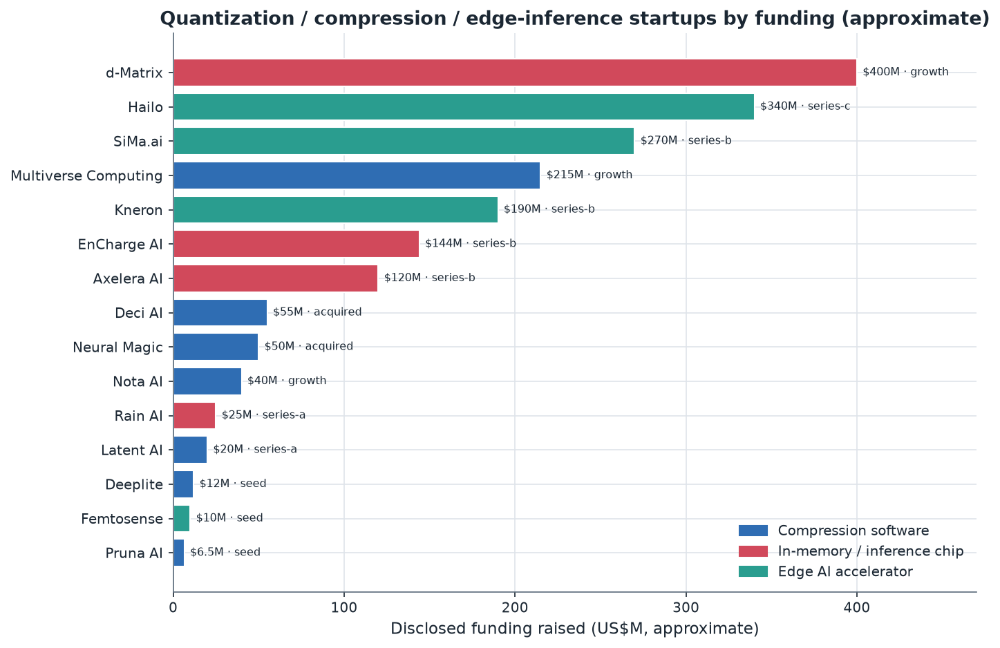
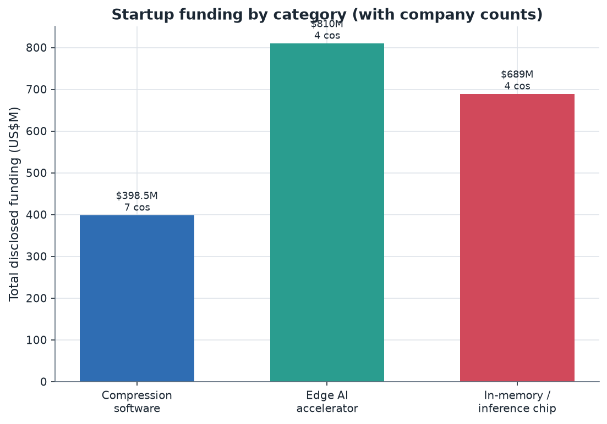

# 13. Startup Landscape

> **Section scope.** The startup ecosystem around model quantization, compression,
> and edge-inference optimization: compression/optimization *software* startups, and
> the *silicon* startups (edge AI accelerators and in-memory-compute chips) whose
> value proposition is intimately tied to low-precision quantized execution. Funding
> figures are approximate and drawn from public reporting (⚠️ funding amounts and
> stages change; treat as directional). The section covers 15 companies across three
> categories, with a competitive table and funding analysis.

## Orientation: three kinds of quantization startup

The startups in this space cluster into three categories, distinguished by *what* they sell:

1. **Compression/optimization software** — companies whose product is tooling that quantizes,
   prunes, distills, and optimizes models for efficient deployment (Neural Magic, Deci, Multiverse,
   Pruna, Nota, Deeplite, Latent AI). Their value is making models smaller and faster via software.
2. **In-memory / novel-compute inference chips** — companies building silicon that attacks the
   data-movement bottleneck (Section 06) with in-memory or analog compute, inherently low-precision
   and thus quantization-dependent (d-Matrix, EnCharge, Axelera, Rain, Mythic). Their value is a
   fundamentally more efficient hardware substrate for quantized inference.
3. **Edge AI accelerators** — companies building dedicated edge-inference chips (not in-memory but
   conventional NPU/accelerator designs) optimized for quantized models (Hailo, SiMa.ai, Kneron,
   Femtosense). Their value is efficient edge silicon for quantized vision/AI.

All three depend on quantization: the software companies *do* quantization, and the hardware companies
*execute* quantized models (in-memory compute is intrinsically low-precision, and edge accelerators
are integer-quantization-optimized). This section maps all three.

A note on scope and confidence: the startup landscape moves fast — funding rounds, acquisitions,
pivots, and shutdowns happen continually — so the figures and statuses here are a snapshot from public
reporting as of the generation date, flagged accordingly (⚠️), and should be verified against current
sources for any decision. The selection of 15 companies is representative rather than exhaustive; the
space includes many more startups (especially in China, less visible in Western reporting, and in the
long tail of seed-stage compression-tooling companies), but the 15 profiled span the categories and
funding stages well enough to characterize the landscape's structure. The goal is to map the shape of
the space — who is building what, funded by whom, betting on which thesis — rather than to catalog every
participant, and the competitive table and funding analysis that follow are calibrated to that goal.

The funding chart (approximate, public reporting) shows the landscape's shape: the best-funded are
the **in-memory-compute chip** startups (d-Matrix, EnCharge) and **edge accelerators** (Hailo,
SiMa.ai, Kneron), reflecting the capital intensity of silicon; the **compression-software** companies
are more capital-efficient (Pruna's $6.5M seed, Deeplite) with the notable exception of Multiverse
Computing ($215M) whose quantum-inspired-compression story attracted unusual funding. The pattern —
hardware startups raise more (silicon is expensive), software startups raise less (but are
capital-efficient) — is characteristic of the deep-tech/AI-infrastructure space.

## Compression and optimization software startups

### Neural Magic (acquired by Red Hat, 2024)

Neural Magic was a leading compression-software company, built around the insight that **sparsity plus
quantization** could make LLMs run efficiently on *CPUs* (via its DeepSparse engine) and GPUs (via
nm-vllm). It combined structured/unstructured sparsity with quantization and optimized kernels, and
was a significant contributor to the open-source vLLM project's quantization support. **Red Hat (IBM)
acquired Neural Magic in November 2024**, folding its expertise into Red Hat's enterprise-AI/OpenShift
AI strategy — a signal that quantization/compression expertise is valuable enough for major
infrastructure players to acquire. Neural Magic's trajectory (from sparsity-on-CPU research to
acquisition) exemplifies the compression-software path: build differentiated optimization technology,
contribute to the open ecosystem, and get acquired by a platform player.

### Deci AI (acquired by NVIDIA, 2024)

Deci built model-optimization software centered on **AutoNAC** (automated neural architecture search
for efficiency) plus quantization and compilation, producing optimized models for edge and cloud
deployment. **NVIDIA acquired Deci in 2024**, integrating its optimization expertise — another
acquisition signaling the strategic value of compression/optimization tooling to the silicon leaders.
Deci's path (optimization software → acquisition by a chip leader) mirrors Neural Magic's.

### Multiverse Computing (CompactifAI)

Multiverse Computing (Spain) is the best-funded compression-software startup, having raised ~$215M
(€189M) in 2025 (Bullhound Capital, HP Tech Ventures, Toshiba, and others), and reportedly seeking a
much larger round. Its product, **CompactifAI**, is a **quantum-inspired compression** technology
(using tensor-network methods derived from quantum-physics simulation) that compresses LLMs
substantially while claiming to preserve performance, producing very small high-performing models. The
quantum-inspired angle is a genuine technical differentiator (tensor-network compression is
mathematically distinct from standard quantization/pruning), and Multiverse has released compressed
versions of open models. Multiverse represents the high-funding, differentiated-technology end of the
compression-software space, betting that a novel compression approach can be a large business.

### Pruna AI

Pruna AI (Munich/Paris) raised a $6.5M seed (2024, EQT Ventures and others) and **open-sourced its
optimization framework** (2025). Pruna's product applies a *combination* of efficiency methods —
caching, pruning, quantization, and distillation — to optimize models, positioning itself as a
comprehensive optimization toolkit rather than a single-technique play. Its open-source strategy
(giving away the framework, monetizing enterprise features/services) is a common modern approach.
Pruna represents the capital-efficient, open-source, comprehensive-optimization end of the
compression-software space.

### Nota AI, Deeplite, Latent AI, and others

Several smaller compression-software companies round out the category. **Nota AI** (Korea) provides
edge model-compression tooling (quantization, pruning) and has commercial traction in automotive and
device markets. **Deeplite** offers quantization-focused optimization tooling targeting very-low-bit
deployment on edge hardware. **Latent AI** (LEIP platform) provides edge-MLOps with quantization and
optimization for constrained devices, with defense/enterprise focus. **Embedl** (Sweden) optimizes
models for embedded/edge deployment. These companies compete in the model-optimization-tooling space,
differentiating on target hardware, technique breadth, and go-to-market (automotive, defense,
enterprise edge). The category is somewhat crowded, and the acquisitions of Neural Magic and Deci
suggest consolidation as the larger players absorb the differentiated technology.

## In-memory and novel-compute inference chips

### d-Matrix

d-Matrix is a leading in-memory-compute chip startup, having reached **unicorn status in 2025** and
raised substantial funding (Corsair product line; investors including Microsoft's venture arm and
others). Its **digital in-memory compute (DIMC)** architecture attacks the data-movement bottleneck
(Section 06) by computing in memory, targeting efficient LLM *inference* in the data center and edge.
d-Matrix's approach is inherently low-precision (in-memory compute has limited precision), so it is
deeply quantization-dependent — its efficiency comes from combining in-memory compute with aggressive
quantization. d-Matrix represents the well-funded, in-memory-compute-for-inference bet, and its
unicorn status signals investor conviction that novel-compute architectures can challenge the
GPU-dominant inference market.

### EnCharge AI

EnCharge AI (a Princeton spinout) raised **$100M+ Series B (Tiger Global, Feb 2025)** for its
**analog in-memory compute** chips. EnCharge's analog approach computes matrix operations in the
analog domain within memory (Section 06's compute-in-memory), promising order-of-magnitude energy
efficiency for AI inference. Analog in-memory compute is inherently low-precision (the analog
computation and ADCs effectively quantize), making EnCharge's technology intimately tied to
quantization — its models must be quantization-aware to match the analog substrate's precision.
EnCharge represents the analog-in-memory-compute frontier, a high-risk, high-reward bet on a
fundamentally more efficient (but harder-to-realize) compute paradigm.

### Axelera AI, Rain AI, Mythic

Several more in-memory/novel-compute chip startups round out the category. **Axelera AI** (Europe)
builds in-memory-compute edge AI accelerators (Metis platform), with EU backing, targeting efficient
edge vision/AI. **Rain AI** (backed by prominent investors including Sam Altman) pursues analog
compute-in-memory for AI. **Mythic** was an analog compute-in-memory pioneer that faced commercial
challenges (a cautionary tale about the difficulty of productizing analog compute). These companies
share the in-memory/analog-compute thesis — attack the data-movement energy bottleneck with novel
hardware — and all are quantization-dependent (novel compute is low-precision). The category is
high-risk: the technology is promising (Section 06's CIM discussion) but productizing it at scale
faces real challenges (analog variability, ADC overhead, programming models), and Mythic's struggles
illustrate the risk. But the potential payoff (order-of-magnitude efficiency) attracts continued
investment.

## Edge AI accelerator startups

### Hailo

Hailo (Israel) is a leading edge-AI-accelerator startup, having raised substantial funding (~$340M
total, Series C) for its edge AI processors (Hailo-8, Hailo-10) targeting efficient quantized
inference in cameras, automotive, robotics, and edge devices. Hailo's chips are optimized for INT8/INT4
quantized vision and increasingly generative models at the edge, competing with the NPUs in general
SoCs by offering higher efficiency for dedicated AI workloads. Hailo represents the well-funded,
dedicated-edge-accelerator bet, and its traction (design wins in automotive, security cameras,
industrial) shows there is a market for dedicated edge AI silicon beyond the general SoC NPUs.

### SiMa.ai, Kneron, Femtosense

**SiMa.ai** (~$270M raised) builds an edge **MLSoC** (machine-learning system-on-chip) for embedded
edge AI (automotive, robotics, industrial), emphasizing power efficiency for quantized inference.
**Kneron** builds edge AI chips for on-device inference (smart home, automotive, security), with a
focus on efficient quantized execution and reconfigurable architecture. **Femtosense** pursues
ultra-low-power tiny NPUs exploiting **sparsity** for always-on tinyML applications, at the extreme-
efficiency end. These edge-accelerator startups compete with the general SoC NPUs (Sections 08-11) and
each other by offering dedicated efficiency for quantized edge AI, differentiating on target market
(automotive, tinyML, security), power budget, and architecture. The category faces the challenge of
competing against the integrated NPUs in general-purpose SoCs, which are "free" with the SoC, so the
edge-accelerator startups must offer meaningfully better efficiency or fit for their target niches.

## The competitive table

The consolidated view of the startup landscape (15 companies; funding approximate, ⚠️ subject to change):

| Startup | Category | Funding (approx) | Stage | Technique focus | Differentiator | Notable investors/status |
|---|---|---|---|---|---|---|
| Multiverse Computing | Compression SW | ~$215M | Growth | Quantum-inspired (tensor-network) LLM compression | Novel tensor-network compression | Bullhound, HP, Toshiba |
| d-Matrix | Inference chip | ~$400M (unicorn) | Growth | Digital in-memory compute | DIMC for LLM inference | Microsoft (M12), others |
| Hailo | Edge accelerator | ~$340M | Series C | INT8/INT4 edge inference | Dedicated edge AI processor | Automotive/security wins |
| SiMa.ai | Edge accelerator | ~$270M | Series B | Edge MLSoC | Power-efficient embedded ML | Fidelity, Dell |
| Kneron | Edge accelerator | ~$190M | Series B | Edge AI chips | Reconfigurable edge NPU | Horizons, Sequoia (CN) |
| EnCharge AI | Inference chip | ~$144M | Series B | Analog in-memory compute | Analog CIM energy efficiency | Tiger Global (Princeton) |
| Axelera AI | Inference chip | ~$120M | Series B | In-memory edge accelerator | European CIM edge | EU/EIC backing |
| Deci AI | Compression SW | ~$55M | Acquired | NAS + quant + compile | AutoNAC optimization | Acquired by NVIDIA (2024) |
| Neural Magic | Compression SW | ~$50M | Acquired | Sparsity + quantization | CPU/GPU sparse-quant inference | Acquired by Red Hat (2024) |
| Nota AI | Compression SW | ~$40M | Growth | Edge model compression | Automotive/device traction | Korean market |
| Rain AI | Inference chip | ~$25M | Series A | Analog compute-in-memory | Brain-inspired analog | Sam Altman, others |
| Latent AI | Compression SW | ~$20M | Series A | Edge MLOps + quant | Defense/enterprise edge | Steve Case (Rise of Rest) |
| Deeplite | Compression SW | ~$12M | Seed | Very-low-bit quantization | Extreme edge compression | — |
| Femtosense | Edge accelerator | ~$10M | Seed | Sparsity tiny NPU | Ultra-low-power always-on | — |
| Pruna AI | Compression SW | ~$6.5M | Seed | Caching+prune+quant+distill | Open-source comprehensive optimization | EQT Ventures |

## Funding trends and market dynamics

The funding-by-category view reveals the landscape's economics: **inference-chip and edge-accelerator
startups have raised far more total capital than compression-software startups**, reflecting silicon's
capital intensity (fabricating chips requires tens to hundreds of millions), while compression-software
is more capital-efficient (software scales cheaply). This has strategic implications: the
hardware-startup path requires huge capital and faces the challenge of competing with entrenched
silicon giants (NVIDIA, Qualcomm) and the integrated NPUs in general SoCs, making it high-risk despite
the funding; the software-startup path is capital-efficient but faces commoditization pressure (much
quantization tooling is open-source and free) and consolidation (Neural Magic and Deci were acquired).
The funding trends over 2024-2025 show continued strong investment in **in-memory-compute chips**
(d-Matrix's unicorn status, EnCharge's Series B) — betting on novel-compute architectures to challenge
the GPU-dominant inference market — and in **compression software with a differentiated angle**
(Multiverse's quantum-inspired approach attracting $215M). The market dynamics suggest: hardware
startups are betting on the data-movement bottleneck (Section 06) that quantization only mitigates,
software startups are betting on optimization expertise that the open-source ecosystem partly
commoditizes, and consolidation (acquisitions by Red Hat, NVIDIA) is underway as platform players
absorb differentiated technology.

## Strategic assessment: where the value is

The startup landscape raises a strategic question: where is the durable value in quantization/
compression, given that much of the *technique* is open-source and commoditized? Several answers emerge
from the landscape:

- **Novel compute hardware** (in-memory, analog) offers durable value if it works, because a
  fundamentally more efficient substrate cannot be replicated in software — but the technology risk is
  high (Mythic's struggles), and it competes with entrenched silicon.
- **Differentiated compression technology** (Multiverse's tensor-network approach) offers value if it
  meaningfully beats the open-source methods, but must stay ahead of a fast-moving open field.
- **Vertical/go-to-market focus** (Nota in automotive, Latent AI in defense, edge accelerators in
  specific markets) offers value through domain expertise and integration, even if the core technique
  is commoditized.
- **Optimization-as-a-service and MLOps** (Pruna, Latent AI) offers value by reducing the friction of
  applying open techniques, monetizing convenience and integration rather than the technique itself.

The commoditization pressure is real — the open-source quantization ecosystem (Section 12's tooling)
provides much of the core capability for free — so startups must offer something the open ecosystem
does not: novel hardware, differentiated technology, vertical integration, or convenience. The
acquisitions (Neural Magic, Deci) suggest that even successful compression-software companies often
exit via acquisition (their technology valuable to a platform player) rather than becoming standalone
giants, while the hardware startups (d-Matrix, EnCharge, Hailo) are betting on becoming independent
silicon companies — a higher-risk, higher-reward path.

## In-memory compute: the technology bet in depth

The in-memory-compute (CIM) startups (d-Matrix, EnCharge, Axelera, Rain, Mythic) deserve deeper
treatment because they represent the most technically ambitious — and most quantization-dependent — bet
in the landscape. As Section 06 established, the fundamental energy bottleneck in AI inference is
data movement: moving weights from memory costs far more energy than computing on them. In-memory
compute attacks this directly by performing the matrix-multiply operations *inside or adjacent to the
memory array* where the weights are stored, so the weights never move to a separate compute unit. Two
flavors exist. **Analog CIM** (EnCharge, Rain, Mythic) uses the physics of memory devices — the summed
currents on a bit-line naturally compute a dot product — to perform matrix-vector multiplication in the
analog domain in a single step, promising order-of-magnitude energy efficiency. **Digital CIM** (d-Matrix)
performs the computation digitally but adjacent to the memory, avoiding the long data movement while
retaining digital precision and programmability. Both are intimately tied to quantization: analog CIM is
inherently low-precision (the analog computation, and the analog-to-digital converters that read the
results, effectively quantize to a limited number of bits), so models must be quantization-aware to match
the analog substrate's precision — the quantization and the hardware are co-designed. Digital CIM is more
precision-flexible but still benefits enormously from quantization (fewer bits means less memory and
less digital compute). The bet these startups make is that the data-movement bottleneck is so
fundamental that a hardware architecture attacking it directly can be dramatically more efficient than
the GPU/NPU approach that quantization only *mitigates*. The risk is equally fundamental: analog CIM
faces device variability (analog is noisy), ADC overhead (converting analog results to digital costs
energy and area, potentially eroding the gains), programming-model challenges (mapping arbitrary models
onto the fixed CIM array), and the difficulty of matching the precision that software expects. Mythic's
commercial struggles are the cautionary tale — the analog-CIM promise is real but productizing it at
scale has proven hard. Digital CIM (d-Matrix) is lower-risk (digital precision, easier programming) but
offers less extreme efficiency than analog. The CIM startups are, in essence, betting that the
quantization-hardware co-design can be pushed to its logical conclusion — hardware that computes where
the (quantized) data lives — and that this is worth the substantial technology risk. If they succeed,
they would make aggressive quantization not just beneficial but mandatory (the analog substrate demands
it), tightening the quantization-hardware bond further; if the technology risk proves too high, they
join the long list of novel-compute efforts that promised much and delivered less. The heavy funding
(d-Matrix unicorn, EnCharge $144M) reflects investor conviction that the potential payoff justifies the
risk, and the CIM bet is the most-watched hardware direction in the startup landscape.

## Cloud-inference-optimization startups

A category adjacent to but distinct from the edge-focused startups is the **cloud-inference-optimization**
companies, which deserve mention because quantization is central to their offering even though their
venue is the data center. Companies like **Together AI**, **Fireworks AI**, **Baseten**, **Deepinfra**,
and others provide fast, cost-efficient LLM inference as a service, and a core part of how they achieve
low cost and high throughput is *aggressive quantization* — serving models at FP8, INT4 weight-only, or
lower, with quantized KV caches, using the optimized kernels of Section 05. These companies compete on
inference cost-per-token and latency, and quantization is one of their primary levers (alongside
batching, kernel optimization, and hardware choice). While they are not "quantization startups" per se
(their product is inference service, not quantization tooling), quantization is central to their
economics, and they are significant *consumers and advancers* of quantization technology — some
contribute to the open-source quantization ecosystem (kernels, methods) and push the practical frontier
of what quantization can do in production serving. Their existence illustrates that quantization's
commercial value extends beyond selling quantization tools to *using* quantization to deliver
cost-efficient AI services — arguably the largest commercial application of quantization, since these
companies serve enormous inference volume and their cost advantage depends substantially on quantization.
The inference-service market is large and growing, and quantization is a key competitive lever within it,
making these companies an important part of the quantization commercial landscape even though they sit
adjacent to the pure-play quantization startups.

## Cautionary tales: the risk in the landscape

An honest account of the startup landscape includes the failures and struggles, which illuminate the
risks. **Mythic**, the analog-CIM pioneer, faced severe commercial and financial difficulties despite
promising technology, illustrating how hard productizing analog compute is — the gap between a working
demo and a manufacturable, programmable, precision-adequate product proved large. **Untether AI**, an
at-memory-compute startup, wound down its independent operations with its technology/team reportedly
going to AMD (2025), a "soft landing" that is a common outcome for hardware startups that build valuable
technology but cannot achieve independent commercial scale. **OctoML**, built around the Apache TVM
compiler (a quantization-and-optimization tooling play), pivoted away from its original model-optimization
focus toward a different business before being largely absorbed — illustrating the commoditization
pressure on compression-tooling startups (TVM is open-source, making it hard to build a large business
purely on optimization tooling). These cautionary tales share themes: hardware startups face immense
capital requirements and technology risk (Mythic, Untether), and software startups face commoditization
from the open-source ecosystem (OctoML) — the two structural challenges the whole landscape navigates.
They also show the common outcomes: acqui-hire/asset-sale to a larger player (Untether → AMD, and the
successful acquisitions of Neural Magic and Deci), pivot (OctoML), or struggle (Mythic). The startup
landscape is dynamic and risky, and for every well-funded success there are efforts that struggled — a
normal feature of a deep-tech frontier, but important to note against the funding-chart optimism. The
lesson for assessing the landscape is that the funding and the technology promise are real, but so are
the risks, and the eventual outcomes will include failures and acqui-hires alongside the independent
successes.

## Geographic distribution of quantization startups

The startup landscape has a distinctive geographic distribution worth mapping. **The US** hosts many of
the leading startups — d-Matrix, EnCharge (Princeton), Rain, SiMa.ai, Latent AI, Femtosense, and the
cloud-inference companies (Together, Fireworks, Baseten) — reflecting Silicon Valley's deep-tech venture
ecosystem and proximity to the AI-model companies. **Europe** has a growing cluster — Multiverse (Spain),
Axelera (Netherlands/Europe), Pruna (Germany/France), Embedl (Sweden) — supported by EU deep-tech funding
initiatives (the EIC and others) and a strong academic base (IST Austria, ETH from Section 12). **Israel**
has Hailo, reflecting its strong chip-design ecosystem. **Asia** has Kneron (Taiwan/US), Nota AI (Korea),
and a growing set of Chinese startups (less visible in Western reporting, and shaped by the geopolitical
dynamics of Section 11 — China has many domestic AI-chip and compression startups building for the
domestic market and the sanctions-constrained-hardware context). This distribution mirrors the broader
semiconductor and AI-startup geography: US-led with strong European (increasingly), Israeli, and Asian
clusters, and a partially-separate Chinese ecosystem. The geographic spread matters because it shows
quantization/compression is a globally-pursued commercial opportunity, not concentrated in one region,
and because the different regions' funding environments (US venture depth, EU deep-tech grants, Asian
manufacturing proximity, Chinese domestic focus) shape what kinds of startups thrive where. The European
cluster in particular has grown notably, supported by both venture capital (Multiverse's large raise) and
public deep-tech funding, reflecting Europe's push to build sovereign AI-infrastructure capability.

## The venture thesis: why invest in quantization startups

Understanding *why* investors fund these startups clarifies the landscape's logic. The venture thesis has
several strands. First, **AI inference cost is enormous and growing** — as AI deployment scales, the cost
of running models (dominated by inference, since a model is trained once but served billions of times)
becomes a massive market, and anything that reduces inference cost (quantization, efficient hardware) has
a large addressable market. Second, **the data-movement bottleneck is fundamental** — the physics that
makes data movement the energy bottleneck (Section 06) is not going away, so hardware that attacks it
(in-memory compute) could capture value that software optimization cannot, justifying the capital-
intensive hardware bets. Third, **the incumbents' dominance creates opportunity** — NVIDIA's dominance in
AI compute makes investors eager to fund challengers (d-Matrix, EnCharge) that might capture a slice of
the inference market with a differentiated architecture, and the strategic value of not being
NVIDIA-dependent attracts both venture and strategic (Microsoft, others) investment. Fourth, **the edge/
on-device market is growing** — as on-device AI expands (Sections 08-11), dedicated edge accelerators
(Hailo, SiMa.ai) and edge-optimization software (Nota, Latent AI) have a growing market. The thesis
against these startups is the commoditization of quantization *technique* (open-source) and the
difficulty of competing with entrenched silicon and integrated NPUs — which is why the winning startups
must offer novel hardware, differentiated technology, or vertical focus. The venture activity reflects a
belief that the AI-inference-efficiency market is large enough, and the incumbents beatable enough, to
justify the bets, tempered by the recognition (via acquisitions and struggles) that many will exit via
acquisition rather than independent scale. The thesis is fundamentally about capturing value from the
enormous and growing cost of AI inference, with quantization as a central lever.

## The build-versus-buy dynamic and consolidation

The acquisitions of Neural Magic (Red Hat) and Deci (NVIDIA), and the asset-sales (Untether → AMD),
illustrate a **build-versus-buy dynamic** that is shaping the landscape and likely to intensify. For the
platform players (NVIDIA, Red Hat/IBM, AMD, the cloud providers), quantization/compression expertise is
strategically valuable but not necessarily worth building from scratch when a startup has already built
differentiated technology and a team — so acquisition is attractive. For the startups, acquisition is
often the realistic exit (becoming an independent giant in a market dominated by NVIDIA and the SoC
vendors is hard), so building differentiated, acquirable technology is a rational strategy. This dynamic
produces **consolidation**: the compression-software space in particular is consolidating as platform
players absorb the differentiated startups (Neural Magic, Deci), and further consolidation is likely as
the open-source ecosystem commoditizes the baseline capability, leaving room only for genuinely
differentiated players who then become acquisition targets. The hardware startups are somewhat different —
their capital intensity and the strategic importance of independent AI-compute alternatives (not
NVIDIA-dependent) may support more independent outcomes (d-Matrix aiming to be an independent inference-
silicon company), though acqui-hires (Untether) also occur. The consolidation dynamic suggests the
startup landscape is entering a maturation phase where the differentiated players get acquired or scale,
the me-too players struggle against open-source commoditization, and the field's commercial value
increasingly accrues to the platform players who acquire the innovation. This is a normal maturation
pattern for a deep-tech field, and it means the startup landscape of a few years hence will likely be
more consolidated, with the surviving independents being those with the most defensible technology
(novel hardware, genuinely differentiated compression) and the rest absorbed into the platforms.

## Startups and the open-source ecosystem

A defining tension for the compression-software startups is their relationship to the **open-source
quantization ecosystem** (Section 12's tooling), which both enables and threatens them. On one hand, the
open-source methods (GPTQ, AWQ, bitsandbytes, GGUF) and frameworks provide a foundation these startups
build on — they do not need to invent quantization from scratch. On the other hand, the same open-source
availability commoditizes the baseline capability: if anyone can quantize a model to 4-bit with free
open-source tools, a startup selling "we quantize your model to 4-bit" has no defensible business. This
tension shapes the compression-software startups' strategies in several ways. Some **contribute to and
build on open source while monetizing services and enterprise features** (Pruna open-sourced its
framework and monetizes enterprise/hosted offerings; Neural Magic contributed heavily to vLLM while
selling enterprise inference). Some **offer differentiated technology beyond the open-source baseline**
(Multiverse's tensor-network compression, Deci's AutoNAC) that the open ecosystem does not provide. Some
**focus on the integration and operational burden** — the open techniques exist but applying them well
across many models and targets is real work, so optimization-as-a-service and MLOps (Latent AI, Pruna)
monetizes convenience. And the acquisitions (Neural Magic, Deci) partly reflect that the standalone
compression-software business is hard to sustain against open-source commoditization, making acquisition
by a platform player (that values the technology and team) a natural outcome. The relationship with open
source is thus double-edged: it is the foundation the startups build on and the force that commoditizes
their core, pushing them toward differentiation, services, verticals, or acquisition. This dynamic is
specific to the software startups; the hardware startups (whose value is physical silicon that cannot be
open-sourced away) face a different competitive structure (capital and technology risk rather than
commoditization). The open-source relationship is arguably the defining strategic challenge for the
compression-software category, and how each company navigates it — build on it, differentiate beyond it,
or monetize around it — largely determines its prospects.

## The historical waves of quantization startups

The current startup landscape is the latest of several waves, and the history contextualizes it. An
**early wave** (roughly 2016-2019) rode the first enthusiasm for edge AI and model efficiency — companies
building edge accelerators (some now mature, like Hailo, founded 2017) and early compression tooling
(some pivoted or were absorbed). A **middle wave** (roughly 2019-2022) came as edge AI matured and the
efficient-ML techniques (pruning, quantization, NAS) became commercially relevant — Deci (founded 2019),
Neural Magic (founded 2018, building on MIT sparsity research), and others built optimization businesses.
The **current wave** (2022-present) is driven overwhelmingly by the **LLM explosion** — the sudden need
to compress and efficiently serve large language models created a large new market, driving both the
compression-software companies (Multiverse, Pruna) targeting LLM compression and the in-memory-compute
chip companies (d-Matrix, EnCharge) betting that LLM inference cost justifies novel hardware. The LLM
wave is distinctive because the market is so large (LLM inference is a massive and growing cost) and the
technical need so acute (models too big to run without compression), attracting more capital than the
earlier waves — hence d-Matrix's unicorn status and Multiverse's $215M raise. Reading the waves, the
pattern is that each new AI capability that strains hardware (edge vision, then efficient ML, then LLMs)
creates a startup wave around the compression and efficient-hardware needed to deploy it, and the current
LLM-driven wave is the largest because LLMs strain hardware the most. The next wave (Section 14) may be
driven by multimodal/diffusion on-device, agentic AI's sustained inference, or the maturation of
in-memory compute — each a potential catalyst for the next generation of quantization/efficiency
startups. The historical pattern suggests the startup landscape will continue to evolve in waves tied to
the AI capabilities that most strain the available hardware, with quantization/efficiency the perennial
response.

## Edge-accelerator competitive dynamics

The edge-AI-accelerator startups (Hailo, SiMa.ai, Kneron, Femtosense) face a distinctive competitive
challenge worth examining: they compete not only with each other but with the **integrated NPUs in
general-purpose SoCs** (Sections 08-11), which are "free" with the SoC a device already needs. This makes
the edge-accelerator value proposition specific — they must offer meaningfully better efficiency,
performance, or fit for their target niche than the general SoC's NPU, or serve markets where a dedicated
accelerator makes sense (high-volume dedicated devices like security cameras, automotive perception,
industrial vision, where a purpose-built chip's efficiency justifies its inclusion). Hailo has succeeded
by targeting exactly these markets (automotive, security, industrial) where dedicated efficiency matters
and the general SoC NPU is insufficient or absent. SiMa.ai targets embedded/automotive edge with its
MLSoC. Kneron targets on-device inference for smart devices. Femtosense targets the ultra-low-power
tinyML niche where even the smallest general NPU is too power-hungry. The common strategy is **niche focus**
— serving markets where dedicated quantized-inference silicon has a clear advantage over general-purpose
NPUs. The risk is that the general SoC NPUs keep improving (Sections 08-11's rapid NPU scaling), eroding
the dedicated accelerators' advantage over time, and that the target markets may not be large enough to
sustain independent silicon companies. The edge-accelerator startups' quantization dependence is total —
their chips exist to run quantized (INT8/INT4) models efficiently, and their competitive advantage is
precisely superior quantized-inference efficiency for their niche. Their success depends on staying ahead
of the general NPUs' improvement and on their target markets growing enough to support independent silicon
businesses — a real but bounded opportunity that has produced some successes (Hailo's traction) and will
likely see consolidation as the general NPUs improve and the markets mature.

## Quantization startups in the AI-infrastructure stack

Positioning the startups within the broader **AI-infrastructure stack** clarifies their role and the value
they capture. The stack runs from silicon (chips) up through systems software (compilers, runtimes) to
model-serving and applications. The quantization/compression startups occupy specific layers: the
**hardware startups** (d-Matrix, EnCharge, Hailo, etc.) are at the silicon layer, offering alternative
compute substrates; the **compression-software startups** (Multiverse, Pruna, Deci, Neural Magic) are at
the model-optimization layer, transforming models for efficient deployment; and the **cloud-inference
companies** (Together, Fireworks) are at the serving layer, using quantization to deliver efficient
inference. This layering shows that quantization is a *cross-cutting* concern in the infrastructure stack
— it appears at the silicon layer (hardware that executes quantized models), the optimization layer
(software that quantizes), and the serving layer (services that deploy quantized models) — and startups
target each layer. The value capture differs by layer: silicon startups capture value if their hardware
is adopted (high risk, high reward, capital-intensive); optimization-software startups capture value if
their tooling is differentiated (medium risk, commoditization pressure); serving companies capture value
from the inference market directly (using quantization as a cost lever). The incumbents (NVIDIA, the SoC
vendors, the cloud providers) span these layers too, which is the competitive context — the startups are
attacking specific layers where they believe they can offer more than the incumbents. Understanding this
layering helps assess each startup: a silicon startup competes with NVIDIA and the SoC vendors at the
hardware layer, a software startup competes with the open-source ecosystem and the platform players'
tooling, and a serving company competes with the cloud providers and other inference services. The
quantization-startup landscape is thus best understood not as a single market but as startups attacking
different layers of the AI-infrastructure stack, unified by their reliance on quantization as the enabling
technology, and each facing the specific competitive dynamics of its layer.

## What success looks like: metrics and outcomes

Finally, what does success look like for these startups, and how is it measured? For the **hardware
startups**, success means design wins (getting their chips into products or data centers), performance/
efficiency benchmarks that beat the incumbents for their target workloads, and ultimately either
independent scale (becoming a real silicon company, d-Matrix's aspiration) or a valuable acquisition. The
key metrics are performance-per-watt and cost-per-inference versus NVIDIA/incumbents, and design-win
traction. For the **compression-software startups**, success means adoption of their tooling, measurable
efficiency gains for customers (compression ratio, speedup, accuracy retention), and either a sustainable
services/enterprise business or a valuable acquisition (Neural Magic, Deci). The key metrics are the
efficiency their tooling delivers and their commercial traction against the free open-source alternatives.
For the **serving companies**, success is inference-market share and cost-per-token competitiveness, with
quantization a key lever. Across all, the ultimate outcomes are: independent scale (rare, hard against
incumbents), acquisition (common, the realistic exit for many), or struggle/failure (the risk). The
landscape will produce all three, and assessing any individual startup requires looking past the funding
headlines to the real metrics — efficiency delivered, adoption/design wins, and competitive position
against both incumbents and open-source. The funding is a leading indicator of investor conviction but
not of eventual success; the deep-tech graveyard (Mythic's struggles, various shutdowns) is a reminder
that promising technology and substantial funding do not guarantee outcomes in this capital-intensive,
incumbent-dominated, open-source-pressured space. The realistic expectation is a landscape that produces a
few independent successes (likely among the well-funded hardware startups with genuinely differentiated
technology), many acquisitions (the differentiated software startups absorbed by platforms), and some
failures — the normal distribution of outcomes for a deep-tech frontier, playing out over the coming
years as the field matures.

## The strategic and sovereign-AI dimension

A dimension gaining importance is the **strategic and sovereign-AI** angle to quantization/efficiency
startups, which shapes funding and outcomes beyond pure commercial logic. Governments and strategic
investors increasingly view AI-compute capability — including efficient-inference and compression
technology — as strategically important, not just commercially valuable. This manifests in several ways.
The **European** deep-tech funding (EU/EIC support for Axelera, and the general European push for
sovereign AI-infrastructure capability) reflects a desire not to depend entirely on US (NVIDIA) and Asian
silicon, making efficient-inference startups strategically as well as commercially interesting to European
funders — Multiverse's large raise and Axelera's EU backing partly reflect this. **China's** domestic
AI-chip and compression ecosystem (Section 11) is heavily shaped by the strategic imperative to build
sanctions-resilient AI capability, where quantization is doubly important (fitting models on constrained
domestic hardware), driving domestic startup activity with strategic backing. **Strategic corporate
investors** (Microsoft in d-Matrix, HP and Toshiba in Multiverse, and others) invest partly for strategic
access to efficient-inference technology and to hedge against NVIDIA dependence, not just for financial
return. This strategic dimension means some quantization/efficiency startups are funded and sustained by
more than pure venture economics — they serve national or corporate strategic goals of AI-compute
independence and efficiency, which can provide funding and patience beyond what commercial metrics alone
would justify. It also means the landscape is shaped by the broader geopolitics of AI compute (Section
11's bifurcation theme), with efficient-inference and compression technology seen as a lever for reducing
dependence on the dominant (NVIDIA/US) AI-compute supply. For assessing the landscape, this strategic
dimension is a real factor — it explains some of the funding (strategic as well as financial) and suggests
that efficient-inference startups may find support (public and strategic-corporate) beyond pure venture
capital, particularly outside the US where AI-compute sovereignty is a policy priority. The strategic
importance of AI-compute efficiency, of which quantization is central, thus extends the startup landscape's
significance beyond commerce into the geopolitics of AI infrastructure.

## Synthesis

The quantization/compression startup landscape spans three categories — compression software, in-memory/
novel-compute chips, and edge accelerators — all fundamentally dependent on quantization. The hardware
startups raise far more capital (silicon is expensive) and bet on novel compute to attack the
data-movement bottleneck; the software startups are capital-efficient but face commoditization from the
open-source ecosystem and consolidation via acquisition (Neural Magic → Red Hat, Deci → NVIDIA). The
best-funded companies are the in-memory-compute chips (d-Matrix unicorn, EnCharge) and edge accelerators
(Hailo, SiMa.ai), with Multiverse the software outlier on funding via its quantum-inspired
differentiation. The durable value lies in novel hardware (if it works), genuinely differentiated
technology, vertical focus, or convenience — because the core quantization *techniques* are largely
open-source and commoditized. The landscape is dynamic, with active funding, ongoing consolidation, and
the persistent tension between the commercial value of quantization (large, given AI's deployment costs)
and the difficulty of capturing that value when the techniques are open. For the broader picture, the
startup ecosystem is a healthy sign of the field's commercial importance, a source of hardware
innovation (in-memory compute) that the incumbents are watching, and a talent pipeline connected to the
research groups of Section 12.

Several forward-looking observations complete the picture. The landscape is entering a **maturation and
consolidation phase**: the open-source commoditization of quantization technique and the acquisitions of
differentiated players (Neural Magic, Deci) signal that the standalone compression-software business is
hard to sustain, while the capital-intensive hardware startups are the ones betting on independent scale,
with outcomes that will include a few independent successes, many acquisitions, and some failures. The
**in-memory-compute bet** is the most technically ambitious and most-watched — if it matures it would
reshape the inference-hardware market and deepen the quantization-hardware co-design; if the technology
risk proves too high (as Mythic's struggles warn), it joins the long history of novel-compute efforts
that promised more than they delivered. The **strategic dimension** (sovereign AI, reducing NVIDIA
dependence) is increasingly shaping funding beyond pure commercial logic. And the **next wave** of
startups will likely be catalyzed by whatever AI capability next most strains hardware — multimodal and
diffusion on-device, agentic AI's sustained inference, or the maturation of novel compute — with
quantization the perennial response. For anyone tracking the commercial edge of quantization, the startup
landscape is where the hardware innovation and go-to-market experimentation happen, and its
consolidation, its in-memory-compute bets, and its strategic entanglements are the developments to watch
as the field's commercial structure matures.

## Master database contributions

This section contributes startup entities to the master database (Section 16): Multiverse Computing,
d-Matrix, EnCharge AI, Hailo, SiMa.ai, Kneron, Axelera AI, Neural Magic, Deci AI, Nota AI, Rain AI,
Latent AI, Deeplite, Femtosense, and Pruna AI — see Section 16.

---

*Next: [14 — Future Roadmap (Next 3–5 Years)](./14-future.md).*
