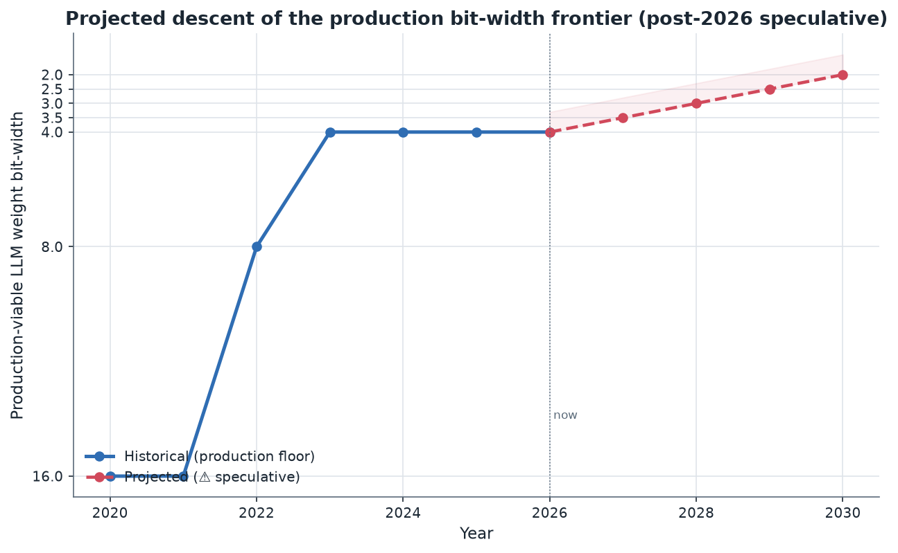
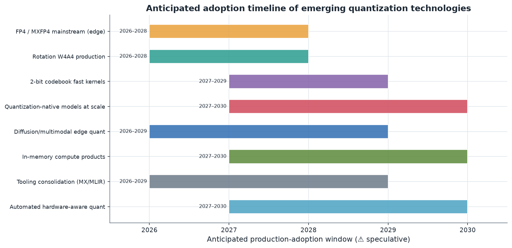
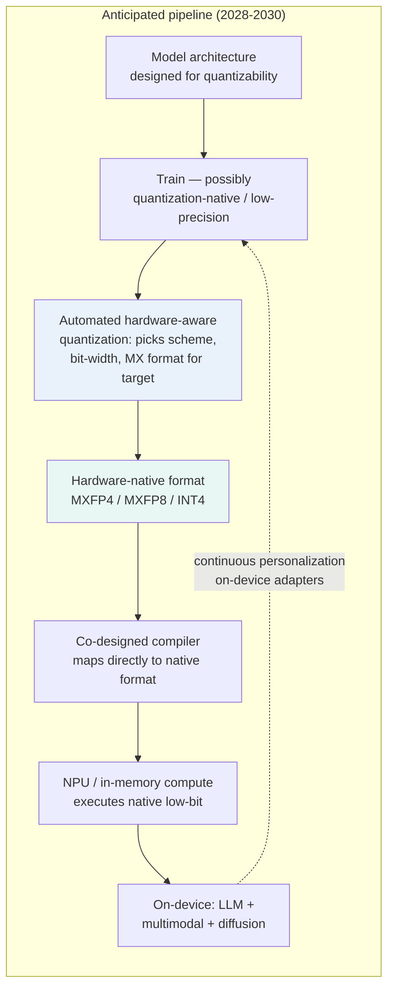

# 14. Future Roadmap (Next 3–5 Years)

> **Section scope.** Where quantization for edge AI is heading over roughly
> 2026–2030: the viability of sub-4-bit quantization, the revival of extreme/binary
> quantization via quantization-native training, quantization for multimodal and
> diffusion models on edge, co-design trends (quantization-native architectures and
> hardware-aligned formats), and the likely consolidation in tooling. **All
> forward-looking claims in this section are speculative (⚠️) — they are informed
> projections from current trajectories, not predictions, and the confidence
> discipline of the whole database applies with extra force here.**

## The shape of the projection

The safest forward-looking statement is that the patterns of the past decade will continue: the
production bit-width floor will keep descending, the research frontier will stay a few bits ahead, and
the binding problem will remain the accuracy-deployability gap at the frontier while the solved regimes
(INT8, 4-bit weight-only) stay stable and ubiquitous.

The projection chart extrapolates the production LLM-weight bit-width floor: historically 16→8→4 bits
by 2023, and speculatively descending toward 3, 2.5, and perhaps 2 bits by 2030 as the sub-4-bit
methods mature. The shaded uncertainty band and dashed line emphasize that the post-2026 trajectory is
speculative — whether 2-bit becomes a *general* production floor by 2030 depends on research progress
(closing the accuracy gap), kernel maturation (fast decode), and hardware support, none guaranteed. The
more confident claim is directional: the floor will keep descending, just as it has, with the pace set
by hardware and tooling rather than algorithms alone.

A methodological note frames the whole section. Forecasting a field that moved from "INT8 is hard" to
"2-bit is demonstrated and FP4 hardware ships" in roughly three years (Section 02) is inherently
hazardous, and the past decade's biggest developments — the speed of the LLM-quantization wave, the
revival of ternary via BitNet, the microscaling-format standardization — were not widely predicted in
advance. This section therefore emphasizes *directions and forces* over dated predictions, grades its
confidence explicitly, and gives scenario ranges rather than point estimates where the uncertainty is
genuine. The aim is to be useful for planning — telling the reader what is safe to build on, what to
watch, and what could surprise — rather than to make confident calls a fast-moving field will likely
falsify. Read the specifics as informed possibilities and the overall trajectory as the well-supported
through-line.

The adoption-timeline chart lays out anticipated production-adoption windows for the emerging
technologies this section discusses (all ⚠️ speculative): FP4/MXFP4 going mainstream on edge, rotation
methods reaching production for W4A4, 2-bit codebook methods getting fast kernels, quantization-native
models scaling, diffusion/multimodal edge quantization maturing, in-memory compute reaching products,
tooling consolidating around MX/MLIR, and automated hardware-aware quantization arriving. These windows
are informed estimates, not commitments, and the actual timing will depend on the research and
engineering progress discussed below.

## Sub-4-bit quantization: from frontier to (partial) production

The most consequential near-term question is whether **sub-4-bit quantization** — 3-bit and 2-bit —
crosses from research frontier to production default, and the likely answer is a qualified, gradual yes.
The pieces are converging: the accuracy methods exist (QuIP#, AQLM for 2-bit; rotation methods for
W4A4), the hardware is arriving (Qualcomm's INT2, NVIDIA's FP4, the MX formats), and the memory pressure
(fitting ever-larger models on-device) creates demand. The gating factors are (1) closing the remaining
accuracy gap at 2-bit for hard tasks (reasoning, code), where current methods still lose meaningful
capability; (2) fast kernels for the codebook methods, whose decode complexity currently limits
throughput; and (3) the model-size interaction (Section 07) — 2-bit works better on larger models, so
2-bit may become viable for large models before small ones. The likely trajectory: 3-bit becomes a
practical option for memory-constrained deployments in the near term, and 2-bit becomes viable for
large models where the memory pressure justifies the accuracy cost and the kernels mature, but a
*general* 2-bit production floor (all models, all tasks) remains uncertain within the 5-year window. The
more confident claim is that sub-4-bit moves from "research-only" to "used where memory forces it,"
expanding its production footprint without necessarily becoming the universal default — the same
gradual-adoption pattern INT4 followed, but harder because the accuracy cliff below 4 bits is steeper.

## Extreme and binary quantization revival via native training

The **quantization-native training** direction (BitNet lineage, Section 05/12) is the wildcard that
could reshape the field. If training models to be natively low-precision (ternary, or even binary)
scales to frontier sizes and holds on hard tasks, it would change the paradigm: post-training
quantization becomes unnecessary for models trained that way, and the extreme-low-bit regimes (1-1.58
bits) that failed as post-training compression become viable as native architectures. The appeal is
substantial — ternary/binary models have matmul-free, addition-dominant compute that is dramatically
more energy-efficient and enables radically simpler (and cheaper) hardware, including custom accelerators
and in-memory compute (Section 13). The open questions are equally substantial and unresolved: whether
native low-bit training scales to the largest models, whether it holds on reasoning and other hard
capabilities, whether the training is stable and efficient, and whether the ecosystem (which is built
around post-training quantization of standard models) would adopt a fundamentally different training
paradigm. The likely near-term outcome: quantization-native training continues as an active,
closely-watched research program with growing but not yet frontier-scale demonstrations, and its
production impact within 5 years is uncertain — it could remain a research curiosity, or it could be the
beginning of a paradigm shift, and which is genuinely unknown (⚠️ high uncertainty). It is the direction
most likely to produce a surprise, positive or negative, and it deserves the closest watching.

## Quantization for multimodal and diffusion models on edge

A near-certain trend is that quantization for **multimodal and diffusion models** on edge will mature,
because the demand (on-device image/video generation, multimodal assistants) is growing and the current
methods lag LLM quantization. Diffusion models pose the distinctive challenge of per-step error
compounding (Section 03/07), and the research to address it — timestep-aware quantization, methods that
account for the denoising trajectory, and quantization-aware fine-tuning for diffusion — is active and
will likely produce production-viable sub-8-bit diffusion quantization within the window. Multimodal
models (vision-language) will get calibration and quantization methods that account for their
cross-modal structure. The likely trajectory: on-device image generation (already demonstrated at INT8,
Section 09) becomes more efficient and higher-quality via better quantization, and on-device multimodal
assistants (combining quantized vision and language) become common, with the quantization methods for
these modalities maturing from their current relative immaturity toward the robustness LLM quantization
already has. This is one of the more confident predictions because the demand is clear and the research
direction is established — it is a matter of engineering effort catching up to a known need, following
the pattern by which LLM quantization matured a few years earlier. The edge devices' growing capability
(Sections 08-11) plus maturing multimodal/diffusion quantization will make on-device generative AI
extend well beyond text within the window.

## Co-design trends: quantization-native architectures and hardware-aligned formats

The deepest trend, continuing the co-design thesis of Section 06, is the further **merging of
quantization with hardware and architecture**. Three sub-trends:

- **Hardware-aligned formats become the norm.** The microscaling (MX) formats (MXFP4, MXFP8), which bake
  per-group quantization into the numeric type, will likely become the standard sub-8-bit hardware
  numerics as silicon adopts them (NVIDIA already, mobile vendors following). This closes the
  algorithm-hardware gap by making the hardware natively understand the quantization structure, and it
  will simplify the stack (the algorithm targets the hardware's native format rather than managing scales
  separately). Expect MX formats to spread across edge silicon and become a primary target.
- **Quantization-native architectures.** Beyond BitNet, expect architectures designed from the start to
  quantize well — activation functions and attention mechanisms that suppress outlier formation, and
  structures amenable to low-bit representation. Neural architecture search will increasingly optimize
  for quantizability, producing models that are efficient *because* they were designed to be quantized.
- **Deeper hardware-software co-optimization.** The compiler, the format, the algorithm, and the hardware
  will be co-designed more tightly, with automated tools (below) that jointly optimize the whole stack
  for a target. The boundary between "quantization algorithm" and "hardware format" will blur further,
  as it already has with MX.

These co-design trends are the most confident structural prediction: the field has been moving toward
algorithm-hardware co-design for years (Section 06), and this will intensify, with the MX formats as the
leading concrete manifestation. The practical consequence is that quantization will become less a
separate post-training step and more an integrated part of the model-hardware co-design pipeline.

## The anticipated pipeline evolution

The end-to-end pipeline (Section 01) will evolve toward tighter integration and more automation, as
diagrammed below (⚠️ anticipated, not current).

The key changes from today's pipeline: architecture designed for quantizability, training that may be
quantization-native, *automated* hardware-aware quantization (removing the manual method-selection burden
of Section 05), hardware-native formats (MX) that eliminate the algorithm-hardware gap, and on-device
continuous personalization (Section 05) feeding back. The pipeline becomes more integrated (co-design
throughout) and more automated (tools handle the scheme selection), reflecting the field's maturation.

## Likely consolidation in tooling

A confident prediction is **consolidation in quantization tooling**. Today's landscape is fragmented
(Section 06's exchange-format problem, Section 11's per-vendor stacks, Section 12's many methods), which
imposes a real tax. Several consolidating forces are at work: the MX format standardization (converging
the numeric formats), the MLIR compiler-infrastructure convergence (converging the compiler layer), the
consolidation of methods around the reference implementations (GPTQ, AWQ, GGUF as de-facto standards),
and the startup consolidation (Section 13, acquisitions absorbing differentiated tooling). The likely
trajectory: the numeric formats consolidate around INT8, INT4, and the MX formats; the compiler
infrastructure converges on MLIR-based stacks; the quantization methods stabilize around a small set of
reference approaches; and the exchange-format fragmentation eases as standards (ONNX quantization, MX)
mature. This consolidation would reduce the developer tax of the multipolar landscape (Section 11) and
make quantization more of a solved, standardized infrastructure than a fragmented frontier. It will not
be complete within the window (the vendor-specific deployment stacks will persist), but the direction is
toward more standardization and less fragmentation, which is the natural maturation of a field moving
from frontier to infrastructure. The MX formats and MLIR are the leading indicators to watch for this
consolidation.

## Automated, hardware-aware quantization

A specific tooling trend worth highlighting is the arrival of **automated, hardware-aware quantization** —
tools that, given a model and a target device, automatically select the optimal quantization scheme,
bit-width, granularity, and format, and produce a validated deployable model. Today this is largely
manual (Section 05's method-selection burden), requiring expertise to choose among GPTQ/AWQ/etc., set
group sizes, protect layers, and match the target's capabilities. The trend is toward tools that automate
this — searching the quantization design space against a hardware model and an accuracy target, much as
neural architecture search automates architecture design. This would democratize quantization (removing
the expertise barrier) and improve results (systematic search over manual heuristics). Early forms exist
(some tooling automates parts of the flow), and more comprehensive automation is likely within the
window, driven by the complexity of the design space and the demand to deploy across diverse hardware.
Automated hardware-aware quantization would be a significant maturation, turning quantization from an
expert craft into a more push-button infrastructure capability — though the "validate on the actual task
and target" discipline (Sections 06-07) will remain essential regardless of automation.

## Open problems and who is addressing them

The table below maps the field's key open problems (Section 12) to the players and labs addressing them,
providing a forward-looking research-and-development map (⚠️ associations are indicative).

| Open problem | Status | Who is addressing it |
|---|---|---|
| Lossless 2-bit on hard tasks | Research frontier | Cornell (QuIP#), IST Austria (AQLM), MIT, others |
| Fast kernels for codebook methods | Systems open problem | IST Austria (Marlin lineage), NVIDIA, community |
| Production-grade W4A4 | Emerging | Meta (SpinQuant), academic rotation-method groups |
| Quantization-native training at scale | High-uncertainty research | Microsoft (BitNet), others |
| Diffusion/multimodal edge quant | Maturing | MIT HAN Lab, vendor labs, academic groups |
| Long-context KV-cache quant | Active | Berkeley (KVQuant), KIVI groups, serving vendors |
| Theory of outliers | Open | Academic theory groups (Cornell, others) |
| Low-precision training (FP8/FP4) | Active | NVIDIA, model labs, academic |
| Automated hardware-aware quant | Emerging | Tooling vendors, startups (Deci-lineage), OSS |
| MX-format software maturity | In progress | OCP consortium members (all major vendors) |
| Tooling/format consolidation | In progress | OCP, MLIR community, standards bodies |

The table's pattern: the open problems cluster at the sub-4-bit frontier, the algorithm-hardware boundary,
and the new modalities, and they are being addressed by a mix of academic labs (the theory and methods),
the silicon vendors (the hardware and formats), and the tooling ecosystem (automation and consolidation)
— the same distributed, industry-academia-blurred effort that characterizes the whole field.

## A second forward-looking table: scenario ranges

Because the future is uncertain, it is more honest to give *ranges* than point predictions. The table
below gives conservative, likely, and optimistic scenarios for key questions (⚠️ all speculative):

| Question (by ~2030) | Conservative | Likely | Optimistic |
|---|---|---|---|
| General production LLM-weight floor | 4-bit | 3-bit | 2-bit |
| 2-bit for large models | Niche | Memory-forced use | Common |
| W4A4 (weight+activation) | Research | Production for some | Standard |
| Quantization-native models | Research curiosity | Growing niche | Paradigm shift begun |
| MX formats on edge | Emerging | Standard sub-8-bit | Dominant |
| On-device diffusion quant | INT8 | Sub-8-bit viable | Efficient + high-quality |
| Tooling automation | Partial | Substantial | Push-button |
| In-memory compute products | Niche | Growing | Significant market share |

The honest position is that the "likely" column is the central expectation, but the conservative and
optimistic columns bracket a wide range of plausible outcomes, and which materializes depends on research
progress, engineering effort, and market forces that cannot be confidently predicted. The one near-certain
claim is that the solved regimes (INT8, 4-bit weight-only) will remain stable and the frontier will keep
advancing — the details of how far and how fast are genuinely uncertain.

## The energy and sustainability driver

An increasingly important force shaping quantization's future is **energy and sustainability**. AI's
energy consumption — for both training and, at scale, inference — has become a significant concern, and
quantization is one of the most direct levers for reducing it (Section 06's energy-per-byte argument).
As AI deployment scales to billions of users and continuous/agentic workloads, the aggregate energy of
inference becomes enormous, and the pressure to reduce it — for cost, for sustainability, and for the
practical limits of power delivery and cooling — will intensify. This drives quantization forward on
multiple fronts: more aggressive quantization to reduce per-inference energy, energy-efficient hardware
(in-memory compute) that quantization enables, and energy-aware quantization that optimizes for joules
rather than just accuracy or latency. The sustainability angle also connects to the edge: on-device
inference (enabled by quantization) can be more energy-efficient than cloud inference for some workloads
(no data-center overhead, no network transmission), making on-device quantized AI a sustainability play.
Expect energy efficiency to become an increasingly explicit optimization target — quantization methods
and hardware evaluated on energy-per-token and energy-per-inference, not just accuracy and latency — and
expect the energy pressure to accelerate the adoption of aggressive quantization and efficient hardware.
The energy driver is a structural force that will keep quantization strategically central: as long as AI
energy consumption is a concern, quantization (the most direct lever on inference energy) will be
important, and the pressure to reduce AI's energy footprint will push the quantization frontier forward.
This is a confident structural prediction — the energy concern is real and growing, and quantization's
role in addressing it is direct and well-established.

## Agentic AI and sustained on-device inference

A specific driver likely to shape the near-term roadmap is the rise of **agentic AI** — models that run
autonomously over extended interactions, using tools, maintaining context, and generating long
sequences. Agentic workloads have distinctive quantization implications. They involve *sustained*
inference (not one-shot queries but ongoing operation), which amplifies the energy and cost pressures
that quantization addresses — an agent running continuously must be efficient, making quantization
essential. They involve *long context* (maintaining state across an interaction), amplifying the KV-cache
quantization importance (Section 05). And on-device agents (the privacy-and-latency-favored form) must
fit and run efficiently on the device, requiring aggressive quantization. The vendors have already begun
framing their silicon around agentic AI (Qualcomm's 8 Elite Gen 5 agentic framing, Section 09), and the
trend will likely intensify: as agentic AI becomes prominent, the demand for efficient sustained
on-device inference — enabled by quantization — will grow, driving both more aggressive quantization and
better KV-cache/long-context quantization. Agentic AI is thus a likely catalyst for the next phase of
quantization adoption, particularly for the long-context and sustained-efficiency capabilities. It also
connects to the on-device personalization trend (below) — an agent that adapts to a user is a
personalization case — and to the energy driver (sustained inference amplifies energy concerns). The
agentic-AI driver is a plausible (⚠️) but reasonably-confident near-term force, given the current
industry momentum toward agentic capabilities and the vendors' explicit positioning around it.

## On-device personalization and continual learning

The roadmap includes the maturation of **on-device personalization** (Section 05/08) — models that adapt
to individual users locally, for privacy and relevance. Quantization is the enabler (it fits the base
model on-device, leaving room for personal adapters), and the trend will likely grow: on-device
fine-tuning of adapters (QLoRA-style) on user data, continual adaptation, and personalized models that
never send data to the cloud. This connects to several trends — Apple's adapter architecture (Section 08),
the agentic-AI personalization case, and the privacy-driven on-device push. The technical challenges
(on-device training compute, adapter-quantization interaction, managing personal adapters) are being
addressed, and the capability will likely become more common within the window. On-device personalization
is a compelling future direction because it combines privacy (data stays local), relevance (adapted to
the user), and quantization's enabling role (fitting the base model), and it represents a qualitatively
new use of quantization — not just deploying a fixed model efficiently but enabling *local learning*.
Expect on-device personalization to grow from Apple's early adapter approach toward a broader capability
across the on-device-AI ecosystem, with quantization as its foundation. This is a plausible (⚠️) trend
whose pace depends on the on-device training tooling and the demand for personalization versus the
convenience of cloud adaptation, but the direction — toward local, private, adaptive on-device AI enabled
by quantization — is well-motivated.

## The hardware evolution: what NPUs will look like

The hardware side of the roadmap involves the continued evolution of NPUs and the possible mainstreaming
of novel compute. Expect NPUs to (⚠️ speculative): add native support for the frontier formats (FP4/
MXFP4 spreading from flagship to mainstream, possibly MXFP6/MXINT8, and refined sub-4-bit integer);
increase memory bandwidth (the binding constraint for LLM decode, Section 06) via faster memory (LPDDR6
and beyond) and better integration; add more transformer-specific hardware (the softmax/layernorm/KV-cache
primitives AMD's XDNA2 pioneered becoming standard); and grow in raw capability (the TOPS race
continuing, though TOPS remains a poor metric). The more speculative hardware evolution is the
**mainstreaming of in-memory compute** (Section 13) — if the startups (d-Matrix, EnCharge) and the
incumbents' research succeed, in-memory/near-memory compute could move from niche to significant,
attacking the data-movement bottleneck more fundamentally than quantization alone and deepening the
quantization-hardware co-design (in-memory compute demands low precision). The hardware evolution will
continue to be driven by the memory-bandwidth and energy bottlenecks, with quantization support (native
low-bit, hardware-aligned formats) a central design concern. The confident prediction is continued NPU
evolution toward the frontier formats and better memory; the speculative one is the mainstreaming of
in-memory compute, which would be a larger shift. Either way, the hardware will keep co-evolving with
quantization, and the format frontier (FP4, MX, sub-4-bit integer) will spread from flagship to
mainstream silicon over the window, following the diffusion pattern the whole database has documented.

## Low-precision training as the next frontier

While this database centers on inference quantization, a major forward trend is **low-precision
*training*** — training models in FP8 and, increasingly, FP4 (Section 03/04). NVIDIA's Blackwell
demonstrated FP4 training in the data center, and the trend will likely continue: as training costs
dominate AI economics, training in lower precision to reduce cost and energy becomes attractive, and the
numerics of low-precision training (stochastic rounding, loss scaling, mixed precision, the FP4/FP8
formats) are an active research area. This matters for the edge/inference story in two ways. First,
models trained in low precision may be more amenable to low-precision inference (they have already
adapted to reduced precision), potentially easing the inference-quantization problem. Second, the
quantization-native training direction (BitNet) is a form of low-precision training that produces
natively-low-bit *inference* models — blurring the training-inference boundary. Expect low-precision
training to advance (FP8 mainstream, FP4 growing) in the data center, with implications flowing to the
edge (models trained low-precision, and the quantization-native direction). The low-precision-training
frontier is primarily a data-center story near-term but connects to edge inference through the models it
produces and the quantization-native paradigm it enables. It is a confident (⚠️) trend — low-precision
training is already happening and the economic pressure (training cost) is strong — whose edge
implications will unfold over the window as the models it produces reach deployment.

## Wildcards and risks to the roadmap

An honest forward view includes the wildcards and risks that could change the trajectory. **A
quantization-native breakthrough** (BitNet scaling successfully) could accelerate the roadmap
dramatically, making extreme low-bit mainstream faster than the gradual projection suggests — an upside
wildcard. Conversely, **the accuracy cliff proving fundamental** — if sub-4-bit turns out to have
irreducible accuracy costs on important capabilities that no method can overcome — would slow the
descent, keeping 4-bit as the durable floor longer than projected. **A format-standardization failure**
(if the MX formats do not achieve broad adoption, or fragment) would prolong the tooling fragmentation.
**A hardware surprise** (in-memory compute maturing faster or slower than expected) would shift the
hardware roadmap. **Geopolitical developments** (Section 11's bifurcation intensifying, or easing) would
reshape the ecosystem's structure. And **a shift in AI's direction** (if models move away from the
current transformer-LLM paradigm) could change what quantization needs to address. These wildcards mean
the roadmap is genuinely uncertain, and the projections should be held loosely. The most likely single
surprise is on the quantization-native-training front (the highest-uncertainty, highest-impact
direction), but any of the wildcards could materialize. The honest position is that the *direction*
(continued descent, deeper co-design) is well-supported, but the *pace and details* are subject to these
wildcards, and confident specific predictions are unwarranted. Acknowledging the wildcards is part of the
confidence discipline — the future of a fast-moving field is inherently uncertain, and a responsible
roadmap says so.

## The long view: beyond 5 years

Looking beyond the 5-year window (⚠️ highly speculative), the deeper trajectory is toward quantization
becoming so integrated into the model-hardware co-design that it ceases to be a distinct "step" and
becomes an intrinsic property of how models are built and run. In this long view, models would be
designed, trained, and deployed in a unified low-precision co-design pipeline (architecture designed for
quantizability, trained quantization-native, deployed on hardware whose native format matches),
automated tools would handle the optimization, and the concept of "quantizing a model" as a separate
post-training operation would largely disappear — replaced by models that are natively efficient by
design. The hardware would be co-designed around whatever precision the models use (possibly in-memory
compute at extreme low precision), and the energy efficiency would be dramatically better than today's.
This is a speculative long-term vision, not a prediction, but it is the logical endpoint of the co-design
trend: the merging of quantization with architecture, training, and hardware into a unified efficient-AI
pipeline. Whether and when this materializes is unknown, but the direction — toward integration and away
from quantization as a separate step — is the deep current beneath the near-term roadmap. The long view
underscores that quantization is not a transient optimization but a fundamental and permanent aspect of
efficient AI: as long as there is a gap between the models we want and the hardware we have, closing that
gap through reduced precision — increasingly by design rather than after the fact — will remain central.

## What would change the trajectory

To close the forward view, it is worth stating what developments would most change the projected
trajectory, as signposts to watch. **Quantization-native training scaling** (BitNet at frontier size,
holding on reasoning) would be the biggest accelerant, potentially making extreme low-bit mainstream. A
**breakthrough in codebook-method kernels** (fast 2-bit decode) would accelerate sub-4-bit adoption.
**Broad MX-format hardware adoption** would consolidate the format landscape and simplify the stack.
**In-memory-compute productization at scale** would shift the hardware roadmap and deepen quantization's
centrality. **A new dominant model architecture** (post-transformer) would change what quantization
addresses. And **regulatory or energy pressures** (mandates or costs pushing efficiency) would accelerate
adoption. Watching these signposts gives the best read on whether the roadmap is tracking the
conservative, likely, or optimistic scenarios. The field moves fast (Section 12), so these developments
could arrive sooner than expected, and the roadmap should be revisited as they do. The signposts are the
practical way to track the future: rather than committing to specific predictions, watch for these
developments, and update the expected trajectory as they materialize or fail to.

## Regulatory, standards, and policy drivers

A less-discussed but real force on the roadmap is the influence of **regulation, standards, and policy**.
Several strands could shape quantization's future. **Energy/sustainability regulation** — if AI energy
consumption draws regulatory attention (efficiency mandates, carbon accounting), the pressure to reduce
inference energy via quantization would intensify, accelerating adoption of aggressive quantization and
efficient hardware. **Privacy regulation** — data-protection rules favoring on-device processing (keeping
data local) would boost on-device AI, which quantization enables, driving demand for efficient on-device
models. **Standards development** — the maturation of quantization standards (ONNX quantization spec, the
OCP MX formats, and Section 15's benchmark efforts) will shape the tooling consolidation and
interoperability, and standards bodies' choices will influence which formats and methods become
dominant. **Sovereign-AI policy** — governments' pushes for domestic AI-compute capability (Section 13's
strategic dimension) will fund and shape efficient-inference technology, including quantization, as a
lever for AI-compute independence. **Export controls** — the geopolitical controls (Section 11) will
continue to shape where quantization research and deployment happen, potentially accelerating quantization
in constrained regions (as a way to maximize capability on available hardware). These policy and standards
forces are harder to predict than the technical trends (⚠️ high uncertainty) but are real influences on
the roadmap — quantization does not develop in a policy vacuum, and regulation around AI energy, privacy,
and sovereignty, plus the standards-development process, will shape its trajectory. The most likely
near-term policy influence is the energy/sustainability pressure (given growing attention to AI's energy
footprint) and the standards maturation (already underway via OCP and ONNX), both of which point toward
accelerated adoption of efficient quantization and more standardized tooling.

## The democratization trajectory

A hopeful trend on the roadmap is the continued **democratization** of AI via quantization — the
trajectory, established by QLoRA and llama.cpp (Sections 05, 12), of making powerful AI accessible on
modest, widely-available hardware. This will likely continue and deepen: as quantization improves and
hardware spreads, capable AI models will run on ever-cheaper and more-widely-available devices, extending
AI access down the price curve (MediaTek's mid-range role, Section 10) and to more of the world. The
democratization has several dimensions — running large models on consumer hardware (already achieved for
4-bit), fitting larger models on the same hardware (as sub-4-bit matures), running on cheaper devices
(mid-range and emerging-market), and enabling on-device personalization and local AI (privacy-preserving
access). Quantization is central to all of these, and the trajectory is toward broader access — more
capable AI, on cheaper and more diverse hardware, more privately. This democratization trajectory is
socially significant: it means the benefits of AI capability are not confined to those with expensive
hardware or cloud access but extend, via quantization, to a much broader population and range of devices.
The trend is well-established (the past few years have democratized LLM access dramatically via
quantization) and will likely continue as quantization and hardware improve, making it one of the more
confident and socially important forward trends. The democratization angle also connects to the
sustainability and privacy drivers — on-device quantized AI is more accessible, more private, and
potentially more energy-efficient — making it a convergence point for several positive trends. As long
as quantization keeps improving and efficient hardware keeps spreading, the democratization of AI
capability will continue, with quantization as its enabling technology.

## Quantization within the broader efficiency stack

Looking forward, quantization will increasingly be deployed as part of an integrated **efficiency stack**
rather than in isolation (Section 03's compression-interaction theme extended forward). The future
efficient-AI pipeline will combine quantization with sparsity, distillation, efficient architectures
(including MoE and efficient attention), speculative decoding and other generation optimizations,
KV-cache management, and efficient hardware — all co-optimized. The trend is toward *holistic* efficiency
optimization, where quantization is one lever among several, jointly tuned for a target. This matters
because the biggest efficiency gains come from combining levers (Section 03), and the future tooling
(automated, hardware-aware) will optimize the whole stack rather than quantization alone. Expect the
efficiency techniques to be increasingly integrated — a model optimized for deployment will be
quantized *and* pruned *and* distilled *and* architecturally efficient, with the combination co-designed
for the target hardware. Quantization remains central (it is the most broadly-applicable and
highest-leverage lever, especially for the memory-bound LLM case), but it will be deployed within an
increasingly integrated efficiency stack. This integration is the natural maturation of the field — from
individual techniques toward holistic efficiency co-design — and it reinforces the co-design theme: the
future is not just quantization-hardware co-design but *whole-efficiency-stack* co-design, with
quantization as a central component. For practitioners, this means the future efficiency workflow will
be more integrated and automated, optimizing the full stack for a target rather than applying
quantization as an isolated step — a more powerful but also more complex approach that the tooling
evolution will need to support.

## The confidence spectrum of these predictions

Because this section is inherently speculative, it is worth explicitly grading the confidence of its
main predictions, applying the database's confidence discipline to the forward view. **High confidence**
(structural forces well-established): the production bit-width floor will keep descending; the solved
regimes (INT8, 4-bit weight-only) will remain stable and ubiquitous; the co-design trend (quantization
merging with hardware/architecture) will intensify; energy and cost pressures will keep quantization
strategically central; multimodal/diffusion edge quantization will mature; and democratization will
continue. **Medium confidence** (likely but with real uncertainty): MX formats becoming the standard
sub-8-bit edge numeric; tooling consolidation around standards; automated hardware-aware quantization
arriving; 3-bit becoming a practical production option; agentic AI driving sustained-inference
quantization demand. **Low confidence / high uncertainty** (genuine wildcards): quantization-native
training scaling to change the paradigm; a general 2-bit production floor by 2030; in-memory compute
mainstreaming; and the specific timing of any of these. This confidence grading is important because it
distinguishes the well-supported directional claims (the field will keep descending and co-designing)
from the genuinely uncertain specific predictions (whether 2-bit or native training breaks through). The
honest forward view leans on the high-confidence structural claims, treats the medium-confidence ones as
likely-but-watch, and holds the low-confidence wildcards loosely — and it explicitly resists the
temptation to make confident specific predictions about a fast-moving field where the past decade's
surprises (the speed of the LLM-quantization wave, the revival of ternary via BitNet) show how
unpredictable the details are. A reader should take from this section a well-supported sense of
*direction* and an appropriately humble sense of *specifics*, which is the responsible posture for
forecasting a field this dynamic. The confidence spectrum is itself a deliverable: knowing which
predictions are solid and which are speculative is more useful than a list of equally-asserted forecasts.

## Synthesis

The next 3–5 years of quantization will likely see the production bit-width floor continue descending
(toward 3-bit generally, 2-bit for large models where memory forces it), the maturation of quantization
for diffusion and multimodal models on edge, the spread of hardware-aligned MX formats that merge
quantization with the numeric type, the possible (but uncertain) rise of quantization-native training,
and a consolidation of the fragmented tooling landscape around standards (MX, MLIR) and automation. The
deepest trend is the continued merging of quantization with hardware and architecture — the co-design
thesis of Section 06 intensifying — such that quantization becomes less a separate post-training step and
more an integrated part of the model-hardware co-design pipeline, increasingly automated. The solved
regimes (INT8, 4-bit weight-only) will remain the stable, ubiquitous baseline, while the frontier (sub-4-
bit, W4A4, native training, new modalities) advances at a pace set, as always, by hardware and tooling
more than by algorithms. All of this is speculative (⚠️), and the honest summary is a direction (continued
descent, deeper co-design, more automation, some consolidation) rather than specific predictions — but
the direction is well-supported by the trajectories of the past decade, and the one certainty is that as
long as models outgrow the hardware that must run them, quantization will remain indispensable and its
frontier will keep moving.

To distill the forward view into a single actionable frame: the reader planning for the next few years
should treat 4-bit weight-only plus quantized KV cache as the stable, safe foundation that will not go
away and will only improve; should watch the MX formats and the rotation/W4A4 methods as the most likely
next production additions; should track quantization-native training and in-memory compute as the
high-uncertainty wildcards that could reshape the field if they break through; and should expect the
tooling to consolidate and automate, easing the fragmentation tax over time. The convergence of the
energy driver, the agentic-AI driver, the on-device-personalization trend, the democratization
trajectory, the regulatory and sustainability pressures, and the co-design intensification all point the
same way — toward quantization becoming more
central, more integrated, more automated, and more capable — and while the specific milestones are
uncertain, that overall direction is as well-supported as any forecast in a fast-moving field can be.
The future of edge AI is, to a first approximation, the future of quantization, because quantization is
what makes capable AI fit the devices and budgets it must run on, and nothing on the horizon changes
that fundamental role — only its depth, breadth, and degree of integration will grow. That is the single most durable conclusion
this forward-looking section can offer, and it is the note on which the roadmap rests.

## Master database contributions

This section adds no new entities (it is forward-looking), but it maps the open problems and anticipated
developments that the entities of Sections 08–13 will address — see the open-problems table above and
Section 16 for the consolidated entity view. The forward-looking value of the master database is
precisely that it captures the entities positioned to shape these trends: the chipmakers provisioning
frontier-format silicon, the research labs pursuing the sub-4-bit and native-training frontiers, the
startups betting on in-memory compute, and the standards efforts driving consolidation. Tracking those
entities' progress against the open problems and scenario ranges laid out here is the practical way to
see which of the possible futures is materializing — and the database is structured to support exactly
that kind of longitudinal tracking as the roadmap unfolds.

---

*Next: [15 — Standards and Benchmarks](./15-standards-benchmarks.md).*
