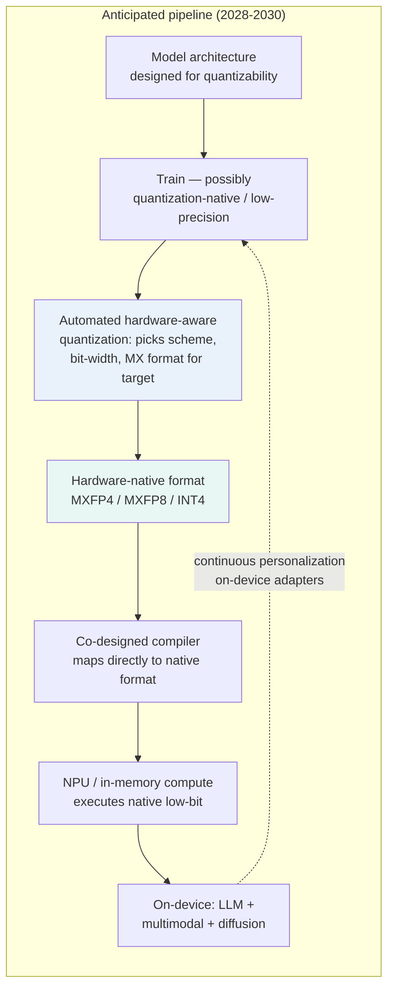

# 14. Future Roadmap (Next 3–5 Years)

> **Section scope.** Where quantization for edge AI is heading over roughly
> 2026–2030: the viability of sub-4-bit quantization, the revival of extreme/binary
> quantization via quantization-native training, quantization for multimodal and
> diffusion models on edge, co-design trends (quantization-native architectures and
> hardware-aligned formats), and the likely consolidation in tooling. **All
> forward-looking claims in this section are speculative (⚠️) — they are informed
> projections from current trajectories, not predictions, and the confidence
> discipline of the whole database applies with extra force here.**

## The shape of the projection

The safest forward-looking statement is that the patterns of the past decade will continue: the
production bit-width floor will keep descending, the research frontier will stay a few bits ahead, and
the binding problem will remain the accuracy-deployability gap at the frontier while the solved regimes
(INT8, 4-bit weight-only) stay stable and ubiquitous.

The projection chart extrapolates the production LLM-weight bit-width floor: historically 16→8→4 bits
by 2023, and speculatively descending toward 3, 2.5, and perhaps 2 bits by 2030 as the sub-4-bit
methods mature. The shaded uncertainty band and dashed line emphasize that the post-2026 trajectory is
speculative — whether 2-bit becomes a *general* production floor by 2030 depends on research progress
(closing the accuracy gap), kernel maturation (fast decode), and hardware support, none guaranteed. The
more confident claim is directional: the floor will keep descending, just as it has, with the pace set
by hardware and tooling rather than algorithms alone.

The adoption-timeline chart lays out anticipated production-adoption windows for the emerging
technologies this section discusses (all ⚠️ speculative): FP4/MXFP4 going mainstream on edge, rotation
methods reaching production for W4A4, 2-bit codebook methods getting fast kernels, quantization-native
models scaling, diffusion/multimodal edge quantization maturing, in-memory compute reaching products,
tooling consolidating around MX/MLIR, and automated hardware-aware quantization arriving. These windows
are informed estimates, not commitments, and the actual timing will depend on the research and
engineering progress discussed below.

## Sub-4-bit quantization: from frontier to (partial) production

The most consequential near-term question is whether **sub-4-bit quantization** — 3-bit and 2-bit —
crosses from research frontier to production default, and the likely answer is a qualified, gradual yes.
The pieces are converging: the accuracy methods exist (QuIP#, AQLM for 2-bit; rotation methods for
W4A4), the hardware is arriving (Qualcomm's INT2, NVIDIA's FP4, the MX formats), and the memory pressure
(fitting ever-larger models on-device) creates demand. The gating factors are (1) closing the remaining
accuracy gap at 2-bit for hard tasks (reasoning, code), where current methods still lose meaningful
capability; (2) fast kernels for the codebook methods, whose decode complexity currently limits
throughput; and (3) the model-size interaction (Section 07) — 2-bit works better on larger models, so
2-bit may become viable for large models before small ones. The likely trajectory: 3-bit becomes a
practical option for memory-constrained deployments in the near term, and 2-bit becomes viable for
large models where the memory pressure justifies the accuracy cost and the kernels mature, but a
*general* 2-bit production floor (all models, all tasks) remains uncertain within the 5-year window. The
more confident claim is that sub-4-bit moves from "research-only" to "used where memory forces it,"
expanding its production footprint without necessarily becoming the universal default — the same
gradual-adoption pattern INT4 followed, but harder because the accuracy cliff below 4 bits is steeper.

## Extreme and binary quantization revival via native training

The **quantization-native training** direction (BitNet lineage, Section 05/12) is the wildcard that
could reshape the field. If training models to be natively low-precision (ternary, or even binary)
scales to frontier sizes and holds on hard tasks, it would change the paradigm: post-training
quantization becomes unnecessary for models trained that way, and the extreme-low-bit regimes (1-1.58
bits) that failed as post-training compression become viable as native architectures. The appeal is
substantial — ternary/binary models have matmul-free, addition-dominant compute that is dramatically
more energy-efficient and enables radically simpler (and cheaper) hardware, including custom accelerators
and in-memory compute (Section 13). The open questions are equally substantial and unresolved: whether
native low-bit training scales to the largest models, whether it holds on reasoning and other hard
capabilities, whether the training is stable and efficient, and whether the ecosystem (which is built
around post-training quantization of standard models) would adopt a fundamentally different training
paradigm. The likely near-term outcome: quantization-native training continues as an active,
closely-watched research program with growing but not yet frontier-scale demonstrations, and its
production impact within 5 years is uncertain — it could remain a research curiosity, or it could be the
beginning of a paradigm shift, and which is genuinely unknown (⚠️ high uncertainty). It is the direction
most likely to produce a surprise, positive or negative, and it deserves the closest watching.

## Quantization for multimodal and diffusion models on edge

A near-certain trend is that quantization for **multimodal and diffusion models** on edge will mature,
because the demand (on-device image/video generation, multimodal assistants) is growing and the current
methods lag LLM quantization. Diffusion models pose the distinctive challenge of per-step error
compounding (Section 03/07), and the research to address it — timestep-aware quantization, methods that
account for the denoising trajectory, and quantization-aware fine-tuning for diffusion — is active and
will likely produce production-viable sub-8-bit diffusion quantization within the window. Multimodal
models (vision-language) will get calibration and quantization methods that account for their
cross-modal structure. The likely trajectory: on-device image generation (already demonstrated at INT8,
Section 09) becomes more efficient and higher-quality via better quantization, and on-device multimodal
assistants (combining quantized vision and language) become common, with the quantization methods for
these modalities maturing from their current relative immaturity toward the robustness LLM quantization
already has. This is one of the more confident predictions because the demand is clear and the research
direction is established — it is a matter of engineering effort catching up to a known need, following
the pattern by which LLM quantization matured a few years earlier. The edge devices' growing capability
(Sections 08-11) plus maturing multimodal/diffusion quantization will make on-device generative AI
extend well beyond text within the window.

## Co-design trends: quantization-native architectures and hardware-aligned formats

The deepest trend, continuing the co-design thesis of Section 06, is the further **merging of
quantization with hardware and architecture**. Three sub-trends:

- **Hardware-aligned formats become the norm.** The microscaling (MX) formats (MXFP4, MXFP8), which bake
  per-group quantization into the numeric type, will likely become the standard sub-8-bit hardware
  numerics as silicon adopts them (NVIDIA already, mobile vendors following). This closes the
  algorithm-hardware gap by making the hardware natively understand the quantization structure, and it
  will simplify the stack (the algorithm targets the hardware's native format rather than managing scales
  separately). Expect MX formats to spread across edge silicon and become a primary target.
- **Quantization-native architectures.** Beyond BitNet, expect architectures designed from the start to
  quantize well — activation functions and attention mechanisms that suppress outlier formation, and
  structures amenable to low-bit representation. Neural architecture search will increasingly optimize
  for quantizability, producing models that are efficient *because* they were designed to be quantized.
- **Deeper hardware-software co-optimization.** The compiler, the format, the algorithm, and the hardware
  will be co-designed more tightly, with automated tools (below) that jointly optimize the whole stack
  for a target. The boundary between "quantization algorithm" and "hardware format" will blur further,
  as it already has with MX.

These co-design trends are the most confident structural prediction: the field has been moving toward
algorithm-hardware co-design for years (Section 06), and this will intensify, with the MX formats as the
leading concrete manifestation. The practical consequence is that quantization will become less a
separate post-training step and more an integrated part of the model-hardware co-design pipeline.

## The anticipated pipeline evolution

The end-to-end pipeline (Section 01) will evolve toward tighter integration and more automation, as
diagrammed below (⚠️ anticipated, not current).

The key changes from today's pipeline: architecture designed for quantizability, training that may be
quantization-native, *automated* hardware-aware quantization (removing the manual method-selection burden
of Section 05), hardware-native formats (MX) that eliminate the algorithm-hardware gap, and on-device
continuous personalization (Section 05) feeding back. The pipeline becomes more integrated (co-design
throughout) and more automated (tools handle the scheme selection), reflecting the field's maturation.

## Likely consolidation in tooling

A confident prediction is **consolidation in quantization tooling**. Today's landscape is fragmented
(Section 06's exchange-format problem, Section 11's per-vendor stacks, Section 12's many methods), which
imposes a real tax. Several consolidating forces are at work: the MX format standardization (converging
the numeric formats), the MLIR compiler-infrastructure convergence (converging the compiler layer), the
consolidation of methods around the reference implementations (GPTQ, AWQ, GGUF as de-facto standards),
and the startup consolidation (Section 13, acquisitions absorbing differentiated tooling). The likely
trajectory: the numeric formats consolidate around INT8, INT4, and the MX formats; the compiler
infrastructure converges on MLIR-based stacks; the quantization methods stabilize around a small set of
reference approaches; and the exchange-format fragmentation eases as standards (ONNX quantization, MX)
mature. This consolidation would reduce the developer tax of the multipolar landscape (Section 11) and
make quantization more of a solved, standardized infrastructure than a fragmented frontier. It will not
be complete within the window (the vendor-specific deployment stacks will persist), but the direction is
toward more standardization and less fragmentation, which is the natural maturation of a field moving
from frontier to infrastructure. The MX formats and MLIR are the leading indicators to watch for this
consolidation.

## Automated, hardware-aware quantization

A specific tooling trend worth highlighting is the arrival of **automated, hardware-aware quantization** —
tools that, given a model and a target device, automatically select the optimal quantization scheme,
bit-width, granularity, and format, and produce a validated deployable model. Today this is largely
manual (Section 05's method-selection burden), requiring expertise to choose among GPTQ/AWQ/etc., set
group sizes, protect layers, and match the target's capabilities. The trend is toward tools that automate
this — searching the quantization design space against a hardware model and an accuracy target, much as
neural architecture search automates architecture design. This would democratize quantization (removing
the expertise barrier) and improve results (systematic search over manual heuristics). Early forms exist
(some tooling automates parts of the flow), and more comprehensive automation is likely within the
window, driven by the complexity of the design space and the demand to deploy across diverse hardware.
Automated hardware-aware quantization would be a significant maturation, turning quantization from an
expert craft into a more push-button infrastructure capability — though the "validate on the actual task
and target" discipline (Sections 06-07) will remain essential regardless of automation.

## Open problems and who is addressing them

The table below maps the field's key open problems (Section 12) to the players and labs addressing them,
providing a forward-looking research-and-development map (⚠️ associations are indicative).

| Open problem | Status | Who is addressing it |
|---|---|---|
| Lossless 2-bit on hard tasks | Research frontier | Cornell (QuIP#), IST Austria (AQLM), MIT, others |
| Fast kernels for codebook methods | Systems open problem | IST Austria (Marlin lineage), NVIDIA, community |
| Production-grade W4A4 | Emerging | Meta (SpinQuant), academic rotation-method groups |
| Quantization-native training at scale | High-uncertainty research | Microsoft (BitNet), others |
| Diffusion/multimodal edge quant | Maturing | MIT HAN Lab, vendor labs, academic groups |
| Long-context KV-cache quant | Active | Berkeley (KVQuant), KIVI groups, serving vendors |
| Theory of outliers | Open | Academic theory groups (Cornell, others) |
| Low-precision training (FP8/FP4) | Active | NVIDIA, model labs, academic |
| Automated hardware-aware quant | Emerging | Tooling vendors, startups (Deci-lineage), OSS |
| MX-format software maturity | In progress | OCP consortium members (all major vendors) |
| Tooling/format consolidation | In progress | OCP, MLIR community, standards bodies |

The table's pattern: the open problems cluster at the sub-4-bit frontier, the algorithm-hardware boundary,
and the new modalities, and they are being addressed by a mix of academic labs (the theory and methods),
the silicon vendors (the hardware and formats), and the tooling ecosystem (automation and consolidation)
— the same distributed, industry-academia-blurred effort that characterizes the whole field.

## A second forward-looking table: scenario ranges

Because the future is uncertain, it is more honest to give *ranges* than point predictions. The table
below gives conservative, likely, and optimistic scenarios for key questions (⚠️ all speculative):

| Question (by ~2030) | Conservative | Likely | Optimistic |
|---|---|---|---|
| General production LLM-weight floor | 4-bit | 3-bit | 2-bit |
| 2-bit for large models | Niche | Memory-forced use | Common |
| W4A4 (weight+activation) | Research | Production for some | Standard |
| Quantization-native models | Research curiosity | Growing niche | Paradigm shift begun |
| MX formats on edge | Emerging | Standard sub-8-bit | Dominant |
| On-device diffusion quant | INT8 | Sub-8-bit viable | Efficient + high-quality |
| Tooling automation | Partial | Substantial | Push-button |
| In-memory compute products | Niche | Growing | Significant market share |

The honest position is that the "likely" column is the central expectation, but the conservative and
optimistic columns bracket a wide range of plausible outcomes, and which materializes depends on research
progress, engineering effort, and market forces that cannot be confidently predicted. The one near-certain
claim is that the solved regimes (INT8, 4-bit weight-only) will remain stable and the frontier will keep
advancing — the details of how far and how fast are genuinely uncertain.

## Synthesis

The next 3–5 years of quantization will likely see the production bit-width floor continue descending
(toward 3-bit generally, 2-bit for large models where memory forces it), the maturation of quantization
for diffusion and multimodal models on edge, the spread of hardware-aligned MX formats that merge
quantization with the numeric type, the possible (but uncertain) rise of quantization-native training,
and a consolidation of the fragmented tooling landscape around standards (MX, MLIR) and automation. The
deepest trend is the continued merging of quantization with hardware and architecture — the co-design
thesis of Section 06 intensifying — such that quantization becomes less a separate post-training step and
more an integrated part of the model-hardware co-design pipeline, increasingly automated. The solved
regimes (INT8, 4-bit weight-only) will remain the stable, ubiquitous baseline, while the frontier (sub-4-
bit, W4A4, native training, new modalities) advances at a pace set, as always, by hardware and tooling
more than by algorithms. All of this is speculative (⚠️), and the honest summary is a direction (continued
descent, deeper co-design, more automation, some consolidation) rather than specific predictions — but
the direction is well-supported by the trajectories of the past decade, and the one certainty is that as
long as models outgrow the hardware that must run them, quantization will remain indispensable and its
frontier will keep moving.

## Master database contributions

This section adds no new entities (it is forward-looking), but it maps the open problems and anticipated
developments that the entities of Sections 08–13 will address — see the open-problems table above and
Section 16 for the consolidated entity view.

---

*Next: [15 — Standards and Benchmarks](./15-standards-benchmarks.md).*
