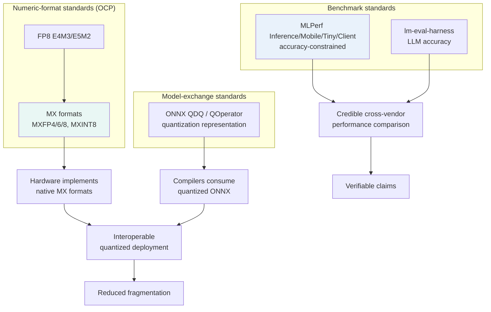

# 15. Standards and Benchmarks

> **Section scope.** The standards and benchmarks that structure quantized-model
> evaluation and interoperability: the MLPerf benchmark suites (Inference, Mobile,
> Tiny, Client), quantization-specific evaluation, the format-standardization efforts
> (ONNX quantization representation, the OCP microscaling formats), and the honest
> state of benchmark coverage. A recurring theme is that quantization *evaluation* is
> harder to standardize than it should be, and that the field's benchmarks lag its
> methods — which is why so many claims in this database carry confidence flags.

## Why standards and benchmarks matter for quantization

Standards and benchmarks serve two distinct functions in quantization. **Standards** (format
representations, numeric-type specifications) enable *interoperability* — a quantized model produced
by one tool running on another vendor's hardware — and their absence is the fragmentation tax of
Sections 06 and 11. **Benchmarks** enable *comparison* — assessing whether a quantized model or a piece
of silicon is actually good — and their weakness is why vendor claims (TOPS, "X% faster") are so hard to
verify and why this database flags them. Both are areas where quantization is less mature than its
technical methods, and improving them is important for the field's maturation (Section 14's
consolidation trend). This section maps both.

## The MLPerf benchmark family

**MLPerf**, run by the **MLCommons** consortium, is the most credible cross-vendor AI benchmark effort,
and it has several tracks relevant to quantized inference:

- **MLPerf Inference (Datacenter and Edge)** — the flagship inference benchmark, measuring throughput
  and latency on standardized models (vision, LLMs, recommendation) with defined accuracy targets.
  Crucially, MLPerf *allows quantization* (submitters commonly use INT8, FP8, and INT4) but enforces an
  **accuracy constraint** — a submission must meet a minimum accuracy on the task, so quantization
  cannot be used to inflate throughput at the cost of unacceptable accuracy loss. This accuracy-
  constrained design is exactly what makes MLPerf more credible than raw TOPS: it measures real
  performance *at a real accuracy bar*, capturing the quantization tradeoff honestly.
- **MLPerf Mobile** — measures on-device AI performance on smartphones (via an app), covering vision and
  increasingly generative workloads on mobile NPUs, with quantization central (mobile inference is
  quantized). It is the most relevant MLPerf track for the mobile-SoC vendors of Sections 08-10.
- **MLPerf Tiny** — targets the tinyML/microcontroller tier (Section 11), measuring quantized (INT8)
  inference on tiny hardware for keyword spotting, visual wake words, and anomaly detection — the
  extreme-efficiency corner where quantization is existential.
- **MLPerf Client** — a newer track for AI-PC/client (laptop/desktop) workloads, relevant to the AI-PC
  NPU race (Intel/AMD/Qualcomm, Section 11), measuring on-device generative and other AI on client
  hardware, again with quantization central.

MLPerf's value is that it is **standardized, accuracy-constrained, and cross-vendor** — the closest thing
to an apples-to-apples comparison, far more credible than vendor TOPS. Its limitations: submission is
voluntary (not all vendors submit all tracks, so coverage is incomplete), the benchmarks lag the fastest-
moving workloads (LLM/generative coverage is growing but the field moves faster), and the results
require interpretation (the configurations vary). But MLPerf is the benchmark to trust where it exists,
precisely because of its accuracy-constrained, standardized design.

## Other benchmark suites

Beyond MLPerf, several other benchmarks cover parts of the quantized-inference landscape:

- **AI-Benchmark** (ETH Zurich) — a long-running mobile-AI benchmark measuring quantized (and float)
  inference across many models on mobile SoCs, one of the earliest systematic mobile-NPU comparisons.
- **Geekbench AI** (Primate Labs) — a cross-platform AI benchmark measuring inference performance
  (including quantized) across devices, widely-run and accessible but less rigorous than MLPerf.
- **Procyon AI** (UL Solutions) — an AI-inference benchmark for PCs (and mobile), used in the AI-PC
  context to compare NPU performance.
- **lm-evaluation-harness** (EleutherAI) — not a hardware benchmark but the *de-facto standard for
  evaluating LLM quality*, including quantized LLMs, across task suites (MMLU, GSM8K, HumanEval, etc.).
  It is the tool the research community uses to measure the accuracy cost of quantization (Section 05's
  "evaluate on tasks not perplexity"), and it is essential for the accuracy side of quantization
  evaluation.

The coverage matrix (above) shows how these suites cover the dimensions (vision, LLM, mobile NPU, tinyML,
quantization-specific, public/comparable). The pattern: MLPerf has the broadest and most credible
coverage; the others cover specific niches (mobile, PC, LLM-quality); and *quantization-specific*
coverage (measuring the accuracy-vs-compression tradeoff explicitly) is the weakest dimension — no
benchmark comprehensively measures quantization quality across methods, bit-widths, and models in a
standardized way, which is a real gap.

| Benchmark | Run by | Coverage | Quantization treatment | Credibility |
|---|---|---|---|---|
| MLPerf Inference | MLCommons | DC/edge vision, LLM, rec | Allowed, accuracy-constrained | High (standardized) |
| MLPerf Mobile | MLCommons | Mobile NPU vision/genAI | Central (mobile is quantized) | High |
| MLPerf Tiny | MLCommons | tinyML/MCU | INT8 central | High (for niche) |
| MLPerf Client | MLCommons | AI-PC | Central | High (newer) |
| AI-Benchmark | ETH Zurich | Mobile SoC | Measures quantized inference | Medium-high |
| Geekbench AI | Primate Labs | Cross-platform | Includes quantized | Medium |
| Procyon AI | UL Solutions | PC/mobile NPU | Includes quantized | Medium |
| lm-eval-harness | EleutherAI | LLM quality | Measures quant accuracy cost | High (for accuracy) |

## The benchmark gap: what is missing

The honest assessment is that quantization *benchmarking* has significant gaps, and this is why the
database flags so many claims. The gaps:

- **No standardized quantization-quality benchmark.** There is no widely-adopted, standardized benchmark
  that measures the accuracy-vs-compression tradeoff across quantization methods, bit-widths, and models
  in a comparable way. The research community uses lm-eval-harness for accuracy and various ad-hoc
  perplexity/task measurements, but the group sizes, calibration sets, and configurations vary (Section
  05's comparability problem), making cross-method comparison imperfect.
- **Incomplete hardware coverage.** MLPerf submission is voluntary, so not all vendors submit all tracks
  — Apple, notably, does not participate in MLPerf, so its silicon cannot be compared apples-to-apples
  with the Android vendors (part of why Section 08 carries so many confidence flags). This leaves gaps
  in the cross-vendor comparison.
- **Vendor benchmarks dominate the discourse.** In the absence of comprehensive independent benchmarks,
  vendor-produced numbers (TOPS, throughput claims, favorable demos) fill the vacuum, and these are the
  unverified claims the database flags. The chart below illustrates the problem.

**Note the chart's explicit warning:** the values shown are *illustrative placeholders, not measured or
independently-verified results*. This is deliberate — it demonstrates the problem. Credible,
independent, apples-to-apples on-device LLM throughput comparisons across the major SoCs are *not*
readily available (the vendors publish their own favorable numbers under their own conditions, which are
not comparable), so any chart purporting to compare them would either use vendor claims (unreliable) or
illustrative placeholders (as here, clearly labeled). The honest position is that the field lacks the
standardized, independent on-device-LLM benchmarks that would allow trustworthy cross-vendor comparison,
and presenting fabricated-looking precise numbers would be misleading. This gap is a real limitation of
the current benchmark landscape and a key reason vendor claims cannot be taken at face value.

## Format standardization: ONNX and the OCP formats

On the standards (interoperability) side, two efforts are central:

- **ONNX quantization representation.** ONNX (Open Neural Network Exchange) is the nearest thing to a
  cross-vendor model-exchange standard, and its quantization representation (the QDQ and QOperator forms,
  Section 06) is the closest to a standard way to *represent* a quantized model for exchange. ONNX Runtime
  and its execution providers operationalize this across hardware. The ONNX quantization spec has matured
  but remains imperfectly and inconsistently supported across vendor compilers (Section 06's exchange-
  format problem), so it eases but does not eliminate the fragmentation.
- **OCP microscaling (MX) formats.** The Open Compute Project's standardization of the MX formats (MXFP8,
  MXFP6, MXFP4, MXINT8, Section 04) is the most significant *numeric-format* standardization, backed by
  nearly all major vendors (AMD, Arm, Intel, Meta, Microsoft, NVIDIA, Qualcomm). By standardizing the
  block-floating-point formats — the numeric types themselves — the OCP effort provides a rare point of
  cross-vendor agreement that could consolidate the sub-8-bit format landscape (Section 14). The OCP FP8
  standard (E4M3/E5M2) similarly standardized 8-bit float. These format standards are the most successful
  standardization in quantization, precisely because the vendors have a shared interest in interoperable
  numeric formats.

These standardization efforts are the antidote to the fragmentation tax, and their maturation (Section
14's consolidation trend) is important for the field. The format standards (OCP MX, FP8) are further
along than the model-exchange standards (ONNX quantization), reflecting that agreeing on numeric formats
is easier than agreeing on the full model representation and its per-vendor compilation.

## The standardization landscape

The diagram shows the two roles: format/exchange standards (left/center) enable interoperability, and
benchmark standards (right) enable verifiable comparison — together they would reduce the fragmentation
and the unverifiable-claims problems the database repeatedly flags.

## What good quantization evaluation looks like

Drawing the threads together, credible quantization evaluation — the standard the database applies and
recommends — has several elements: measure on the *target hardware* (not estimate from bit-counts);
measure accuracy on *deployment-relevant tasks* (via lm-eval-harness or equivalent, not just
perplexity); report as a *delta* from the float baseline (to isolate the quantization cost); use
*accuracy-constrained* performance measurement (MLPerf-style, not raw TOPS); and *document the
configuration* (group size, method, calibration). Where independent, standardized benchmarks exist
(MLPerf), trust them; where only vendor claims exist, flag them. This evaluation discipline is what
separates credible quantization assessment from spec-sheet reading, and it is why this database's claims
carry maturity and confidence tags — the tags encode exactly this distinction between what is
independently verified (MLPerf, published papers, open tooling) and what is vendor-asserted (TOPS,
favorable demos, unreleased-format claims).

## Synthesis

Standards and benchmarks are where quantization is *less* mature than its technical methods, and this
gap is the root of much of the database's confidence-flagging. On the standards side, the OCP format
standards (FP8, MX) are the most successful — a rare point of cross-vendor agreement that could
consolidate the sub-8-bit landscape — while the model-exchange standard (ONNX quantization) eases but
does not eliminate fragmentation. On the benchmark side, MLPerf provides credible, accuracy-constrained,
cross-vendor comparison where vendors submit, and lm-eval-harness provides the accuracy-cost measurement
for LLMs, but the coverage is incomplete (Apple does not participate; LLM/generative coverage lags), and
there is no standardized quantization-quality benchmark measuring the accuracy-vs-compression tradeoff
comparably across methods. The result is that vendor claims (TOPS, throughput) dominate the discourse in
the absence of independent benchmarks, which is why this database flags them and why credible evaluation
requires on-device, task-relevant, delta-reported, accuracy-constrained measurement. Improving the
benchmark landscape — a standardized quantization-quality benchmark, broader MLPerf participation — is an
important direction for the field's maturation (Section 14), and the format-standardization progress
(OCP MX) is a hopeful sign that quantization is moving from a fragmented frontier toward a more
standardized infrastructure.

## Master database contributions

This section contributes standard/benchmark entities to the master database (Section 16): MLPerf /
MLCommons, ONNX (quantization representation), OCP MX formats (added in Section 04), and lm-evaluation-
harness — see Section 16.

---

*Next: [16 — Master Competitive and Research Database](./16-master-database.md).*
