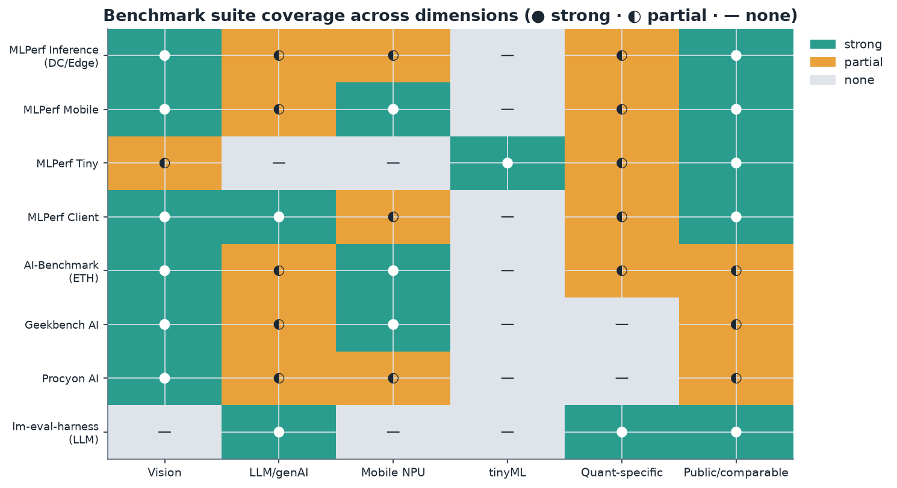
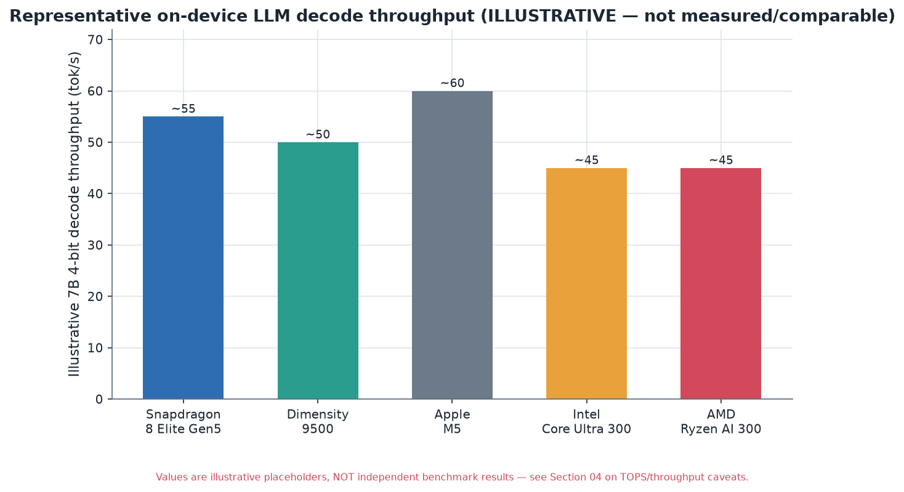
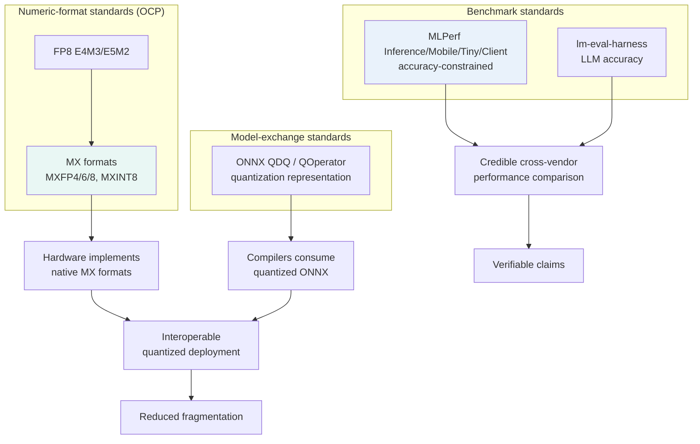

# 15. Standards and Benchmarks

> **Section scope.** The standards and benchmarks that structure quantized-model
> evaluation and interoperability: the MLPerf benchmark suites (Inference, Mobile,
> Tiny, Client), quantization-specific evaluation, the format-standardization efforts
> (ONNX quantization representation, the OCP microscaling formats), and the honest
> state of benchmark coverage. A recurring theme is that quantization *evaluation* is
> harder to standardize than it should be, and that the field's benchmarks lag its
> methods — which is why so many claims in this database carry confidence flags.

## Why standards and benchmarks matter for quantization

Standards and benchmarks serve two distinct functions in quantization. **Standards** (format
representations, numeric-type specifications) enable *interoperability* — a quantized model produced
by one tool running on another vendor's hardware — and their absence is the fragmentation tax of
Sections 06 and 11. **Benchmarks** enable *comparison* — assessing whether a quantized model or a piece
of silicon is actually good — and their weakness is why vendor claims (TOPS, "X% faster") are so hard to
verify and why this database flags them. Both are areas where quantization is less mature than its
technical methods, and improving them is important for the field's maturation (Section 14's
consolidation trend). This section maps both.

## The MLPerf benchmark family

**MLPerf**, run by the **MLCommons** consortium, is the most credible cross-vendor AI benchmark effort,
and it has several tracks relevant to quantized inference:

- **MLPerf Inference (Datacenter and Edge)** — the flagship inference benchmark, measuring throughput
  and latency on standardized models (vision, LLMs, recommendation) with defined accuracy targets.
  Crucially, MLPerf *allows quantization* (submitters commonly use INT8, FP8, and INT4) but enforces an
  **accuracy constraint** — a submission must meet a minimum accuracy on the task, so quantization
  cannot be used to inflate throughput at the cost of unacceptable accuracy loss. This accuracy-
  constrained design is exactly what makes MLPerf more credible than raw TOPS: it measures real
  performance *at a real accuracy bar*, capturing the quantization tradeoff honestly.
- **MLPerf Mobile** — measures on-device AI performance on smartphones (via an app), covering vision and
  increasingly generative workloads on mobile NPUs, with quantization central (mobile inference is
  quantized). It is the most relevant MLPerf track for the mobile-SoC vendors of Sections 08-10.
- **MLPerf Tiny** — targets the tinyML/microcontroller tier (Section 11), measuring quantized (INT8)
  inference on tiny hardware for keyword spotting, visual wake words, and anomaly detection — the
  extreme-efficiency corner where quantization is existential.
- **MLPerf Client** — a newer track for AI-PC/client (laptop/desktop) workloads, relevant to the AI-PC
  NPU race (Intel/AMD/Qualcomm, Section 11), measuring on-device generative and other AI on client
  hardware, again with quantization central.

MLPerf's value is that it is **standardized, accuracy-constrained, and cross-vendor** — the closest thing
to an apples-to-apples comparison, far more credible than vendor TOPS. Its limitations: submission is
voluntary (not all vendors submit all tracks, so coverage is incomplete), the benchmarks lag the fastest-
moving workloads (LLM/generative coverage is growing but the field moves faster), and the results
require interpretation (the configurations vary). But MLPerf is the benchmark to trust where it exists,
precisely because of its accuracy-constrained, standardized design.

## Other benchmark suites

Beyond MLPerf, several other benchmarks cover parts of the quantized-inference landscape:

- **AI-Benchmark** (ETH Zurich) — a long-running mobile-AI benchmark measuring quantized (and float)
  inference across many models on mobile SoCs, one of the earliest systematic mobile-NPU comparisons.
- **Geekbench AI** (Primate Labs) — a cross-platform AI benchmark measuring inference performance
  (including quantized) across devices, widely-run and accessible but less rigorous than MLPerf.
- **Procyon AI** (UL Solutions) — an AI-inference benchmark for PCs (and mobile), used in the AI-PC
  context to compare NPU performance.
- **lm-evaluation-harness** (EleutherAI) — not a hardware benchmark but the *de-facto standard for
  evaluating LLM quality*, including quantized LLMs, across task suites (MMLU, GSM8K, HumanEval, etc.).
  It is the tool the research community uses to measure the accuracy cost of quantization (Section 05's
  "evaluate on tasks not perplexity"), and it is essential for the accuracy side of quantization
  evaluation.

The coverage matrix (above) shows how these suites cover the dimensions (vision, LLM, mobile NPU, tinyML,
quantization-specific, public/comparable). The pattern: MLPerf has the broadest and most credible
coverage; the others cover specific niches (mobile, PC, LLM-quality); and *quantization-specific*
coverage (measuring the accuracy-vs-compression tradeoff explicitly) is the weakest dimension — no
benchmark comprehensively measures quantization quality across methods, bit-widths, and models in a
standardized way, which is a real gap.

| Benchmark | Run by | Coverage | Quantization treatment | Credibility |
|---|---|---|---|---|
| MLPerf Inference | MLCommons | DC/edge vision, LLM, rec | Allowed, accuracy-constrained | High (standardized) |
| MLPerf Mobile | MLCommons | Mobile NPU vision/genAI | Central (mobile is quantized) | High |
| MLPerf Tiny | MLCommons | tinyML/MCU | INT8 central | High (for niche) |
| MLPerf Client | MLCommons | AI-PC | Central | High (newer) |
| AI-Benchmark | ETH Zurich | Mobile SoC | Measures quantized inference | Medium-high |
| Geekbench AI | Primate Labs | Cross-platform | Includes quantized | Medium |
| Procyon AI | UL Solutions | PC/mobile NPU | Includes quantized | Medium |
| lm-eval-harness | EleutherAI | LLM quality | Measures quant accuracy cost | High (for accuracy) |

## The benchmark gap: what is missing

The honest assessment is that quantization *benchmarking* has significant gaps, and this is why the
database flags so many claims. The gaps:

- **No standardized quantization-quality benchmark.** There is no widely-adopted, standardized benchmark
  that measures the accuracy-vs-compression tradeoff across quantization methods, bit-widths, and models
  in a comparable way. The research community uses lm-eval-harness for accuracy and various ad-hoc
  perplexity/task measurements, but the group sizes, calibration sets, and configurations vary (Section
  05's comparability problem), making cross-method comparison imperfect.
- **Incomplete hardware coverage.** MLPerf submission is voluntary, so not all vendors submit all tracks
  — Apple, notably, does not participate in MLPerf, so its silicon cannot be compared apples-to-apples
  with the Android vendors (part of why Section 08 carries so many confidence flags). This leaves gaps
  in the cross-vendor comparison.
- **Vendor benchmarks dominate the discourse.** In the absence of comprehensive independent benchmarks,
  vendor-produced numbers (TOPS, throughput claims, favorable demos) fill the vacuum, and these are the
  unverified claims the database flags. The chart below illustrates the problem.

**Note the chart's explicit warning:** the values shown are *illustrative placeholders, not measured or
independently-verified results*. This is deliberate — it demonstrates the problem. Credible,
independent, apples-to-apples on-device LLM throughput comparisons across the major SoCs are *not*
readily available (the vendors publish their own favorable numbers under their own conditions, which are
not comparable), so any chart purporting to compare them would either use vendor claims (unreliable) or
illustrative placeholders (as here, clearly labeled). The honest position is that the field lacks the
standardized, independent on-device-LLM benchmarks that would allow trustworthy cross-vendor comparison,
and presenting fabricated-looking precise numbers would be misleading. This gap is a real limitation of
the current benchmark landscape and a key reason vendor claims cannot be taken at face value.

## Format standardization: ONNX and the OCP formats

On the standards (interoperability) side, two efforts are central:

- **ONNX quantization representation.** ONNX (Open Neural Network Exchange) is the nearest thing to a
  cross-vendor model-exchange standard, and its quantization representation (the QDQ and QOperator forms,
  Section 06) is the closest to a standard way to *represent* a quantized model for exchange. ONNX Runtime
  and its execution providers operationalize this across hardware. The ONNX quantization spec has matured
  but remains imperfectly and inconsistently supported across vendor compilers (Section 06's exchange-
  format problem), so it eases but does not eliminate the fragmentation.
- **OCP microscaling (MX) formats.** The Open Compute Project's standardization of the MX formats (MXFP8,
  MXFP6, MXFP4, MXINT8, Section 04) is the most significant *numeric-format* standardization, backed by
  nearly all major vendors (AMD, Arm, Intel, Meta, Microsoft, NVIDIA, Qualcomm). By standardizing the
  block-floating-point formats — the numeric types themselves — the OCP effort provides a rare point of
  cross-vendor agreement that could consolidate the sub-8-bit format landscape (Section 14). The OCP FP8
  standard (E4M3/E5M2) similarly standardized 8-bit float. These format standards are the most successful
  standardization in quantization, precisely because the vendors have a shared interest in interoperable
  numeric formats.

These standardization efforts are the antidote to the fragmentation tax, and their maturation (Section
14's consolidation trend) is important for the field. The format standards (OCP MX, FP8) are further
along than the model-exchange standards (ONNX quantization), reflecting that agreeing on numeric formats
is easier than agreeing on the full model representation and its per-vendor compilation.

## The standardization landscape

The diagram shows the two roles: format/exchange standards (left/center) enable interoperability, and
benchmark standards (right) enable verifiable comparison — together they would reduce the fragmentation
and the unverifiable-claims problems the database repeatedly flags.

## What good quantization evaluation looks like

Drawing the threads together, credible quantization evaluation — the standard the database applies and
recommends — has several elements: measure on the *target hardware* (not estimate from bit-counts);
measure accuracy on *deployment-relevant tasks* (via lm-eval-harness or equivalent, not just
perplexity); report as a *delta* from the float baseline (to isolate the quantization cost); use
*accuracy-constrained* performance measurement (MLPerf-style, not raw TOPS); and *document the
configuration* (group size, method, calibration). Where independent, standardized benchmarks exist
(MLPerf), trust them; where only vendor claims exist, flag them. This evaluation discipline is what
separates credible quantization assessment from spec-sheet reading, and it is why this database's claims
carry maturity and confidence tags — the tags encode exactly this distinction between what is
independently verified (MLPerf, published papers, open tooling) and what is vendor-asserted (TOPS,
favorable demos, unreleased-format claims).

## MLPerf mechanics in depth

MLPerf's design deserves deeper treatment because its methodology is what makes it credible, and
understanding it clarifies why it is trustworthy where raw vendor numbers are not. MLPerf Inference
defines a set of **standardized tasks** (image classification on ResNet/ImageNet, object detection,
LLM tasks on defined models, recommendation, etc.), each with a **reference model** and a **required
accuracy target** (typically 99% or 99.9% of the FP32 reference accuracy). A submission runs the task
and must *meet the accuracy target* — quantization is allowed (and universal), but a submission that
quantizes so aggressively that it falls below the accuracy target is invalid. This is the crucial
design choice: by coupling performance measurement to an accuracy floor, MLPerf measures **real
performance at a real accuracy bar**, capturing the quantization tradeoff honestly rather than letting
submitters trade away accuracy for throughput unmeasured. MLPerf also defines **scenarios** (single-
stream, multi-stream, server, offline) that model different deployment patterns (latency-critical vs.
throughput-critical), and **divisions** — the **closed division** (strict rules, comparable results,
using the reference model) and the **open division** (more flexibility, allowing model changes, less
directly comparable). For quantization specifically, the closed division's requirement to meet the
accuracy target on the reference model with defined rules is what makes cross-vendor comparison
meaningful. The submission process is rigorous (results are reviewed, and there is a period for
submitters to inspect each other's submissions), which adds credibility. The limitations remain
(voluntary participation, the benchmarks lagging the fastest workloads, the complexity of interpreting
results across configurations), but the accuracy-constrained, standardized, peer-reviewed design makes
MLPerf the gold standard for *credible* AI-performance comparison, and it is why the database treats
MLPerf results as high-confidence where they exist. The contrast with vendor TOPS could not be
sharper: TOPS is a peak-throughput number at no defined accuracy, while MLPerf is real throughput at a
required accuracy — the difference between a marketing scalar and a meaningful measurement.

## The TOPS problem in depth

Because vendor TOPS claims dominate the marketing discourse and this database repeatedly flags them, a
fuller treatment of *why* TOPS is nearly useless for cross-vendor comparison is warranted. **TOPS
(tera-operations per second)** is a peak-throughput figure — the maximum number of operations the
hardware can perform per second under ideal conditions. It is misleading for several compounding
reasons. First, it is **precision-dependent**: a chip's TOPS at INT4 is higher than at INT8 (more
operations per cycle at lower precision), so a headline TOPS number without a specified precision is
meaningless, and vendors often quote the highest-precision-lowest number (INT4 or lower) for the
biggest figure. Second, it is a **peak, not achieved, number**: real workloads reach a fraction of
peak (often 20-50%) due to memory bottlenecks, utilization inefficiencies, and the workload's actual
arithmetic intensity (Section 06's roofline) — a chip with high peak TOPS but low memory bandwidth will
badly underperform its TOPS on the memory-bound LLM-decode workload. Third, it **ignores accuracy**:
TOPS says nothing about whether the quantized model running at that throughput is accurate. Fourth, it
is **not measured consistently** across vendors (different assumptions about sparsity, utilization,
precision), so cross-vendor TOPS comparison is apples-to-oranges. The upshot, stated plainly: **a chip's
TOPS number tells you almost nothing about how fast it will run your actual quantized model**, and
comparing two vendors' TOPS is nearly meaningless. What matters instead is memory bandwidth (for the
memory-bound LLM case), native precision support, achieved throughput at a real accuracy bar (MLPerf),
and on-device measurement of the actual workload. This is why the database flags every TOPS claim, why
Section 06 emphasized memory bandwidth over TOPS, and why the "representative results" chart above uses
clearly-labeled illustrative values rather than pretending to a precision the available data does not
support. TOPS is the single most over-cited and least-useful number in the edge-AI marketing landscape,
and understanding why is essential to reading vendor claims critically.

## A brief history of AI benchmarking

The current benchmark landscape is the product of an evolution worth sketching. Early neural-network
benchmarking was **accuracy-only** — the ImageNet leaderboard, reporting top-1/top-5 accuracy, with no
standardized *performance* measurement. As deep learning moved to production and efficiency mattered,
**performance benchmarks** emerged, initially vendor-specific and non-comparable (each vendor published
its own numbers). **MLPerf** launched (2018, by MLCommons) to bring standardized, credible,
cross-vendor benchmarking, addressing the non-comparability of vendor numbers — its accuracy-constrained
design was a direct response to the gaming-by-accuracy-loss problem. Mobile-specific benchmarks
(AI-Benchmark from ETH Zurich, later Geekbench AI, MLPerf Mobile) emerged as mobile NPUs proliferated.
The LLM era brought **quality benchmarks** for generative models (the task suites — MMLU, GSM8K,
HumanEval — aggregated by harnesses like lm-eval-harness) as accuracy measurement became more complex
(perplexity insufficient, Section 05). The AI-PC era brought client benchmarks (MLPerf Client, Procyon
AI). This evolution — from accuracy-only, to non-comparable vendor performance numbers, to standardized
accuracy-constrained benchmarks, to LLM-quality suites — reflects the field's maturation and its
recurring struggle with the same problem: how to measure AI performance and quality *credibly and
comparably*. The history shows progress (MLPerf's standardization was a real advance) but also the
persistent gap (the fastest-moving workloads always outrun the benchmarks, and quantization-specific
quality measurement remains under-standardized). Understanding this history contextualizes the current
gaps as the latest instance of a recurring challenge rather than a novel failure — the benchmarks have
always lagged the methods, and the field has always relied partly on vendor claims in the interim,
which is why the confidence discipline this database applies is a permanent necessity, not a temporary
workaround.

## The reproducibility and comparability problem

A specific weakness of quantization *quality* evaluation, expanding Section 05's caveat, is the
**reproducibility and comparability** problem, which deserves emphasis because it undermines much of the
published quantization-accuracy discourse. The issue: a quantization method's reported accuracy depends
on many under-documented choices — the group size, the calibration set, the protected layers, the
specific model and version, the evaluation tasks and their configurations, the random seed — and
different papers and checkpoints vary these, so two "4-bit GPTQ" results from different sources are not
directly comparable, and a method's headline accuracy may not reproduce under different conditions
(Section 05's "quantized model of unknown quality" problem). This is not fraud but the natural
consequence of a fast-moving field without standardized evaluation protocols. The consequences are
real: cross-method comparisons from different papers are only roughly commensurable, published accuracy
numbers should be treated as indicative rather than definitive, and a practitioner cannot assume a
method's reported accuracy will hold for their model and task without re-measuring. The community has
developed partial remedies — shared evaluation via lm-eval-harness, conventions around reporting FP16
deltas, some publishers documenting their quantization configurations — but the problem persists, and it
is a significant weakness in the field's evaluation infrastructure. A standardized quantization-quality
benchmark (measuring the accuracy-vs-compression tradeoff across methods and models under controlled,
documented conditions) would address it, and its absence is a real gap. Until then, the discipline is to
treat published quantization-accuracy numbers with appropriate skepticism, document one's own
quantization configuration, and re-measure on the actual deployment target and task — the same discipline
the whole database applies, extended to the evaluation infrastructure itself.

## Benchmark gaming and Goodhart's law

A cautionary consideration for any benchmark discussion is **Goodhart's law** — "when a measure becomes a
target, it ceases to be a good measure" — which applies to quantization benchmarking. If a specific
benchmark becomes the target, vendors and methods can optimize for it in ways that do not generalize:
tuning quantization specifically for the benchmark's models and tasks, choosing configurations that
favor the benchmark, or (in the accuracy-quality context) optimizing for the specific task suites at the
expense of un-benchmarked capabilities. MLPerf's accuracy-constrained, peer-reviewed design mitigates
some gaming (you cannot trade accuracy for throughput unmeasured, and submissions are inspected), but no
benchmark is immune — a chip optimized to win MLPerf on the benchmark's specific models may not be
proportionally better on a customer's actual workload, and a quantization method tuned to preserve the
benchmark's tasks may degrade on others. This is why the database emphasizes evaluating on *your actual
task and workload*, not just standard benchmarks — the benchmark is a useful signal but not a guarantee
for your specific case. The Goodhart concern is a reason to use benchmarks as one input among several
(alongside on-device measurement of the actual workload) rather than as the sole arbiter, and it is a
reason to be wary of both vendor benchmark-optimization and method-specific benchmark-tuning. Good
benchmarking practice — diverse tasks, held-out evaluation, on-target measurement, skepticism of
benchmark-specific optimization — mitigates Goodhart, but the fundamental tension (measures become
targets) is permanent, and it reinforces the database's stance that no single number (benchmark or TOPS)
substitutes for evaluating the actual deployment on the actual target.

## ONNX quantization representation in depth

The ONNX quantization standard warrants fuller treatment as the primary model-exchange standardization
effort. ONNX provides two representations for quantized models (Section 06): the **QDQ format**, which
keeps floating-point operators but inserts explicit QuantizeLinear/DequantizeLinear node pairs carrying
scale and zero-point (the compiler folds these into integer operators), and the **QOperator format**,
which uses explicitly quantized operator types (QLinearConv, QLinearMatMul). The QDQ format has become
the more common and flexible approach — it cleanly separates "what precision" from "which operator" and
lets each backend decide how to execute the quantized graph. ONNX Runtime, with its execution-provider
architecture, operationalizes this across hardware (CPU, CUDA, TensorRT, QNN, OpenVINO, and other EPs),
making ONNX the nearest thing to a portable quantized-model exchange format. The standardization is
valuable but imperfect: vendor compilers vary in which ONNX quantization constructs they accept, how
faithfully they preserve the intended scheme (per-group, mixed precision), and how they handle the newer
formats, so an ONNX-quantized model does not always deploy identically across targets (Section 06's
exchange-format friction). The ONNX quantization spec continues to evolve (adding support for newer
schemes, better per-channel/per-group representation, and the emerging formats), and its maturation is
part of the tooling consolidation (Section 14). For interoperability, ONNX is the best available
standard, but it eases rather than eliminates the fragmentation, and the gap between the standard and its
consistent implementation across vendors remains a real friction. The contrast with the OCP format
standards is instructive: agreeing on a numeric format (a well-defined bit layout) is easier and more
complete than agreeing on a full model representation and its compilation semantics, which is why the OCP
format standards are further along than the ONNX quantization standard, and why numeric-format
consolidation (Section 14) is likely to precede full model-exchange standardization.

## The community and de-facto standards

Beyond the formal standards bodies (MLCommons, OCP, the ONNX community), quantization has significant
**de-facto standards** set by the community and the dominant tools, which deserve recognition. **GGUF**
(llama.cpp) is a de-facto standard distribution format for local quantized LLMs — not blessed by a
standards body but universally adopted by the local-LLM ecosystem (Sections 02, 05). **The reference
method implementations** (AutoGPTQ, AutoAWQ, bitsandbytes, the Hugging Face quantization backends) are
de-facto standard tools that define how quantization is done in practice. **lm-evaluation-harness** is
the de-facto standard for LLM-quality evaluation. **Hugging Face's model hub** conventions (how quantized
models are packaged and documented) are de-facto standards for distribution. These community/de-facto
standards are, in practice, as important as the formal ones — they are what practitioners actually use —
and they emerged from the open-source dynamic (Section 02) rather than from standards committees. The
interplay between formal standards (MLPerf, OCP, ONNX) and de-facto standards (GGUF, the reference tools,
lm-eval-harness) characterizes the quantization standardization landscape: the formal standards address
interoperability and credible comparison, while the de-facto standards address the practical how-to of
quantization, and both are essential. The de-facto standards' emergence from open source is a strength
(they reflect what actually works and is adopted) but also a source of the reproducibility problem (they
are conventions, not rigorously-specified standards, so they vary). The field's maturation involves both
strengthening the formal standards (better benchmarks, format consolidation) and formalizing the de-facto
ones (documented conventions, reproducible protocols) — a two-track standardization that Section 14's
consolidation trend encompasses.

## What a standardized quantization-quality benchmark would measure

Since the absence of a standardized quantization-quality benchmark is the field's key evaluation gap, it
is worth sketching what one would ideally measure — both to clarify the gap and to indicate the
direction of improvement. A comprehensive quantization-quality benchmark would evaluate, in a
standardized and reproducible way: **the accuracy-vs-compression tradeoff** across bit-widths (16, 8, 4,
3, 2 bits) and methods (GPTQ, AWQ, QuIP#, etc.), on a **fixed set of models** (spanning sizes, since the
model-size interaction of Section 07 matters) and **fixed, documented configurations** (group size,
calibration set, protected layers), measured on **deployment-relevant task suites** (not just perplexity
— reasoning, code, instruction-following, long-context) reported as **deltas from the float baseline**.
It would also measure the *slice-level* degradation (Section 07's concentrated failures — rare classes,
hard tasks, long context) not just aggregate accuracy, and ideally the *robustness/safety* deltas that
Section 07 flagged. On the performance side, it would pair this with accuracy-constrained throughput and
energy measurement (MLPerf-style) on *actual target hardware*. Such a benchmark would let practitioners
and researchers compare quantization methods and their tradeoffs credibly, addressing the reproducibility
and comparability problem. The reasons it does not yet exist are the effort required (running many
methods × bit-widths × models × tasks is expensive), the fast-moving methods (a benchmark risks
obsolescence), and the coordination challenge (agreeing on the protocol across a fragmented field). But
its absence is a real gap, and efforts toward it — whether from MLCommons (extending MLPerf toward
quantization-quality), the research community (standardized evaluation protocols), or a dedicated effort
— would materially improve the field's evaluation infrastructure. The database's own approach (the
maturity and confidence tags) is a partial, qualitative substitute for what a rigorous quantitative
benchmark would provide, and the need for the latter is one of the clearer conclusions of this section.

## Standardization politics and incentives

Standardization does not happen in a vacuum; it is shaped by the incentives and politics of the players,
which explains both the successes and the gaps. The **format standards** (OCP FP8, MX) succeeded because
the vendors share a strong interest in interoperable numeric formats — a fragmented format landscape
hurts everyone (models don't port, tooling multiplies), so agreeing on formats is positive-sum, which is
why nearly all major vendors joined the OCP effort. The **benchmark standards** (MLPerf) succeed where
vendors see value in credible comparison (to demonstrate their silicon's strengths) but face the tension
that a vendor doing poorly on a benchmark has an incentive not to participate (Apple's non-participation
being the notable case), leaving coverage gaps. The **model-exchange standards** (ONNX quantization) face
the tension that vendors have some incentive toward lock-in (their own optimized stacks are competitive
advantages), so full interoperability is not unambiguously in every vendor's interest, which slows the
standard's complete adoption. And the **de-facto standards** (GGUF, the reference tools) emerged from the
open-source community precisely because the formal standardization was slow or absent, filling the gap
bottom-up. Understanding these incentives clarifies the landscape: format standards advance fastest
(positive-sum), benchmark participation is uneven (competitive incentives), model-exchange standards lag
(partial lock-in incentives), and community de-facto standards fill gaps (open-source dynamism). The
politics also connect to the geopolitical dimension (Section 11) — the Western (OCP, ONNX, MLCommons) and
Chinese domestic standardization efforts may diverge, adding another axis of fragmentation. For the
field's maturation, the incentive analysis suggests that format consolidation (positive-sum) will
continue to progress, while benchmark coverage and model-exchange standardization will advance more
slowly against the competitive frictions — a realistic expectation that tempers the optimism about
standardization easing the fragmentation tax. The standardization will advance, but unevenly, shaped by
where the players' incentives align and where they conflict.

## The role of independent evaluation and the community

Filling part of the gap left by incomplete formal benchmarks is a layer of **independent and community
evaluation** that deserves recognition. Independent technical reviewers, academic groups publishing
thorough evaluations, and community efforts (the local-LLM community's extensive testing of quantized
GGUF variants, independent NPU benchmarking by technical press and enthusiasts) provide a check on
vendor claims where formal benchmarks are absent. The local-LLM community in particular has generated a
large body of practical, if informal, evaluation of quantized models — comparing k-quant variants,
measuring quality degradation, sharing configurations — that, while not standardized, provides real
signal about what quantization schemes work well. Academic papers increasingly include thorough,
reproducible evaluations that serve as reference points. And independent benchmarking by technical
publications, while varying in rigor, provides cross-vendor comparison the vendors themselves will not.
This independent/community layer is imperfect (informal, varying rigor, not standardized) but valuable —
it is part of why the field is not wholly dependent on vendor claims, and it embodies the open, community
-driven culture (Section 12) applied to evaluation. The database draws on this layer where it is credible,
and it is a partial answer to the benchmark gap: in the absence of comprehensive formal benchmarks,
independent and community evaluation provides real, if imperfect, checks on vendor claims, and
strengthening this layer (more rigorous community protocols, more independent benchmarking) is a
complement to the formal-benchmark improvement the field needs. The healthiest evaluation ecosystem
combines formal standardized benchmarks (MLPerf), reproducible academic evaluation, community testing,
and independent review — and quantization has all of these in developing form, even if the formal
standardized-quality-benchmark piece is the weakest.

## Synthesis

Standards and benchmarks are where quantization is *less* mature than its technical methods, and this
gap is the root of much of the database's confidence-flagging. On the standards side, the OCP format
standards (FP8, MX) are the most successful — a rare point of cross-vendor agreement that could
consolidate the sub-8-bit landscape — while the model-exchange standard (ONNX quantization) eases but
does not eliminate fragmentation. On the benchmark side, MLPerf provides credible, accuracy-constrained,
cross-vendor comparison where vendors submit, and lm-eval-harness provides the accuracy-cost measurement
for LLMs, but the coverage is incomplete (Apple does not participate; LLM/generative coverage lags), and
there is no standardized quantization-quality benchmark measuring the accuracy-vs-compression tradeoff
comparably across methods. The result is that vendor claims (TOPS, throughput) dominate the discourse in
the absence of independent benchmarks, which is why this database flags them and why credible evaluation
requires on-device, task-relevant, delta-reported, accuracy-constrained measurement. Improving the
benchmark landscape — a standardized quantization-quality benchmark, broader MLPerf participation — is an
important direction for the field's maturation (Section 14), and the format-standardization progress
(OCP MX) is a hopeful sign that quantization is moving from a fragmented frontier toward a more
standardized infrastructure.

The practical guidance that follows from this section is concrete. When assessing a quantized-inference
claim, prefer, in descending order of trust: MLPerf results (accuracy-constrained, peer-reviewed, where
they exist); published peer-reviewed benchmarks with documented configurations; open, reproducible
evaluations via lm-eval-harness or equivalent on named models; and — last and least — vendor TOPS and
throughput claims, which should be treated as marketing until independently corroborated. When producing
a quantized model, document the configuration (method, group size, calibration, protected layers) and
report accuracy as a delta from the float baseline on deployment-relevant tasks, so the result is
reproducible and comparable. And when comparing hardware, look past TOPS to memory bandwidth, native
precision support, and accuracy-constrained achieved throughput on the actual workload. This guidance —
trust the accuracy-constrained standardized benchmarks, discount the vendor scalars, document and measure
rigorously — is the operational form of the confidence discipline the whole database embodies, and it is
the single most useful takeaway from the standards-and-benchmarks landscape: in a field where the
benchmarks lag the methods and vendor claims fill the vacuum, disciplined, skeptical, target-specific
measurement is the only reliable path to knowing whether a quantized model or a piece of silicon is
actually good. The standards and benchmarks are improving, but until they fully mature, that discipline
is indispensable — and it will remain valuable even after, because no benchmark ever fully substitutes
for measuring the actual deployment on the actual target.

## Master database contributions

This section contributes standard/benchmark entities to the master database (Section 16): MLPerf /
MLCommons, ONNX (quantization representation), OCP MX formats (added in Section 04), and lm-evaluation-
harness — see Section 16.

---

*Next: [16 — Master Competitive and Research Database](./16-master-database.md).*
