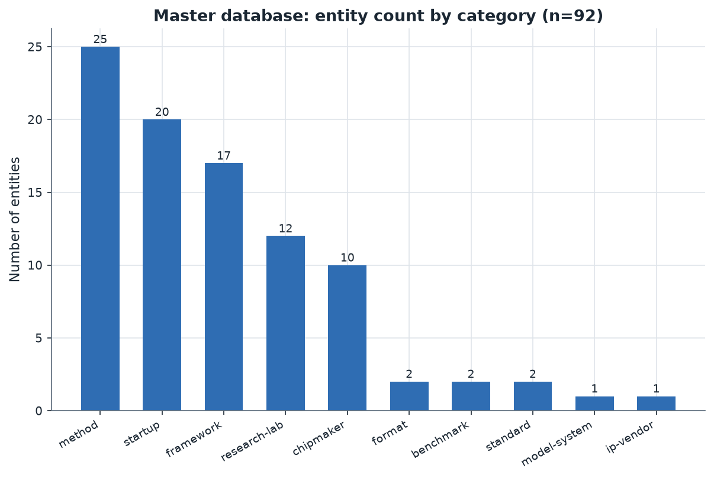
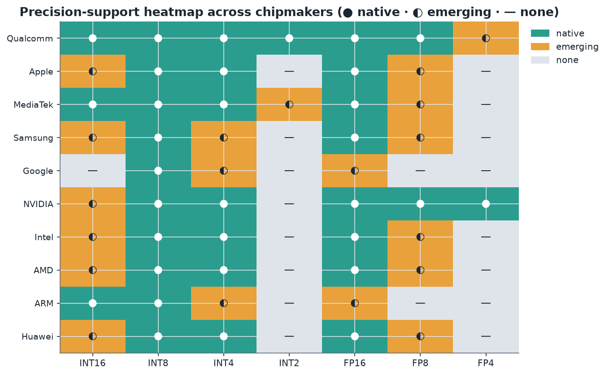

# 16. Master Competitive and Research Database

> **Section scope.** The consolidated database of every entity discussed across this
> reference — chipmakers, IP vendors, frameworks/tools, quantization methods, numeric
> formats, standards, benchmarks, research labs, and startups — deduplicated,
> categorized, and tagged with maturity and confidence. The full table (92 entities)
> follows the analysis, and the machine-readable version is at
> [`/assets/data/master_database.csv`](../assets/data/master_database.csv). This
> section is the reference's index and cross-cutting synthesis: it is where the
> per-section detail becomes a single navigable map.

## How to use this database

The master database is a single deduplicated table of every substantive entity in this reference, with
a consistent schema (documented in [`SCHEMA.md`](../assets/data/SCHEMA.md)). Each entity carries:

- **Category** — the top-level bucket (chipmaker, ip-vendor, framework, method, format, standard,
  benchmark, research-lab, startup, model-system).
- **Technique focus** — what quantization angle it centers on.
- **Precision support** — the precisions it ships/supports (hardware) or targets (method/format).
- **Maturity** — 🟢 production-shipped / 🟡 sdk-limited / 🔴 research-only.
- **Key differentiator** — the one-line distinguishing claim.
- **Source confidence** — the evidence basis (official-spec, sdk-docs, paper, press, inferred,
  speculative), per Section 17's methodology.
- **Section reference** — where the entity is discussed in depth.

The CSV is the authoritative, regeneratable version; the table below is the rendered view. The database
is designed for two uses: as an **index** (find any entity and its home section) and as a **comparative
map** (see the landscape by category, maturity, and precision).

## The database at a glance



The 92 entities distribute across categories as shown: the largest categories are **methods** (25 — the
quantization techniques of Sections 02–05), **startups** (20 — the commercial landscape of Section 13),
**frameworks** (17 — the tooling of Sections 05–11), **research labs** (12 — Section 12), and
**chipmakers** (10 — Sections 08–11), with smaller counts of formats, standards, benchmarks, IP vendors,
and model systems. This distribution reflects the reference's structure and the field's shape: a rich
method landscape (the algorithms), a substantial commercial ecosystem (startups and frameworks), a
concentrated research community (labs), and a defined set of silicon players (chipmakers). The
predominance of methods and startups shows that quantization is both a deep technical field (many
methods) and an active commercial one (many companies), while the smaller counts of formats and
standards reflect the consolidation of the numeric-format and standardization layers (Sections 04, 15).



The precision-support heatmap across the ten chipmakers consolidates the per-vendor detail of Sections
08–11 into a single view. The pattern confirms the database's recurring findings: **INT8 and FP16 are
universal** (every chipmaker supports them natively); **INT4 is broadly supported** (native on most,
emerging on a few); **FP8 is emerging** (native on Qualcomm/NVIDIA, emerging elsewhere); and **INT2 and
FP4 are the frontier** (Qualcomm's INT2, NVIDIA's FP4 leading, absent elsewhere). Qualcomm's row is the
most complete (the breadth leader), NVIDIA leads on the low-FP frontier (FP4), and the others cluster
around the INT8/INT4/FP16 production baseline with emerging FP8. This single heatmap is the clearest
summary of the silicon-precision landscape, and it visually confirms the hardware-ahead-of-software,
flagship-first diffusion pattern the database has documented throughout.

## Cross-cutting analysis: maturity distribution

A key analytical view is the **maturity distribution** across the database. The majority of the 92
entities are 🟢 production-shipped — the chipmakers (all shipping silicon), the frameworks (all deployed
tooling), the production methods (INT8, 4-bit weight-only), the major research labs (whose methods
shipped), and the commercial startups (whose products are deployed). A smaller set is 🟡 sdk-limited —
the emerging methods (QuIP#, AQLM, HQQ), the frontier formats (MXFP4), and the earlier-stage startups
and in-memory-compute companies. A still smaller set is 🔴 research-only — the aggressive-frontier methods
(BitNet, QuaRot/SpinQuant, SpQR), the extreme-quantization historical methods (BinaryConnect, XNOR-Net,
Deep Compression), and the highest-risk startups (Mythic, EnCharge, Rain, Untether — the analog/novel-
compute bets). This distribution maps precisely onto the field's structure: a large production core (the
solved regimes and shipping players), an emerging middle (the maturing frontier), and a research frontier
(the aggressive methods and novel hardware). The maturity tags are the database's most important
analytical dimension because they encode the crucial production-vs-research distinction the whole
reference emphasizes — the difference between what can be deployed today and what is demonstrated but not
yet deployable.

## Cross-cutting analysis: the confidence spectrum

The **source-confidence** distribution is equally telling. The **official-spec** and **sdk-docs**
entities (the chipmakers' disclosed capabilities, the open tooling) are the highest-confidence — these
are documented facts. The **paper** entities (the methods and research labs) are high-confidence for the
*claim* (peer-reviewed) but the maturity varies (a well-supported paper may be research-only). The
**press** entities (the startups) are lower-confidence — startup information changes fast and is often
self-reported. The **inferred** entities (Apple's internals, Samsung's and Huawei's less-disclosed
details, Mobileye) carry explicit uncertainty. This confidence spectrum is orthogonal to maturity (a
research-only method can have high paper-confidence; a production chipmaker can have inferred internals),
and tracking both is essential to reading the database correctly — the tags encode exactly the epistemic
discipline Section 17 formalizes. The database's value depends on this honesty about evidence: it
distinguishes what is known (official-spec, sdk-docs), what is claimed (paper, press), and what is
deduced (inferred), rather than presenting everything as equally certain.

## Reading the categories as a stack

The categories are not a flat list but a **stack**, and reading them as such reveals the ecosystem's
structure. At the bottom are the **chipmakers** and **IP vendors** (the silicon that executes quantized
models) and the **formats/standards** (the numeric types and interoperability specs the silicon
implements). Above them sit the **frameworks** (the compilers, runtimes, and toolkits that map quantized
models onto the silicon) and the **methods** (the algorithms that produce the quantized models). The
**research labs** produce the methods and inform the silicon; the **startups** attack specific layers of
the stack commercially; the **benchmarks** measure the whole; and the **model-systems** (Apple
Intelligence) are the end products that everything enables. This stacked reading — silicon and formats at
the base, tooling and methods in the middle, research and commerce cutting across, benchmarks measuring,
products on top — is how the 92 entities relate, and it mirrors the AI-infrastructure-stack view of
Section 13.

```mermaid
flowchart TD
    PROD[Model systems<br/>Apple Intelligence] --> METH
    subgraph MID["Methods & tooling"]
        METH[Methods · 25<br/>GPTQ · AWQ · QuIP# · BitNet …]
        FW[Frameworks · 17<br/>TensorRT · Core ML · LiteRT · llama.cpp …]
    end
    METH --> FW
    FW --> BASE
    subgraph BASE["Silicon, formats & standards"]
        CHIP[Chipmakers · 10 + ARM IP]
        FMT[Formats & standards<br/>FP8 · MX · ONNX]
    end
    LABS[Research labs · 12] -. produce methods, inform silicon .-> METH
    LABS -. .-> CHIP
    STARTUP[Startups · 20] -. attack layers commercially .-> CHIP
    STARTUP -. .-> FW
    BENCH[Benchmarks · MLPerf · lm-eval] -. measure the whole .-> FW
    style BASE fill:#e9f7f4
    style MID fill:#e9f2fb
    style PROD fill:#eaf6ee
``` The database's categorization is thus not arbitrary but reflects the ecosystem's layered
structure, and navigating it by layer (what silicon, what formats, what tooling, what methods, who
researches, who commercializes, how it's measured, what it produces) is the most illuminating way to use
it.

## Precision-support patterns across the full database

Looking across all 92 entities' precision-support fields reveals the field's precision landscape in
aggregate. **INT8** is the most common precision across the database — supported by essentially every
chipmaker, framework, and production method, confirming its status as the universal baseline. **INT4/W4**
is the second-most-common, appearing across the chipmakers, the LLM-quant methods, and the frameworks —
the on-device-LLM workhorse. **FP16/BF16** appears across the hardware (as the high-precision baseline).
The **sub-4-bit precisions** (W3, W2, 1.58-bit, binary) appear concentrated in the method and research-lab
categories (the algorithms and their originators) and sparingly in the chipmaker category (Qualcomm's
INT2), confirming the sub-4-bit-is-research-frontier pattern. The **low-FP precisions** (FP8, FP4/MXFP4)
appear in the leading chipmakers (Qualcomm, NVIDIA, and the formats/standards), confirming the
low-FP-frontier pattern. This aggregate precision view — INT8 universal, INT4 broad, sub-4-bit and low-FP
concentrated at the frontier — is the database's quantitative confirmation of the precision landscape the
reference has described qualitatively throughout: the production precisions (INT8, INT4) are broadly
supported, and the frontier precisions (INT2, FP4, sub-4-bit) are concentrated in the leaders and the
research community, awaiting broader diffusion. Reading the precision fields across categories is thus a
way to see the precision landscape's structure from the data itself, and it matches the per-section
narrative — a useful cross-check that the database's aggregate view is consistent with its detailed one.

## The geographic and geopolitical distribution

Mapping the database entities geographically (drawing on Sections 11–13) reveals the ecosystem's global
structure. The **chipmakers** span the US (NVIDIA, Intel, AMD, Google, Apple, Qualcomm — mostly US-
headquartered), East Asia (MediaTek in Taiwan, Samsung in Korea, Huawei in China), and the UK (ARM). The
**research labs** center on North America (MIT, Berkeley, UW/CMU, Cornell, Meta, Google, Microsoft) with
strong European (IST Austria, ETH Zurich, Qualcomm AI Research's European presence) and East Asian (KAIST/
SNU, Tsinghua) contributions. The **startups** span the US (d-Matrix, EnCharge, Hailo-adjacent, SiMa.ai,
Rain, Latent AI, Femtosense, Together, Fireworks), Europe (Multiverse in Spain, Axelera, Pruna, Embedl),
Israel (Hailo), and Asia (Kneron, Nota). This distribution shows a **US-centered but genuinely global**
ecosystem, with the geopolitical bifurcation (Section 11) visible in Huawei's separate positioning and the
under-representation of Chinese domestic entities (which are less visible in the Western-accessible sources
this database draws on, a limitation noted below). The geographic view underscores that quantization is a
globally-pursued field, that the US leads in both silicon and research but does not monopolize either, and
that the geopolitical dimension (the partial US-China decoupling) is a real structural feature. For a
complete map, the database's Western-source bias means the Chinese domestic ecosystem is under-represented
relative to its actual size — a limitation that the geographic view makes explicit and that Section 17's
methodology note addresses.

## A statistical summary of the database

Some aggregate statistics characterize the database concisely. Of the 92 entities: roughly two-thirds are
🟢 production-shipped, reflecting a field with a large deployed core; the remainder split between 🟡
sdk-limited (the emerging frontier) and 🔴 research-only (the aggressive frontier and historical extreme
methods). By confidence: the chipmaker and framework entities are predominantly official-spec/sdk-docs
(documented), the method and research-lab entities predominantly paper (peer-reviewed), and the startup
entities predominantly press (self-reported, lower-confidence) — a confidence distribution that tracks the
category (hardware/tooling documented, methods peer-reviewed, startups press-reported). By category size:
methods (25) and startups (20) dominate, followed by frameworks (17), research labs (12), and chipmakers
(10), with the formats, standards, benchmarks, IP vendors, and model-systems in single digits. These
statistics paint a field that is deeply technical (many methods), actively commercial (many startups and
frameworks), research-driven (many labs), and built on a defined silicon base (ten chipmakers) — a mature,
multi-faceted ecosystem rather than a narrow technical niche. The statistical view is a useful high-level
characterization: quantization for edge AI is, by the numbers, a field with a large production core, an
active frontier, a rich method landscape, a substantial commercial ecosystem, and a concentrated but
global research community — the quantitative signature of a field that has grown from a deployment-
engineering niche into a central, multi-stakeholder area of AI.

## What the database omits and its limitations

Intellectual honesty requires stating the database's **limitations and omissions**. It is *representative,
not exhaustive*: the method landscape includes more than 25 methods (many variants and newer methods are
not individually listed), the startup landscape includes more than 20 companies (especially in China and
the long tail of seed-stage companies), and the research community includes more than 12 labs. The
selection favors *impact and prominence* (the entities most discussed and most consequential) over
completeness. The database also has a *Western-source bias*: the Chinese domestic ecosystem (Huawei aside)
is under-represented because it is less visible in the Western-accessible sources, and the geopolitical
bifurcation (Section 11) means a whole parallel ecosystem is thinly covered. The *temporal snapshot* nature
means the startup information (funding, status) and the frontier-format claims will age. And the
*maturity/confidence tags*, while carefully assigned, involve judgment (the boundary between sdk-limited
and production-shipped, or between paper and inferred, is not always crisp). These limitations do not
undermine the database's value — as a representative, prominence-weighted, honestly-tagged map it serves
its purpose well — but they should temper any use of it as a complete or definitive census. The database
is a *useful map*, not a *complete atlas*, and stating its limits is part of the epistemic discipline the
whole reference embodies. A user should treat it as a comprehensive-enough guide to the field's shape and
key entities, not as an exhaustive registry, and should supplement it with current sources for
fast-changing details (startup funding, frontier-format status) and with China-specific sources for the
under-represented domestic ecosystem.

## The database as a decision tool

Finally, the database is designed to be a **decision tool**, not just a reference, and a few use cases
illustrate. A **procurement** decision (which silicon for an edge-AI product) can use the chipmaker
entries and the precision heatmap to match a product's precision needs (INT8 for vision, INT4 for LLMs,
FP8/FP4 for the frontier) to the vendors' support, and the maturity/confidence tags to weight disclosed
versus inferred capabilities. A **method-selection** decision (which quantization method for a deployment)
can use the method entries, their maturity (production vs. research), and their precision/focus to pick
the appropriate method (the Section 05 guidance, indexed here). A **research-orientation** decision (where
to focus research or track the field) can use the research-lab entries and the open-problems map (Section
14) to see who is working on what. An **investment or competitive** decision can use the startup entries,
their funding/stage, and the competitive map. And a **learning** path can use the section references to
navigate to the relevant depth. The database's design — categorized, tagged, cross-referenced, and
regeneratable — supports all these uses, making it a practical tool for the decisions the reference's
audience faces, not just a passive catalog. This decision-tool orientation is the database's ultimate
purpose: to turn the reference's comprehensive detail into an actionable map that supports real decisions
about quantization for edge AI, from procurement to method selection to research orientation to
investment.

## Cross-referencing the database with the reference's themes

The database also serves as a check that the reference's cross-cutting themes are grounded in concrete
entities rather than abstract assertions. The **co-design theme** (Section 06) is instantiated by the
entities that span the algorithm-hardware boundary: the MX formats (both a quantization technique and a
hardware numeric), Qualcomm AI Research (research informing silicon), MIT HAN Lab (co-design methods), and
the transformer-aware NPUs (AMD's XDNA2 hardware primitives). The **industry-academia blurring theme**
(Section 12) is instantiated by the dual-role entities (Qualcomm AI Research, Google, Meta FAIR) and the
corporate research labs (Microsoft, Meta) appearing alongside universities. The **hardware-ahead-of-
software theme** (Sections 04, 06) is instantiated by the precision heatmap (INT2/FP4 in flagship silicon
ahead of the software) and the frontier methods (research-only, awaiting production). The **commoditization
theme** (Section 13) is instantiated by the open-source frameworks (bitsandbytes, llama.cpp, ONNX Runtime)
and the acquired startups (Neural Magic, Deci). The **multipolar theme** (Section 11) is instantiated by
the ten chipmakers and the many frameworks, none dominating all dimensions. And the **production-vs-
frontier theme** (throughout) is instantiated by the maturity distribution (a large production core, an
emerging middle, a research frontier). This grounding of the themes in concrete entities is a validation
that the reference's synthesis is not abstract hand-waving but a distillation of the actual landscape — the
themes emerge from the entities, and the database is where one can verify that. A reader skeptical of any
of the reference's cross-cutting claims can consult the database to see the entities that instantiate it,
which is part of the database's value as the reference's evidentiary backbone: it is where the qualitative
synthesis meets the concrete data, and where the two are shown to be consistent.

## Navigating from the database to the depth

A practical note on using the database as an **index into the reference's depth**: every entity's section-
reference column points to where it is discussed in detail, so the database is the entry point for
navigating to any topic's full treatment. A reader interested in, say, GPTQ can find it in the method
category, see its production-shipped maturity and W4/W3 precision, and follow the reference to Section 05
for the full treatment (the error-compensation mechanism, the GPTQ-vs-AWQ comparison, the workflow
diagram). A reader interested in Qualcomm can find it in the chipmaker category, see its broad precision
support, and follow to Section 09 for the Hexagon evolution, AIMET, and the research-silicon-tooling loop.
This index function makes the database the natural starting point for using the reference: rather than
reading linearly, a reader can locate an entity of interest in the database and jump to its depth. The
database thus serves both the top-down user (survey the landscape via the categories and charts, then
drill into entities of interest) and the bottom-up user (find a specific entity, then explore its context
and relationships). Combined with the README's table of contents, the database is the reference's primary
navigation aid, turning a large multi-section document into a navigable, queryable resource. This
navigational role, alongside its analytical and decision-tool roles, makes the master database the
reference's keystone — the section that ties the whole together and makes it usable as a reference rather
than merely readable as a document.

## The consolidated master table

The full deduplicated table follows, organized by category and sorted alphabetically within each. The
"§" column gives the primary section reference; the "Conf." column gives the primary source-confidence
basis. For the complete schema and the machine-readable version with all fields (including subcategory,
notable output, and full section cross-references), see the
[CSV](../assets/data/master_database.csv) and [SCHEMA.md](../assets/data/SCHEMA.md).


### chipmaker (10)

| Entity | Focus | Precision | Maturity | Differentiator | Conf. | §|
|---|---|---|---|---|---|---|
| **AMD** | Ryzen AI XDNA2 Block FP16 | INT4;INT8;BF16;BlockFP16 | 🟢 | Block FP16 bet + transformer HW primitives | official-spec | 11 |
| **Apple** | ANE + Core ML palettization/INT4 | INT8;INT4;palettized 1-8bit;FP16 | 🟢 | Whole-stack co-design; unified memory; Apple Intelligence | official-spec | 08 |
| **Google** | Tensor SoC + Edge TPU INT8 | INT8;INT4 | 🟢 | Reference toolchain + on-device models | official-spec | 11 |
| **Huawei** | DaVinci NPU + Ascend | INT8;INT4;FP16 | 🟢 | Vertically integrated; China domestic | inferred | 11 |
| **Intel** | Core Ultra NPU + OpenVINO | INT8;INT4;FP8 | 🟢 | Open portable tooling; runtime-decides | official-spec | 11 |
| **MediaTek** | APU + transformer accelerator | INT4;INT8;INT16;FP16;FP8 | 🟢 | Silicon parity + deep LiteRT integration | official-spec | 10 |
| **Mobileye** | quantized automotive perception | INT8 | 🟢 | Safety-critical quantized vision | inferred | 11 |
| **NVIDIA** | Jetson GPU+tensor FP4/FP8 | INT8;INT4;FP8;FP4 | 🟢 | Tooling + format leader | official-spec | 11 |
| **Qualcomm** | Hexagon NPU broad-precision + micro-tile | INT2;INT4;INT8;INT16;FP8;FP16 | 🟢 | Broadest disclosed mobile precision support | official-spec | 09 |
| **Samsung** | Exynos NPU + PIM research | INT8;INT4;FP16 | 🟢 | Vertical integration silicon+memory+devices | inferred | 11 |

### ip-vendor (1)

| Entity | Focus | Precision | Maturity | Differentiator | Conf. | §|
|---|---|---|---|---|---|---|
| **ARM** | Ethos IP + KleidiAI integer kernels | INT8;INT4 | 🟢 | Ubiquitous integer IP across edge | sdk-docs | 11 |

### framework (17)

| Entity | Focus | Precision | Maturity | Differentiator | Conf. | §|
|---|---|---|---|---|---|---|
| **AI Engine Direct (QNN)** | NPU compile + deploy | INT2;INT4;INT8;FP8;FP16 | 🟢 | Low-level Hexagon deployment SDK | sdk-docs | 09 |
| **AIMET** | DFQ + AdaRound PTQ + QAT + mixed precision | INT4;INT8;INT16 | 🟢 | Ships Qualcomm's own DFQ/AdaRound methods | sdk-docs | 09 |
| **Apache TVM** | cross-vendor quant compiler | INT8;INT4 | 🟢 | BYOC autotuned quantization | sdk-docs | 06 |
| **bitsandbytes** | INT8/NF4 drop-in for transformers | INT8;NF4 | 🟢 | Accessible LLM quantization library | sdk-docs | 05 |
| **Core ML / coremltools** | palettization + linear + joint compression | INT8;INT4;1-8bit palettize | 🟢 | Codebook palettization tuned for ANE | sdk-docs | 08 |
| **ExecuTorch** | PyTorch edge deployment | INT8;INT4 | 🟢 | PyTorch-native edge quantization | sdk-docs | 06 |
| **GGUF k-quants** | hierarchical mixed-bit block quant | 2-8 bit | 🟢 | Dominant local-LLM distribution format | sdk-docs | 05 |
| **LiteRT (TFLite)** | reference mobile quant toolchain | INT8;INT4 | 🟢 | Defined mobile quantization; delegate arch | sdk-docs | 11 |
| **llama.cpp** | CPU/Metal GGUF inference | 2-8 bit | 🟢 | Dominant local-LLM runtime | sdk-docs | 05 |
| **MLC-LLM** | cross-platform LLM deployment | W4 | 🟢 | TVM-based universal LLM deploy | sdk-docs | 06 |
| **MLX** | group-wise low-bit quant + on-device finetune | INT4;lower | 🟢 | Unified-memory native LLM framework | sdk-docs | 08 |
| **NeuroPilot** | INT8/INT4 quant + Gen-AI SDK | INT4;INT8 | 🟢 | APU deployment + LLM optimization | sdk-docs | 10 |
| **ONNX Runtime** | portable quantized execution | INT8;INT4 | 🟢 | Execution-provider quant deployment | sdk-docs | 06 |
| **OpenVINO / Neural Compressor** | cross-hardware quant toolkit | INT8;INT4;FP8 | 🟢 | Open framework-agnostic quantization | sdk-docs | 11 |
| **Qualcomm AI Hub** | auto-optimize + compile for Snapdragon | INT4;INT8 | 🟢 | Accessible model optimization service | sdk-docs | 09 |
| **TensorRT / TensorRT-LLM** | most mature quant inference stack | INT8;INT4;FP8;FP4 | 🟢 | Reference performance toolchain | sdk-docs | 11 |
| **vLLM** | high-throughput quantized serving | W4;W8A8;FP8 | 🟢 | GPTQ/AWQ/FP8 serving kernels | sdk-docs | 05 |

### method (25)

| Entity | Focus | Precision | Maturity | Differentiator | Conf. | §|
|---|---|---|---|---|---|---|
| **AdaRound** | learned rounding PTQ | INT4;INT8 | 🟢 | Optimize output error not weight error | paper | 02 |
| **AQLM** | additive multi-codebook VQ | W2;W3 | 🟡 | Additive codebook 2-bit | paper | 05 |
| **AWQ** | activation-aware weight scaling | W4;W3 | 🟢 | Protects salient weights; reorder-free kernels | paper | 05 |
| **BinaryConnect** | binary weights + STE | binary | 🔴 | Introduced straight-through estimator | paper | 02 |
| **BitNet b1.58** | quantization-native ternary training | 1.58-bit | 🔴 | Trains ternary from scratch | paper | 04 |
| **BRECQ** | block reconstruction PTQ | INT4 | 🟡 | Block-wise reconstruction for INT4 | paper | 02 |
| **Data-Free Quantization (DFQ)** | cross-layer equalization + bias correction | INT8 | 🟢 | Calibration-free INT8 | paper | 02 |
| **Deep Compression** | prune+codebook quant+huffman | codebook | 🔴 | Foundational compression pipeline | paper | 02 |
| **GPTQ** | weight-only error-compensation PTQ | W4;W3 | 🟢 | Hessian-based one-shot 4-bit weights | paper | 05 |
| **HAWQ** | Hessian-aware mixed precision | mixed | 🟡 | Curvature-based bit allocation | paper | 03 |
| **HQQ** | fast calibration-free quant | W4;W3;W2 | 🟡 | Minutes-scale data-free quantization | sdk-docs | 05 |
| **I-BERT** | integer-only transformer inference | INT8 | 🟡 | Integer GELU/softmax/layernorm | paper | 02 |
| **KIVI/KVQuant** | KV-cache quantization | KV 2-4 bit | 🟢 | Per-channel keys per-token values | paper | 05 |
| **LLM.int8()** | mixed-precision outlier decomposition | W8A8 | 🟢 | No-loss INT8 via outlier FP16 path | paper | 05 |
| **LSQ** | learnable step size QAT | low-bit | 🟢 | Learnable quantization step | paper | 02 |
| **Marlin** | fast 4-bit GPU kernels | W4A16 | 🟢 | Near-optimal 4-bit matmul kernels | sdk-docs | 05 |
| **NF4/QLoRA** | non-uniform 4-bit + adapter finetune | W4 | 🟢 | NormalFloat4 + single-GPU finetuning | paper | 05 |
| **OmniQuant** | learned equivalent transforms | W4A4;W4 | 🟡 | Learned scaling/clipping | paper | 05 |
| **QuaRot/SpinQuant** | rotation-enabled W4A4 | W4A4 | 🔴 | Rotations enable 4-bit activations | paper | 05 |
| **QuIP#** | rotation + E8 lattice codebook | W2;W3 | 🟡 | SOTA 2-bit accuracy | paper | 05 |
| **SmoothQuant** | activation outlier migration | W8A8 | 🟢 | Migrates activation outliers into weights | paper | 05 |
| **SpQR** | sparse outlier isolation | ~3.5-bit | 🔴 | Near-lossless sub-4-bit via sparse outliers | paper | 05 |
| **SqueezeLLM** | dense-and-sparse LLM quant | W3;W4 | 🟡 | Sensitivity-based non-uniform | paper | 05 |
| **XNOR-Net** | binary weights+activations | binary | 🔴 | ImageNet-scale binary net | paper | 02 |
| **ZeroQuant** | per-token dynamic + group + distill | W8A8;W4 | 🟡 | DeepSpeed serving quantization | paper | 02 |

### format (2)

| Entity | Focus | Precision | Maturity | Differentiator | Conf. | §|
|---|---|---|---|---|---|---|
| **FP8 (E4M3/E5M2)** | low-bit floating point | W8A8 float | 🟢 | OCP standard 8-bit float | official-spec | 04 |
| **MXFP4** | microscaling block FP4 | W4A4 float | 🟡 | Block FP with shared scale | official-spec | 04 |

### standard (2)

| Entity | Focus | Precision | Maturity | Differentiator | Conf. | §|
|---|---|---|---|---|---|---|
| **OCP MX formats** | microscaling block-FP standard | MXFP4;MXFP8;MXINT8 | 🟡 | Cross-vendor sub-8-bit format standard | official-spec | 04 |
| **ONNX (quantization spec)** | QDQ/QOperator quant representation | INT8;INT4 | 🟢 | Cross-vendor quantized-model exchange | sdk-docs | 15 |

### benchmark (2)

| Entity | Focus | Precision | Maturity | Differentiator | Conf. | §|
|---|---|---|---|---|---|---|
| **lm-evaluation-harness** | LLM quality/accuracy evaluation | any | 🟢 | De-facto LLM accuracy eval | sdk-docs | 15 |
| **MLPerf / MLCommons** | accuracy-constrained inference benchmark | INT8;FP8;INT4 | 🟢 | Cross-vendor accuracy-constrained comparison | official-spec | 15 |

### research-lab (12)

| Entity | Focus | Precision | Maturity | Differentiator | Conf. | §|
|---|---|---|---|---|---|---|
| **Cornell (De Sa)** | extreme low-bit theory | W2;W3 | 🟡 | Incoherence + lattice codebooks | paper | 12 |
| **ETH Zurich (Hoefler)** | compression systems | W4 | 🟢 | GPTQ co-author + HPC systems | paper | 12 |
| **Google Research/DeepMind** | foundational INT8 + tooling | INT8 | 🟢 | Integer-arithmetic INT8 scheme | paper | 12 |
| **IST Austria (Alistarh)** | rigorous LLM compression + systems | W4;W3;sparse | 🟢 | GPTQ + Marlin fast kernels | paper | 12 |
| **KAIST / SNU groups** | LLM outlier + quantization | W4;low-bit | 🟢 | Korean LLM-quant research | paper | 12 |
| **Meta FAIR** | rotation + edge deploy | W4A4 | 🟡 | SpinQuant learned rotations | paper | 12 |
| **Microsoft Research** | quantization-native + serving | 1.58-bit;W8A8 | 🔴 | BitNet native low-bit training | paper | 12 |
| **MIT HAN Lab** | efficiency + algorithm-hardware co-design | W4;W8A8 | 🟢 | Co-design; AWQ+SmoothQuant+TinyML | paper | 12 |
| **Qualcomm AI Research** | PTQ technique invention | INT4;INT8;low-bit | 🟢 | Invented DFQ and AdaRound | paper | 09 |
| **Tsinghua (KIVI et al.)** | KV-cache + efficient LLM quant | KV 2-bit | 🟡 | KV-cache quantization | paper | 12 |
| **UC Berkeley (Keutzer)** | mixed precision + KV cache | mixed;KV | 🟢 | Hessian-aware mixed precision | paper | 12 |
| **UW/CMU (Dettmers)** | accessible LLM quantization tooling | W8;W4 | 🟢 | Democratization via bitsandbytes/QLoRA | paper | 12 |

### startup (20)

| Entity | Focus | Precision | Maturity | Differentiator | Conf. | §|
|---|---|---|---|---|---|---|
| **Axelera AI** | in-memory edge accelerator | INT8 | 🟡 | European CIM edge | press | 13 |
| **d-Matrix** | digital in-memory compute | low-bit | 🟡 | DIMC for LLM inference; unicorn | press | 13 |
| **Deci AI** | NAS + quant + compile | INT8;W4 | 🟢 | AutoNAC optimization (NVIDIA) | press | 13 |
| **Deeplite** | very-low-bit quantization | sub-4-bit | 🟡 | Extreme edge compression | press | 13 |
| **Embedl** | embedded model optimization | INT8;INT4 | 🟢 | Embedded/edge deployment optimization | press | 13 |
| **EnCharge AI** | analog in-memory compute | low-bit analog | 🔴 | Analog CIM energy efficiency | press | 13 |
| **Femtosense** | sparsity tiny NPU | INT8;sparse | 🟡 | Ultra-low-power always-on | press | 13 |
| **Fireworks AI** | fast LLM inference service | W4;FP8 | 🟢 | Quantized serving optimization | press | 13 |
| **Hailo** | INT8/INT4 edge accelerator | INT4;INT8 | 🟢 | Dedicated edge AI processor | press | 13 |
| **Kneron** | edge AI chips | INT4;INT8 | 🟢 | Reconfigurable edge NPU | press | 13 |
| **Latent AI** | edge MLOps + quant | INT8;INT4 | 🟢 | Defense/enterprise edge | press | 13 |
| **Multiverse Computing** | tensor-network LLM compression | low-bit | 🟡 | Quantum-inspired compression CompactifAI | press | 13 |
| **Mythic** | analog compute-in-memory | low-bit analog | 🔴 | Analog CIM pioneer (struggled) | press | 13 |
| **Neural Magic** | sparsity + quantization | INT8;W4;sparse | 🟢 | CPU/GPU sparse-quant (Red Hat) | press | 13 |
| **Nota AI** | edge model compression | INT8;INT4 | 🟢 | Automotive/device compression | press | 13 |
| **Pruna AI** | cache+prune+quant+distill | INT8;W4 | 🟡 | Open-source comprehensive optimization | press | 13 |
| **Rain AI** | analog compute-in-memory | low-bit analog | 🔴 | Brain-inspired analog | press | 13 |
| **SiMa.ai** | edge MLSoC | INT8 | 🟢 | Power-efficient embedded ML | press | 13 |
| **Together AI** | cost-efficient LLM inference service | W4;FP8 | 🟢 | Quantized inference-as-a-service | press | 13 |
| **Untether AI** | at-memory compute | low-bit | 🔴 | At-memory acceleration (to AMD) | press | 13 |

### model-system (1)

| Entity | Focus | Precision | Maturity | Differentiator | Conf. | §|
|---|---|---|---|---|---|---|
| **Apple Intelligence** | mixed ~3.5-4 bit base + LoRA adapters | ~3.5-4 bit avg | 🟢 | Quantized 3B base + swappable adapters + PCC | press | 08 |

## Notable cross-references and relationships

Beyond the categorical view, several **cross-cutting relationships** among the entities are worth
highlighting, as they reveal the ecosystem's connective tissue:

- **The research-to-production chains.** Several entities form clear chains from research lab to method to
  framework to silicon: *Qualcomm AI Research* → *DFQ/AdaRound* → *AIMET* → *Qualcomm* Hexagon; *MIT HAN
  Lab* → *AWQ/SmoothQuant* → the serving frameworks (*vLLM*, *TensorRT-LLM*) → the silicon that runs them;
  *IST Austria* → *GPTQ/Marlin* → *vLLM*/*TensorRT-LLM*. These chains show how a research lab's work flows
  through the stack to deployment, and they are the connective tissue linking the research-lab, method,
  framework, and chipmaker categories.
- **The dual-role entities.** Some entities appear in multiple roles: *Qualcomm AI Research* is both a
  corporate research lab (Section 12) and part of the *Qualcomm* chipmaker (Section 09); *Google* spans
  chipmaker (Tensor), framework (LiteRT), and research (foundational INT8); *Meta FAIR* is a research lab
  whose *ExecuTorch* is a framework. These dual roles reflect the blurred industry-academia and
  hardware-software boundaries the reference emphasizes.
- **The method-to-tool mappings.** Methods and their reference implementations pair across categories:
  *GPTQ* (method) ↔ AutoGPTQ and *Marlin* kernels; *AWQ* (method) ↔ AutoAWQ; *NF4/QLoRA* ↔ *bitsandbytes*;
  *GGUF k-quants* ↔ *llama.cpp*. A method is only as useful as its tool, so these pairings are essential
  to the method's real-world impact.
- **The format-to-silicon dependencies.** The formats (*FP8*, *MXFP4*) and their standard (*OCP MX*)
  depend on silicon implementing them (*NVIDIA*, *Qualcomm*, and the OCP consortium members), linking the
  format, standard, and chipmaker categories.
- **The acquisition relationships.** Several startups were acquired by the incumbents: *Neural Magic* →
  Red Hat/IBM, *Deci AI* → NVIDIA, *Untether AI* assets → AMD, linking the startup and chipmaker
  categories through the consolidation dynamic of Section 13.

These relationships mean the database is not just a flat list but a graph, with entities connected by
research lineage, dual roles, method-tool pairings, format-silicon dependencies, and acquisitions —
reflecting the interconnected reality of the quantization ecosystem.

## The database as a competitive map

Read as a **competitive map**, the database reveals the key contests: among the chipmakers, the mobile
three-way race (Qualcomm/Apple/MediaTek) and the AI-PC three-way race (Intel/AMD/Qualcomm), with NVIDIA
leading the edge-GPU niche and ARM the IP layer; among the frameworks, the vendor-locked performance
leaders (TensorRT, Core ML, QNN) versus the portable/open tools (ONNX Runtime, LiteRT, OpenVINO, TVM);
among the methods, the production workhorses (GPTQ, AWQ, GGUF) versus the frontier (QuIP#, AQLM, BitNet);
among the startups, the well-funded hardware bets (d-Matrix, EnCharge, Hailo) versus the compression-
software players (Multiverse, Pruna, and the acquired Neural Magic/Deci); and among the research labs,
the co-design leaders (MIT HAN Lab), the systems-compression leaders (IST Austria), and the
accessibility leaders (UW/Dettmers). This competitive map, derived from the database, is the reference's
synthesis of who competes where and how — a single view of the entire quantization landscape's
competitive structure. It shows a field that is multipolar in silicon and tooling (many competitors,
different leaders per niche) but converging in methods and formats (the reference methods and OCP formats
becoming standards), with an active commercial layer (startups) attacking specific opportunities and a
concentrated research community driving the frontier.

## Regenerating and extending the database

The database is designed to be **regeneratable and extensible**. The [CSV](../assets/data/master_database.csv)
is the source of truth, the [chart script](../assets/scripts/16_master_db.py) regenerates the summary
charts, and the table above is rendered from the CSV. To extend it, add rows to the CSV following the
[schema](../assets/data/SCHEMA.md) (entity, category, subcategory, technique_focus, precision_support,
maturity, key_differentiator, notable_output, source_confidence, section_ref), and regenerate the charts.
This design supports the database's role as a living reference: as the field evolves (new methods, new
silicon, new startups, changed funding/maturity), the CSV can be updated and the views regenerated,
keeping the database current. The regeneratable design also supports the longitudinal tracking Section 14
described — tracking entities' progress against the open problems and roadmap over time — by updating the
maturity and confidence tags as capabilities advance. The database is thus not a static snapshot but a
maintainable, extensible map of the quantization ecosystem, and its CSV-plus-scripts design makes it easy
to keep current.

## Synthesis

The master database consolidates 92 entities across ten categories into a single deduplicated,
maturity-and-confidence-tagged map of the quantization ecosystem. Its distribution (methods and startups
the largest categories) reflects a field that is both deeply technical and actively commercial; its
maturity distribution (a large production core, an emerging middle, a research frontier) mirrors the
field's structure; its confidence spectrum encodes the epistemic honesty the reference demands; and its
cross-cutting relationships (research-to-production chains, dual roles, method-tool pairings,
acquisitions) reveal the ecosystem's connective tissue. Read as a stack, it shows the layered structure
from silicon and formats through tooling and methods to products; read as a competitive map, it shows the
contests per niche; read as an index, it locates any entity in its home section. The database is the
reference's synthesis — the point where the per-section detail becomes a navigable whole — and its
regeneratable CSV design makes it a living map that can track the ecosystem's evolution. It is, in the
end, the answer to "who and what matters in quantization for edge AI," organized so that the answer is
both comprehensive and usable.

## Master database contributions

This section adds no new entities (it consolidates those introduced in Sections 04–15) but provides the
rendered table, the summary charts, the cross-cutting analysis, and the CSV export. The 92 entities are
the deduplicated union of every substantive entity in the reference — see the table above and the
[CSV](../assets/data/master_database.csv).

---

*Next: [17 — Appendix: Glossary and Methodology](./17-appendix.md).*
