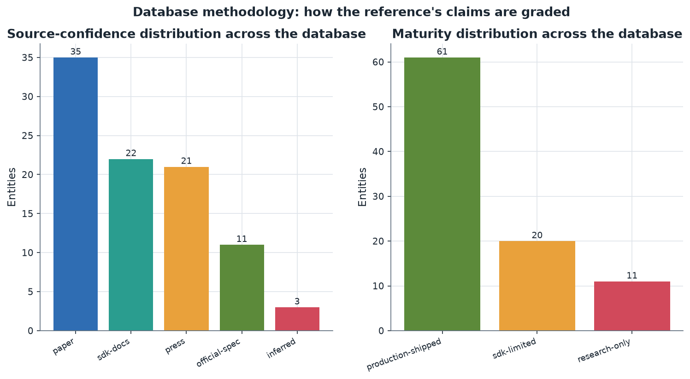
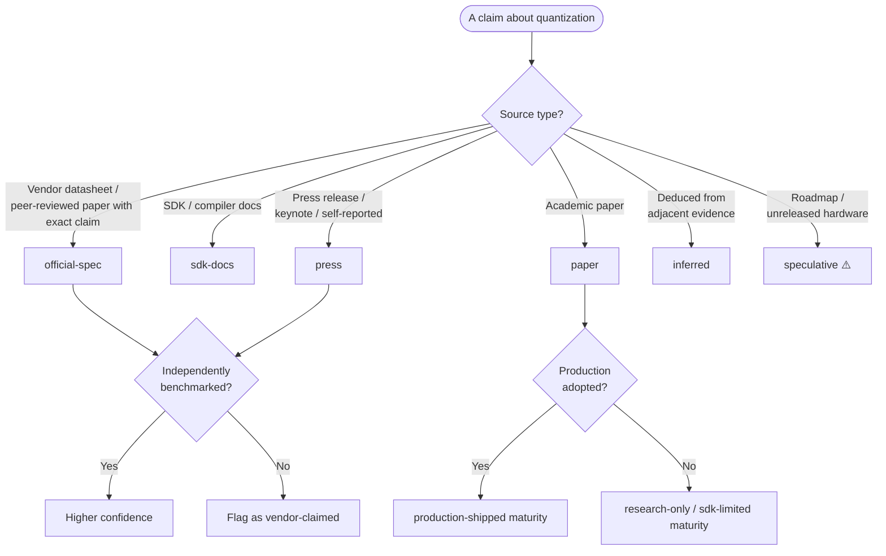

# 17. Appendix: Glossary and Methodology

> **Section scope.** The reference apparatus: a glossary of quantization and
> edge-inference terms used throughout, and a methodology note on the confidence and
> maturity taxonomies that govern every claim in this database. This section is the
> key to reading the rest precisely.

## Methodology: how this database grades its claims

Every substantive claim in this reference carries two orthogonal tags — a **maturity** level (what can be
deployed) and a **confidence** level (how solid the evidence). Understanding these is essential to reading
the database correctly, because the reference is designed to be *used* (for procurement, research, and
engineering decisions), and conflating "demonstrated in a paper" with "deployable at scale," or
"vendor-claimed" with "independently verified," is the most common and consequential error in surveying
this field.

The distributions above show how the 92 master-database entities are graded. The **maturity** distribution
is weighted toward production-shipped (a large deployed core) with smaller sdk-limited and research-only
sets (the frontier). The **confidence** distribution spans official-spec and sdk-docs (documented facts),
paper (peer-reviewed claims), press (self-reported, lower confidence), and inferred (deduced) — reflecting
that different entity types warrant different evidentiary treatment.

### The maturity taxonomy

- 🟢 **production-shipped** — Deployed at scale in released silicon, apps, or widely-used model releases.
  Verifiable in shipping products. *Example:* INT8 PTQ, 4-bit weight-only LLM quantization, the shipping
  NPUs.
- 🟡 **sdk-limited** — Available in an SDK, toolkit, or research codebase, but with limited or unverified
  production adoption. The capability exists in tooling; broad deployment is unproven. *Example:* QuIP#
  2-bit, MXFP4, HQQ.
- 🔴 **research-only** — Demonstrated in papers or prototypes; not packaged for general deployment.
  *Example:* BitNet, QuaRot/SpinQuant, binary networks.

### The confidence taxonomy

- **official-spec** — Vendor datasheet, published spec sheet, or peer-reviewed paper with the exact claim.
  Highest confidence. *Example:* Qualcomm's disclosed Hexagon precision support.
- **sdk-docs** — Inferred from SDK/compiler documentation or release notes (capability exists in tooling;
  adoption unverified). *Example:* framework quantization capabilities.
- **paper** — Claim from an academic paper; may not be production-adopted. High confidence for the claim,
  variable for the maturity. *Example:* the quantization methods.
- **press** — Announcement, keynote, or press release without independent third-party benchmark. Lower
  confidence. *Example:* startup funding and product claims.
- **inferred** — Deduced from adjacent evidence (e.g., tooling capability implying hardware support) but
  not explicitly stated. Explicit uncertainty. *Example:* Apple's undisclosed ANE internals.
- **speculative** — Roadmap or unreleased-hardware expectation; flagged as low-confidence. *Example:* the
  future-roadmap projections of Section 14.

### The confidence-assignment decision flow

The following diagram encodes how a claim's confidence level is assigned — the logic applied throughout
the database.

### Handling of vendor performance claims

A specific methodological stance, applied throughout: **vendor performance claims (TOPS, "X% faster", "N×
speedup") are reported as vendor claims and flagged where no independent third-party benchmark corroborates
them.** TOPS figures in particular are treated as near-useless for cross-vendor comparison (Section 15),
because they conflate precision, utilization, and measurement methodology. Where MLPerf or other
independent, accuracy-constrained benchmarks exist, those are trusted; where only vendor numbers exist,
they are flagged (⚠️). This stance is why the reference does not present precise cross-vendor performance
comparisons as fact — the credible data for such comparisons largely does not exist.

### Handling of tables and coverage

Per the reference's cross-cutting requirements, every comparison table aims for enough entries to be
genuinely useful, and where a category cannot support a full table (sparse public data, a genuinely small
category), that is stated explicitly rather than padded. The illustrative charts (e.g., the accuracy-vs-
bitwidth curves, the representative-throughput chart in Section 15) are labeled as illustrative where they
use directional rather than measured values, precisely because the measured cross-vendor data is often
unavailable — presenting fabricated-looking precise numbers would violate the reference's honesty
standard.

## Glossary of quantization and edge-inference terms

The following glossary defines the terms used throughout this reference. Terms are grouped by theme for
navigability.

### Core quantization concepts

| Term | Definition |
|---|---|
| **Quantization** | Representing a model's weights and/or activations in lower-precision formats (low-bit integer or reduced floating-point) instead of FP32/FP16, to reduce memory, latency, and energy. |
| **Affine (uniform) quantization** | The dominant scheme: `x_q = round(x/s) + z`, with a scale `s` and zero-point `z`, mapping reals to evenly-spaced integer levels. |
| **Scale** | The positive real number setting the spacing between representable quantized values (the step size). |
| **Zero-point** | The integer that maps to the real value 0.0; enables exact representation of zero (important for padding, ReLU, sparsity). |
| **Symmetric quantization** | Quantization with zero-point fixed at 0 (range centered on zero); cheaper hardware; standard for weights. |
| **Asymmetric quantization** | Affine quantization with a non-zero zero-point (range shifted to fit the data); better for one-sided data like post-ReLU activations. |
| **Quantization error** | The reconstruction error `x - x_hat` introduced by quantizing and dequantizing; the sum of rounding and clipping error. |
| **Clipping** | Restricting values to the representable range; values outside are clamped, causing clipping error. |
| **Calibration** | Choosing the quantization range (clipping thresholds) from a small representative dataset. |
| **SQNR** | Signal-to-quantization-noise ratio; improves ~6 dB per bit for a well-matched quantizer ("6 dB/bit rule"). |

### Granularity and scheme

| Term | Definition |
|---|---|
| **Per-tensor** | One scale/zero-point for a whole tensor; cheapest, coarsest. |
| **Per-channel** | A separate scale per output channel of a weight tensor; the production standard for weights. |
| **Per-group / per-block** | A separate scale per contiguous group (e.g. 32/64/128) of weights; enabled 4-bit and sub-4-bit LLM quantization. |
| **Per-token** | Dynamic per-token activation scaling; handles token-varying activation ranges. |
| **Weight-only quantization** | Quantizing weights while keeping activations in higher precision (e.g. W4A16); a memory optimization, the LLM-decode workhorse. |
| **Weight-and-activation quantization** | Quantizing both operands (e.g. W8A8); enables compute speedup; needs activation-outlier handling. |
| **Static quantization** | Activation ranges pre-computed offline from calibration; cheapest runtime; risks distribution mismatch. |
| **Dynamic quantization** | Activation ranges computed at runtime per inference; adapts to data; no calibration needed. |
| **Mixed precision** | Different bit-widths for different layers/tensors, allocating precision where it matters most. |

### Methods and training

| Term | Definition |
|---|---|
| **PTQ** | Post-training quantization; quantizing a trained model with at most a small calibration set, no retraining. |
| **QAT** | Quantization-aware training; inserting simulated quantization during training so the model adapts. |
| **Straight-through estimator (STE)** | Treating the non-differentiable rounding as the identity in the backward pass, enabling gradient flow through quantization in QAT. |
| **Fake quantization** | Quantize-then-dequantize operators inserted in the training graph so the model sees quantization error while staying in float. |
| **Error compensation** | Adjusting not-yet-quantized weights to absorb the error from quantizing others (the GPTQ / Optimal Brain Surgeon mechanism). |
| **Outlier** | A large-magnitude activation channel or weight that dominates the quantization range and wrecks naive quantization; central to LLM quantization. |
| **Quantization-native training** | Training a model to be natively low-precision (e.g. ternary in BitNet) rather than quantizing post-training. |
| **Low-precision training** | Performing the training arithmetic itself in reduced precision (FP8/FP4), preserving gradient information. |

### Numeric formats

| Term | Definition |
|---|---|
| **INT8 / INT4 / INT2** | Signed/unsigned integer formats with 256 / 16 / 4 uniform levels respectively. |
| **FP16 / BF16** | 16-bit floats; FP16 (5-exp/10-mant) favors precision, BF16 (8-exp/7-mant) favors range (training). |
| **FP8 (E4M3 / E5M2)** | 8-bit floats; E4M3 more precision, E5M2 more range; OCP-standardized. |
| **FP4 (E2M1)** | 4-bit float; 16 values with floating-point spacing; frontier format. |
| **NF4 (NormalFloat4)** | Non-uniform 4-bit format with levels at normal-distribution quantiles; from QLoRA. |
| **Block floating point (BFP)** | A block of low-precision values sharing a common scale/exponent. |
| **Microscaling (MX) formats** | OCP-standardized block-FP formats (MXFP4/6/8, MXINT8) with a shared scale per 32-element block. |
| **Codebook / vector quantization** | Representing groups of weights by indices into a learned codebook (AQLM, QuIP#). |
| **Ternary / binary** | Weights in {−1,0,+1} (≈1.58 bits) or {−1,+1} (1 bit). |

### Hardware and systems

| Term | Definition |
|---|---|
| **NPU** | Neural Processing Unit; a dedicated accelerator for neural-network inference, typically integer-quantization-optimized. |
| **Matrix engine** | The multiply-accumulate hardware (systolic array, vector/tensor units) at the heart of an accelerator. |
| **Accumulator** | The wider register (typically INT32) that accumulates low-precision products to avoid overflow. |
| **Requantization** | Narrowing the wide accumulator back to the next layer's low-precision input via a fixed-point multiply-and-shift. |
| **Roofline model** | A performance model plotting attainable throughput vs. arithmetic intensity, distinguishing memory-bound from compute-bound. |
| **Memory-bound / compute-bound** | Whether a workload is limited by memory bandwidth (LLM decode) or compute throughput (vision, prefill). |
| **KV cache** | The stored keys and values for past tokens in attention; a dominant memory consumer at long context; quantizable. |
| **Fallback** | When a runtime cannot execute an operator/precision on the NPU and offloads to CPU/GPU, incurring a penalty. |
| **In-memory / compute-in-memory (CIM)** | Computing matrix operations inside or adjacent to the memory array to avoid data movement; inherently low-precision. |
| **Fusion** | Merging operators (matmul + bias + requant + activation) into one kernel to keep intermediates on-chip. |

### Tooling and ecosystem

| Term | Definition |
|---|---|
| **GGUF** | The llama.cpp distribution format for quantized local LLMs; uses k-quant mixed-bit block quantization. |
| **Delegate / execution provider** | The mechanism by which a runtime (LiteRT, ONNX Runtime) routes quantized subgraphs to vendor NPUs. |
| **QDQ / QOperator** | ONNX quantization representations: bracketing tensors with Quantize/Dequantize nodes (QDQ) vs. explicit quantized operators (QOperator). |
| **Kernel** | The optimized low-level implementation of an operation (e.g. Marlin for 4-bit matmul) that determines real speed. |
| **Calibration set** | The small representative dataset used to set quantization ranges; must match the deployment distribution. |
| **Group size** | The number of weights sharing a scale in per-group quantization (commonly 128, 64, or 32). |

## How to cite and use this reference

This reference is a compiled technical database drawing on public specifications, SDK documentation,
academic papers, standards documents, and vendor announcements, generated 2026-07-23. It should be used as
an orientation and index, with the confidence and maturity tags guiding how much weight to place on each
claim, and with current primary sources consulted for fast-changing details (silicon roadmaps, startup
funding, frontier-format status). Where the reference flags a claim as vendor-asserted, inferred, or
speculative, that flag should be honored — the reference's value lies substantially in its honesty about
what is known versus claimed versus deduced. The charts are regeneratable from the data and scripts in
`/assets`, and the master database is exportable as CSV for further analysis.

## Closing note

Model quantization for edge AI has, over roughly a decade, moved from a niche deployment optimization to a
central, strategically-important discipline that determines what AI can run on the devices and within the
budgets the world actually has. This reference has mapped that discipline across seventeen sections — its
techniques and numerics, its LLM-specific methods, its hardware-software co-design, its vendor roadmaps,
its research and startup ecosystems, its standards and its future. The through-line is simple and durable:
as long as the models we want exceed the hardware that must run them, quantization — the art and science of
representing those models in fewer bits without breaking them — will remain indispensable, and its frontier
will keep advancing. The specifics will change; the reference's tags flag what is solid and what is
provisional; but the centrality of quantization to efficient, accessible, on-device AI is as certain as any
claim in this document. That is the reason this database exists, and the reason its subject will remain
worth tracking for years to come.

---

*End of reference. Return to the [README](../README.md) and [table of contents](../README.md#table-of-contents).*
